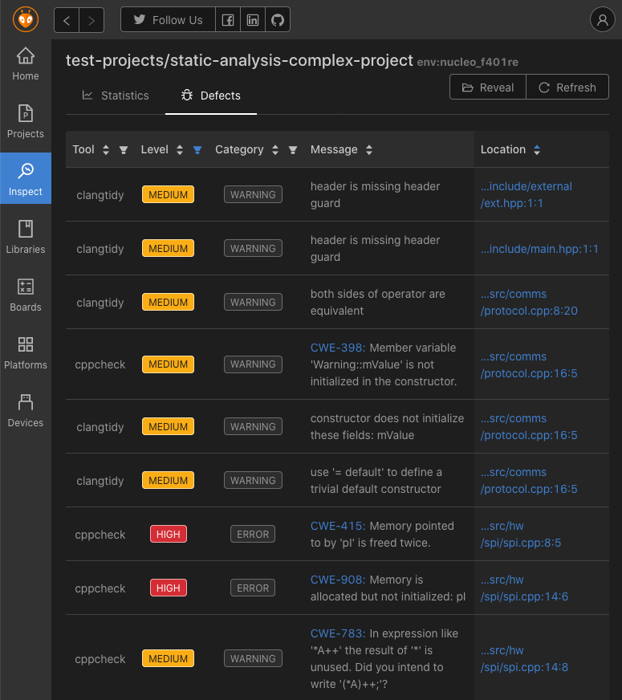

..  Copyright (c) 2019-present PlatformIO <contact@platformio.org>
    Licensed under the Apache License, Version 2.0 (the "License");
    you may not use this file except in compliance with the License.
    You may obtain a copy of the License at
       http://www.apache.org/licenses/LICENSE-2.0
    Unless required by applicable law or agreed to in writing, software
    distributed under the License is distributed on an "AS IS" BASIS,
    WITHOUT WARRANTIES OR CONDITIONS OF ANY KIND, either express or implied.
    See the License for the specific language governing permissions and
    limitations under the License.

User Interface
--------------

There is the rich and friendly interface for **Static Code Analysis** in :ref:`piohome`.
It allows you to filter messages or directly jump to an issue in a source code.

.. image:: ../../_static/images/home/pio-home-inspect-stats-check.png

