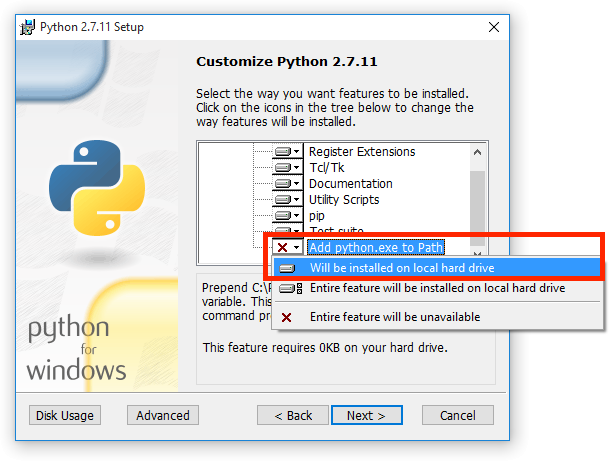

..  Copyright 2014-present PlatformIO <contact@platformio.org>
    Licensed under the Apache License, Version 2.0 (the "License");
    you may not use this file except in compliance with the License.
    You may obtain a copy of the License at
       http://www.apache.org/licenses/LICENSE-2.0
    Unless required by applicable law or agreed to in writing, software
    distributed under the License is distributed on an "AS IS" BASIS,
    WITHOUT WARRANTIES OR CONDITIONS OF ANY KIND, either express or implied.
    See the License for the specific language governing permissions and
    limitations under the License.

.. _faq:

Frequently Asked Questions
==========================

.. note::
   We have a big database with `Frequently Asked Questions in our Community Forums <https://community.platformio.org/c/faq>`_.
   Please have a look at it.

.. contents::

General
-------

What is PlatformIO?
~~~~~~~~~~~~~~~~~~~

Please refer to :ref:`what_is_pio`

What is ``.pioenvs`` directory
~~~~~~~~~~~~~~~~~~~~~~~~~~~~~~

Please refer to :ref:`projectconf_pio_envs_dir`.

Command completion in Terminal
~~~~~~~~~~~~~~~~~~~~~~~~~~~~~~

Bash completion
'''''''''''''''

Bash completion support will complete subcommands and parameters. To enable
Bash completion for `platformio` subcommands you need to put into your `.bashrc`:

.. code-block:: bash

    eval "$(_PLATFORMIO_COMPLETE=source platformio)"
    eval "$(_PLATFORMIO_COMPLETE=source pio)"

ZSH completion
''''''''''''''

To enable ``zsh`` completion please run these commands:

.. code-block:: bash

    autoload bashcompinit && bashcompinit
    eval "$(_PLATFORMIO_COMPLETE=source platformio)"
    eval "$(_PLATFORMIO_COMPLETE=source pio)"

.. note::

    For permanent command completion you need to place commands above to
    ``~/.bashrc`` or ``~/.zshrc`` file.

Install Python Interpreter
--------------------------

:ref:`core` is written in `Python <https://www.python.org/downloads/>`_ that
is installed by default on the all popular OS except Windows.

**Windows Users**, please `Download the latest Python 2.7.x <https://www.python.org/downloads/>`_
and install it. **DON'T FORGET** to select ``Add python.exe to Path`` feature
on the "Customize" stage, otherwise ``python`` command will not be available.

.. _faq_convert_ino_to_cpp:

Convert Arduino file to C++ manually
------------------------------------

Some :ref:`ide` doesn't support Arduino files (``*.ino`` and ``.pde``) because
they are not valid C/C++ based source files:

1. Missing includes such as ``#include <Arduino.h>``
2. Function declarations are omitted.

In this case, code completion and code linting does not work properly or
disabled. To avoid this issue you can manually convert your INO files to CPP.

For example, we have the next ``Demo.ino`` file:

.. code-block:: cpp

    void setup () {
        someFunction(13);
    }

    void loop() {
        delay(1000);
    }

    void someFunction(int num) {
    }

Let's convert it to  ``Demo.cpp``:

1. Add ``#include <Arduino.h>`` at the top of the source file
2. Declare each custom function (excluding built-in, such as ``setup`` and ``loop``)
   before it will be called.

The final ``Demo.cpp``:

.. code-block:: cpp

    #include <Arduino.h>

    void someFunction(int num);

    void setup () {
        someFunction(13);
    }

    void loop() {
        delay(1000);
    }

    void someFunction(int num) {
    }

PlatformIO IDE
--------------

Please refer to :ref:`PlatformIO IDE Frequently Asked Questions <pioide>`.

Before/Pre and After/Post build actions
---------------------------------------

PlatformIO Build System has rich API that allows to attach different pre-/post
actions (hooks). See features of :ref:`projectconf_extra_script` option for
:ref:`projectconf`.

.. _faq_troubleshooting:

Troubleshooting
---------------

Installation
~~~~~~~~~~~~

Multiple PIO Cores in a system
''''''''''''''''''''''''''''''

Multiple :ref:`core` in a system could lead to a different issues. We highly
recommend to keep one instance of PIO Core or use built-in PIO Core in :ref:`pioide`:

* :ref:`ide_atom` - ``Menu PlatformIO: Settings > PlatformIO IDE > Use built-in PlatformIO Core``

Finally, if you have a global :ref:`core` in a system, please open system
Terminal (not PlatformIO IDE Terminal) and uninstall obsolete PIO Core:

.. code-block:: bash

    pip uninstall platformio

    # if you used MacOS "brew"
    brew uninstall platformio

'platformio' is not recognized as an internal or external command
'''''''''''''''''''''''''''''''''''''''''''''''''''''''''''''''''

If you use :ref:`pioide`, please check in PlatformIO IDE Settings that
"Use built-in PIO Core" is enabled.

If you modify system environment variable ``PATH`` in your Bash/Fish/ZSH
profile, please do not override global ``PATH``. This line
``export PATH=/my/custom/path`` is incorrect. Use ``export PATH=/my/custom/path:$PATH``
instead.

[Errno 1] Operation not permitted
'''''''''''''''''''''''''''''''''

Answered in `issue #295 <https://github.com/platformio/platformio-core/issues/295#issuecomment-143772005>`_.

Windows AttributeError: 'module' object has no attribute 'packages'
'''''''''''''''''''''''''''''''''''''''''''''''''''''''''''''''''''

Answered in `issue #252 <https://github.com/platformio/platformio-core/issues/252#issuecomment-127072039>`_.

Windows UnicodeDecodeError: 'ascii' codec can't decode byte
'''''''''''''''''''''''''''''''''''''''''''''''''''''''''''

Answered in `issue #143 <https://github.com/platformio/platformio-core/issues/143#issuecomment-88060906>`_.

PlatformIO: command not found || An error "pkg_resources.DistributionNotFound"
''''''''''''''''''''''''''''''''''''''''''''''''''''''''''''''''''''''''''''''

Please upgrade *SetupTools* package:

.. code-block:: bash

    [sudo] pip uninstall setuptools
    [sudo] pip install setuptools

    # Then re-install PlatformIO
    [sudo] pip uninstall platformio
    [sudo] pip install platformio

Miscellaneous
~~~~~~~~~~~~~

Serial does not work with panStampAVR board
'''''''''''''''''''''''''''''''''''''''''''

Answered in `issue #144 <https://github.com/platformio/platformio-core/issues/144#issuecomment-87388038>`_.

Building
~~~~~~~~

ARM toolchain: cc1plus: error while loading shared libraries
''''''''''''''''''''''''''''''''''''''''''''''''''''''''''''

See related answers for
`error while loading shared libraries <https://github.com/platformio/platformio-core/issues?utf8=✓&q=error+while+loading+shared+libraries>`_.

Archlinux: libncurses.so.5: cannot open shared object file
''''''''''''''''''''''''''''''''''''''''''''''''''''''''''

Answered in `issue #291 <https://github.com/platformio/platformio-core/issues/291>`_.

Monitoring a serial port breaks upload
''''''''''''''''''''''''''''''''''''''

Answered in `issue #384 <https://github.com/platformio/platformio-core/issues/384>`_.
