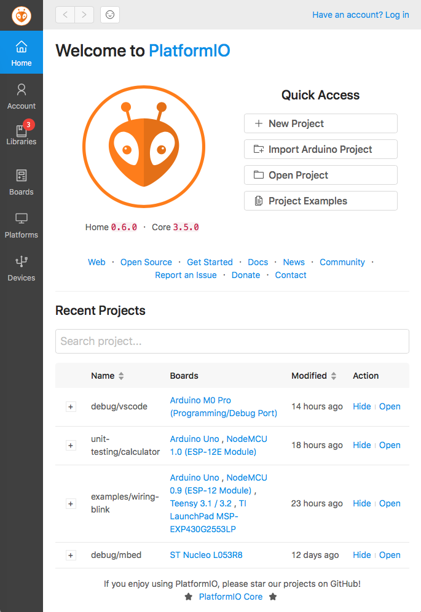
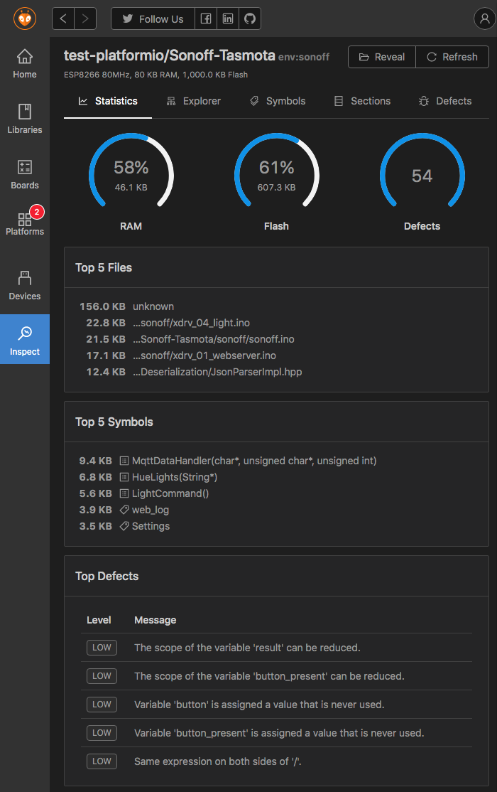
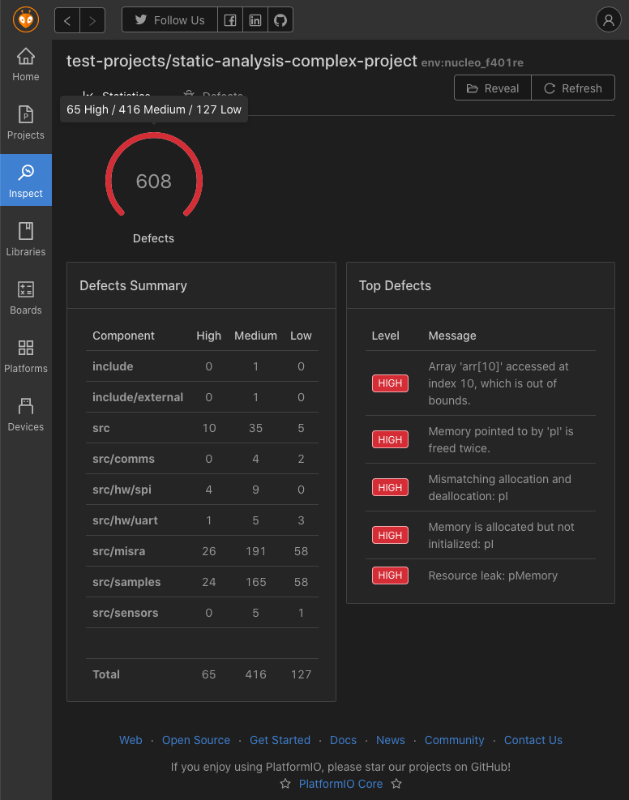
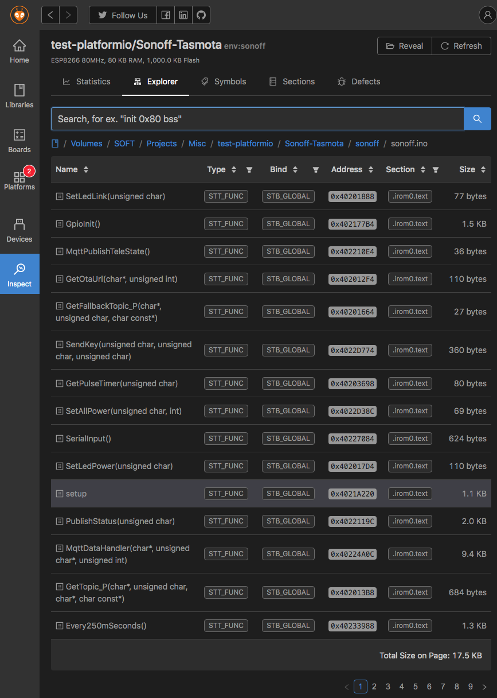
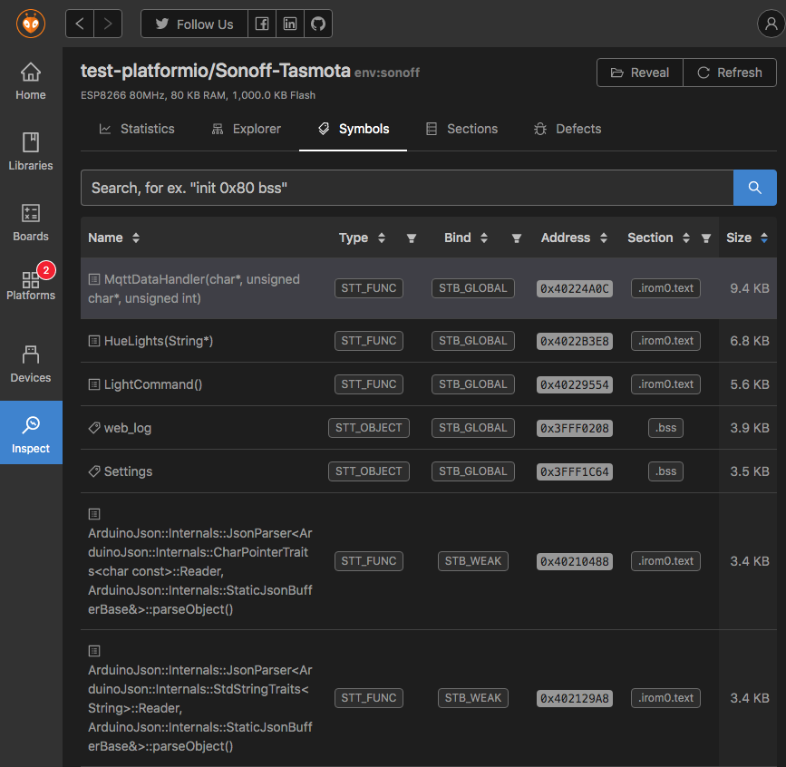
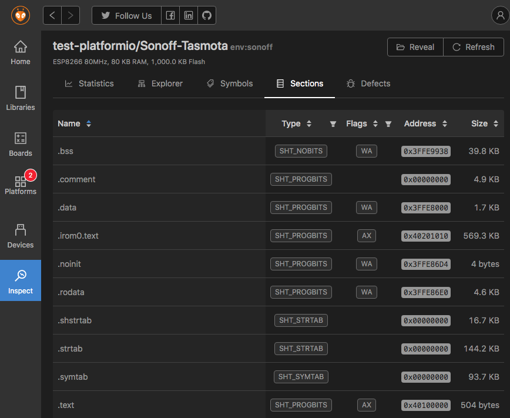
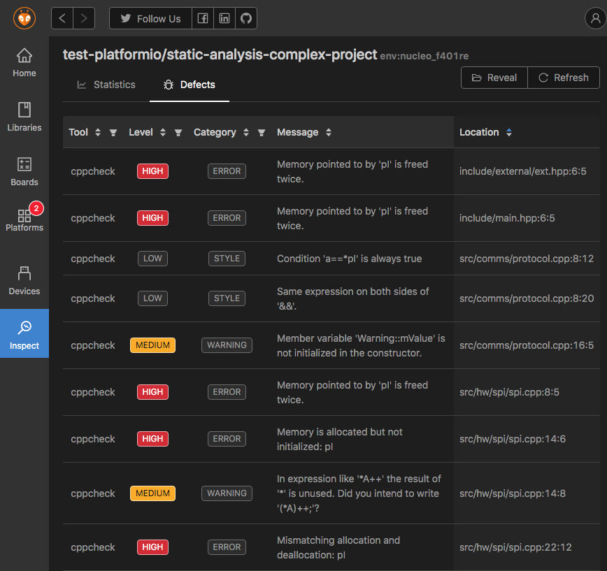
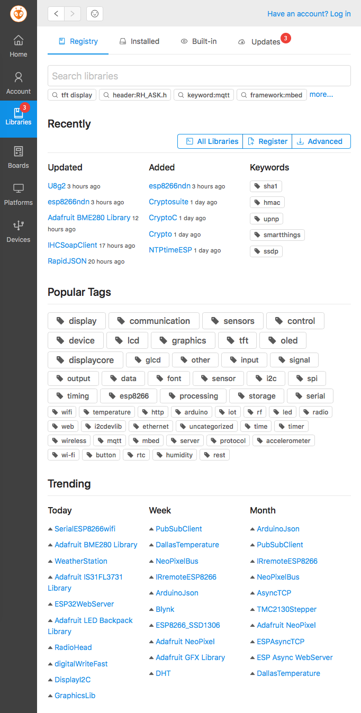
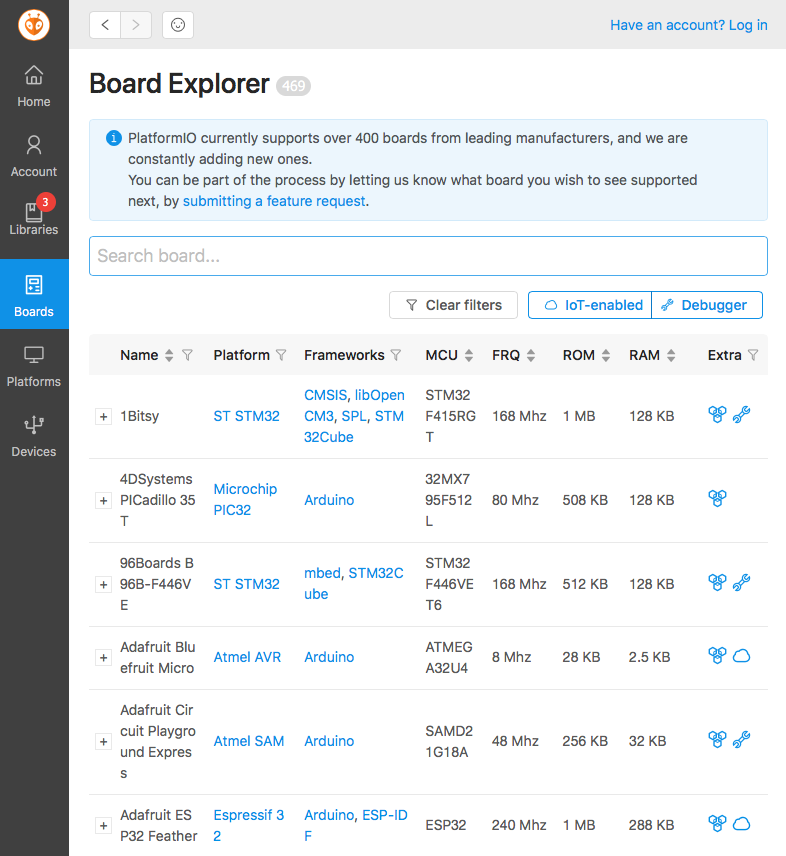

..  Copyright (c) 2014-present PlatformIO <contact@platformio.org>
    Licensed under the Apache License, Version 2.0 (the "License");
    you may not use this file except in compliance with the License.
    You may obtain a copy of the License at
       http://www.apache.org/licenses/LICENSE-2.0
    Unless required by applicable law or agreed to in writing, software
    distributed under the License is distributed on an "AS IS" BASIS,
    WITHOUT WARRANTIES OR CONDITIONS OF ANY KIND, either express or implied.
    See the License for the specific language governing permissions and
    limitations under the License.

.. |PIOHOME| replace:: **PlatformIO Home**

.. _piohome:

PlatformIO Home
===============

|PIOHOME| allows you to interact with PlatformIO's professional collaborative platform
using modern and cross-platform GUI:

* Project Manager
* :ref:`pioaccount`
* :ref:`librarymanager`
* :ref:`platforms`
* Library and development platform updates
* :ref:`frameworks`
* :ref:`boards`
* :ref:`Device Manager <cmd_device>`: serial, logical, and multicast DNS services
* Static Code Analysis
* Firmware File Explorer
* Firmware Memory Inspection
* Firmware Sections & Symbols Viewer.

.. contents:: Contents
    :local:

Installation
------------

You do not need to install |PIOHOME| separately, it's already built-in in
:ref:`pioide` and :ref:`piocore`.

Quick Start
-----------

PlatformIO IDE
~~~~~~~~~~~~~~

Please open |PIOHOME| using (HOME) button on PlatformIO Toolbar:

* **Atom**: :ref:`atom_ide_platformio_toolbar`
* **VSCode**: :ref:`ide_vscode_toolbar`

PlatformIO Core
~~~~~~~~~~~~~~~

Please launch |PIOHOME| Web-server using :ref:`cmd_home` command and open in
your browser http://127.0.0.1:8008.

You can change host and port. Please check :ref:`cmd_home` command for details.

Demo
----

Welcome & Project Manager
~~~~~~~~~~~~~~~~~~~~~~~~~

Project Inspect
~~~~~~~~~~~~~~~

Statistics
''''''''''

Only code analysis (:ref:`piocheck`)

Firmware File Explorer
''''''''''''''''''''''

.. image:: ../_static/images/home/pio-home-inspect-firmware-file-explorer.png

File Symbols

Firmware Symbols
''''''''''''''''

Firmware Sections
'''''''''''''''''

Static Code Analysis
''''''''''''''''''''

Library Manager
~~~~~~~~~~~~~~~

Board Explorer
~~~~~~~~~~~~~~

