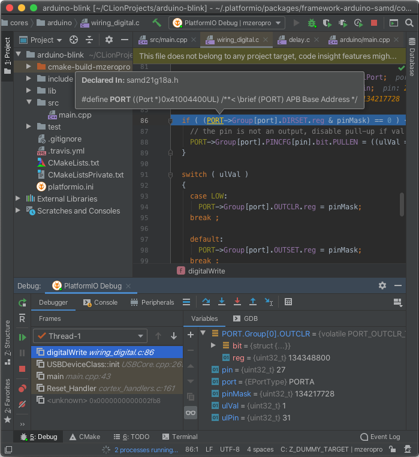

..  Copyright (c) 2014-present PlatformIO <contact@platformio.org>
    Licensed under the Apache License, Version 2.0 (the "License");
    you may not use this file except in compliance with the License.
    You may obtain a copy of the License at
       http://www.apache.org/licenses/LICENSE-2.0
    Unless required by applicable law or agreed to in writing, software
    distributed under the License is distributed on an "AS IS" BASIS,
    WITHOUT WARRANTIES OR CONDITIONS OF ANY KIND, either express or implied.
    See the License for the specific language governing permissions and
    limitations under the License.

.. _ide_clion:

CLion
=====

The `CLion <https://www.jetbrains.com/clion/>`_ is a cross-platform C/C++ IDE
for Linux, OS X, and Windows integrated with the CMake build system. The
initial version will support the GCC and Clang compilers and GDB debugger.
CLion includes such features as a smart editor, code quality assurance,
automated refactorings, project manager, integrated version control systems.

Refer to the `CLion Documentation <https://www.jetbrains.com/clion/help>`_
page for more detailed information.

.. contents:: Contents
    :local:

Integration
-----------

Integration process consists of these steps:

1. Install `File Watchers <https://plugins.jetbrains.com/plugin/7177-file-watchers>`_
   plugin via "CLion: Preferences > Plugins". We need it to automatically
   update project configuration when changes are made in :ref:`projectconf`
2. Open system Terminal and install :ref:`piocore`
3. Create new folder for your project and change directory (``cd``) to it
4. Generate a project using PIO Core Project Generator (:option:`platformio project init --ide`)
5. Open project in IDE.

------------

Choose board ``ID`` using :ref:`cmd_boards` or `Embedded Boards Explorer <https://platformio.org/boards>`_
command and generate project via :option:`platformio project init --ide` command:

.. code-block:: shell

    platformio project init --ide clion --board <ID>

    # For example, generate project for Arduino UNO
    platformio project init --ide clion --board uno

Then:

1. Place source files (``*.c, *.cpp, *.h, *.hpp``) to ``src`` directory and
   repeat :option:`platformio project init --ide` command above (to refresh source files list)
2. Open this project via ``Menu: File > Open...``
   and specify root directory where is located :ref:`projectconf`
3. Open source file from ``src`` directory
4. Build project (*DO NOT* use "Run" button, see marks on the screenshot above):
   ``Menu: Run > Build``.

.. warning::

    1. :ref:`piocore` **DOES NOT** depend on ``CMake``, it has own cross-platform
       Build System. All data related to build flags and source code filtering
       should be specified using :ref:`projectconf_section_env_build` in
       :ref:`projectconf`.

    2. See know issue: :ref:`ide_clion_knownissues_inopde_not_supported` and how
    to resolve it.

There are 11 predefined targets for building (*NOT FOR RUNNING*, see marks on
the screenshot above):

* ``PLATFORMIO_BUILD`` - Build project without auto-uploading
* ``PLATFORMIO_BUILD_VERBOSE`` - Build project without auto-uploading in verbose mode
* ``PLATFORMIO_UPLOAD`` - Build and upload (if no errors)
* ``PLATFORMIO_CLEAN`` - Clean compiled objects
* ``PLATFORMIO_MONITOR`` - Device monitor :ref:`cmd_device_monitor`
* ``PLATFORMIO_TEST`` - :ref:`unit_testing`
* ``PLATFORMIO_PROGRAM`` - Build and upload using external programmer
  (if no errors), see :ref:`atmelavr_upload_via_programmer`
* ``PLATFORMIO_UPLOADFS`` - Upload files to file system SPIFFS,
  see :ref:`platform_espressif_uploadfs`
* ``PLATFORMIO_UPDATE`` - Update installed platforms and libraries via :ref:`cmd_update`
* ``PLATFORMIO_REBUILD_PROJECT_INDEX`` - Rebuild C/C++ Index for the Project.
  Allows one to fix code completion and code linting issues.
* ``PLATFORMIO_DEVICE_LIST`` - List connected devices.

If you have multiple environements, you can select which one the target is going to use by
changing the build profile (See screenshot). Changing the build profile also updates
defines and includes for code completion in the editor to those specified by the environement.

The profile ``All`` runs the target for all environements ; this was the previous behavior.

.. warning::
    The libraries which are added, installed or used in a project after
    generating process will not be reflected in IDE. Please run
    ``PLATFORMIO_REBUILD_PROJECT_INDEX`` target to resolve this issue.

Known issues
------------

.. _ide_clion_knownissues_inopde_not_supported:

Arduino ``.ino`` files are not supported
~~~~~~~~~~~~~~~~~~~~~~~~~~~~~~~~~~~~~~~~

CLion uses "CMake" tool for code completion and code linting. As result, it
doesn't support Arduino files (``*.ino`` and ``.pde``) because they are
not valid C/C++ based source files:

1. Missing includes such as ``#include <Arduino.h>``
2. Function declarations are omitted.

See how to :ref:`faq_convert_ino_to_cpp`.

Articles / Manuals
------------------

* Dec 01, 2015 - **JetBrains CLion Blog** - `C++ Annotated: Fall 2015. Arduino Support in CLion using PlatformIO <http://blog.jetbrains.com/clion/2015/12/cpp-annotated-fall-2015/>`_
* Nov 22, 2015 - **Michał Seroczyński** - `Using PlatformIO to get started with Arduino in CLion IDE <http://www.ches.pl/using-platformio-get-started-arduino-clion-ide/>`_
* Nov 09, 2015 - **ÁLvaro García Gómez** - `Programar con Arduino "The good way" (Programming with Arduino "The good way", Spanish) <http://congdegnu.es/2015/11/09/programar-con-arduino-the-good-way/>`_

See more :ref:`articles`.
