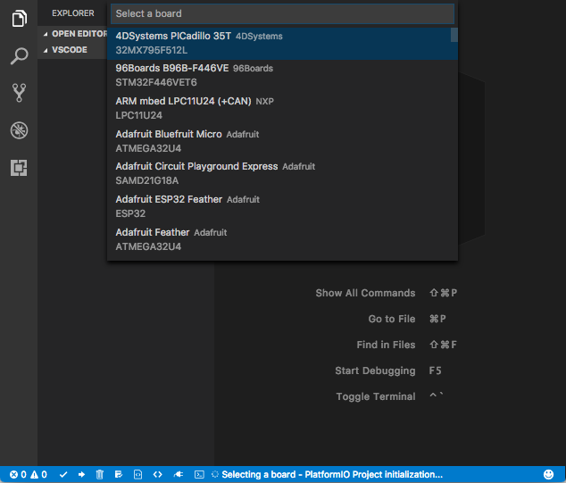
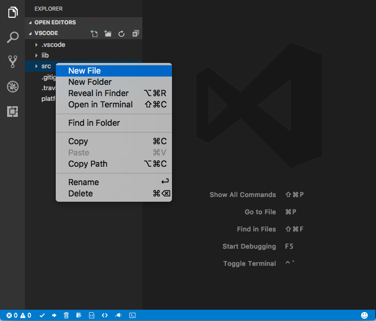
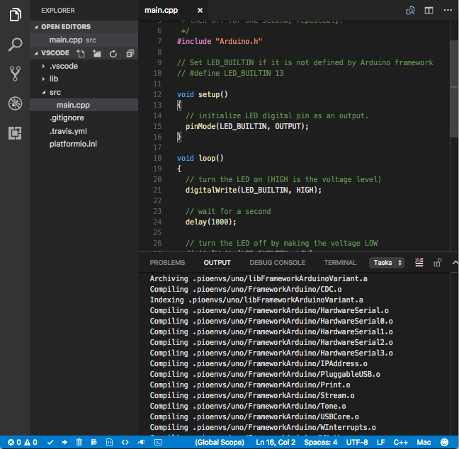

..  Copyright (c) 2014-present PlatformIO <contact@platformio.org>
    Licensed under the Apache License, Version 2.0 (the "License");
    you may not use this file except in compliance with the License.
    You may obtain a copy of the License at
       http://www.apache.org/licenses/LICENSE-2.0
    Unless required by applicable law or agreed to in writing, software
    distributed under the License is distributed on an "AS IS" BASIS,
    WITHOUT WARRANTIES OR CONDITIONS OF ANY KIND, either express or implied.
    See the License for the specific language governing permissions and
    limitations under the License.

.. _ide_vscode:

PlatformIO IDE for VScode
=========================

PlatformIO IDE is the next-generation integrated development environment for IoT:

* Cross-platform build system without external dependencies to the OS software:

    - 400+ embedded boards
    - 20+ development platforms
    - 10+ frameworks

* :ref:`debugging`
* :ref:`pio_remote`
* :ref:`unit_testing`
* C/C++ Intelligent Code Completion
* C/C++ Smart Code Linter for rapid professional development
* Library Manager for the hundreds popular libraries
* Multi-projects workflow with multiple panes
* Themes support with dark and light colors
* Serial Port Monitor
* Built-in Terminal with :ref:`piocore` and CLI tool (``pio``, ``platformio``)

`Visual Studio Code <https://code.visualstudio.com>`_ is a lightweight but
powerful source code editor which runs on your desktop and is available for
Windows, macOS and Linux. It comes with built-in support for JavaScript,
TypeScript and Node.js and has a rich ecosystem of extensions for other
languages (such as C++, C#, Python, PHP, Go) and runtimes (such as .NET and Unity)

.. image:: ../_static/ide/vscode/platformio-ide-vscode.png
    :target: https://marketplace.visualstudio.com/items?itemName=platformio.platformio-ide

.. contents::

Installation
------------

.. note::

    Please note that you do not need to install :ref:`piocore` separately if
    you are going to use :ref:`ide_vscode`. :ref:`piocore` is built into
    PlatformIO IDE and you will be able to use it within PlatformIO IDE Terminal.

- `Download <https://code.visualstudio.com>`_ and install official Microsoft
  Visual Studio Code, PlatformIO IDE is built on top of it
- Install `PlatformIO IDE for VSCode extension <https://marketplace.visualstudio.com/items?itemName=platformio.platformio-ide>`_:

    * Launch VS Code Quick Open (``Ctr+P`` or ``Cmd+P``)
    * Paste the following command ``ext install platformio-ide``, press enter
    * Install an official ``PlatformIO IDE`` extension

- Reload VSCode.

Quick Start
-----------

This tutorial introduces you to the basics of PlatformIO IDE workflow and shows
you a creation process of a simple "Blink" example. After finishing you will
have a general understanding of how to work with projects in the IDE.

Setting Up the Project
~~~~~~~~~~~~~~~~~~~~~~

1. Create empty directory (or use existing) and open it via ``File > Open...``

.. image:: ../_static/ide/vscode/platformio-ide-vscode-open-folder.png

2. Initialize PlatformIO Project using one of these methods:

    * Run "Initialize or Update Project" command using ``ctrl+alt+i`` hotkey
    * Launch "VS Code Menu: View > Command Palette..." or use hotkey
      ``Ctrl+Shift+P`` (``Cmd+Shift+P`` for macOS), search for
      ``PlatformIO: Initialize or Update Project``, and press enter

3. Select a board. You can change it any time in :ref:`projectconf` or add
   new using the same ``PlatformIO: Initialize or Update Project`` command.

4. Create FREE :ref:`cmd_account` which opens access to extra features, such as:

    * :ref:`debugging`
    * :ref:`unit_testing`
    * :ref:`pio_remote`

  Please open PIO Terminal using :ref:`ide_vscode_toolbar` |pio_vscode_toolbar_terminal|

    * Create new PIO Account with :ref:`cmd_account_register` command
    * Use temporary password from received e-mail and login with
      :ref:`cmd_account_login` command
    * Change temporary password using :ref:`cmd_account_password` command

5. Create New File named ``main.cpp`` in ``src`` folder

6. Copy the next source code to the just created file ``main.cpp``

.. warning::

    The code below works only in pair with Arduino-based boards. Please
    follow to `PlatformIO Project Examples <https://github.com/platformio/platformio-examples>`_ repository for other pre-configured projects.

.. code-block:: cpp

    /**
     * Blink
     *
     * Turns on an LED on for one second,
     * then off for one second, repeatedly.
     */
    #include "Arduino.h"

    // Set LED_BUILTIN if it is not defined by Arduino framework
    // #define LED_BUILTIN 13

    void setup()
    {
      // initialize LED digital pin as an output.
      pinMode(LED_BUILTIN, OUTPUT);
    }

    void loop()
    {
      // turn the LED on (HIGH is the voltage level)
      digitalWrite(LED_BUILTIN, HIGH);

      // wait for a second
      delay(1000);

      // turn the LED off by making the voltage LOW
      digitalWrite(LED_BUILTIN, LOW);

       // wait for a second
      delay(1000);
    }

7. Build your project with ``ctrl+alt+b`` hotkey (see all Key Bindings in
   "User Guide" section below)

8. Learn more about :ref:`ide_vscode_toolbar` and other commands (Upload, Clean,
   Serial Monitor, Library Manager, Run Other Tasks) in "User Guider" section.

**Happy coding with PlatformIO!**

.. _ide_vscode_user_guide:

User Guide
----------

.. _ide_vscode_toolbar:

PlatformIO Toolbar
~~~~~~~~~~~~~~~~~~

PlatformIO IDE Toolbar is located in VSCode Status Bar (left corner)
and contains quick access buttons for the popular commands.
Each button contains hint (delay mouse on it).

* PlatformIO: Build
* PlatformIO: Upload
* PlatformIO: Clean
* PlatformIO: Run Other Tasks
* Initialize new PlatformIO Project or Update existing...
* :ref:`librarymanager`
* :ref:`Serial Port Monitor <cmd_device_monitor>`
* PIO Terminal

Key Bindings: Building / Uploading / Other Tasks
~~~~~~~~~~~~~~~~~~~~~~~~~~~~~~~~~~~~~~~~~~~~~~~~

* ``ctrl+alt+i`` Initialize or Update Project
* ``ctrl+alt+b`` / ``cmd-shift-b`` / ``ctrl-shift-b`` Build Project
* ``cmd-shift-d`` / ``ctrl-shift-d`` Debug project
* ``ctrl+alt+u`` Upload Firmware
* ``ctrl+alt+s`` Open :ref:`Serial Port Monitor <cmd_device_monitor>`
* ``ctrl+alt+t`` Run Other Tasks (Upload using Programmer, Upload SPIFFS
  image, Test Project, Update packages and libraries, Upgrade :ref:`piocore`)

Extension Settings
~~~~~~~~~~~~~~~~~~

``platformio-ide.useBuiltinPIOCore``
^^^^^^^^^^^^^^^^^^^^^^^^^^^^^^^^^^^^
Use built-in :ref:`piocore`, default configuration is ``true``.

``platformio-ide.useDevelopmentPIOCore``
^^^^^^^^^^^^^^^^^^^^^^^^^^^^^^^^^^^^^^^^
Use development version of :ref:`piocore`, default configuration is ``false``.

``platformio-ide.autoRebuildAutocompleteIndex``
^^^^^^^^^^^^^^^^^^^^^^^^^^^^^^^^^^^^^^^^^^^^^^^
Automatically rebuild C/C++ Project Index when :ref:`projectconf` is changed
or when new libraries are installed, default configuration is ``true``.

``platformio-ide.customPATH``
^^^^^^^^^^^^^^^^^^^^^^^^^^^^^
Custom PATH for ``platformio`` command. Paste here the result of ``echo $PATH``
(Unix) / ``echo %PATH%`` (Windows) command by typing into your system terminal
if you prefer to use custom version of :ref:`piocore`, default configuration
is ``null``.

Serial Port Monitor
~~~~~~~~~~~~~~~~~~~

You can customize Serial Port Monitor using :ref:`projectconf_monitor` in
:ref:`projectconf`:

* :ref:`projectconf_monitor_port`
* :ref:`projectconf_monitor_baud`
* :ref:`projectconf_monitor_rts`
* :ref:`projectconf_monitor_dtr`

Example:

.. code-block:: ini

    [env:esp32dev]
    platform = espressif32
    framework = arduino
    board = esp32dev

    ; Custom Serial Monitor port
    monitor_port = /dev/ttyUSB1

    ; Custom Serial Monitor baud rate
    monitor_baud = 115200

PIO Account
~~~~~~~~~~~

Create FREE :ref:`cmd_account` which opens access to extra features, such as:

  * :ref:`debugging`
  * :ref:`unit_testing`
  * :ref:`pio_remote`

Please open PIO Terminal using :ref:`ide_vscode_toolbar` |pio_vscode_toolbar_terminal|

  * Create new PIO Account with :ref:`cmd_account_register` command
  * Use temporary password from received e-mail and login with
    :ref:`cmd_account_login` command
  * Change temporary password using :ref:`cmd_account_password` command

