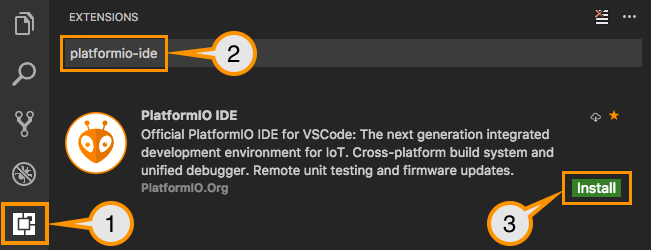

..  Copyright (c) 2014-present PlatformIO <contact@platformio.org>
    Licensed under the Apache License, Version 2.0 (the "License");
    you may not use this file except in compliance with the License.
    You may obtain a copy of the License at
       http://www.apache.org/licenses/LICENSE-2.0
    Unless required by applicable law or agreed to in writing, software
    distributed under the License is distributed on an "AS IS" BASIS,
    WITHOUT WARRANTIES OR CONDITIONS OF ANY KIND, either express or implied.
    See the License for the specific language governing permissions and
    limitations under the License.

.. _ide_vscode:

PlatformIO IDE for VSCode
=========================

.. include:: pioide_features.rst

---------

`Visual Studio Code <https://code.visualstudio.com>`_ is a lightweight but
powerful source code editor which runs on your desktop and is available for
Windows, macOS and Linux. It comes with built-in support for JavaScript,
TypeScript and Node.js and has a rich ecosystem of extensions for other
languages (such as C++, C#, Python, PHP, Go) and runtimes (such as .NET and Unity)

.. image:: ../_static/ide/vscode/platformio-ide-vscode.png
    :target: ../_images/platformio-ide-vscode.png

.. contents:: Contents
    :local:

Installation
------------

.. note::

    Please note that you do not need to install :ref:`piocore` separately if
    you are going to use :ref:`ide_vscode`. :ref:`piocore` is built into
    PlatformIO IDE and you will be able to use it within PlatformIO IDE Terminal.

0. `Download <https://code.visualstudio.com>`_ and install official Microsoft Visual Studio Code. PlatformIO IDE is built on top of it
1. **Open** VSCode Package Manager
2. **Search** for official ``platformio-ide`` `extension <https://marketplace.visualstudio.com/items?itemName=platformio.platformio-ide>`_
3. **Install** PlatformIO IDE.

Quick Start
-----------

This tutorial introduces you to the basics of PlatformIO IDE workflow and shows
you a creation process of a simple "Blink" example. After finishing you will
have a general understanding of how to work with projects in the IDE.

Setting Up the Project
~~~~~~~~~~~~~~~~~~~~~~

1. Click on "PlatformIO Home" button on the bottom :ref:`ide_vscode_toolbar`

.. image:: ../_static/ide/vscode/platformio-ide-vscode-welcome.png

2. Click on "New Project", select a board and create new PlatformIO Project

.. image:: ../_static/ide/vscode/platformio-ide-vscode-new-project.png

3. Open ``main.cpp`` file form ``src`` folder and replace its contents with
   the next:

.. warning::

    The code below works only in pair with Arduino-based boards. Please
    follow to `PlatformIO Project Examples <https://github.com/platformio/platformio-examples>`_ repository for other pre-configured projects.

.. code-block:: cpp

    /**
     * Blink
     *
     * Turns on an LED on for one second,
     * then off for one second, repeatedly.
     */
    #include "Arduino.h"

    // Set LED_BUILTIN if it is not defined by Arduino framework
    // #define LED_BUILTIN 13

    void setup()
    {
      // initialize LED digital pin as an output.
      pinMode(LED_BUILTIN, OUTPUT);
    }

    void loop()
    {
      // turn the LED on (HIGH is the voltage level)
      digitalWrite(LED_BUILTIN, HIGH);

      // wait for a second
      delay(1000);

      // turn the LED off by making the voltage LOW
      digitalWrite(LED_BUILTIN, LOW);

       // wait for a second
      delay(1000);
    }

.. image:: ../_static/ide/vscode/platformio-ide-vscode-blink-project.png

4. Build your project with ``ctrl+alt+b`` hotkey (see all Key Bindings in
   "User Guide" section below) or using "Build" button on the :ref:`ide_vscode_toolbar`

.. image:: ../_static/ide/vscode/platformio-ide-vscode-build-project.png

---------------

Further for reading:

* :ref:`tutorials` (step-by-step tutorials with debugging and unit testing)
* Learn more about :ref:`ide_vscode_toolbar` and other commands (Upload,
  Clean, Serial Monitor) below.

**Happy coding with PlatformIO!**

.. _ide_vscode_toolbar:

PlatformIO Toolbar
------------------

PlatformIO IDE Toolbar is located in VSCode Status Bar (left corner)
and contains quick access buttons for the popular commands.
Each button contains hint (delay mouse on it).

.. image:: ../_static/ide/vscode/platformio-ide-vscode-toolbar.png

1. :ref:`piohome`
2. PlatformIO: Build
3. PlatformIO: Upload
4. :ref:`pioremote`
5. PlatformIO: Clean
6. :ref:`unit_testing`
7. Run a task... (See "Task Runner" below)
8. :ref:`Serial Port Monitor <cmd_device_monitor>`
9. PIO Terminal

Key Bindings
------------

* ``ctrl+alt+b`` / ``cmd-shift-b`` / ``ctrl-shift-b`` Build Project
* ``cmd-shift-d`` / ``ctrl-shift-d`` Debug project
* ``ctrl+alt+u`` Upload Firmware
* ``ctrl+alt+s`` Open :ref:`Serial Port Monitor <cmd_device_monitor>`

You can override existing key bindings  or add a new in VSCode. See official
documentation `Key Bindings for Visual Studio Code <https://code.visualstudio.com/docs/getstarted/keybindings>`_.

Project Tasks
-------------

Task Explorer
~~~~~~~~~~~~~

PlatformIO provides access to "Project Task Explorer" where you can control
build process of declared environments in :ref:`projectconf`.
Project Task Explorer is located in VSCode Activity Bar under branded
PlatformIO icon. You can also access it via "VSCode Menu > Open View... >
PlatformIO".

.. image:: ../_static/ide/vscode/platformio-ide-vscode-task-explorer.png

Task Runner
~~~~~~~~~~~

PlatformIO IDE provides base tasks ``Menu > Termina > Run Task...`` (Build,
Upload, Clean, Monitor, etc) and custom tasks per :ref:`projectconf` environment
(``[env:***]``). A default behavior is to use Terminal Panel for presentation.
Also, we use dedicated panel per unique task.

PlatformIO IDE provides own Problems Matcher named ``$platformio``.
You can use it later if decide to change base task settings.

You can override existing task with own presentation options. For example,
let configure PlatformIO Task Runner to use NEW Terminal panel per each "Build"
command:

1. Please click on "gear" icon near "Build" task in ``Menu > Tasks``
2. Replace template in ``tasks.json`` with this code

  .. code-block:: json

    {
        "version": "2.0.0",
        "tasks": [
            {
                "type": "PlatformIO",
                "task": "Monitor",
                "problemMatcher": [
                    "$platformio"
                ],
                "presentation": {
                    "panel": "new"
                }
            }
        ]
    }

See more options in `official VSCode documentation <https://code.visualstudio.com/docs/editor/tasks#_output-behavior>`__.

Custom Tasks
~~~~~~~~~~~~

Custom tasks can be added to ``tasks.json`` file located in ``.vscode`` folder
in the root of project. Please read official documentation `Tasks in VSCode <https://code.visualstudio.com/docs/editor/tasks#vscode>`_.

This simple example demonstrates a custom build process in verbose mode.
There are a lot of other commands, please read more about :ref:`piocore` and
its commands (:ref:`userguide`).

  .. code-block:: json

    {
        "version": "2.0.0",
        "tasks": [
            {
                "type": "shell",
                "command": "platformio",
                "args": [
                    "run",
                    "--verbose"
                ],
                "problemMatcher": [
                    "$platformio"
                ],
                "label": "PlatformIO: Verbose Build"
            }
        ]
    }

Multi-project Workspaces
------------------------

You can work with multiple project folders in Visual Studio Code with
multi-root workspaces. This can be very helpful when you are working on
several related projects at one time. Read more in documentation
`Multi-root Workspaces <https://code.visualstudio.com/docs/editor/multi-root-workspaces>`_.

Serial Port Monitor
-------------------

You can customize Serial Port Monitor using
:ref:`projectconf_section_env_monitor` in :ref:`projectconf`:

* :ref:`projectconf_monitor_port`
* :ref:`projectconf_monitor_speed`
* :ref:`projectconf_monitor_rts`
* :ref:`projectconf_monitor_dtr`

Example:

.. code-block:: ini

    [env:esp32dev]
    platform = espressif32
    framework = arduino
    board = esp32dev

    ; Custom Serial Monitor port
    monitor_port = /dev/ttyUSB1

    ; Custom Serial Monitor speed (baud rate)
    monitor_speed = 115200

Debugging
---------

Debugging in VSCode works in combination with :ref:`piodebug`. You should
have :ref:`pioaccount` to work with it.

VSCode has a separate activity view named "Debug" (bug icon on the left toolbar).
:ref:`piodebug` extends it with the next advanced debugging instruments and features:

- Local, Global, and Static Variable Explorer
- Conditional Breakpoints
- Expressions and Watchpoints
- Generic Registers
- Peripheral Registers
- Memory Viewer
- Disassembly
- Multi-thread support
- A hot restart of an active debugging session.

There are 2 pre-configured debugging configurations:

:PIO Debug:
  **Default configuration**. PlatformIO runs **Pre-Debug** task and builds
  project using :ref:`Debug Configuration <build_configurations>`. Also, it
  checks for project changes.

:PIO Debug (skip Pre-Debug):
  PlatformIO skips **Pre-Debug** stage and DOES NOT build or check project changes.
  If you do changes in project source files, they will not be reflected in
  a debug session until you switch back to "PIO Debug" configuration or
  manually run "Pre-Debug" task.

  This configuration is very useful for quick debug session. It is super fast
  and skips different checks. You manually control project changes.

.. note::
  Please note that :ref:`piodebug` will use the first declared build
  environment in :ref:`projectconf` if :ref:`projectconf_pio_env_default` option
  is not specified.

.. image:: ../_static/ide/vscode/platformio-ide-vscode-debug.png

Watchpoints
~~~~~~~~~~~

Please read `GDB: Setting Watchpoints <https://sourceware.org/gdb/download/onlinedocs/gdb/Set-Watchpoints.html>`__
before.

Currently, VSCode does not provide an API to change value format of watch points.
You can manually cast output setting it as a watch of a pointer:

* ``$pc``, default decimal integer format
* ``*0x10012000``, an address, default decimal integer format
* ``*(void**)$pc``, $pc register, hexadecimal format
* ``*(void**)0x10012000``, an address, hexadecimal format
* ``*(int *)0x12345678``, an address, a 4-byte region at the specified
  address (assuming an int occupies 4 bytes).

Install Shell Commands
----------------------

Please navigate to PIO Core :ref:`piocore_install_shell_commands`.

Settings
--------

`How to configure VSCode settings? <https://code.visualstudio.com/docs/getstarted/settings>`_

``platformio-ide.useBuiltinPIOCore``
~~~~~~~~~~~~~~~~~~~~~~~~~~~~~~~~~~~~
Use built-in :ref:`piocore`, default value is ``true``.

``platformio-ide.useDevelopmentPIOCore``
~~~~~~~~~~~~~~~~~~~~~~~~~~~~~~~~~~~~~~~~
Use development version of :ref:`piocore`, default value is ``false``.

``platformio-ide.autoRebuildAutocompleteIndex``
~~~~~~~~~~~~~~~~~~~~~~~~~~~~~~~~~~~~~~~~~~~~~~~
Automatically rebuild C/C++ Project Index when :ref:`projectconf` is changed
or when new libraries are installed, default value is ``true``.

``platformio-ide.forceUploadAndMonitor``
~~~~~~~~~~~~~~~~~~~~~~~~~~~~~~~~~~~~~~~~
Force "Upload and Monitor" task for Upload (``platformio-ide.upload``) command,
default value is ``false``.

``platformio-ide.customPATH``
~~~~~~~~~~~~~~~~~~~~~~~~~~~~~
Custom PATH for ``platformio`` command. Paste here the result of ``echo $PATH``
(Unix) / ``echo %PATH%`` (Windows) command by typing into your system terminal
if you prefer to use custom version of :ref:`piocore`, default value is ``null``.

``platformio-ide.updateTerminalPathConfiguration``
~~~~~~~~~~~~~~~~~~~~~~~~~~~~~~~~~~~~~~~~~~~~~~~~~~

Update Terminal configuration with patched PATH environment, default value
is ``true``.

``platformio-ide.activateOnlyOnPlatformIOProject``
~~~~~~~~~~~~~~~~~~~~~~~~~~~~~~~~~~~~~~~~~~~~~~~~~~

Activate extension only when PlatformIO-based project (with :ref:`projectconf`)
is opened in workspace, default value is ``false``.

``platformio-ide.autoCloseSerialMonitor``
~~~~~~~~~~~~~~~~~~~~~~~~~~~~~~~~~~~~~~~~~

Automatically close :ref:`cmd_device_monitor` before uploading/testing,
default value is ``true``.

``platformio-ide.reopenSerialMonitorDelay``
~~~~~~~~~~~~~~~~~~~~~~~~~~~~~~~~~~~~~~~~~~~

Configure time in milliseconds after which reopen Serial Port Monitor,
default value is ``0``, which means reopen instantly.

Known issues
------------

PackageManager is unable to install tool
~~~~~~~~~~~~~~~~~~~~~~~~~~~~~~~~~~~~~~~~

This is a known bug in VSCode Terminal
`issue #61 <https://github.com/platformio/platformio-vscode-ide/issues/61>`_.

A temporary solution is to install packages using a system terminal (not VSCode Terminal).
Please use "Solution 3: Run from Terminal" in FAQ > Package Manager >
:ref:`faq_package_manager_error_5`.

Now, back to VSCode.

Changelog
---------

Please visit `releases page <https://github.com/platformio/platformio-vscode-ide/releases>`_.
