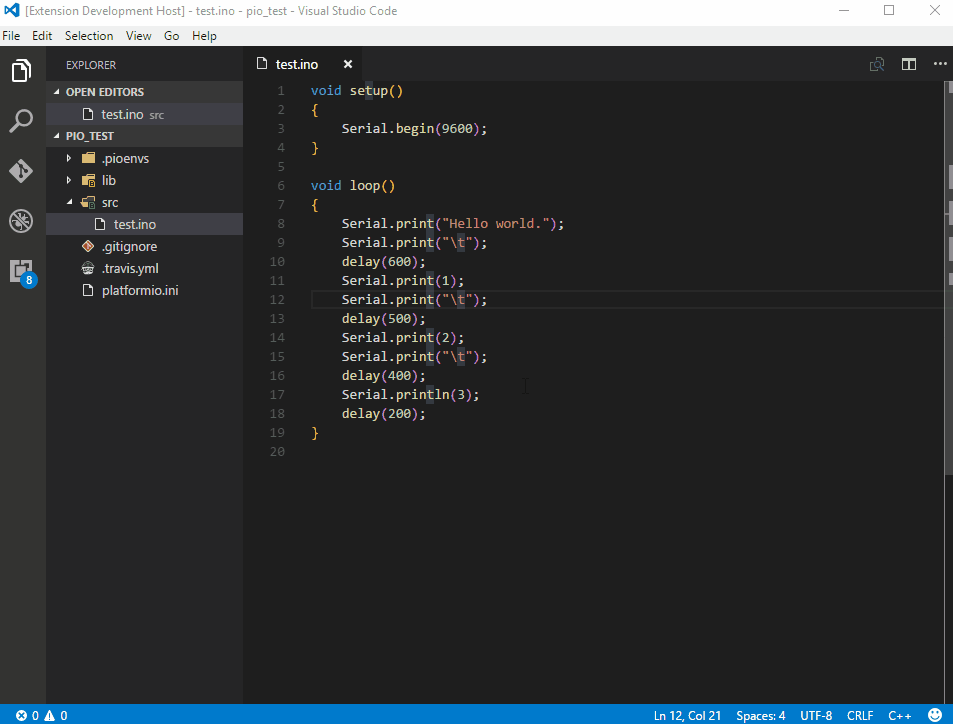

..  Copyright 2014-present PlatformIO <contact@platformio.org>
    Licensed under the Apache License, Version 2.0 (the "License");
    you may not use this file except in compliance with the License.
    You may obtain a copy of the License at
       http://www.apache.org/licenses/LICENSE-2.0
    Unless required by applicable law or agreed to in writing, software
    distributed under the License is distributed on an "AS IS" BASIS,
    WITHOUT WARRANTIES OR CONDITIONS OF ANY KIND, either express or implied.
    See the License for the specific language governing permissions and
    limitations under the License.

.. _ide_vscode:

Visual Studio Code
==================

`Visual Studio Code <https://code.visualstudio.com>`_ is a lightweight but
powerful source code editor which runs on your desktop and is available for
Windows, macOS and Linux. It comes with built-in support for JavaScript,
TypeScript and Node.js and has a rich ecosystem of extensions for other
languages (such as C++, C#, Python, PHP, Go) and runtimes (such as .NET and Unity)

Refer to the `VSCode Documentation <https://code.visualstudio.com/docs>`_
page for more detailed information.

.. contents::

Integration
-----------

Please install `VSCode extension for PlatformIO <https://marketplace.visualstudio.com/items?itemName=formulahendry.platformio>`_.
