..  Copyright (c) 2014-present PlatformIO <contact@platformio.org>
    Licensed under the Apache License, Version 2.0 (the "License");
    you may not use this file except in compliance with the License.
    You may obtain a copy of the License at
       http://www.apache.org/licenses/LICENSE-2.0
    Unless required by applicable law or agreed to in writing, software
    distributed under the License is distributed on an "AS IS" BASIS,
    WITHOUT WARRANTIES OR CONDITIONS OF ANY KIND, either express or implied.
    See the License for the specific language governing permissions and
    limitations under the License.

.. _ide_atom:

PlatformIO IDE for Atom
=======================

.. include:: pioide_features.rst

-------------

`Atom <https://atom.io>`_ is a text editor that's modern, approachable,
yet hackable to the core—a tool you can customize to do anything but also use
productively without ever touching a config file.

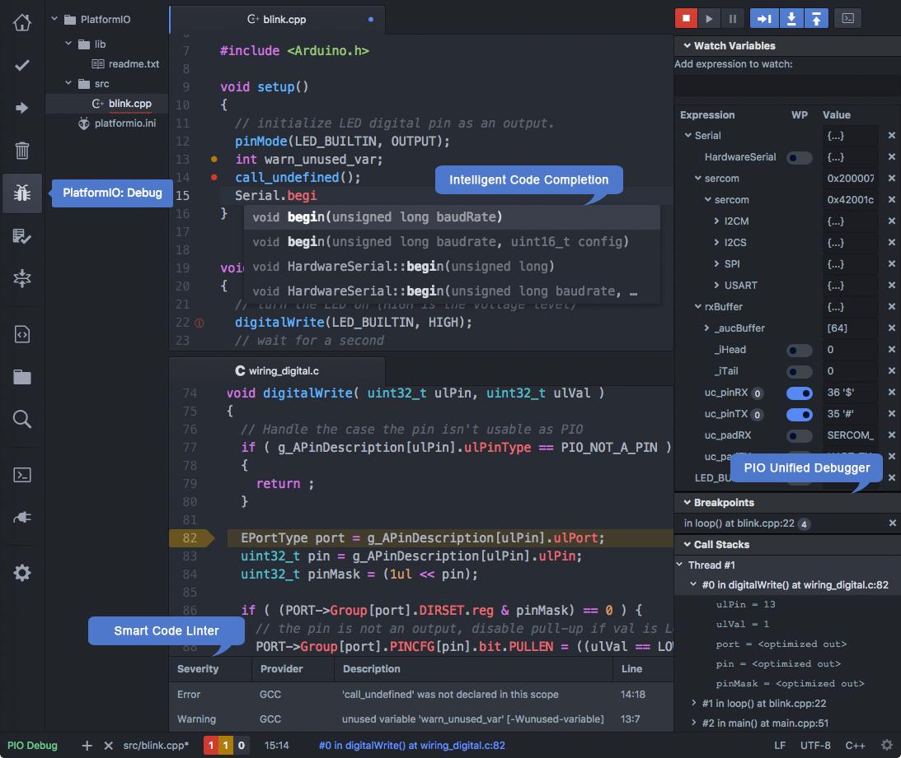

.. contents:: Contents
    :local:

Installation
------------

.. note::

    Please note that you do not need to install :ref:`piocore` separately
    if you are going to use :ref:`ide_atom`. :ref:`piocore` is built into
    PlatformIO IDE and you will be able to use it within PlatformIO IDE Terminal.

    Also, PlatformIO IDE allows one to install :ref:`piocore` Shell Commands
    (``pio``, ``platformio``) globally to your system via
    ``Menu: PlatformIO > Install Shell Commands``.

I. Atom
~~~~~~~

0. `Download <https://atom.io>`_ and install GitHub's official Atom text editor. PlatformIO IDE is built on top of it.

1. **Open** Atom Package Manager

  + *Mac OS X*, ``Menu: Atom > Preferences > Install``
  + *Windows*, ``Menu: File > Settings > Install``
  + *Linux*, ``Menu: Edit > Preferences > Install``

2. **Search** for the official ``platformio-ide`` `package <https://atom.io/packages/platformio-ide>`_
3. **Install** PlatformIO IDE.

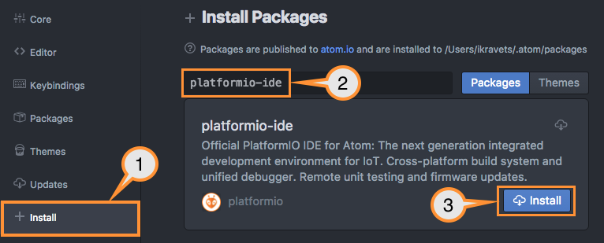

.. _ide_atom_installation_clang:

II. Clang for Intelligent Code Completion
~~~~~~~~~~~~~~~~~~~~~~~~~~~~~~~~~~~~~~~~~

PlatformIO IDE uses `Clang <http://clang.llvm.org>`_ for the Intelligent Code
Completion. To check that ``clang`` is available in your system, please
open Terminal and run ``clang --version``. If ``clang`` is not installed,
then **install it and restart Atom**:

- **Mac OS X**: `Install the latest Xcode <https://developer.apple.com/xcode/download/>`_
  along with the latest Command Line Tools
  (they are installed automatically when you run ``clang`` in Terminal for the
  first time, or manually by running ``xcode-select --install``
- **Windows**: Download `Clang 3.9.1 for Windows <http://llvm.org/releases/download.html>`_.
  Please select "Add LLVM to the system PATH" option on the installation step.

  * `Clang 3.9.1 for Windows (32-bit) <http://releases.llvm.org/3.9.1/LLVM-3.9.1-win32.exe>`__
  * `Clang 3.9.1 for Windows (64-bit) <http://releases.llvm.org/3.9.1/LLVM-3.9.1-win64.exe>`__

  .. image:: ../../_static/images/clang-installer-add-path.png

  .. warning::

      PLEASE DO NOT INSTALL CLANG 4.0. TEMPORARILY, WE SUPPORT ONLY CLANG 3.9.

      If you see a ``Failed to find MSBuild toolsets directory`` error in
      the installation console, please ignore it and press any key to close
      this window. PlatformIO IDE uses only the Clang completion engine, which
      should work after that without any problems.

- **Linux**: Using package managers: ``apt-get install clang`` or ``yum install clang``.
- **Other Systems**: Download the latest `Clang for the other systems <http://llvm.org/releases/download.html>`_.

.. warning::
    If some libraries are not visible in :ref:`ide_atom` and Code Completion or
    Code Linting does not work properly, please perform  ``Menu: PlatformIO >
    Rebuild C/C++ Project Index (Autocomplete, Linter)``

.. _atom_ide_quickstart:

Quick Start
-----------

This tutorial introduces you to the basics of PlatformIO IDE workflow and shows
you the creation process for a simple "Blink" example. After finishing, you will
have a general understanding of how to work with projects in the IDE.

Launch
~~~~~~

After installation, launch PlatformIO IDE by opening Atom. Once Atom is
opened, the PlatformIO IDE auto installer will continue to install dependent packages
and :ref:`piocore`. Please be patient and let the installation complete. Once finished,
PlatformIO IDE will ask you to reload the Atom window to apply
installed components. Please click on ``Reload Now``. After that, PlatformIO IDE is
ready for use. Happy coding!

Setting Up the Project
~~~~~~~~~~~~~~~~~~~~~~

1. Click on the "PlatformIO Home" button on the :ref:`atom_ide_platformio_toolbar`

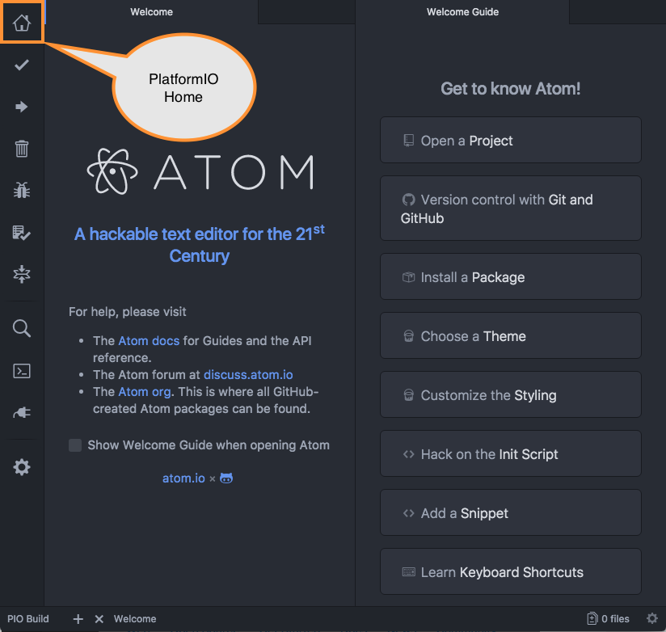

2. Click on "New Project", select a board and create a new PlatformIO Project

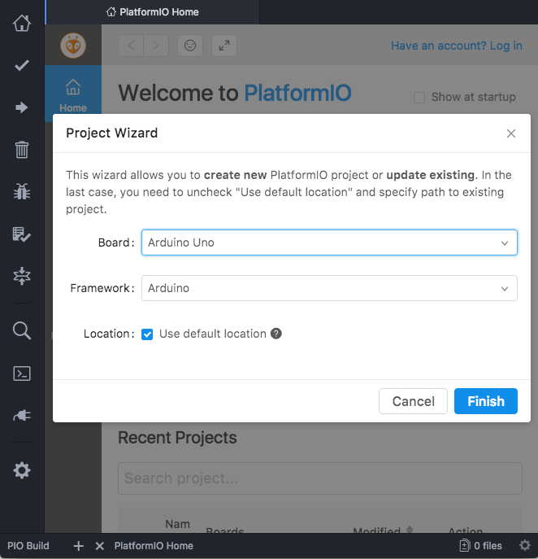

3. Open the ``main.cpp`` file in the ``src`` folder and replace its contents with
   the following:

.. warning::

    The code below only works with Arduino-based boards. Please
    visit the `PlatformIO Project Examples <https://github.com/platformio/platformio-examples>`_ repository for other pre-configured projects.

.. code-block:: cpp

    /**
     * Blink
     *
     * Turns on an LED on for one second,
     * then off for one second, repeatedly.
     */
    #include "Arduino.h"

    // Set LED_BUILTIN if it is not defined by Arduino framework
    // #define LED_BUILTIN 13

    void setup()
    {
      // initialize LED digital pin as an output.
      pinMode(LED_BUILTIN, OUTPUT);
    }

    void loop()
    {
      // turn the LED on (HIGH is the voltage level)
      digitalWrite(LED_BUILTIN, HIGH);

      // wait for a second
      delay(1000);

      // turn the LED off by making the voltage LOW
      digitalWrite(LED_BUILTIN, LOW);

       // wait for a second
      delay(1000);
    }

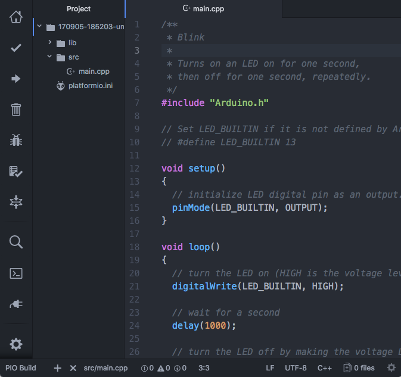

Process Project
~~~~~~~~~~~~~~~

PlatformIO IDE proposes different ways to process the project (build, clean,
upload firmware, run other targets) using:

    - :ref:`atom_ide_platformio_toolbar`
    - :ref:`atom_ide_platformio_menu`
    - :ref:`ide_atom_building_targets` and hotkeys

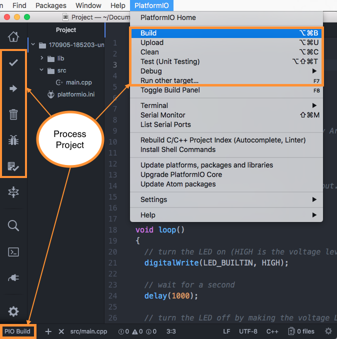

5. Run ``Build`` and you should see a green "success" result in the build
   panel:

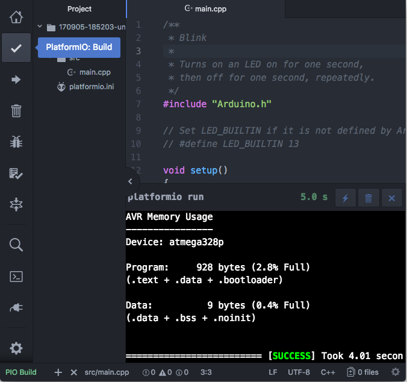

To upload firmware to the board, run ``Upload``.

6. What is more, you can run specific target or process project environment
   using ``Menu: PlatformIO > Run other target...``
   or call targets list from the status bar (bottom, left corner):

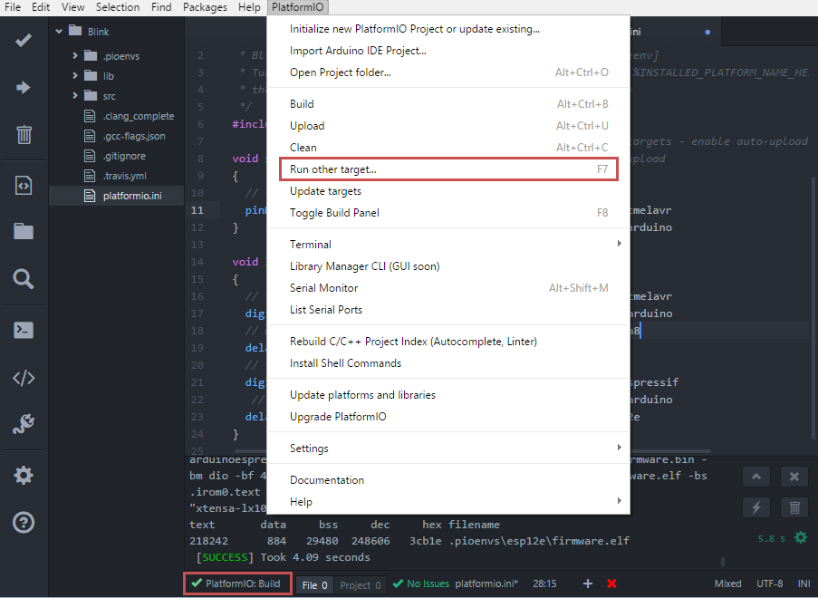

And select desired target:

.. image:: ../../_static/images/ide/atom/ide-atom-quick-start-9.png
    :target: ../../_images/ide-atom-quick-start-9.png

7. To launch the built-in terminal interface, choose ``Menu: PlatformIO > Terminal`` or
   press the corresponding icon in the PlatformIO toolbar:

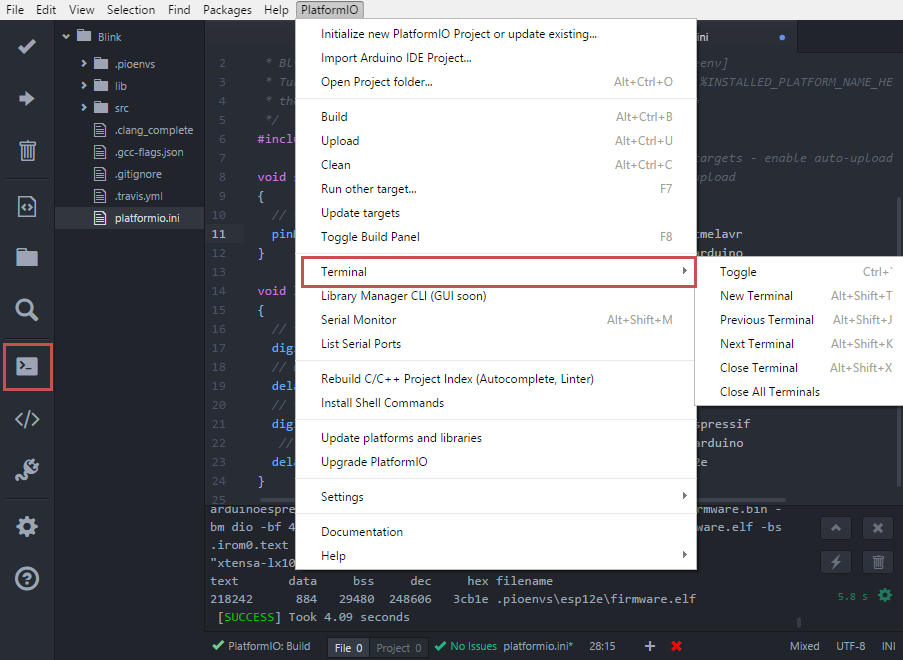

This provides you fast access to a set of powerful :ref:`piocore` CLI commands:

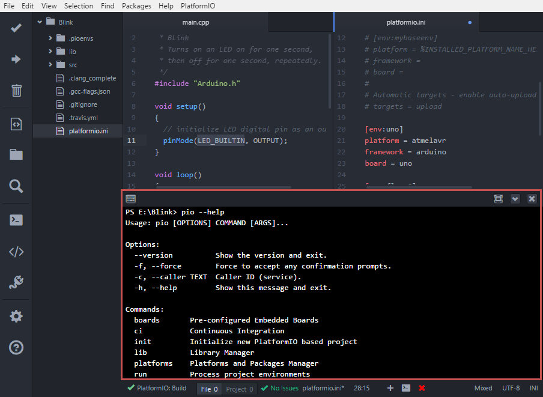

8. To run the built-in "Serial Monitor", choose ``Menu: PlatformIO > Serial Monitor``
   or press the corresponding icon in the PlatformIO toolbar:

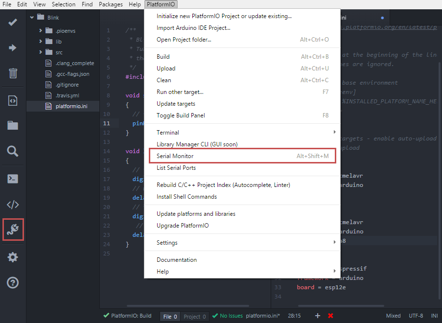

The monitor has several settings to adjust your connection:

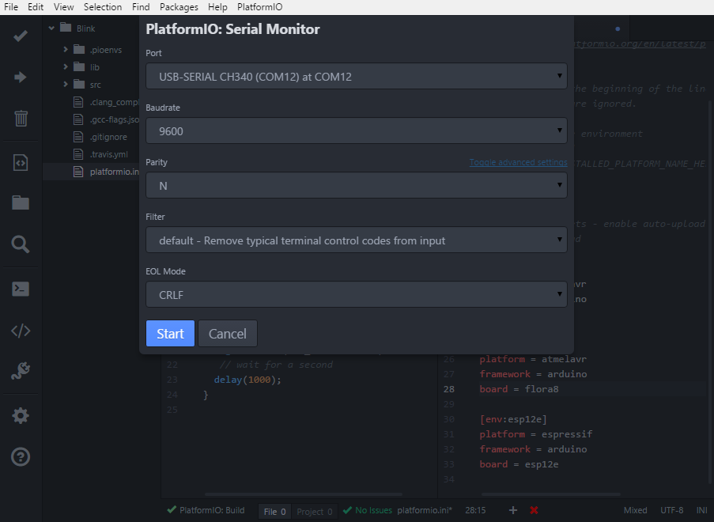

It also allows you to communicate with your board in an easy way:

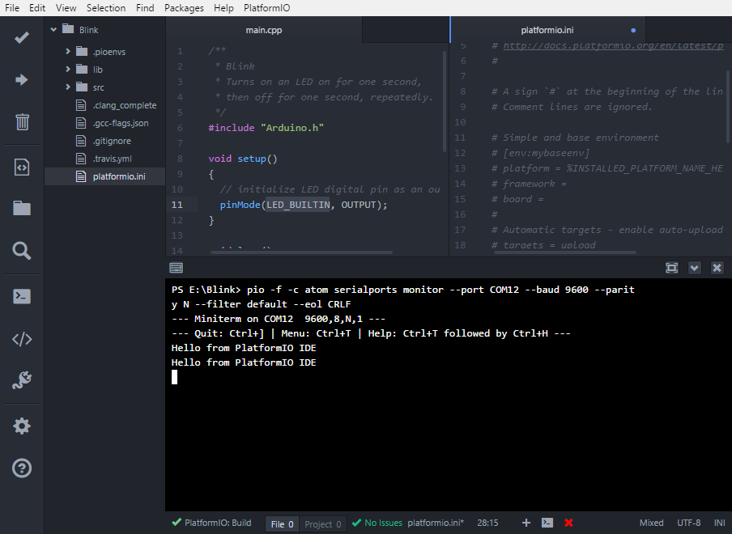

.. _atom_ide_platformio_menu:

Menu item ``PlatformIO``
------------------------

`platformio-ide <https://atom.io/packages/platformio-ide>`_ package adds to Atom
new menu item named ``Menu: PlatformIO`` (after ``Menu: Help`` item).

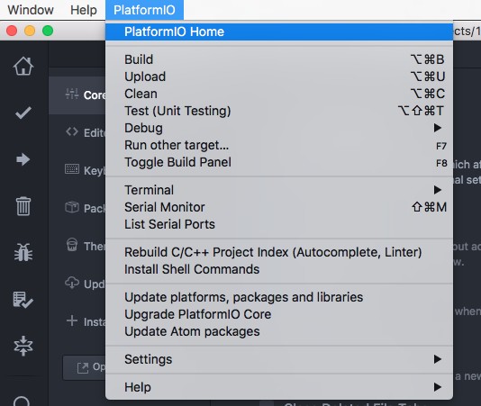

.. _atom_ide_platformio_toolbar:

PlatformIO Toolbar
------------------

PlatformIO IDE Toolbar contains quick access buttons for the popular commands.
Each button contains a hint (leave the mouse on it for a moment).

* :ref:`piohome`
* PlatformIO: Build
* PlatformIO: Upload
* PlatformIO: Clean
* :ref:`piodebug`
* Run other target (Build environments, :ref:`unit_testing`)
* Toggle build panel
* ||
* Find in Project...
* PlatformIO Terminal
* Serial Monitor
* ||
* Atom Settings

.. _ide_atom_building_targets:

Building / Uploading / Targets
------------------------------

* ``cmd-alt-b`` / ``ctrl-alt-b`` / ``f9`` builds project without auto-uploading.
* ``cmd-alt-u`` / ``ctrl-alt-u`` builds and uploads (if no errors).
* ``cmd-alt-c`` / ``ctrl-alt-c`` cleans compiled objects.
* ``cmd-alt-t`` / ``ctrl-alt-t`` / ``f7`` run other targets (Upload using Programmer, Upload SPIFFS image, Update platforms and libraries).
* ``cmd-alt-g`` / ``ctrl-alt-g`` / ``f4`` cycles through causes of build error.
* ``cmd-alt-h`` / ``ctrl-alt-h`` / ``shift-f4`` goes to the first build error.
* ``cmd-alt-v`` / ``ctrl-alt-v`` / ``f8`` toggles the build panel.
* ``escape`` terminates build / closes the build window.

More options: ``Menu: PlatformIO > Settings > Build``.

Intelligent Code Completion
---------------------------

PlatformIO IDE uses `clang <http://clang.llvm.org>`_ for the Intelligent Code Completion.
To install it or check if it is already installed, please follow see the step
:ref:`ide_atom_installation_clang` from Installation guide.

.. warning::
    The libraries which are added/installed after the initializing process will
    not be reflected in the code linter. You need ``Menu: PlatformIO >
    Rebuild C/C++ Project Index (Autocomplete, Linter)``.

.. _ide_atom_smart_code_linter:

Smart Code Linter
-----------------

PlatformIO IDE uses PlatformIO's pre-built GCC toolchains for Smart Code Linter
and rapid professional development.
The configuration data are located in ``.gcc-flags.json``. This file will be
automatically created and preconfigured when you initialize project using
``Menu: PlatformIO > Initialize new PlatformIO Project or update existing...``.

.. warning::
    If some libraries are not visible in :ref:`ide_atom` and Code Completion or
    Code Linting does not work properly, please perform  ``Menu: PlatformIO >
    Rebuild C/C++ Project Index (Autocomplete, Linter)``

Install Shell Commands
----------------------

Please navigate to PlatformIO Core :ref:`piocore_install_shell_commands`.

Known issues
------------

Smart Code Linter is disabled for Arduino files
~~~~~~~~~~~~~~~~~~~~~~~~~~~~~~~~~~~~~~~~~~~~~~~

:ref:`ide_atom_smart_code_linter` is disabled by default for Arduino files
(``*.ino`` and ``.pde``) because they  are not valid C/C++ based
source files:

1. Missing includes such as ``#include <Arduino.h>``
2. Function declarations are omitted.

There are two solutions:

.. contents::
    :local:

.. _ide_atom_knownissues_sclarduino_manually:

Convert Arduino file to C++ manually
^^^^^^^^^^^^^^^^^^^^^^^^^^^^^^^^^^^^

Recommended! See :ref:`faq_convert_ino_to_cpp`.

Force Arduino file as C++
^^^^^^^^^^^^^^^^^^^^^^^^^

To force Smart Code Linter to use Arduino files as C++ please

1. Open ``.gcc-flags.json`` file from the Initialized/Imported project and add
   ``-x c++`` flag at the beginning of the value of ``gccDefaultCppFlags`` field:

.. code-block:: json

    {
      "execPath": "...",
      "gccDefaultCFlags": "...",
      "gccDefaultCppFlags": "-x c++ -fsyntax-only ...",
      "gccErrorLimit": 15,
      "gccIncludePaths": "...",
      "gccSuppressWarnings": false
    }

2. Perform all steps from :ref:`ide_atom_knownissues_sclarduino_manually`
   (without renaming to ``.cpp``).

.. warning::
  Please do not modify other flags here. They will be removed on a next
  "Project Rebuild C/C++ Index" stage.
  Please use :ref:`projectconf_build_flags` for :ref:`projectconf` instead.

Arch Linux: PlatformIO IDE Terminal issue
~~~~~~~~~~~~~~~~~~~~~~~~~~~~~~~~~~~~~~~~~

Please read this article `Installing PlatformIO on Arch Linux <https://primalcortex.wordpress.com/2016/08/18/platformio/>`_.

.. _ide_atom_faq:

Frequently Asked Questions
--------------------------

Keep build panel visible
~~~~~~~~~~~~~~~~~~~~~~~~

PlatformIO IDE hides build panel on success by default. Nevertheless, you can
keep it visible all time. Please follow to
``Menu: PlatformIO > Settings > Build`` and set ``Panel Visibility`` to
``Keep Visible``.

Key-bindings (toggle panel):

* ``cmd+alt+v`` - Mac OS X
* ``ctrl+alt+v`` - Windows/Linux

Automatically save on build
~~~~~~~~~~~~~~~~~~~~~~~~~~~

If you want automatically save all edited files when triggering a build, please follow to
``Menu: PlatformIO > Settings > Build`` and check ``Automatically save on build``.

Jump to Declaration
~~~~~~~~~~~~~~~~~~~

Click on a function/include, press ``F3`` and you will be taken directly to
the declaration for that function.

Code Formatting
~~~~~~~~~~~~~~~

You need to install `atom-beautify <https://atom.io/packages/atom-beautify>`_
package and `C/C++ Uncrustify Code Beautifier <http://sourceforge.net/projects/uncrustify/>`_.

Uninstall Atom with PlatformIO IDE
----------------------------------

Here's how to uninstall the PlatformIO IDE for multiple OS.

See :ref:`piocore_uninstall`, if you do not need it in a system.

Windows
~~~~~~~

1. Uninstall Atom using "Start > Control Panel > Programs and Features > Uninstall"
2. Remove ``C:\Users\<user name>\.atom`` folder (settings, packages, etc...)
3. Remove ``C:\Users\<user name>\AppData\Local\atom`` folder (application itself)
4. Remove ``C:\Users\<user name>\AppData\Roaming\Atom`` folder (cache, etc.)
5. Remove registry records using ``regedit``:

   * HKEY_CLASSES_ROOT\\Directory\\Background\\shell
   * HKEY_CLASSES_ROOT\\Directory\\shell
   * HKEY_CLASSES_ROOT*\\shell

macOS
~~~~~

Run these commands in system Terminal

.. code::

    rm -rf ~/.atom
    rm /usr/local/bin/atom
    rm /usr/local/bin/apm
    rm -rf /Applications/Atom.app
    rm ~/Library/Preferences/com.github.atom.plist
    rm ~/Library/Application\ Support/com.github.atom.ShipIt
    rm -rf ~/Library/Application\ Support/Atom
    rm -rf ~/Library/Saved\ Application\ State/com.github.atom.savedState
    rm -rf ~/Library/Caches/com.github.atom
    rm -rf ~/Library/Caches/Atom

Linux
~~~~~

Run these commands in system Terminal

.. code::

    rm /usr/local/bin/atom
    rm /usr/local/bin/apm
    rm -rf ~/atom
    rm -rf ~/.atom
    rm -rf ~/.config/Atom-Shell
    rm -rf /usr/local/share/atom/

Articles / Manuals
------------------

* Mar, 31, 2017 - **Robin Reiter** - `A little guide to PlatformIO. As an Arduino developer, you may want to check that out! (video review) <https://www.youtube.com/watch?v=EIkGTwLOD7o>`_
* Dec 13, 2016 - **Dr. Patrick Mineault** - `Multi-Arduino projects with PlatformIO <https://xcorr.net/2016/12/13/multi-arduino-projects-with-platformio/>`_
* Nov 10, 2016 - **PiGreek** - `PlatformIO the new Arduino IDE ?! <https://pigreekblog.wordpress.com/2016/11/10/platformio-the-new-arduino-ide/>`_
* Aug 18, 2016 - **Primal Cortex** - `Installing PlatformIO on Arch Linux <https://primalcortex.wordpress.com/2016/08/18/platformio/>`_
* Jul 26, 2016 - **Embedded Systems Laboratory** - `แนะนำการใช้งาน PlatformIO IDE สำหรับบอร์ด Arduino และ ESP8266 (Get started with PlatformIO IDE for Arduino board and ESP8266, Thai) <http://cpre.kmutnb.ac.th/esl/learning/index.php?article=intro_platformio-ide>`_
* May 30, 2016 - **Ron Moerman** - `IoT Development with PlatformIO <https://electronicsworkbench.io/blog/platformio>`_
* May 01, 2016 - **Pedro Minatel** - `PlatformIO – Uma alternativa ao Arduino IDE (PlatformIO - An alternative to the Arduino IDE, Portuguese) <http://pedrominatel.com.br/ferramentas/platformio-uma-alternativa-ao-arduino-ide/>`_
* Apr 23, 2016 - **Al Williams** - `Hackaday: Atomic Arduino (and Other) Development <http://hackaday.com/2016/04/23/atomic-arduino-and-other-development/>`_
* Apr 16, 2016 - **Sathittham Sangthong** - `[PlatformIO] มาลองเล่น PlatformIO แทน Arduino IDE กัน (Let's play together with PlatformIO IDE [alternative to Arduino IDE], Thai) <http://www.sathittham.com/platformio/platformio-ide/>`_
* Apr 11, 2016 - **Matjaz Trcek** - `Top 5 Arduino integrated development environments <https://codeandunicorns.com/top-5-arduino-integrated-development-environments-ide/>`_
* Apr 06, 2016 - **Aleks** - `PlatformIO ausprobiert (Tried PlatformIO, German) <http://5volt-junkie.net/platformio/>`_
* Apr 02, 2016 - **Diego Pinto** - `Você tem coragem de abandonar a IDE do Arduino? PlatformIO + Atom (Do you dare to leave the Arduino IDE? PlatformIO + Atom, Portuguese) <http://www.clubemaker.com.br/?rota=artigo/81>`_
* Mar 30, 2016 - **Brandon Cannaday** - `Getting Started with PlatformIO and ESP8266 NodeMcu <https://www.losant.com/blog/getting-started-with-platformio-esp8266-nodemcu>`_
* Mar 12, 2016 - **Peter Marks** - `PlatformIO, the Arduino IDE for programmers <http://blog.marxy.org/2016/03/platformio-arduino-ide-for-programmers.html>`_
* Mar 05, 2016 - **brichacek.net** - `PlatformIO – otevřený ekosystém pro vývoj IoT (PlatformIO – an open source ecosystem for IoT development, Czech) <http://blog.brichacek.net/platformio-otevreny-ekosystem-pro-vyvoj-iot/>`_
* Mar 04, 2016 - **Ricardo Vega** - `Programa tu Arduino desde Atom (Program your Arduino from Atom, Spanish) <http://ricveal.com/blog/programa-arduino-desde-atom/>`_
* Feb 28, 2016 - **Alex Bloggt** - `PlatformIO vorgestellt (Introduction to PlatformIO IDE, German) <https://alexbloggt.com/platformio-vorgestellt/>`_
* Feb 25, 2016 - **NutDIY** - `PlatformIO Blink On Nodemcu Dev Kit V1.0 (Thai) <http://nutdiy.blogspot.com/2016/02/platformio-blink-on-nodemcu-dev-kit-v10.html>`_

See a full list with :ref:`articles`.

Changelog
---------

Please visit `releases page <https://github.com/platformio/platformio-atom-ide/releases>`_.
