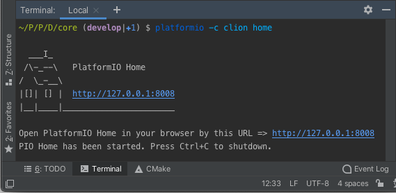

..  Copyright (c) 2014-present PlatformIO <contact@platformio.org>
    Licensed under the Apache License, Version 2.0 (the "License");
    you may not use this file except in compliance with the License.
    You may obtain a copy of the License at
       http://www.apache.org/licenses/LICENSE-2.0
    Unless required by applicable law or agreed to in writing, software
    distributed under the License is distributed on an "AS IS" BASIS,
    WITHOUT WARRANTIES OR CONDITIONS OF ANY KIND, either express or implied.
    See the License for the specific language governing permissions and
    limitations under the License.

.. _ide_clion:

CLion
=====

`CLion <https://www.jetbrains.com/clion/>`_ is a cross-platform C/C++ IDE for
Linux, OS X, and Windows. CLion includes such features as a smart editor, code
generation, code quality assurance, automated refactorings, on-the-fly code analysis,
project manager, integrated version control systems and debugger.

Refer to the `CLion Documentation <https://www.jetbrains.com/clion/help/>`_
page for more detailed information.

.. image:: ../../_static/images/ide/clion/ide-platformio-clion.png

.. contents:: Contents
    :local:

Installation
------------

1. Install PlatformIO Core (CLI). See :ref:`core_installation` guide

   .. warning::
      This a **temporary step** and depends on `CLion #CPP-19412: Automatically install PlatformIO Core  <https://youtrack.jetbrains.com/issue/CPP-19412>`_

2. `Download <https://www.jetbrains.com/clion/>`_ and install CLion IDE
3. Install official `PlatformIO for CLion <https://plugins.jetbrains.com/plugin/13922-platformio-for-clion>`_ plugin.
   Open "Configure > Plugins" window and go to the "Marketplace" tab. Search for
   ``PlatformIO`` and press the "Install" button.

   .. image:: ../../_static/images/ide/clion/ide-platformio-clion-install-plugin.png

4. Restart CLion IDE.

.. note::
    We also recommend to install `Ini <https://plugins.jetbrains.com/plugin/6981-ini>`_
    plugin that provides syntax highlighting, formatting, code folding, and viewing
    structure for :ref:`projectconf`.

Known issues
------------

Project configuration and CMake
~~~~~~~~~~~~~~~~~~~~~~~~~~~~~~~

PlatformIO does not depend on "CMake" and uses own multi-platform build system.
Project configuration, such as build flags, library dependencies, etc., should be
declared in :ref:`projectconf`.

.. warning::
  Please note that "PlatformIO for CLion" plugin does not update automatically CLion
  configuration. There is a feature request `CLion #CPP-18367:  Follow platformio.ini changes and update the project <https://youtrack.jetbrains.com/issue/CPP-18367>`_.

Update CLion configuration: "Tools > PlatformIO > Re-Init"

CLion does not load project build environments from "platformio.ini"
~~~~~~~~~~~~~~~~~~~~~~~~~~~~~~~~~~~~~~~~~~~~~~~~~~~~~~~~~~~~~~~~~~~~

This is a known issue `CLion CPP-19478: CLion does not handle "CMAKE_CONFIGURATION_TYPES" from CMakeLists.txt <https://youtrack.jetbrains.com/issue/CPP-19478>`_.
A temporary solution is to manually configure project profiles in CLion.

Please open CLion Settings and navigate to "Build, Execution, Deployment > CMake".
Press "+" button and PlatformIO-based project profiles:

Arduino ``.ino`` files are not supported
~~~~~~~~~~~~~~~~~~~~~~~~~~~~~~~~~~~~~~~~

CLion uses "CMake" tool for code completion and code linting. As a result, it
doesn't support the Arduino files (``*.ino`` and ``.pde``) because they are
not valid C/C++ based source files:

1. Missing includes such as ``#include <Arduino.h>``
2. Function declarations are omitted.

See how to :ref:`faq_convert_ino_to_cpp`.

Quick Start
-----------

This tutorial introduces you to the basics of PlatformIO for CLion workflow and shows
you a creation process of a simple "Blink" example. After finishing you will
have a general understanding of how to work with projects in the CLion IDE.

Setting Up the Project
~~~~~~~~~~~~~~~~~~~~~~

1. Please open "New Project" wizard, select board and framework, and create a new
   PlatformIO project. Please **USE ONLY** Latin characters (a-z) in a project name to
   avoid further issues with project compilation. Numbers and some symbols are
   allowed depending on a file system:

2. Rename ``main.c`` file in ``src`` folder to ``main.cpp``  (right click on a file
   ``main.c``, Refactor > Rename...) . Paste the next contents:

.. warning::

    The code below works only in pair with Arduino-based boards. Please
    follow to `PlatformIO Project Examples <https://github.com/platformio/platformio-examples>`__
    repository for other pre-configured projects.

.. code-block:: cpp

    /**
     * Blink
     *
     * Turns on an LED on for one second,
     * then off for one second, repeatedly.
     */
    #include "Arduino.h"

    // Set LED_BUILTIN if it is not defined by Arduino framework
    // #define LED_BUILTIN 13

    void setup()
    {
      // initialize LED digital pin as an output.
      pinMode(LED_BUILTIN, OUTPUT);
    }

    void loop()
    {
      // turn the LED on (HIGH is the voltage level)
      digitalWrite(LED_BUILTIN, HIGH);

      // wait for a second
      delay(1000);

      // turn the LED off by making the voltage LOW
      digitalWrite(LED_BUILTIN, LOW);

       // wait for a second
      delay(1000);
    }

Build & Upload
~~~~~~~~~~~~~~

1. Open project configuration wizard and add ``PlatformIO Upload`` and
   ``PlatformIO Debug`` configurations (you can add the rest configurations if you need them):

2. Remove pre-task ("Build") from ``PlatformIO Upload`` and ``PlatformIO Debug``
   configurations to avoid double project building. You should see "There are no tasks
   to run before launch".

3. Select ``PlatformIO Upload`` configuration and use the "Build" button for project
   compilation or the "Run" for a firmware uploading:

Configuration options
'''''''''''''''''''''

- :ref:`projectconf_section_env_build`
- :ref:`projectconf_section_env_upload`

Device/Serial Monitor
---------------------

Please open CLion terminal and use :ref:`cmd_device`. You can also configure
device monitor per project using :ref:`projectconf_section_env_monitor`.

Please note that you need to manually close/stop device monitor before firmware uploading.

Debugging
---------

"PlatformIO for CLion" supports :ref:`piodebug` which allows you to debug your
application with 1-Click without extra steps. Please select ``PlatformIO Debug``
configuration and press the "Debug" button:

Peripheral Registers
~~~~~~~~~~~~~~~~~~~~

Please navigate to the "Peripheral" tab in a "Debug" view, press the "Configure" icon
and select registers to monitor. Close configuration window.

.. warning::
  Currently, CLion does not load automatically Peripheral Register Definitions (SVD file)
  provided by PlatformIO. There is a feature request `CLion #CPP-18369: Support CLION_SVD_FILE_PATH CMake variable to auto-find svd file <https://youtrack.jetbrains.com/issue/CPP-18369>`_.

  A temporary solution is to open ``CMakeListsPrivate.txt`` file from a root of
  PlatformIO project and remember SVD file declared in ``CLION_SVD_FILE_PATH``
  "CMake" variable. Now press the "+" button in Peripherals Wizard and select SVD file
  mentioned in ``CLION_SVD_FILE_PATH``.

PlatformIO Home
---------------

Currently, :ref:`piohome` is not integrated into "PlatformIO for CLion". See related
feature request `CLion: CPP-19493 Integrate PlatformIO Home <https://youtrack.jetbrains.com/issue/CPP-19493>`_.

Nevertheless, you can start it manually and open in your browser. Please note that some
features do not work, such as project opening. Please open CLion terminal
and run :ref:`cmd_home` command:

.. code-block:: shell

    pio -c clion home

---------------

Further for reading:

* :ref:`tutorials` (step-by-step tutorials with debugging and unit testing)
* `CLion documentation <https://www.jetbrains.com/help/clion/working-with-source-code.html>`__.

**Happy coding with PlatformIO!**
