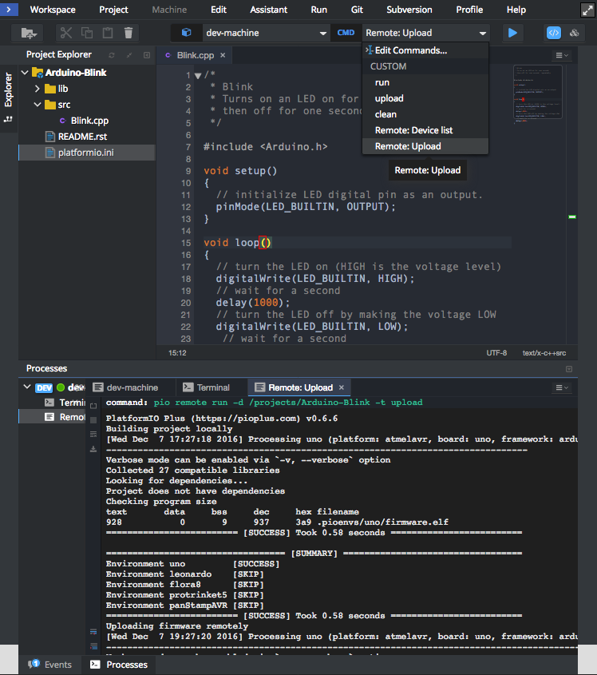
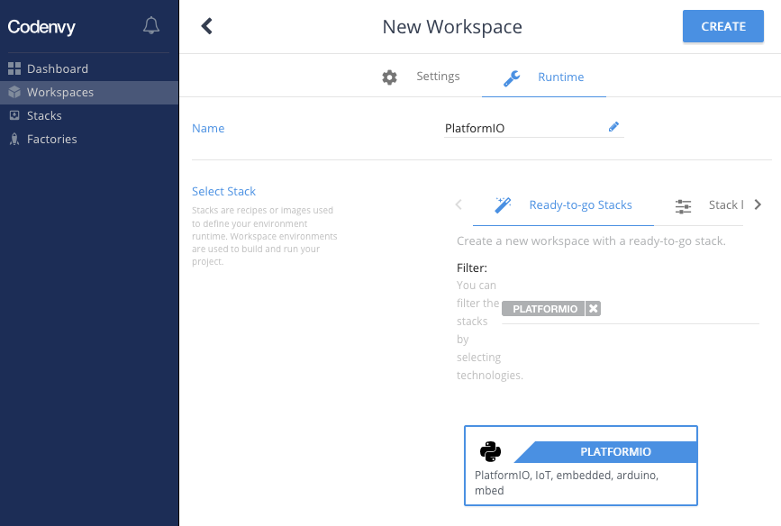
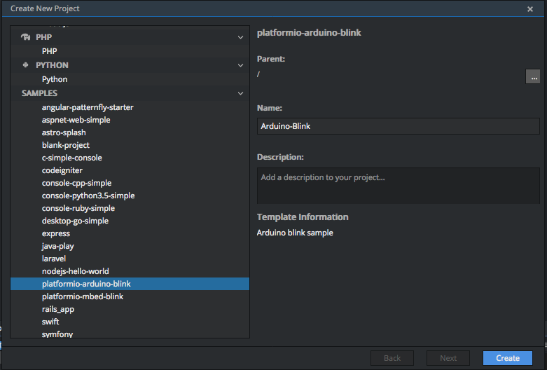
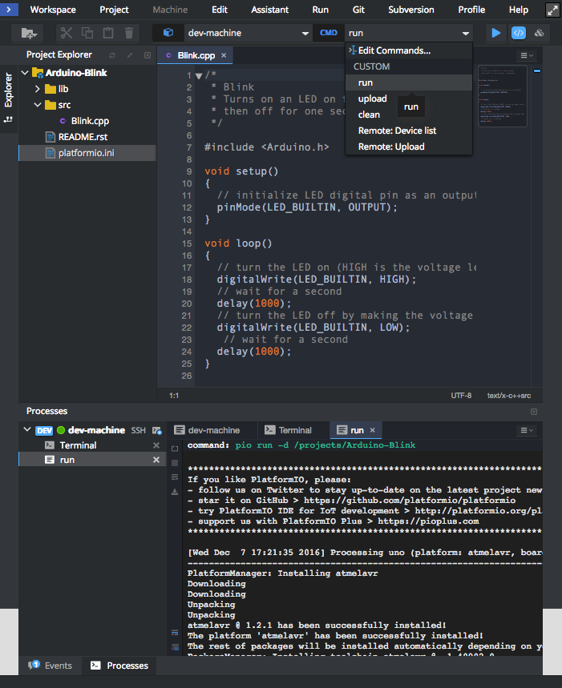

..  Copyright (c) 2014-present PlatformIO <contact@platformio.org>
    Licensed under the Apache License, Version 2.0 (the "License");
    you may not use this file except in compliance with the License.
    You may obtain a copy of the License at
       http://www.apache.org/licenses/LICENSE-2.0
    Unless required by applicable law or agreed to in writing, software
    distributed under the License is distributed on an "AS IS" BASIS,
    WITHOUT WARRANTIES OR CONDITIONS OF ANY KIND, either express or implied.
    See the License for the specific language governing permissions and
    limitations under the License.

.. _ide_eclipseche:

Eclipse Che
===========

`Eclipse Che <https://www.eclipse.org/che/>`_ is an open-source Java based
developer workspace server and cloud integrated development environment (IDE)
which provides a remote development platform for multi-user purpose. The
workspace server comes with a RESTful webservice and provides high flexibility.
It also contains a SDK which can be used to create plug-ins for languages,
frameworks or tools.

.. contents::

.. note::

    1. Please make sure to read :ref:`pioremote` guide first.
    2. You need :ref:`pioaccount` if you don't have it. Registration is FREE.
    3. You should have a running :ref:`cmd_remote_agent` on a remote machine
       where hardware devices are connected physically or accessible for the
       remote operations. See **Remote Development** :ref:`pio_remote_quickstart` for details.

Demo
----

Integration
-----------

1.  `Sign in to Codenvy (based on Eclipse Che) <https://codenvy.com>`_. A
    registration is FREE and gives you unlimited private projects.

2.  Open `Workspaces <https://codenvy.io/dashboard/#/workspaces>`_ tab

3.  Click on "Add Workspace", then switch to "Runtime" tab.

    * **Name** set to "PlatformIO"
    * **Stack** search for ``PLATFORMIO``
    * Click on "Create" button, then "Open".

4.  Using opened Terminal, please log in to :ref:`pioaccount` using
    :ref:`cmd_account_login` command.

Quick Start
-----------

Let's create our first PlatformIO-based Codenvy Project

1.  Click on ``Menu: Workspace > Create New Project`` and select
    ``platformio-arduino-blink`` sample. Set "Name" to "Arduino Blink" and
    press "Create".

2.  Now you can use dropdown Commands menu and process project with "run" command

3.  If you prefer to work with :ref:`piocore` CLI, then you can process project
    using Cloud IDE Terminal and the next commands:

    * :ref:`cmd_run` - build project locally (using Cloud IDE's virtual machine)
    * :ref:`pio run -t clean <cmd_run>` - clean project
    * :ref:`pio remote run -t upload <cmd_remote_run>` - upload firmware (program) to a remote device
    * :ref:`cmd_remote_device_list` - list available remote devices
    * :ref:`cmd_remote_device_monitor` - Remote Serial Port Monitor

Multi-Project workspace
-----------------------

You can have multiple PlatformIO-based Projects in the same workspace. We
recommend a next folders structure:

.. code::

    ├── project-A
    │   ├── lib
    │   │   └── README
    │   ├── platformio.ini
    │   └── src
    │       └── main.ino
    └── project-B
        ├── lib
        │   └── README
        ├── platformio.ini
        └── src
            ├── main.cpp
            └── main.h

In this case, you need to use ``-d, --project-dir`` option for :ref:`cmd_run`
or :ref:`cmd_remote_run` commands:

* ``pio remote run --project-dir project-A -t upload`` build Project-A
* ``pio remote run --project-dir project-A -t upload`` remote firmware uploading
    using Project-A
* ``pio remote run -d project-B -t upload`` remote firmware (program) uploading
    using Project-B

See documentation for :option:`pio remote run --project-dir` option.
