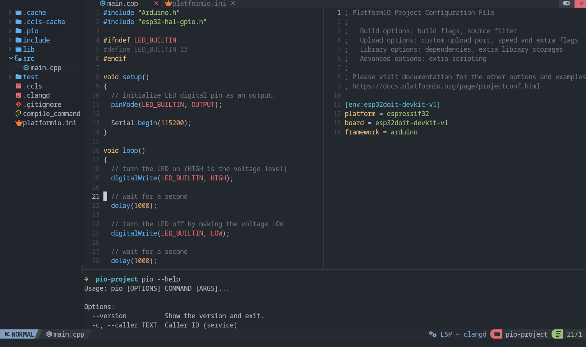

..  Copyright (c) 2014-present PlatformIO <contact@platformio.org>
    Licensed under the Apache License, Version 2.0 (the "License");
    you may not use this file except in compliance with the License.
    You may obtain a copy of the License at
       http://www.apache.org/licenses/LICENSE-2.0
    Unless required by applicable law or agreed to in writing, software
    distributed under the License is distributed on an "AS IS" BASIS,
    WITHOUT WARRANTIES OR CONDITIONS OF ANY KIND, either express or implied.
    See the License for the specific language governing permissions and
    limitations under the License.

.. _ide_neovim:

Neovim
======

`Neovim <https://neovim.io/>`_ is a powerful, open-source and configurable text
editor based on `Vim <http://www.vim.org/>`_. Neovim is designed for use both from a command-line interface and as a
standalone application in a graphical user interface.

.. contents::

Project Generation
------------------

1. Open system Terminal and install :ref:`piocore` if you haven't already
2. Create new folder for your project and change directory (``cd``) to it
3. Generate a project using PlatformIO Core Project Generator

Choose board ``ID`` using :ref:`cmd_boards` or `Embedded Boards Explorer <https://platformio.org/boards>`_
command and generate project via the following command:

.. code-block:: shell

    pio project init --board <ID>

Language Server
---------------

IDE features like completion, diagnostics and navigation are provided by language servers like clangd or ccls.
When cross compiling for embedded architectures, language servers require some metadata to understand target architecture, system include paths and libraries.
This metadata can be generated by PlatformIO.

Neovim supports LSP (Language Server Protocol) natively.
You can configure and start LSP servers using ``vim.lsp``.
LSP servers can be installed manually or using Mason.

clangd
^^^^^^

Install clangd via Mason or install manually ensuring it is in your ``PATH``

You must launch clangd with the option ``--query-driver``.
This is an allowlist that tells clangd which paths it is allowed to query a compiler in.
Often clangd executes the compiler itself with some options,
then the output is parsed to get target architecture and system include directories.
This greatly improves support for embedded GCC toolchains.

It is recommended to manually whitelist directories (* matches all files in a directory, ** matches everything including /, both can only be used at the end of a path) separated by commas.
But if you want to automatically whitelist all platformio toolchains then you can use the following script and add any additional directories to it:

.. code-block:: lua

    local clangd_allowlist = {
      '/usr/bin/*',
      -- add any additional directories you want here
    }

    local pio_toolchain_dirs = vim.fn.glob(vim.env.HOME .. '/.platformio/packages/toolchain-*/bin', false, true)

    for _, dir in ipairs(pio_toolchain_dirs) do
      table.insert(clangd_allowlist, dir .. '/*')
    end

    ---@type vim.lsp.Config
    local clangd_config = {
      cmd = {
        'clangd',
        #clangd_allowlist ~= 0 and ('--query-driver=' .. table.concat(clangd_allowlist, ',')) or nil,
      },
      -- you can configure other options for the clangd server here
    }

    vim.lsp.config('clangd', clangd_config)
    vim.lsp.enable 'clangd'

Generate ``compile_commands.json`` in project root directory

.. code-block:: shell

    pio run -t compiledb

.. warning::
    You should regenerate ``compile_commands.json`` (using the above command) whenever:

    1. Opening a project for the first time (either after generation by you or after git clone or by any other methods)
    2. A new library is added, installed or used in the project
    3. A new source file is created by you in the project (not always necessary, but recommended)

``compile_commands.json`` contains the exact compiler command that gets used when building.
Clangd may not recognize some GCC flags, and some additional flags may be required.

For this you may also want to create a ``.clangd`` file.
It is a ``YAML`` file that you can use to add or remove flags, and configure other project specific settings

For example: if you are getting errors similar to the following in Neovim

.. code-block::

    Diagnostics:
    1. Unknown argument '-mlongcalls'; did you mean '-mlong-calls'? [drv_unknown_argument_with_suggestion]
    2. Unknown argument: '-fstrict-volatile-bitfields' [drv_unknown_argument]
    3. Unknown argument: '-fno-tree-switch-conversion' [drv_unknown_argument]

Create a ``.clangd`` file in the project root directory with the flags that are giving you errors

.. code-block:: yaml

    CompileFlags:
      Remove:
        - "-mlongcalls"
        - "-fstrict-volatile-bitfields"
        - "-fno-tree-switch-conversion"

.. note::
    This only removes clangd errors in the editor. The compiler command during build is unaffected.

See clangd documentation:

- `System Headers <https://clangd.llvm.org/guides/system-headers>`_ and the section ``Query-driver``
- `Compile Commands <https://clangd.llvm.org/design/compile-commands>`_ and the section ``Query-driver``
- `Clangd Configuration <https://clangd.llvm.org/config#compileflags>`_ and the section ``CompileFlags``
- `Editor Plugins <https://clangd.llvm.org/installation#editor-plugins>`_

ccls
^^^^

Manually install `ccls <https://github.com/MaskRay/ccls/>`_ and make sure it is in your ``PATH`` or install via Mason if available. Then configure and enable the ``ccls`` server in your Neovim config:

.. code-block:: lua

    ---@type vim.lsp.Config
    local ccls_config = {
      filetypes = { 'c', 'cpp', 'objc', 'objcpp', 'cuda', 'h' },
      -- you can configure other options for the ccls server here
    }

    vim.lsp.config('ccls', ccls_config)
    vim.lsp.enable('ccls')

Generate ``.ccls`` in project root directory

.. code-block:: shell

    pio project init --ide vim

.. warning::
    You should regenerate ``.ccls`` (using the above command) whenever:

    1. Opening a project for the first time (either after generation by you or after git clone or by any other methods)
    2. A new library is added, installed or used in the project
    3. A new source file is created by you in the project (not always necessary, but recommended)

Useful Commands
---------------

Build (without uploading)

.. code-block:: shell

    pio run

Build and Upload (if no error)

.. code-block:: shell

    pio run --target upload

Serial Monitor

.. code-block:: shell

    pio device monitor -b <baud rate>

