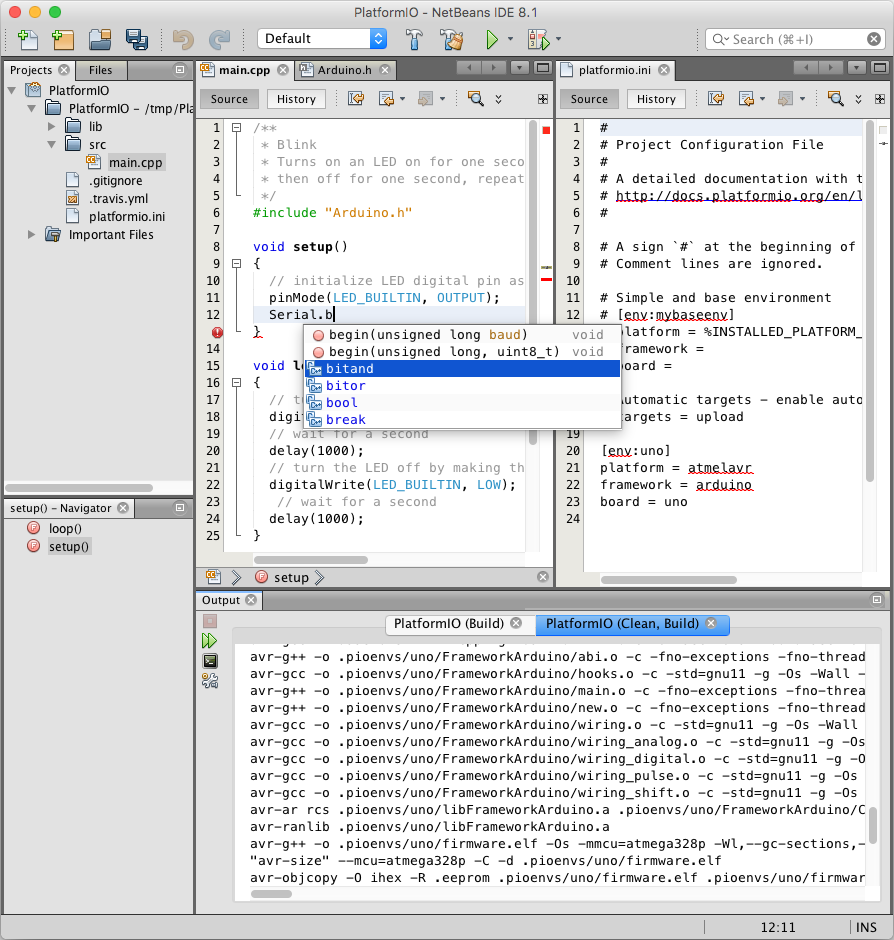

..  Copyright (c) 2014-present PlatformIO <contact@platformio.org>
    Licensed under the Apache License, Version 2.0 (the "License");
    you may not use this file except in compliance with the License.
    You may obtain a copy of the License at
       http://www.apache.org/licenses/LICENSE-2.0
    Unless required by applicable law or agreed to in writing, software
    distributed under the License is distributed on an "AS IS" BASIS,
    WITHOUT WARRANTIES OR CONDITIONS OF ANY KIND, either express or implied.
    See the License for the specific language governing permissions and
    limitations under the License.

.. _ide_netbeans:

NetBeans
========

NetBeans is a Java-based integrated development environment (IDE). It provides
out-of-the-box code analyzers and editors for working with the latest Java 8
technologies--Java SE 8, Java SE Embedded 8, and Java ME Embedded 8. The IDE
also has a range of new tools for HTML5/JavaScript, in particular for Node.js,
KnockoutJS, and AngularJS; enhancements that further improve its support for
Maven and Java EE with PrimeFaces; and improvements to PHP and C/C++ support.

NetBeans IDE can be downloaded from `here <https://netbeans.org/downloads/>`_.
Just make sure you download the C/C++ version (or if you already use NetBeans,
install the C/C++ development plugins).

.. warning::

  Note that the version of NetBeans IDE provided by some Linux package repositories
  may be a Flatpak version, which are known to have issues with accessing the
  PlatformIO CLI installed due to the container nature of this technology. It is
  recommended that you use the native version of the NetBeans IDE via the above link.

.. contents::

Integration
-----------

Integration process consists of these steps:

1. Open system Terminal and install :ref:`piocore`
2. Create new folder for your project and change directory (``cd``) to it
3. Generate a project using PlatformIO Core Project Generator (:option:`pio project init --ide`)
4. Import project in IDE.

------------

Choose board ``ID`` using :ref:`cmd_boards` or `Embedded Boards Explorer <https://platformio.org/boards>`_
command and generate project via :option:`pio project init --ide` command:

.. code-block:: shell

    pio project init --ide netbeans --board <ID>

    # For example, generate project for Arduino UNO
    pio project init --ide netbeans --board uno

Then:

1. Open this project via ``Menu: File > Open Project...``
2. Add new files to ``src`` directory (``*.c, *.cpp, *.ino, etc.``) via
   right-click on ``src`` folder in the "Projects" pane
3. Build project using ``Menu: Run > Build Project``
4. Upload firmware using ``Menu: Run > Run Project``

.. warning::
    The libraries which are added, installed or used in the project
    after generating process won't be reflected in IDE. To fix it you
    need to reinitialize project using :ref:`cmd_project_init` (repeat it).

Articles / Manuals
------------------

* Feb 22, 2016 - **Grzegorz Hołdys** - `How to Integrate PlatformIO with Netbeans <http://www.instructables.com/id/How-to-Integrate-PlatformIO-With-Netbeans/>`_

See the full list with :ref:`articles`.
