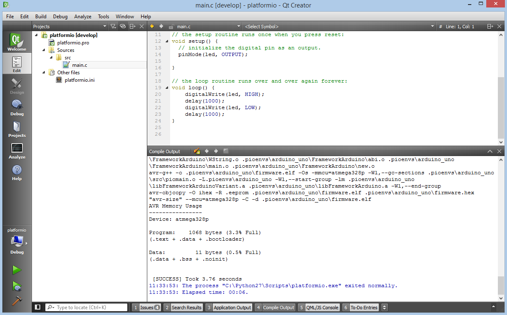

..  Copyright (c) 2014-present PlatformIO <contact@platformio.org>
    Licensed under the Apache License, Version 2.0 (the "License");
    you may not use this file except in compliance with the License.
    You may obtain a copy of the License at
       http://www.apache.org/licenses/LICENSE-2.0
    Unless required by applicable law or agreed to in writing, software
    distributed under the License is distributed on an "AS IS" BASIS,
    WITHOUT WARRANTIES OR CONDITIONS OF ANY KIND, either express or implied.
    See the License for the specific language governing permissions and
    limitations under the License.

.. _ide_qtcreator:

Qt Creator
==========

The `Qt Creator <https://github.com/qtproject/qt-creator>`_ is an open source cross-platform integrated development environment. The editor includes such features as syntax highlighting for various languages, project manager, integrated version control systems, rapid code navigation tools and code autocompletion.

Refer to the `Qt-creator Manual <http://doc.qt.io/qtcreator/>`_
page for more detailed information.

.. contents::

Integration
-----------

Integration process consists of these steps:

1. Open system Terminal and install :ref:`piocore`
2. Create new folder for your project and change directory (``cd``) to it
3. Generate a project using PlatformIO Core Project Generator (:option:`pio project init --ide`)
4. Import project in IDE.

Project Generator
^^^^^^^^^^^^^^^^^

The generator will create a [Qt Creator generic project](https://doc.qt.io/qtcreator/creator-project-generic.html).

Choose board ``ID`` using :ref:`cmd_boards` or `Embedded Boards Explorer <https://platformio.org/boards>`_
command and generate project via :option:`pio project init --ide` command:

.. code-block:: shell

    pio project init --ide qtcreator --board <ID>

    # For example, generate project for Arduino UNO
    pio project init --ide qtcreator --board uno

Then:

1. Import project via ``File > Open File or Project`` and select
   ``platformio.creator`` from the folder where is located :ref:`projectconf`
2. Switch to ``Edit`` mode (left panel) and open source file from ``src``
   directory (``*.c, *.cpp, *.ino, etc.``)
3. Build project: ``Menu: Build > Build All``.

.. warning::
    The libraries which are added, installed or used in the project
    after generating process won't be reflected in IDE. To fix it you
    need to reinitialize project using :ref:`cmd_project_init` (repeat it).
