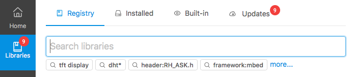

..  Copyright (c) 2014-present PlatformIO <contact@platformio.org>
    Licensed under the Apache License, Version 2.0 (the "License");
    you may not use this file except in compliance with the License.
    You may obtain a copy of the License at
       http://www.apache.org/licenses/LICENSE-2.0
    Unless required by applicable law or agreed to in writing, software
    distributed under the License is distributed on an "AS IS" BASIS,
    WITHOUT WARRANTIES OR CONDITIONS OF ANY KIND, either express or implied.
    See the License for the specific language governing permissions and
    limitations under the License.

.. _librarymanager:

Library Management
==================

*PlatformIO Library Manager* is a tool for managing libraries of
`PlatformIO Registry <https://platformio.org/lib>`__ and VCS repositories (Git,
Hg, SVN). It makes it exceedingly simple to find, install and keep libraries
up-to-date. PlatformIO Library Manager supports
`Semantic Versioning <http://semver.org>`_ and its rules.

-------

:ref:`pioide` has built-in :ref:`piohome` with a modern GUI which allows:

* Search for new libraries in PlatformIO Registry
* "1-click" library installation, per-project libraries, extra storages
* List installed libraries in multiple storages
* List built-in libraries (by frameworks)
* Updates for installed libraries
* Multiple examples, trending libraries, and more.

.. toctree::
    :maxdepth: 2

    quickstart
    ldf
    Configuration <../projectconf/section_env_library>
    config
    creating
