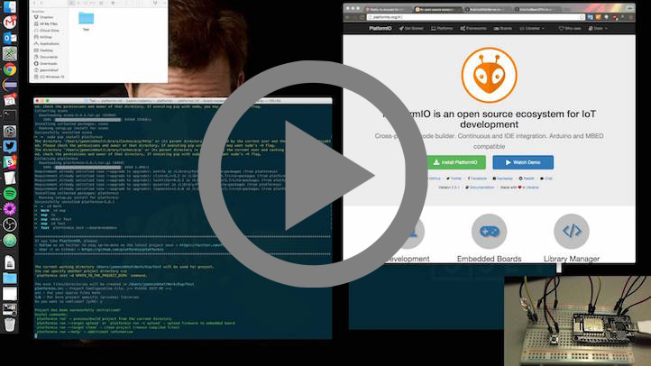

..  Copyright (c) 2014-present PlatformIO <contact@platformio.org>
    Licensed under the Apache License, Version 2.0 (the "License");
    you may not use this file except in compliance with the License.
    You may obtain a copy of the License at
       http://www.apache.org/licenses/LICENSE-2.0
    Unless required by applicable law or agreed to in writing, software
    distributed under the License is distributed on an "AS IS" BASIS,
    WITHOUT WARRANTIES OR CONDITIONS OF ANY KIND, either express or implied.
    See the License for the specific language governing permissions and
    limitations under the License.

Configuration
-------------

.. contents::
    :local:

CPU Frequency
~~~~~~~~~~~~~

See :ref:`projectconf_board_build.f_cpu` option from :ref:`projectconf`

.. code-block:: ini

    [env:myenv]
    ; set frequency to 160MHz
    board_build.f_cpu = 160000000L

FLASH Frequency
~~~~~~~~~~~~~~~

Please use ``board_build.f_flash`` option from :ref:`projectconf` to change
a value. Possible values:

* ``20000000L``
* ``26000000L``
* ``40000000L`` (default)
* ``80000000L``

.. code-block:: ini

    [env:myenv]
    ; set frequency to 80MHz
    board_build.f_flash = 80000000L

FLASH Mode
~~~~~~~~~~

Flash chip interface mode. This parameter is stored in the binary image
header, along with the flash size and flash frequency. The ROM bootloader
in the ESP chip uses the value of these parameters in order to know how to
talk to the flash chip.

Please use ``board_build.flash_mode`` option from :ref:`projectconf` to change
a value. Possible values:

* ``qio``
* ``qout``
* ``dio``
* ``dout``

.. code-block:: ini

    [env:myenv]
    board_build.flash_mode = qio

Reset Method
~~~~~~~~~~~~

You can set custom reset method using :ref:`projectconf_upload_resetmethod`
option from :ref:`projectconf`.

The `possible values <https://github.com/igrr/esptool-ck#supported-boards>`_ are:

* ``ck`` - RTS controls RESET or CH_PD, DTR controls GPIO0
* ``wifio`` - TXD controls GPIO0 via PNP transistor and DTR controls RESET via a capacitor
* ``nodemcu`` - GPIO0 and RESET controlled using two NPN transistors as in NodeMCU devkit.

See `default reset methods per board <https://github.com/platformio/platform-espressif8266/search?p=1&q=resetmethod>`_.

.. code-block:: ini

    [env:myenv]
    upload_resetmethod = ck

.. _platform_espressif_customflash:

Flash Size
~~~~~~~~~~

.. warning::
    Please make sure to read `ESP8266 Flash layout <https://arduino-esp8266.readthedocs.io/en/latest/filesystem.html#flash-layout>`_
    information first.

Available LD-scripts:
https://github.com/esp8266/Arduino/tree/master/tools/sdk/ld

Please open ``eagle.flash.***.ld`` file to check how flash is split.

To override default LD script please use :ref:`projectconf_board_build.ldscript`
option from :ref:`projectconf`.

.. code-block:: ini

    [env:myenv]
    board_build.ldscript = eagle.flash.4m.ld

Upload Speed
~~~~~~~~~~~~

You can set custom upload speed using :ref:`projectconf_upload_speed` option
from :ref:`projectconf`

.. code-block:: ini

    [env:myenv]
    upload_speed = 9600

lwIP Variant
~~~~~~~~~~~~

Available variants (macros):

* ``-D PIO_FRAMEWORK_ARDUINO_LWIP2_LOW_MEMORY`` v2 Lower Memory **(default)**
* ``-D PIO_FRAMEWORK_ARDUINO_LWIP2_HIGHER_BANDWIDTH`` v2 Higher Bandwidth
* ``-D PIO_FRAMEWORK_ARDUINO_LWIP2_LOW_MEMORY_LOW_FLASH`` v2 Lower Memory (no features)
* ``-D PIO_FRAMEWORK_ARDUINO_LWIP2_HIGHER_BANDWIDTH_LOW_FLASH`` v2 Higher Bandwidth (no features)
* ``-D PIO_FRAMEWORK_ARDUINO_LWIP2_IPV6_LOW_MEMORY`` v2 IPv6 Lower Memory
* ``-D PIO_FRAMEWORK_ARDUINO_LWIP2_IPV6_HIGHER_BANDWIDTH`` v2 IPv6 Higher Bandwidth
* ``-D PIO_FRAMEWORK_ARDUINO_LWIP_HIGHER_BANDWIDTH`` v1.4 Higher Bandwidth

You can change lwIP Variant by passing a custom macro using project
:ref:`projectconf_build_flags`.

For example, to switch to lwIP v1.4

.. code-block:: ini

    [env:myenv]
    ...
    build_flags = -D PIO_FRAMEWORK_ARDUINO_LWIP_HIGHER_BANDWIDTH

SDK Version
~~~~~~~~~~~

Available versions (macros):

* ``-D PIO_FRAMEWORK_ARDUINO_ESPRESSIF_SDK3`` NonOS SDK-pre-3.0 as of Jun 26, 2018
* ``-D PIO_FRAMEWORK_ARDUINO_ESPRESSIF_SDK221`` NonOS SDK v2.2.1 (legacy) as of Jun 8, 2018
* ``-D PIO_FRAMEWORK_ARDUINO_ESPRESSIF_SDK22x_190313`` NonOS SDK v2.2.x branch as of Mar 13, 2019
* ``-D PIO_FRAMEWORK_ARDUINO_ESPRESSIF_SDK22x_190703`` NonOS SDK v2.2.x branch as of Jul 03, 2019 **(default)**
* ``-D PIO_FRAMEWORK_ARDUINO_ESPRESSIF_SDK22x_191024`` NonOS SDK v2.2.x branch as of Oct 24, 2019
* ``-D PIO_FRAMEWORK_ARDUINO_ESPRESSIF_SDK22x_191105`` NonOS SDK v2.2.x branch as of to Nov 05, 2019
* ``-D PIO_FRAMEWORK_ARDUINO_ESPRESSIF_SDK22x_191122`` NonOS SDK v2.2.x branch as of to Nov 22, 2019

You can change SDK version by passing a custom macro using project
:ref:`projectconf_build_flags`.

For example, to switch to SDK-pre-3.0:

.. code-block:: ini

    [env:myenv]
    ...
    build_flags = -D PIO_FRAMEWORK_ARDUINO_ESPRESSIF_SDK3

SSL Support
~~~~~~~~~~~

By default, all SSL ciphers (most compatible) are supported.

You can control SSL support passing a custom macro using project
:ref:`projectconf_build_flags`.

For example, use basic SSL ciphers (lower ROM use):

.. code-block:: ini

    [env:myenv]
    ...
    build_flags = -D BEARSSL_SSL_BASIC

.. _platform_espressif8266_serial_debug:

Serial Debug
~~~~~~~~~~~~

Please use the next :ref:`projectconf_build_flags` to enable Serial debug:

.. code-block:: ini

    [env:myenv]
    ...
    build_flags = -DDEBUG_ESP_PORT=Serial

    ; or for Serial1
    build_flags = -DDEBUG_ESP_PORT=Serial1

Debug Level
~~~~~~~~~~~

Please use one of the next :ref:`projectconf_build_flags` to change debug level.
A :ref:`projectconf_build_flags` option could be used only the one time per
build environment. If you need to specify more flags, please separate them
with a new line or space.

Also, please note that you will need to extend :ref:`projectconf_build_flags`
with :ref:`platform_espressif8266_serial_debug` macro. For example,
``build_flags = -DDEBUG_ESP_PORT=Serial -DDEBUG_ESP_SSL ...``.

Actual information is available in `Arduino for ESP8266 Board Manifest <https://github.com/esp8266/Arduino/blob/master/boards.txt#L286>`_.
Please scroll to ``generic.menu.lvl`` section.

.. code-block:: ini

    [env:myenv]
    platform = ...
    board = ...
    framework = arduino

    ;;;;; Possible options ;;;;;;

    ; SSL
    build_flags = -DDEBUG_ESP_SSL

    ; TLS_MEM
    build_flags = -DDEBUG_ESP_TLS_MEM

    ; HTTP_CLIENT
    build_flags = -DDEBUG_ESP_HTTP_CLIENT

    ; HTTP_SERVER
    build_flags = -DDEBUG_ESP_HTTP_SERVER

    ; SSL+TLS_MEM
    build_flags =
      -DDEBUG_ESP_SSL
      -DDEBUG_ESP_TLS_MEM

    ; SSL+HTTP_CLIENT
    build_flags =
      -DDEBUG_ESP_SSL
      -DDEBUG_ESP_HTTP_CLIENT

    ; SSL+HTTP_SERVER
    build_flags =
      -DDEBUG_ESP_SSL
      -DDEBUG_ESP_HTTP_SERVER

    ; TLS_MEM+HTTP_CLIENT
    build_flags =
      -DDEBUG_ESP_TLS_MEM
      -DDEBUG_ESP_HTTP_CLIENT

    ; TLS_MEM+HTTP_SERVER
    build_flags =
      -DDEBUG_ESP_TLS_MEM
      -DDEBUG_ESP_HTTP_SERVER

    ; HTTP_CLIENT+HTTP_SERVER
    build_flags =
      -DDEBUG_ESP_HTTP_CLIENT
      -DDEBUG_ESP_HTTP_SERVER

    ; SSL+TLS_MEM+HTTP_CLIENT
    build_flags =
      -DDEBUG_ESP_SSL
      -DDEBUG_ESP_TLS_MEM
      -DDEBUG_ESP_HTTP_CLIENT

    ; SSL+TLS_MEM+HTTP_SERVER
    build_flags =
      -DDEBUG_ESP_SSL
      -DDEBUG_ESP_TLS_MEM
      -DDEBUG_ESP_HTTP_SERVER

    ; SSL+HTTP_CLIENT+HTTP_SERVER
    build_flags =
      -DDEBUG_ESP_SSL
      -DDEBUG_ESP_HTTP_CLIENT
      -DDEBUG_ESP_HTTP_SERVER

    ; TLS_MEM+HTTP_CLIENT+HTTP_SERVER
    build_flags =
      -DDEBUG_ESP_TLS_MEM
      -DDEBUG_ESP_HTTP_CLIENT
      -DDEBUG_ESP_HTTP_SERVER

    ; SSL+TLS_MEM+HTTP_CLIENT+HTTP_SERVER
    build_flags =
      -DDEBUG_ESP_SSL
      -DDEBUG_ESP_TLS_MEM
      -DDEBUG_ESP_HTTP_CLIENT
      -DDEBUG_ESP_HTTP_SERVER

    ; CORE
    build_flags = -DDEBUG_ESP_CORE

    ; WIFI
    build_flags = -DDEBUG_ESP_WIFI

    ; HTTP_UPDATE
    build_flags = -DDEBUG_ESP_HTTP_UPDATE

    ; UPDATER
    build_flags = -DDEBUG_ESP_UPDATER

    ; OTA
    build_flags = -DDEBUG_ESP_OTA

    ; OOM
    build_flags =
      -DDEBUG_ESP_OOM
      -include "umm_malloc/umm_malloc_cfg.h"

    ; CORE+WIFI+HTTP_UPDATE+UPDATER+OTA+OOM
    build_flags =
      -DDEBUG_ESP_CORE
      -DDEBUG_ESP_WIFI
      -DDEBUG_ESP_HTTP_UPDATE
      -DDEBUG_ESP_UPDATER
      -DDEBUG_ESP_OTA
      -DDEBUG_ESP_OOM -include "umm_malloc/umm_malloc_cfg.h"

    ; SSL+TLS_MEM+HTTP_CLIENT+HTTP_SERVER+CORE+WIFI+HTTP_UPDATE+UPDATER+OTA+OOM
    build_flags =
      -DDEBUG_ESP_SSL
      -DDEBUG_ESP_TLS_MEM
      -DDEBUG_ESP_HTTP_CLIENT
      -DDEBUG_ESP_HTTP_SERVER
      -DDEBUG_ESP_CORE
      -DDEBUG_ESP_WIFI
      -DDEBUG_ESP_HTTP_UPDATE
      -DDEBUG_ESP_UPDATER
      -DDEBUG_ESP_OTA
      -DDEBUG_ESP_OOM -include "umm_malloc/umm_malloc_cfg.h"

    ; NoAssert-NDEBUG
    build_flags = -DNDEBUG

VTables
~~~~~~~

Please use one of the next :ref:`projectconf_build_flags`:

.. code-block:: ini

    [env:myenv]
    ...

    ; Flash (default)
    build_flags = -DVTABLES_IN_FLASH

    ; Heap
    build_flags = -DVTABLES_IN_DRAM

    ; IRAM
    build_flags = -DVTABLES_IN_IRAM

Exceptions
~~~~~~~~~~

Exceptions are disabled by default. To enable exceptions, use the following :ref:`projectconf_build_flags` and :ref:`projectconf_build_unflags`:

.. code-block:: ini

    [env:myenv]
    ...

    ; Remove default exceptions disabled flag
    build_unflags = -fno-exceptions

    ; Enable exceptions
    build_flags = -fexceptions

.. _platform_espressif_uploadfs:

Using Filesystem
~~~~~~~~~~~~~~~~

Selecting appropriate Filesystem
^^^^^^^^^^^^^^^^^^^^^^^^^^^^^^^^

There are two file systems for utilizing the on-board flash on the ESP8266: ``SPIFFS``
and ``LittleFS``. They provide a compatible API but have incompatible on-flash
implementations, so it is important to choose one or the per project as attempting to
mount a SPIFFS volume under LittleFS may result in a format operation and definitely
will not preserve any files, and vice-versa.

.. warning::
    SPIFFS is currently deprecated and may be removed in future releases of the core.
    Please consider moving your code to LittleFS.

The ``SPIFFS`` file system is used by default in order to keep legacy project
compatible. To choose ``LittleFS`` as the file system, it should be explicitly specified
using ``board_build.filesystem`` option in :ref:`projectconf`, for example:

.. code-block:: ini

    [env:myenv]
    platform = espressif8266
    framework = arduino
    board = ...
    board_build.filesystem = littlefs

More information about pros and cons of each file system can be found in `the official documentation <https://arduino-esp8266.readthedocs.io/en/latest/filesystem.html#filesystem>`_.

Uploading files to Filesystem
^^^^^^^^^^^^^^^^^^^^^^^^^^^^^

.. warning::
    Please make sure to read `ESP8266 Flash layout <https://arduino-esp8266.readthedocs.io/en/latest/filesystem.html#flash-layout>`_
    information first.

1. Create new project using :ref:`pioide` or initialize project using
   :ref:`piocore` and :ref:`cmd_project_init` (if you have not initialized it yet)
2. Create ``data`` folder (it should be on the same level as ``src`` folder)
   and put files here. Also, you can specify own location for
   :ref:`projectconf_pio_data_dir`
3. Run "Upload File System image" task in :ref:`pioide` or use :ref:`piocore`
   and :option:`pio run --target` command with ``uploadfs`` target.

To upload file system image using OTA update please specify ``upload_port`` /
``--upload-port`` as IP address or mDNS host name (ending with the ``*.local``).
For the details please follow to :ref:`platform_espressif_ota`.

By default, will be used default LD Script for the board where is specified
file system offsets (start, end, page, block). You can override it using
:ref:`platform_espressif_customflash`.

Active discussion is located in `issue #382 <https://github.com/platformio/platformio-core/issues/382>`_.

Overriding Filesystem image name
^^^^^^^^^^^^^^^^^^^^^^^^^^^^^^^^

By default, the image file name is set according to the used file system: ``spiffs.bin``
or ``littlefs.bin``. You can change the file name using `a PRE extra script <https://docs.platformio.org/en/latest/projectconf/advanced_scripting.html#before-pre-and-after-post-actions>`_, for example:

.. code-block:: ini

    [env:d1]
    platform = espressif8266
    framework = arduino
    board = d1
    board_build.filesystem = littlefs
    extra_scripts =
        pre:extra_script.py

Where a special variable ``ESP8266_FS_IMAGE_NAME`` can be overridden:

.. code-block:: python

    Import("env")
    env.Replace(ESP8266_FS_IMAGE_NAME="custom_image_name")

.. _platform_espressif_ota:

Over-the-Air (OTA) update
~~~~~~~~~~~~~~~~~~~~~~~~~

Firstly, please read `What is OTA? How to use it? <https://arduino-esp8266.readthedocs.io/en/latest/ota_updates/readme.html>`_

There are 2 options:

* Directly specify :option:`pio run --upload-port` in command line

.. code-block:: bash

    pio run --target upload --upload-port IP_ADDRESS_HERE or mDNS_NAME.local

* Specify ``upload_port`` option in :ref:`projectconf`

You also need to set :ref:`projectconf_upload_protocol` to ``espota``.

.. code-block:: ini

   [env:myenv]
   upload_protocol = espota
   upload_port = IP_ADDRESS_HERE or mDNS_NAME.local

For example,

* ``pio run -t upload --upload-port 192.168.0.255``
* ``pio run -t upload --upload-port myesp8266.local``

Authentication and upload options
^^^^^^^^^^^^^^^^^^^^^^^^^^^^^^^^^

You can pass additional options/flags to OTA uploader using
``upload_flags`` option in :ref:`projectconf`

.. code-block:: ini

    [env:myenv]
    upload_protocol = espota
    ; each flag in a new line
    upload_flags =
      --port=8266

Available flags

* ``--port=ESP_PORT`` ESP8266 OTA Port. Default 8266
* ``--auth=AUTH`` Set authentication password
* ``--spiffs`` Use this option to transmit a SPIFFS image and do not flash
  the module

For the full list with available options please run

.. code-block:: bash

    ~/.platformio/packages/framework-arduinoespressif8266/tools/espota.py --help

    Usage: espota.py [options]

    Transmit image over the air to the esp8266 module with OTA support.

    Options:
      -h, --help            show this help message and exit

      Destination:
        -i ESP_IP, --ip=ESP_IP
                            ESP8266 IP Address.
        -I HOST_IP, --host_ip=HOST_IP
                            Host IP Address.
        -p ESP_PORT, --port=ESP_PORT
                            ESP8266 ota Port. Default 8266
        -P HOST_PORT, --host_port=HOST_PORT
                            Host server ota Port. Default random 10000-60000

      Authentication:
        -a AUTH, --auth=AUTH
                            Set authentication password.

      Image:
        -f FILE, --file=FILE
                            Image file.
        -s, --spiffs        Use this option to transmit a SPIFFS image and do not
                            flash the module.

      Output:
        -d, --debug         Show debug output. And override loglevel with debug.
        -r, --progress      Show progress output. Does not work for ArduinoIDE

Demo
~~~~

Using Arduino Framework with Staging version
~~~~~~~~~~~~~~~~~~~~~~~~~~~~~~~~~~~~~~~~~~~~

PlatformIO will install the latest Arduino Core for ESP8266 from
https://github.com/esp8266/Arduino. The `Git <https://git-scm.com>`_
should be installed in a system. To update Arduino Core to the latest revision,
please open :ref:`pioide` and navigate to ``PlatformIO Home > Platforms > Updates``.

1.  Please install :ref:`pioide`
2.  Initialize a new project, open :ref:`projectconf` and specify the link to the
    framework repository in :ref:`projectconf_env_platform_packages` section.
    For example,

    .. code-block:: ini

        [env:nodemcuv2]
        platform = espressif8266
        board = nodemcuv2
        framework = arduino
        platform_packages =
            platformio/framework-arduinoespressif8266 @ https://github.com/esp8266/Arduino.git

3.  Try to build the project
4.  If you see build errors, then try to build this project using the same
    ``stage`` with Arduino IDE
5.  If it works with Arduino IDE but doesn't work with PlatformIO, then please
    `file a new issue <https://github.com/platformio/platform-espressif8266/issuess>`_
    with attached information:

    - test project/files
    - detailed log of build process from Arduino IDE (please copy it from
      console to https://hastebin.com)
    - detailed log of build process from PlatformIO Build System (please copy
      it from console to https://hastebin.com)
