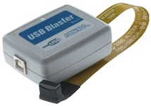
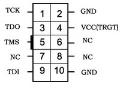

..  Copyright (c) 2014-present PlatformIO <contact@platformio.org>
    Licensed under the Apache License, Version 2.0 (the "License");
    you may not use this file except in compliance with the License.
    You may obtain a copy of the License at
       http://www.apache.org/licenses/LICENSE-2.0
    Unless required by applicable law or agreed to in writing, software
    distributed under the License is distributed on an "AS IS" BASIS,
    WITHOUT WARRANTIES OR CONDITIONS OF ANY KIND, either express or implied.
    See the License for the specific language governing permissions and
    limitations under the License.

.. _debugging_tool_altera-usb-blaster:

Altera / Intel USB-Blaster
==========================

USB Blaster Download Cable is designed for ALTERA FPGA, CPLD, Active Serial Configuration Devices and Enhanced Configuration Devices, USB 2.0 connection to the PC and JTAG, AS, PS to the target device.
Official reference can be found `here <https://www.intel.com/content/www/us/en/programmable/products/boards_and_kits/download-cables.html?utm_source=platformio&utm_medium=docs>`__.

.. contents:: Contents
    :local:

Configuration
-------------

You can configure debugging tool using :ref:`projectconf_debug_tool` option in
:ref:`projectconf`:

.. code-block:: ini

    [env:myenv]
    platform = ...
    board = ...
    debug_tool = altera-usb-blaster

If you would like to use this tool for firmware uploading, please change
upload protocol:

.. code-block:: ini

    [env:myenv]
    platform = ...
    board = ...
    debug_tool = altera-usb-blaster
    upload_protocol = altera-usb-blaster

More options:

* :ref:`projectconf_section_env_debug`
* :ref:`projectconf_section_env_upload`

Drivers
-------

Please install `official drivers <https://www.intel.com/content/www/us/en/programmable/support/support-resources/download/drivers/dri-index.html?utm_source=platformio&utm_medium=docs>`__.

Wiring Connections
------------------

JTAG Interface
~~~~~~~~~~~~~~

.. list-table::
  :header-rows:  1

  * - USB-Blaster JTAG 10-Pin Connector
    - Board JTAG Pin
    - Description
  * - 1
    - TCK
    - JTAG Return Test Clock
  * - 2
    - GND
    - Digital ground
  * - 3
    - TDO
    - Test Data Out pin
  * - 4
    - VCC
    - Positive Supply Voltage — Power supply for JTAG interface drivers
  * - 5
    - TMS
    - Test Mode State pin
  * - 9
    - TDI
    - Test Data In pin

.. begin_platforms

Platforms
---------
.. list-table::
    :header-rows:  1

    * - Name
      - Description

    * - :ref:`platform_gd32v`
      - The GigaDevice GD32V device is a 32-bit general-purpose microcontroller based on the RISC-V core with an impressive balance of processing power, reduced power consumption and peripheral set.

    * - :ref:`platform_nuclei`
      - Find professional RISC-V Processor IP in Nuclei, first professional RISC-V IP company in Mainland China, match all your requirements in AIoT Era.

Frameworks
----------
.. list-table::
    :header-rows:  1

    * - Name
      - Description

    * - :ref:`framework_arduino`
      - Arduino Wiring-based Framework allows writing cross-platform software to control devices attached to a wide range of Arduino boards to create all kinds of creative coding, interactive objects, spaces or physical experiences

    * - :ref:`framework_gd32vf103-sdk`
      - GigaDevice GD32VF103 Firmware Library (SDK) is a firmware function package, including programs, data structures and macro definitions, all the performance features of peripherals of GD32VF103 devices are involved in the package

    * - :ref:`framework_nuclei-sdk`
      - Open Source Software Development Kit for the Nuclei N/NX processors

Boards
------

.. note::
    For more detailed ``board`` information please scroll tables below by horizontal.

.. list-table::
    :header-rows:  1

    * - Name
      - Platform
      - Debug
      - MCU
      - Frequency
      - Flash
      - RAM
    * - :ref:`board_nuclei_gd32vf103v_eval`
      - :ref:`platform_nuclei`
      - External
      - GD32VF103VBT6
      - 108MHz
      - 128KB
      - 32KB
    * - :ref:`board_nuclei_gd32vf103v_rvstar`
      - :ref:`platform_nuclei`
      - On-board
      - GD32VF103VBT6
      - 108MHz
      - 128KB
      - 32KB
    * - :ref:`board_gd32v_gd32vf103v-eval`
      - :ref:`platform_gd32v`
      - External
      - GD32VF103VBT6
      - 108MHz
      - 128KB
      - 32KB
    * - :ref:`board_gd32v_sipeed-longan-nano`
      - :ref:`platform_gd32v`
      - External
      - GD32VF103CBT6
      - 108MHz
      - 128KB
      - 32KB
    * - :ref:`board_nuclei_gd32vf103c_longan_nano`
      - :ref:`platform_nuclei`
      - External
      - GD32VF103CBT6
      - 108MHz
      - 128KB
      - 32KB
    * - :ref:`board_gd32v_sipeed-longan-nano-lite`
      - :ref:`platform_gd32v`
      - External
      - GD32VF103C8T6
      - 108MHz
      - 64KB
      - 20KB
    * - :ref:`board_gd32v_wio_lite_risc-v`
      - :ref:`platform_gd32v`
      - External
      - GD32VF103CBT6
      - 108MHz
      - 128KB
      - 32KB
