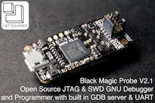
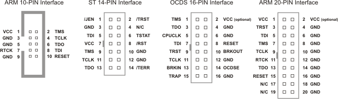

..  Copyright (c) 2014-present PlatformIO <contact@platformio.org>
    Licensed under the Apache License, Version 2.0 (the "License");
    you may not use this file except in compliance with the License.
    You may obtain a copy of the License at
       http://www.apache.org/licenses/LICENSE-2.0
    Unless required by applicable law or agreed to in writing, software
    distributed under the License is distributed on an "AS IS" BASIS,
    WITHOUT WARRANTIES OR CONDITIONS OF ANY KIND, either express or implied.
    See the License for the specific language governing permissions and
    limitations under the License.

.. _debugging_tool_blackmagic:

Black Magic Probe
=================

The Black Magic Probe is a modern, in-application debugging tool for embedded
microprocessors. It is able to control and examine the state of the target
microprocessor using a JTAG or Serial Wire Debugging (SWD) port and on-chip
debug logic provided by the microprocessor. The probe connects to a host
computer using a standard USB interface.
Official reference can be found `here <https://github.com/blacksphere/blackmagic/wiki?utm_source=platformio&utm_medium=docs>`__.

Also, see :ref:`debugging_tool_custom` debugging configuration with
Black Magic Probe.

.. contents:: Contents
    :local:

Configuration
-------------

You can configure debugging tool using :ref:`projectconf_debug_tool` option in
:ref:`projectconf`:

.. code-block:: ini

    [env:myenv]
    platform = ...
    board = ...
    debug_tool = blackmagic
    debug_port = <CONFIGURE GDB PORT>

    ;
    ; Debug Port Examples
    ;

    ; Linux
    debug_port = /dev/ttyACM0

    ; Windows for COM1-COM9
    debug_port = COM3
    ; Windows for COM10-XXX
    debug_port = \\.\COM13

    ; macOS
    debug_port = /dev/cu.usbmodemE2C0C4C6

Black Magic Probe has 2 serial ports: UART and GDB. We will need "GDB" port.
Please use :ref:`piohome` > Devices or :ref:`piocore` and :ref:`cmd_device_list`
command to list available ports. If you do not see "Black Magic Probe GDB" port,
please try both. More `details <https://github.com/blacksphere/blackmagic/wiki/Useful-GDB-commands#connecting-gdb-to-the-black-magic-probe>`_.

If you would like to use this tool for firmware uploading, please change
upload protocol:

.. code-block:: ini

    [env:myenv]
    platform = ...
    board = ...
    debug_tool = blackmagic
    debug_port = <CONFIGURE GDB PORT>

    upload_port = <THE SAME AS DEBUG PORT>

    ; SWD interface
    upload_protocol = blackmagic

    ; JTAG interface
    upload_protocol = blackmagic-jtag

More options:

* :ref:`projectconf_section_env_debug`
* :ref:`projectconf_section_env_upload`

Drivers
-------

Not required.

Wiring Connections
------------------

JTAG Interface
~~~~~~~~~~~~~~

.. list-table::
  :header-rows:  1

  * - Black Magic Probe 10-Pin Connector
    - Board JTAG Pin
    - Description
  * - 1
    - VCC
    - Positive Supply Voltage — Power supply for JTAG interface drivers
  * - 3
    - GND
    - Digital ground
  * - 2
    - TMS
    - Test Mode State
  * - 4
    - TCLK
    - JTAG Return Test Clock
  * - 6
    - TDO
    - Test Data Out
  * - 8
    - TDI
    - Test Data In
  * - 10
    - RESET
    - Connect this pin to the (active low) reset input of the target CPU

Serial Wire Mode Interface (SWD)
~~~~~~~~~~~~~~~~~~~~~~~~~~~~~~~~

.. image:: ../../_static/images/debug_probes/arm_swd_connector.png

.. list-table::
  :header-rows:  1

  * - Black Magic Probe 10-Pin Connector
    - Board SWD Pin
    - Description
  * - 1
    - VCC
    - Positive Supply Voltage — Power supply for JTAG interface drivers
  * - 3
    - GND
    - Digital ground
  * - 2
    - SWDIO
    - Data I/O
  * - 4
    - SWCLK
    - Clock
  * - 10
    - RESET
    - Connect this pin to the (active low) reset input of the target CPU

.. begin_platforms

Platforms
---------
.. list-table::
    :header-rows:  1

    * - Name
      - Description

    * - :ref:`platform_aceinna_imu`
      - Open-source, embedded development platform for Aceinna IMU hardware. Run custom algorithms and navigation code on Aceinna IMU/INS hardware.

    * - :ref:`platform_atmelsam`
      - Atmel | SMART offers Flash- based ARM products based on the ARM Cortex-M0+, Cortex-M3 and Cortex-M4 architectures, ranging from 8KB to 2MB of Flash including a rich peripheral and feature mix.

    * - :ref:`platform_freescalekinetis`
      - Freescale Kinetis Microcontrollers is family of multiple hardware- and software-compatible ARM Cortex-M0+, Cortex-M4 and Cortex-M7-based MCU series. Kinetis MCUs offer exceptional low-power performance, scalability and feature integration.

    * - :ref:`platform_nordicnrf51`
      - The Nordic nRF51 Series is a family of highly flexible, multi-protocol, system-on-chip (SoC) devices for ultra-low power wireless applications. nRF51 Series devices support a range of protocol stacks including Bluetooth Smart (previously called Bluetooth low energy), ANT and proprietary 2.4GHz protocols such as Gazell.

    * - :ref:`platform_nordicnrf52`
      - The nRF52 Series are built for speed to carry out increasingly complex tasks in the shortest possible time and return to sleep, conserving precious battery power. They have a Cortex-M4F processor and are the most capable Bluetooth Smart SoCs on the market.

    * - :ref:`platform_nxpimxrt`
      - The i.MX RT series of crossover processors features the Arm Cortex-M core, real-time functionality and MCU usability at a cost-effective price.

    * - :ref:`platform_nxplpc`
      - The NXP LPC is a family of 32-bit microcontroller integrated circuits by NXP Semiconductors. The LPC chips are grouped into related series that are based around the same 32-bit ARM processor core, such as the Cortex-M4F, Cortex-M3, Cortex-M0+, or Cortex-M0. Internally, each microcontroller consists of the processor core, static RAM memory, flash memory, debugging interface, and various peripherals.

    * - :ref:`platform_siliconlabsefm32`
      - Silicon Labs EFM32 Gecko 32-bit microcontroller (MCU) family includes devices that offer flash memory configurations up to 256 kB, 32 kB of RAM and CPU speeds up to 48 MHz. Based on the powerful ARM Cortex-M core, the Gecko family features innovative low energy techniques, short wake-up time from energy saving modes and a wide selection of peripherals, making it ideal for battery operated applications and other systems requiring high performance and low-energy consumption.

    * - :ref:`platform_ststm32`
      - The STM32 family of 32-bit Flash MCUs based on the ARM Cortex-M processor is designed to offer new degrees of freedom to MCU users. It offers a 32-bit product range that combines very high performance, real-time capabilities, digital signal processing, and low-power, low-voltage operation, while maintaining full integration and ease of development.

Frameworks
----------
.. list-table::
    :header-rows:  1

    * - Name
      - Description

    * - :ref:`framework_arduino`
      - Arduino Wiring-based Framework allows writing cross-platform software to control devices attached to a wide range of Arduino boards to create all kinds of creative coding, interactive objects, spaces or physical experiences

    * - :ref:`framework_cmsis`
      - The ARM Cortex Microcontroller Software Interface Standard (CMSIS) is a vendor-independent hardware abstraction layer for the Cortex-M processor series and specifies debugger interfaces. The CMSIS enables consistent and simple software interfaces to the processor for interface peripherals, real-time operating systems, and middleware. It simplifies software re-use, reducing the learning curve for new microcontroller developers and cutting the time-to-market for devices

    * - :ref:`framework_mbed`
      - Arm Mbed OS is an open source embedded operating system designed specifically for the 'things' in the Internet of Things. It includes all the features you need to develop a connected product based on an Arm Cortex-M microcontroller, including security, connectivity, an RTOS and drivers for sensors and I/O devices

    * - :ref:`framework_stm32cube`
      - STM32Cube embedded software libraries, including: The HAL hardware abstraction layer, enabling portability between different STM32 devices via standardized API calls; The Low-Layer (LL) APIs, a light-weight, optimized, expert oriented set of APIs designed for both performance and runtime efficiency

    * - :ref:`framework_simba`
      - Simba is an RTOS and build framework with aims to make embedded programming easy and portable

    * - :ref:`framework_spl`
      - The ST Standard Peripheral Library provides a set of functions for handling the peripherals on the STM32 family of microcontrollers.

    * - :ref:`framework_zephyr`
      - The Zephyr Project is a scalable real-time operating system (RTOS) supporting multiple hardware architectures, optimized for resource constrained devices, and built with safety and security in mind

    * - :ref:`framework_libopencm3`
      - The libOpenCM3 framework aims to create a free and open-source firmware library for various ARM Cortex-M0(+)/M3/M4 microcontrollers, including ST STM32, Ti Tiva and Stellaris, NXP LPC, Atmel SAM3, Energy Micro EFM32 and others

Boards
------

.. note::
    For more detailed ``board`` information please scroll tables below by horizontal.

.. list-table::
    :header-rows:  1

    * - Name
      - Platform
      - Debug
      - MCU
      - Frequency
      - Flash
      - RAM
    * - :ref:`board_ststm32_1bitsy_stm32f415rgt`
      - :ref:`platform_ststm32`
      - External
      - STM32F415RGT
      - 168MHz
      - 1MB
      - 128KB
    * - :ref:`board_ststm32_disco_f412zg`
      - :ref:`platform_ststm32`
      - On-board
      - STM32F412ZGT6
      - 100MHz
      - 1MB
      - 256KB
    * - :ref:`board_ststm32_disco_f723ie`
      - :ref:`platform_ststm32`
      - On-board
      - STM32F723IEK6
      - 216MHz
      - 512KB
      - 192KB
    * - :ref:`board_ststm32_armed_v1`
      - :ref:`platform_ststm32`
      - External
      - STM32F407VET6
      - 168MHz
      - 512KB
      - 192KB
    * - :ref:`board_ststm32_rumba32_f446ve`
      - :ref:`platform_ststm32`
      - External
      - STM32F446RET6
      - 180MHz
      - 512KB
      - 128KB
    * - :ref:`board_ststm32_remram_v1`
      - :ref:`platform_ststm32`
      - On-board
      - STM32F765VIT6
      - 216MHz
      - 2MB
      - 512KB
    * - :ref:`board_ststm32_st3dp001_eval`
      - :ref:`platform_ststm32`
      - On-board
      - STM32F401VGT6
      - 84MHz
      - 512KB
      - 96KB
    * - :ref:`board_ststm32_b96b_argonkey`
      - :ref:`platform_ststm32`
      - External
      - STM32F412CG
      - 100MHz
      - 1MB
      - 256KB
    * - :ref:`board_ststm32_b96b_f446ve`
      - :ref:`platform_ststm32`
      - On-board
      - STM32F446VET6
      - 168MHz
      - 512KB
      - 128KB
    * - :ref:`board_ststm32_b96b_aerocore2`
      - :ref:`platform_ststm32`
      - External
      - STM32F427VIT6
      - 168MHz
      - 1.99MB
      - 256KB
    * - :ref:`board_ststm32_b96b_neonkey`
      - :ref:`platform_ststm32`
      - External
      - STM32F411CE
      - 100MHz
      - 512KB
      - 128KB
    * - :ref:`board_nordicnrf52_96b_nitrogen`
      - :ref:`platform_nordicnrf52`
      - External
      - NRF52832
      - 64MHz
      - 512KB
      - 64KB
    * - :ref:`board_nxplpc_lpc11u24_301`
      - :ref:`platform_nxplpc`
      - On-board
      - LPC11U24
      - 48MHz
      - 32KB
      - 8KB
    * - :ref:`board_aceinna_imu_LowCostRTK`
      - :ref:`platform_aceinna_imu`
      - On-board
      - STM32F469NIH6
      - 180MHz
      - 1MB
      - 384KB
    * - :ref:`board_aceinna_imu_OpenIMU300`
      - :ref:`platform_aceinna_imu`
      - External
      - STM32F405RG
      - 120MHz
      - 1MB
      - 128KB
    * - :ref:`board_aceinna_imu_OpenIMU300ZA`
      - :ref:`platform_aceinna_imu`
      - External
      - STM32F405RG
      - 120MHz
      - 1MB
      - 128KB
    * - :ref:`board_aceinna_imu_OpenIMU330`
      - :ref:`platform_aceinna_imu`
      - External
      - STM32L431CB
      - 80MHz
      - 128KB
      - 64KB
    * - :ref:`board_aceinna_imu_OpenRTK`
      - :ref:`platform_aceinna_imu`
      - External
      - STM32F469IG
      - 180MHz
      - 1MB
      - 384KB
    * - :ref:`board_aceinna_imu_OpenRTK330L`
      - :ref:`platform_aceinna_imu`
      - External
      - STM32F469IG
      - 180MHz
      - 1MB
      - 384KB
    * - :ref:`board_atmelsam_adafruit_blm_badge`
      - :ref:`platform_atmelsam`
      - External
      - SAMD21E18A
      - 48MHz
      - 256KB
      - 32KB
    * - :ref:`board_nordicnrf52_adafruit_feather_nrf52832`
      - :ref:`platform_nordicnrf52`
      - External
      - NRF52832
      - 64MHz
      - 512KB
      - 64KB
    * - :ref:`board_nordicnrf52_adafruit_clue_nrf52840`
      - :ref:`platform_nordicnrf52`
      - External
      - NRF52840
      - 64MHz
      - 796KB
      - 243KB
    * - :ref:`board_atmelsam_adafruit_circuitplayground_m0`
      - :ref:`platform_atmelsam`
      - External
      - SAMD21G18A
      - 48MHz
      - 256KB
      - 32KB
    * - :ref:`board_atmelsam_adafruit_crickit_m0`
      - :ref:`platform_atmelsam`
      - External
      - SAMD21G18A
      - 48MHz
      - 256KB
      - 32KB
    * - :ref:`board_nordicnrf52_adafruit_feather_nrf52840_sense`
      - :ref:`platform_nordicnrf52`
      - External
      - NRF52840
      - 64MHz
      - 796KB
      - 243KB
    * - :ref:`board_atmelsam_adafruit_feather_m0`
      - :ref:`platform_atmelsam`
      - External
      - SAMD21G18A
      - 48MHz
      - 256KB
      - 32KB
    * - :ref:`board_atmelsam_adafruit_feather_m0_express`
      - :ref:`platform_atmelsam`
      - External
      - SAMD21G18A
      - 48MHz
      - 256KB
      - 32KB
    * - :ref:`board_ststm32_adafruit_feather_f405`
      - :ref:`platform_ststm32`
      - External
      - STM32F405RGT6
      - 168MHz
      - 1MB
      - 128KB
    * - :ref:`board_nordicnrf52_adafruit_feather_nrf52840`
      - :ref:`platform_nordicnrf52`
      - External
      - NRF52840
      - 64MHz
      - 796KB
      - 243KB
    * - :ref:`board_atmelsam_adafruit_gemma_m0`
      - :ref:`platform_atmelsam`
      - External
      - SAMD21E18A
      - 48MHz
      - 256KB
      - 32KB
    * - :ref:`board_atmelsam_adafruit_hallowing`
      - :ref:`platform_atmelsam`
      - External
      - SAMD21G18A
      - 48MHz
      - 256KB
      - 32KB
    * - :ref:`board_atmelsam_adafruit_itsybitsy_m0`
      - :ref:`platform_atmelsam`
      - External
      - SAMD21G18A
      - 48MHz
      - 256KB
      - 32KB
    * - :ref:`board_atmelsam_adafruit_metro_m0`
      - :ref:`platform_atmelsam`
      - External
      - SAMD21G18A
      - 48MHz
      - 256KB
      - 32KB
    * - :ref:`board_atmelsam_adafruit_qt_py_m0`
      - :ref:`platform_atmelsam`
      - External
      - SAMD21E18A
      - 48MHz
      - 256KB
      - 32KB
    * - :ref:`board_atmelsam_adafruit_trinket_m0`
      - :ref:`platform_atmelsam`
      - External
      - SAMD21E18A
      - 48MHz
      - 256KB
      - 32KB
    * - :ref:`board_atmelsam_adafruit_pirkey`
      - :ref:`platform_atmelsam`
      - External
      - SAMD21E18A
      - 48MHz
      - 256KB
      - 32KB
    * - :ref:`board_ststm32_afroflight_f103cb`
      - :ref:`platform_ststm32`
      - External
      - STM32F103CBT6
      - 72MHz
      - 128KB
      - 20KB
    * - :ref:`board_atmelsam_due`
      - :ref:`platform_atmelsam`
      - External
      - AT91SAM3X8E
      - 84MHz
      - 512KB
      - 96KB
    * - :ref:`board_atmelsam_dueUSB`
      - :ref:`platform_atmelsam`
      - External
      - AT91SAM3X8E
      - 84MHz
      - 512KB
      - 96KB
    * - :ref:`board_atmelsam_mzeroUSB`
      - :ref:`platform_atmelsam`
      - External
      - SAMD21G18A
      - 48MHz
      - 256KB
      - 32KB
    * - :ref:`board_atmelsam_mzeroproUSB`
      - :ref:`platform_atmelsam`
      - External
      - SAMD21G18A
      - 48MHz
      - 256KB
      - 32KB
    * - :ref:`board_atmelsam_mzeropro`
      - :ref:`platform_atmelsam`
      - On-board
      - SAMD21G18A
      - 48MHz
      - 256KB
      - 32KB
    * - :ref:`board_atmelsam_mkrfox1200`
      - :ref:`platform_atmelsam`
      - External
      - SAMD21G18A
      - 48MHz
      - 256KB
      - 32KB
    * - :ref:`board_atmelsam_mkrgsm1400`
      - :ref:`platform_atmelsam`
      - External
      - SAMD21G18A
      - 48MHz
      - 256KB
      - 32KB
    * - :ref:`board_atmelsam_mkrnb1500`
      - :ref:`platform_atmelsam`
      - External
      - SAMD21G18A
      - 48MHz
      - 256KB
      - 32KB
    * - :ref:`board_atmelsam_mkrwan1300`
      - :ref:`platform_atmelsam`
      - External
      - SAMD21G18A
      - 48MHz
      - 256KB
      - 32KB
    * - :ref:`board_atmelsam_mkrwan1310`
      - :ref:`platform_atmelsam`
      - External
      - SAMD21G18A
      - 48MHz
      - 256KB
      - 32KB
    * - :ref:`board_atmelsam_mkrwifi1010`
      - :ref:`platform_atmelsam`
      - External
      - SAMD21G18A
      - 48MHz
      - 256KB
      - 32KB
    * - :ref:`board_atmelsam_mkr1000USB`
      - :ref:`platform_atmelsam`
      - External
      - SAMD21G18A
      - 48MHz
      - 256KB
      - 32KB
    * - :ref:`board_atmelsam_mkrzero`
      - :ref:`platform_atmelsam`
      - External
      - SAMD21G18A
      - 48MHz
      - 256KB
      - 32KB
    * - :ref:`board_nordicnrf52_nano33ble`
      - :ref:`platform_nordicnrf52`
      - External
      - NRF52840
      - 64MHz
      - 960KB
      - 256KB
    * - :ref:`board_atmelsam_tian`
      - :ref:`platform_atmelsam`
      - External
      - SAMD21G18A
      - 48MHz
      - 256KB
      - 32KB
    * - :ref:`board_atmelsam_zero`
      - :ref:`platform_atmelsam`
      - On-board
      - SAMD21G18A
      - 48MHz
      - 256KB
      - 32KB
    * - :ref:`board_atmelsam_zeroUSB`
      - :ref:`platform_atmelsam`
      - External
      - SAMD21G18A
      - 48MHz
      - 256KB
      - 32KB
    * - :ref:`board_ststm32_armstrap_eagle1024`
      - :ref:`platform_ststm32`
      - On-board
      - STM32F417VGT6
      - 168MHz
      - 1MB
      - 192KB
    * - :ref:`board_ststm32_armstrap_eagle2048`
      - :ref:`platform_ststm32`
      - On-board
      - STM32F427VIT6
      - 168MHz
      - 1.99MB
      - 256KB
    * - :ref:`board_ststm32_armstrap_eagle512`
      - :ref:`platform_ststm32`
      - On-board
      - STM32F407VET6
      - 168MHz
      - 512KB
      - 192KB
    * - :ref:`board_atmelsam_samr21_xpro`
      - :ref:`platform_atmelsam`
      - On-board
      - SAMR21G18A
      - 48MHz
      - 256KB
      - 32KB
    * - :ref:`board_atmelsam_samd21g18a`
      - :ref:`platform_atmelsam`
      - On-board
      - SAMD21G18A
      - 48MHz
      - 256KB
      - 32KB
    * - :ref:`board_atmelsam_samc21_xpro`
      - :ref:`platform_atmelsam`
      - On-board
      - SAMC21J18A
      - 48MHz
      - 256KB
      - 32KB
    * - :ref:`board_atmelsam_samd21_xpro`
      - :ref:`platform_atmelsam`
      - On-board
      - SAMD21J18A
      - 48MHz
      - 256KB
      - 32KB
    * - :ref:`board_atmelsam_saml21_xpro_b`
      - :ref:`platform_atmelsam`
      - On-board
      - SAML21J18B
      - 48MHz
      - 256KB
      - 32KB
    * - :ref:`board_nordicnrf52_bbcmicrobit_v2`
      - :ref:`platform_nordicnrf52`
      - On-board
      - NRF52833
      - 64MHz
      - 512KB
      - 64KB
    * - :ref:`board_nordicnrf52_laird_bl652_dvk`
      - :ref:`platform_nordicnrf52`
      - On-board
      - NRF52832
      - 64MHz
      - 512KB
      - 64KB
    * - :ref:`board_nordicnrf52_laird_bl654_dvk`
      - :ref:`platform_nordicnrf52`
      - On-board
      - NRF52840
      - 64MHz
      - 1MB
      - 256KB
    * - :ref:`board_nxplpc_lpc4330_m4`
      - :ref:`platform_nxplpc`
      - On-board
      - LPC4330
      - 204MHz
      - 8MB
      - 264KB
    * - :ref:`board_ststm32_black_f407ve`
      - :ref:`platform_ststm32`
      - External
      - STM32F407VET6
      - 168MHz
      - 512KB
      - 128KB
    * - :ref:`board_ststm32_black_f407vg`
      - :ref:`platform_ststm32`
      - External
      - STM32F407VGT6
      - 168MHz
      - 512KB
      - 128KB
    * - :ref:`board_ststm32_black_f407ze`
      - :ref:`platform_ststm32`
      - External
      - STM32F407ZET6
      - 168MHz
      - 512KB
      - 128KB
    * - :ref:`board_ststm32_black_f407zg`
      - :ref:`platform_ststm32`
      - External
      - STM32F407ZGT6
      - 168MHz
      - 1MB
      - 128KB
    * - :ref:`board_ststm32_blackpill_f103c8`
      - :ref:`platform_ststm32`
      - External
      - STM32F103C8T6
      - 72MHz
      - 64KB
      - 20KB
    * - :ref:`board_ststm32_blackpill_f103c8_128`
      - :ref:`platform_ststm32`
      - External
      - STM32F103C8T6
      - 72MHz
      - 128KB
      - 20KB
    * - :ref:`board_ststm32_robotdyn_blackpill_f303cc`
      - :ref:`platform_ststm32`
      - External
      - STM32F303CCT6
      - 72MHz
      - 256KB
      - 40KB
    * - :ref:`board_ststm32_blackpill_f401cc`
      - :ref:`platform_ststm32`
      - External
      - STM32F401CCU6
      - 84MHz
      - 256KB
      - 64KB
    * - :ref:`board_ststm32_blackpill_f401ce`
      - :ref:`platform_ststm32`
      - External
      - STM32F401CEU6
      - 84MHz
      - 512KB
      - 96KB
    * - :ref:`board_ststm32_blue_f407ve_mini`
      - :ref:`platform_ststm32`
      - External
      - STM32F407VET6
      - 168MHz
      - 512KB
      - 128KB
    * - :ref:`board_ststm32_bluepill_f103c6`
      - :ref:`platform_ststm32`
      - External
      - STM32F103C6T6
      - 72MHz
      - 32KB
      - 10KB
    * - :ref:`board_ststm32_bluepill_f103c8`
      - :ref:`platform_ststm32`
      - External
      - STM32F103C8T6
      - 72MHz
      - 64KB
      - 20KB
    * - :ref:`board_ststm32_bluepill_f103c8_128k`
      - :ref:`platform_ststm32`
      - External
      - STM32F103C8T6
      - 72MHz
      - 128KB
      - 20KB
    * - :ref:`board_nordicnrf52_bluey`
      - :ref:`platform_nordicnrf52`
      - External
      - NRF52832
      - 64MHz
      - 512KB
      - 64KB
    * - :ref:`board_nordicnrf51_bluz_dk`
      - :ref:`platform_nordicnrf51`
      - External
      - NRF51822
      - 32MHz
      - 256KB
      - 32KB
    * - :ref:`board_atmelsam_briki_abc_samd21`
      - :ref:`platform_atmelsam`
      - External
      - SAMD21G18A
      - 48MHz
      - 256KB
      - 32KB
    * - :ref:`board_atmelsam_briki_mbcwb_samd21`
      - :ref:`platform_atmelsam`
      - External
      - SAMD21G18A
      - 48MHz
      - 256KB
      - 32KB
    * - :ref:`board_nxplpc_lpc11u35_501`
      - :ref:`platform_nxplpc`
      - External
      - LPC11U35
      - 48MHz
      - 64KB
      - 10KB
    * - :ref:`board_ststm32_cicada_l082cz`
      - :ref:`platform_ststm32`
      - External
      - STM32L082CZY6
      - 32MHz
      - 192KB
      - 20KB
    * - :ref:`board_nordicnrf52_adafruit_cplaynrf52840`
      - :ref:`platform_nordicnrf52`
      - External
      - NRF52840
      - 64MHz
      - 796KB
      - 243KB
    * - :ref:`board_nxplpc_elektor_cocorico`
      - :ref:`platform_nxplpc`
      - On-board
      - LPC812
      - 30MHz
      - 16KB
      - 4KB
    * - :ref:`board_ststm32_coreboard_f401rc`
      - :ref:`platform_ststm32`
      - External
      - STM32F401RCT6
      - 84MHz
      - 256KB
      - 64KB
    * - :ref:`board_ststm32_cricket_l082cz`
      - :ref:`platform_ststm32`
      - External
      - STM32L082CZY6
      - 32MHz
      - 192KB
      - 20KB
    * - :ref:`board_nordicnrf52_delta_dfbm_nq620`
      - :ref:`platform_nordicnrf52`
      - On-board
      - NRF52832
      - 64MHz
      - 512KB
      - 64KB
    * - :ref:`board_ststm32_demo_f030f4`
      - :ref:`platform_ststm32`
      - External
      - STM32F030F4P6
      - 48MHz
      - 16KB
      - 4KB
    * - :ref:`board_atmelsam_digix`
      - :ref:`platform_atmelsam`
      - External
      - AT91SAM3X8E
      - 84MHz
      - 512KB
      - 96KB
    * - :ref:`board_nxplpc_lpc11u35`
      - :ref:`platform_nxplpc`
      - External
      - LPC11U35
      - 48MHz
      - 64KB
      - 10KB
    * - :ref:`board_siliconlabsefm32_efm32gg_stk3700`
      - :ref:`platform_siliconlabsefm32`
      - On-board
      - EFM32GG990F1024
      - 48MHz
      - 1MB
      - 128KB
    * - :ref:`board_siliconlabsefm32_efm32lg_stk3600`
      - :ref:`platform_siliconlabsefm32`
      - On-board
      - EFM32LG990F256
      - 48MHz
      - 256KB
      - 32KB
    * - :ref:`board_siliconlabsefm32_efm32wg_stk3800`
      - :ref:`platform_siliconlabsefm32`
      - On-board
      - EFM32WG990F256
      - 48MHz
      - 256KB
      - 32KB
    * - :ref:`board_siliconlabsefm32_efm32zg_stk3200`
      - :ref:`platform_siliconlabsefm32`
      - On-board
      - EFM32ZG222F32
      - 24MHz
      - 32KB
      - 4KB
    * - :ref:`board_ststm32_econode_l082cz`
      - :ref:`platform_ststm32`
      - External
      - STM32L082CZY6
      - 32MHz
      - 192KB
      - 20KB
    * - :ref:`board_nordicnrf52_electronut_blip`
      - :ref:`platform_nordicnrf52`
      - On-board
      - NRF52840
      - 64MHz
      - 1MB
      - 256KB
    * - :ref:`board_nordicnrf52_electronut_papyr`
      - :ref:`platform_nordicnrf52`
      - On-board
      - NRF52840
      - 64MHz
      - 1MB
      - 256KB
    * - :ref:`board_ststm32_electrosmith_daisy`
      - :ref:`platform_ststm32`
      - External
      - STM32H750IBK6
      - 400MHz
      - 512KB
      - 128KB
    * - :ref:`board_ststm32_elmo_f411re`
      - :ref:`platform_ststm32`
      - External
      - STM32F411RET6
      - 100MHz
      - 512KB
      - 128KB
    * - :ref:`board_ststm32_diymore_f407vgt`
      - :ref:`platform_ststm32`
      - External
      - STM32F407VGT6
      - 168MHz
      - 512KB
      - 128KB
    * - :ref:`board_ststm32_fk407m1`
      - :ref:`platform_ststm32`
      - External
      - STM32F407VET6
      - 168MHz
      - 512KB
      - 128KB
    * - :ref:`board_ststm32_fysetc_s6`
      - :ref:`platform_ststm32`
      - External
      - STM32F446VET6
      - 168MHz
      - 512KB
      - 128KB
    * - :ref:`board_freescalekinetis_frdm_kl25z`
      - :ref:`platform_freescalekinetis`
      - On-board
      - MKL25Z128VLK4
      - 48MHz
      - 128KB
      - 16KB
    * - :ref:`board_freescalekinetis_frdm_kl27z`
      - :ref:`platform_freescalekinetis`
      - On-board
      - MKL27Z64VLH4
      - 48MHz
      - 64KB
      - 16KB
    * - :ref:`board_ststm32_gnat_l082cz`
      - :ref:`platform_ststm32`
      - External
      - STM32L082CZY6
      - 32MHz
      - 192KB
      - 20KB
    * - :ref:`board_ststm32_grasshopper_l082cz`
      - :ref:`platform_ststm32`
      - External
      - STM32L082CZY6
      - 32MHz
      - 192KB
      - 20KB
    * - :ref:`board_nordicnrf52_holyiot_yj16019`
      - :ref:`platform_nordicnrf52`
      - External
      - NRF52832
      - 64MHz
      - 512KB
      - 64KB
    * - :ref:`board_nordicnrf52_adafruit_itsybitsy_nrf52840`
      - :ref:`platform_nordicnrf52`
      - External
      - NRF52840
      - 64MHz
      - 796KB
      - 243KB
    * - :ref:`board_ststm32_rhombio_l476dmw1k`
      - :ref:`platform_ststm32`
      - On-board
      - STM32L476VGT6
      - 80MHz
      - 1MB
      - 128KB
    * - :ref:`board_nxplpc_lpc11u68`
      - :ref:`platform_nxplpc`
      - On-board
      - LPC11U68
      - 50MHz
      - 256KB
      - 36KB
    * - :ref:`board_nxplpc_lpc824`
      - :ref:`platform_nxplpc`
      - On-board
      - LPC824
      - 30MHz
      - 32KB
      - 8KB
    * - :ref:`board_nordicnrf52_laird_pinnacle_100_dvk`
      - :ref:`platform_nordicnrf52`
      - External
      - NRF52840
      - 64MHz
      - 1MB
      - 256KB
    * - :ref:`board_ststm32_malyanm200_f070cb`
      - :ref:`platform_ststm32`
      - External
      - STM32F070CBT6
      - 48MHz
      - 120KB
      - 14.81KB
    * - :ref:`board_ststm32_malyanm300_f070cb`
      - :ref:`platform_ststm32`
      - External
      - STM32F070CBT6
      - 48MHz
      - 120KB
      - 14.81KB
    * - :ref:`board_ststm32_mkr_sharky`
      - :ref:`platform_ststm32`
      - External
      - STM32WB55CG
      - 64MHz
      - 512KB
      - 192.00KB
    * - :ref:`board_atmelsam_mkrvidor4000`
      - :ref:`platform_atmelsam`
      - External
      - SAMD21G18A
      - 48MHz
      - 256KB
      - 32KB
    * - :ref:`board_ststm32_mts_dragonfly_f411re`
      - :ref:`platform_ststm32`
      - External
      - STM32F411RET6
      - 100MHz
      - 512KB
      - 128KB
    * - :ref:`board_nordicnrf52_nrf52832_mdk`
      - :ref:`platform_nordicnrf52`
      - On-board
      - NRF52832
      - 64MHz
      - 512KB
      - 64KB
    * - :ref:`board_nordicnrf52_nrf52840_mdk`
      - :ref:`platform_nordicnrf52`
      - On-board
      - NRF52840
      - 64MHz
      - 1MB
      - 256KB
    * - :ref:`board_ststm32_malyanm200_f103cb`
      - :ref:`platform_ststm32`
      - External
      - STM32F103CBT6
      - 72MHz
      - 120KB
      - 20KB
    * - :ref:`board_ststm32_maple`
      - :ref:`platform_ststm32`
      - External
      - STM32F103RBT6
      - 72MHz
      - 108KB
      - 17KB
    * - :ref:`board_ststm32_maple_ret6`
      - :ref:`platform_ststm32`
      - External
      - STM32F103RET6
      - 72MHz
      - 256KB
      - 48KB
    * - :ref:`board_ststm32_maple_mini_b20`
      - :ref:`platform_ststm32`
      - External
      - STM32F103CBT6
      - 72MHz
      - 120KB
      - 20KB
    * - :ref:`board_ststm32_maple_mini_origin`
      - :ref:`platform_ststm32`
      - External
      - STM32F103CBT6
      - 72MHz
      - 108KB
      - 17KB
    * - :ref:`board_ststm32_mbed_connect_odin`
      - :ref:`platform_ststm32`
      - On-board
      - STM32F439ZIY6
      - 168MHz
      - 2MB
      - 256KB
    * - :ref:`board_nordicnrf52_adafruit_metro_nrf52840`
      - :ref:`platform_nordicnrf52`
      - External
      - NRF52840
      - 64MHz
      - 796KB
      - 243KB
    * - :ref:`board_ststm32_microduino32_flash`
      - :ref:`platform_ststm32`
      - External
      - STM32F103CBT6
      - 72MHz
      - 105.47KB
      - 16.60KB
    * - :ref:`board_ststm32_mxchip_az3166`
      - :ref:`platform_ststm32`
      - On-board
      - STM32F412ZGT6
      - 100MHz
      - 1MB
      - 256KB
    * - :ref:`board_atmelsam_minitronics20`
      - :ref:`platform_atmelsam`
      - External
      - SAMD21J18A
      - 48MHz
      - 256KB
      - 32KB
    * - :ref:`board_atmelsam_moteino_zero`
      - :ref:`platform_atmelsam`
      - External
      - SAMD21G18A
      - 48MHz
      - 256KB
      - 32KB
    * - :ref:`board_ststm32_mts_mdot_f405rg`
      - :ref:`platform_ststm32`
      - External
      - STM32F411RET6
      - 100MHz
      - 512KB
      - 128KB
    * - :ref:`board_ststm32_mts_mdot_f411re`
      - :ref:`platform_ststm32`
      - External
      - STM32F411RET6
      - 100MHz
      - 512KB
      - 128KB
    * - :ref:`board_ststm32_xdot_l151cc`
      - :ref:`platform_ststm32`
      - External
      - STM32L151CCU6
      - 32MHz
      - 256KB
      - 32KB
    * - :ref:`board_ststm32_mote_l152rc`
      - :ref:`platform_ststm32`
      - External
      - STM32L152RC
      - 32MHz
      - 256KB
      - 32KB
    * - :ref:`board_atmelsam_nano_33_iot`
      - :ref:`platform_atmelsam`
      - External
      - SAMD21G18A
      - 48MHz
      - 256KB
      - 32KB
    * - :ref:`board_nxplpc_blueboard_lpc11u24`
      - :ref:`platform_nxplpc`
      - External
      - LPC11U24
      - 48MHz
      - 32KB
      - 8KB
    * - :ref:`board_nxplpc_lpc11c24`
      - :ref:`platform_nxplpc`
      - External
      - LPC11C24
      - 48MHz
      - 32KB
      - 8KB
    * - :ref:`board_nxplpc_lpc11u34_421`
      - :ref:`platform_nxplpc`
      - External
      - LPC11U34
      - 48MHz
      - 40KB
      - 8KB
    * - :ref:`board_nxplpc_lpc11u37_501`
      - :ref:`platform_nxplpc`
      - External
      - LPC11U37
      - 48MHz
      - 128KB
      - 10KB
    * - :ref:`board_nxplpc_lpc812`
      - :ref:`platform_nxplpc`
      - On-board
      - LPC812
      - 30MHz
      - 16KB
      - 4KB
    * - :ref:`board_nxplpc_lpc1549`
      - :ref:`platform_nxplpc`
      - External
      - LPC1549
      - 72MHz
      - 256KB
      - 36KB
    * - :ref:`board_nxpimxrt_mimxrt1010_evk`
      - :ref:`platform_nxpimxrt`
      - On-board
      - MIMXRT1011DAE5A
      - 500MHz
      - 64KB
      - 128KB
    * - :ref:`board_nxpimxrt_mimxrt1015_evk`
      - :ref:`platform_nxpimxrt`
      - On-board
      - MIMXRT1015DAF5A
      - 500MHz
      - 96KB
      - 128KB
    * - :ref:`board_nxpimxrt_mimxrt1020_evk`
      - :ref:`platform_nxpimxrt`
      - On-board
      - MIMXRT1021DAG5A
      - 500MHz
      - 64MB
      - 256MB
    * - :ref:`board_nxpimxrt_mimxrt1050_evk`
      - :ref:`platform_nxpimxrt`
      - On-board
      - MIMXRT1052DVL6B
      - 600MHz
      - 64MB
      - 512KB
    * - :ref:`board_nxpimxrt_mimxrt1060_evk`
      - :ref:`platform_nxpimxrt`
      - On-board
      - MIMXRT1062DVL6A
      - 600MHz
      - 64MB
      - 1MB
    * - :ref:`board_nxpimxrt_mimxrt1064_evk`
      - :ref:`platform_nxpimxrt`
      - On-board
      - MIMXRT1064DVL6A
      - 600MHz
      - 4MB
      - 1MB
    * - :ref:`board_nxplpc_lpc11u24`
      - :ref:`platform_nxplpc`
      - On-board
      - LPC11U24
      - 48MHz
      - 32KB
      - 8KB
    * - :ref:`board_nxplpc_lpc1768`
      - :ref:`platform_nxplpc`
      - On-board
      - LPC1768
      - 96MHz
      - 512KB
      - 64KB
    * - :ref:`board_nordicnrf51_nrf51_beacon`
      - :ref:`platform_nordicnrf51`
      - On-board
      - NRF51822
      - 32MHz
      - 256KB
      - 32KB
    * - :ref:`board_nordicnrf52_thingy_52`
      - :ref:`platform_nordicnrf52`
      - External
      - NRF52832
      - 64MHz
      - 512KB
      - 64KB
    * - :ref:`board_nordicnrf51_nrf51_dk`
      - :ref:`platform_nordicnrf51`
      - On-board
      - NRF51822
      - 32MHz
      - 256KB
      - 32KB
    * - :ref:`board_nordicnrf52_nrf52_dk`
      - :ref:`platform_nordicnrf52`
      - On-board
      - NRF52832
      - 64MHz
      - 512KB
      - 64KB
    * - :ref:`board_nordicnrf52_nrf52840_dk`
      - :ref:`platform_nordicnrf52`
      - On-board
      - NRF52840
      - 64MHz
      - 1MB
      - 256KB
    * - :ref:`board_nordicnrf52_nrf52840_dk_adafruit`
      - :ref:`platform_nordicnrf52`
      - On-board
      - NRF52840
      - 64MHz
      - 796KB
      - 243KB
    * - :ref:`board_ststm32_nucleo_g071rb`
      - :ref:`platform_ststm32`
      - External
      - STM32G071RBT6
      - 64MHz
      - 128KB
      - 36KB
    * - :ref:`board_ststm32_nucleo_g431kb`
      - :ref:`platform_ststm32`
      - External
      - STM32G431KBT6
      - 170MHz
      - 128KB
      - 32KB
    * - :ref:`board_ststm32_nucleo_g431rb`
      - :ref:`platform_ststm32`
      - External
      - STM32G431RBT6
      - 170MHz
      - 128KB
      - 32KB
    * - :ref:`board_ststm32_nucleo_g474re`
      - :ref:`platform_ststm32`
      - External
      - STM32G474RET6
      - 170MHz
      - 512KB
      - 128KB
    * - :ref:`board_ststm32_olimexino`
      - :ref:`platform_ststm32`
      - External
      - STM32F103RBT6
      - 72MHz
      - 128KB
      - 20KB
    * - :ref:`board_nordicnrf51_oshchip`
      - :ref:`platform_nordicnrf51`
      - External
      - NRF51822
      - 32MHz
      - 256KB
      - 32KB
    * - :ref:`board_ststm32_olimex_f103`
      - :ref:`platform_ststm32`
      - External
      - STM32F103RBT6
      - 72MHz
      - 128KB
      - 20KB
    * - :ref:`board_ststm32_olimex_p405`
      - :ref:`platform_ststm32`
      - External
      - STM32F405RGT6
      - 168MHz
      - 1MB
      - 192KB
    * - :ref:`board_ststm32_nucleo_wb55rg_p`
      - :ref:`platform_ststm32`
      - On-board
      - STM32WB55RG
      - 64MHz
      - 512KB
      - 192.00KB
    * - :ref:`board_nordicnrf52_reel_board`
      - :ref:`platform_nordicnrf52`
      - On-board
      - NRF52840
      - 64MHz
      - 1MB
      - 256KB
    * - :ref:`board_nordicnrf52_reel_board_v2`
      - :ref:`platform_nordicnrf52`
      - On-board
      - NRF52840
      - 64MHz
      - 1MB
      - 256KB
    * - :ref:`board_ststm32_pybstick26_duino`
      - :ref:`platform_ststm32`
      - External
      - STM32F072RB
      - 48MHz
      - 128KB
      - 16KB
    * - :ref:`board_ststm32_pybstick26_pro`
      - :ref:`platform_ststm32`
      - External
      - STM32F412RE
      - 100MHz
      - 512KB
      - 256KB
    * - :ref:`board_ststm32_pybstick26_lite`
      - :ref:`platform_ststm32`
      - External
      - STM32F401CEU6
      - 84MHz
      - 512KB
      - 96KB
    * - :ref:`board_ststm32_pybstick26_std`
      - :ref:`platform_ststm32`
      - External
      - STM32F411CEU6
      - 100MHz
      - 512KB
      - 128KB
    * - :ref:`board_nordicnrf52_particle_argon`
      - :ref:`platform_nordicnrf52`
      - External
      - NRF52840
      - 64MHz
      - 796KB
      - 243KB
    * - :ref:`board_nordicnrf52_particle_boron`
      - :ref:`platform_nordicnrf52`
      - External
      - NRF52840
      - 64MHz
      - 796KB
      - 243KB
    * - :ref:`board_nordicnrf52_particle_xenon`
      - :ref:`platform_nordicnrf52`
      - External
      - NRF52840
      - 64MHz
      - 796KB
      - 243KB
    * - :ref:`board_ststm32_piconomix_px_her0`
      - :ref:`platform_ststm32`
      - External
      - STM32L072RB
      - 32MHz
      - 128KB
      - 20KB
    * - :ref:`board_ststm32_prntr_v2`
      - :ref:`platform_ststm32`
      - External
      - STM32F407RE
      - 168MHz
      - 512KB
      - 192KB
    * - :ref:`board_ststm32_rak811_tracker`
      - :ref:`platform_ststm32`
      - External
      - STM32L151RBT6
      - 32MHz
      - 128KB
      - 16KB
    * - :ref:`board_ststm32_rak811_tracker_32`
      - :ref:`platform_ststm32`
      - External
      - STM32L151RBT6
      - 32MHz
      - 128KB
      - 32KB
    * - :ref:`board_ststm32_rhf76_052`
      - :ref:`platform_ststm32`
      - External
      - STM32L051C8T6
      - 32MHz
      - 64KB
      - 8KB
    * - :ref:`board_nordicnrf52_raytac_mdbt50q_rx`
      - :ref:`platform_nordicnrf52`
      - External
      - NRF52840
      - 64MHz
      - 796KB
      - 243KB
    * - :ref:`board_nordicnrf51_redBearLabBLENano`
      - :ref:`platform_nordicnrf51`
      - On-board
      - NRF51822
      - 16MHz
      - 256KB
      - 32KB
    * - :ref:`board_nordicnrf52_redbear_blenano2`
      - :ref:`platform_nordicnrf52`
      - On-board
      - NRF52832
      - 64MHz
      - 512KB
      - 64KB
    * - :ref:`board_nordicnrf52_redbear_blend2`
      - :ref:`platform_nordicnrf52`
      - On-board
      - NRF52832
      - 64MHz
      - 512KB
      - 64KB
    * - :ref:`board_nordicnrf51_redBearLab`
      - :ref:`platform_nordicnrf51`
      - On-board
      - NRF51822
      - 16MHz
      - 256KB
      - 16KB
    * - :ref:`board_ststm32_cloud_jam`
      - :ref:`platform_ststm32`
      - On-board
      - STM32F401RET6
      - 84MHz
      - 512KB
      - 96KB
    * - :ref:`board_ststm32_cloud_jam_l4`
      - :ref:`platform_ststm32`
      - On-board
      - STM32L476RGT6
      - 80MHz
      - 1MB
      - 128KB
    * - :ref:`board_nordicnrf52_ruuvitag`
      - :ref:`platform_nordicnrf52`
      - External
      - NRF52832
      - 64MHz
      - 512KB
      - 64KB
    * - :ref:`board_nordicnrf52_sdt52832b`
      - :ref:`platform_nordicnrf52`
      - External
      - NRF52832
      - 64MHz
      - 512KB
      - 64KB
    * - :ref:`board_siliconlabsefm32_efm32hg_stk3400`
      - :ref:`platform_siliconlabsefm32`
      - On-board
      - EFM32HG322F64
      - 25MHz
      - 64KB
      - 8KB
    * - :ref:`board_siliconlabsefm32_efm32pg_stk3401`
      - :ref:`platform_siliconlabsefm32`
      - On-board
      - EFM32PG1B200F256GM48
      - 40MHz
      - 256KB
      - 32KB
    * - :ref:`board_siliconlabsefm32_efm32gg11_stk3701`
      - :ref:`platform_siliconlabsefm32`
      - On-board
      - EFM32GG11B820F2048GL192
      - 48MHz
      - 2MB
      - 512KB
    * - :ref:`board_atmelsam_sodaq_autonomo`
      - :ref:`platform_atmelsam`
      - External
      - SAMD21J18A
      - 48MHz
      - 256KB
      - 32KB
    * - :ref:`board_atmelsam_sodaq_explorer`
      - :ref:`platform_atmelsam`
      - External
      - SAMD21J18A
      - 48MHz
      - 256KB
      - 32KB
    * - :ref:`board_atmelsam_sodaq_one`
      - :ref:`platform_atmelsam`
      - External
      - SAMD21G18A
      - 48MHz
      - 256KB
      - 32KB
    * - :ref:`board_atmelsam_sodaq_sara`
      - :ref:`platform_atmelsam`
      - External
      - SAMD21J18A
      - 48MHz
      - 256KB
      - 32KB
    * - :ref:`board_atmelsam_sodaq_sff`
      - :ref:`platform_atmelsam`
      - External
      - SAMD21G18A
      - 48MHz
      - 256KB
      - 32KB
    * - :ref:`board_ststm32_disco_f334c8`
      - :ref:`platform_ststm32`
      - On-board
      - STM32F334C8T6
      - 72MHz
      - 64KB
      - 12KB
    * - :ref:`board_ststm32_disco_f401vc`
      - :ref:`platform_ststm32`
      - On-board
      - STM32F401VCT6
      - 84MHz
      - 256KB
      - 64KB
    * - :ref:`board_ststm32_disco_f411ve`
      - :ref:`platform_ststm32`
      - On-board
      - STM32F411VET6
      - 100MHz
      - 512KB
      - 128KB
    * - :ref:`board_ststm32_disco_f413zh`
      - :ref:`platform_ststm32`
      - On-board
      - STM32F413ZHT6
      - 100MHz
      - 512KB
      - 128KB
    * - :ref:`board_ststm32_disco_f429zi`
      - :ref:`platform_ststm32`
      - On-board
      - STM32F429ZIT6
      - 180MHz
      - 2MB
      - 256KB
    * - :ref:`board_ststm32_disco_f469ni`
      - :ref:`platform_ststm32`
      - On-board
      - STM32F469NIH6
      - 180MHz
      - 1MB
      - 384KB
    * - :ref:`board_ststm32_disco_f746ng`
      - :ref:`platform_ststm32`
      - On-board
      - STM32F746NGH6
      - 216MHz
      - 1MB
      - 320KB
    * - :ref:`board_ststm32_disco_f769ni`
      - :ref:`platform_ststm32`
      - On-board
      - STM32F769NIH6
      - 216MHz
      - 1MB
      - 512KB
    * - :ref:`board_ststm32_disco_l053c8`
      - :ref:`platform_ststm32`
      - On-board
      - STM32L053C8T6
      - 32MHz
      - 64KB
      - 8KB
    * - :ref:`board_ststm32_disco_l100rc`
      - :ref:`platform_ststm32`
      - On-board
      - STM32L100RCT6
      - 32MHz
      - 256KB
      - 16KB
    * - :ref:`board_ststm32_disco_l476vg`
      - :ref:`platform_ststm32`
      - On-board
      - STM32L476VGT6
      - 80MHz
      - 1MB
      - 128KB
    * - :ref:`board_ststm32_disco_l496ag`
      - :ref:`platform_ststm32`
      - On-board
      - STM32L496AGI6
      - 80MHz
      - 1MB
      - 320KB
    * - :ref:`board_ststm32_disco_l475vg_iot01a`
      - :ref:`platform_ststm32`
      - On-board
      - STM32L475VGT6
      - 80MHz
      - 1MB
      - 128KB
    * - :ref:`board_ststm32_disco_l072cz_lrwan1`
      - :ref:`platform_ststm32`
      - On-board
      - STM32L072CZ
      - 32MHz
      - 192KB
      - 20KB
    * - :ref:`board_ststm32_disco_f072rb`
      - :ref:`platform_ststm32`
      - On-board
      - STM32F072RBT6
      - 48MHz
      - 128KB
      - 16KB
    * - :ref:`board_ststm32_nucleo_f030r8`
      - :ref:`platform_ststm32`
      - On-board
      - STM32F030R8T6
      - 48MHz
      - 64KB
      - 8KB
    * - :ref:`board_ststm32_nucleo_f031k6`
      - :ref:`platform_ststm32`
      - On-board
      - STM32F031K6T6
      - 48MHz
      - 32KB
      - 4KB
    * - :ref:`board_ststm32_nucleo_f042k6`
      - :ref:`platform_ststm32`
      - On-board
      - STM32F042K6T6
      - 48MHz
      - 32KB
      - 6KB
    * - :ref:`board_ststm32_nucleo_f070rb`
      - :ref:`platform_ststm32`
      - On-board
      - STM32F070RBT6
      - 48MHz
      - 128KB
      - 16KB
    * - :ref:`board_ststm32_nucleo_f072rb`
      - :ref:`platform_ststm32`
      - On-board
      - STM32F072RBT6
      - 48MHz
      - 128KB
      - 16KB
    * - :ref:`board_ststm32_nucleo_f091rc`
      - :ref:`platform_ststm32`
      - On-board
      - STM32F091RCT6
      - 48MHz
      - 256KB
      - 32KB
    * - :ref:`board_ststm32_nucleo_f103rb`
      - :ref:`platform_ststm32`
      - On-board
      - STM32F103RBT6
      - 72MHz
      - 128KB
      - 20KB
    * - :ref:`board_ststm32_nucleo_f207zg`
      - :ref:`platform_ststm32`
      - On-board
      - STM32F207ZGT6
      - 120MHz
      - 1MB
      - 128KB
    * - :ref:`board_ststm32_nucleo_f302r8`
      - :ref:`platform_ststm32`
      - On-board
      - STM32F302R8T6
      - 72MHz
      - 64KB
      - 16KB
    * - :ref:`board_ststm32_nucleo_f303k8`
      - :ref:`platform_ststm32`
      - On-board
      - STM32F303K8T6
      - 72MHz
      - 64KB
      - 12KB
    * - :ref:`board_ststm32_nucleo_f303re`
      - :ref:`platform_ststm32`
      - On-board
      - STM32F303RET6
      - 72MHz
      - 512KB
      - 64KB
    * - :ref:`board_ststm32_nucleo_f303ze`
      - :ref:`platform_ststm32`
      - On-board
      - STM32F303ZET6
      - 72MHz
      - 512KB
      - 64KB
    * - :ref:`board_ststm32_nucleo_f334r8`
      - :ref:`platform_ststm32`
      - On-board
      - STM32F334R8T6
      - 72MHz
      - 64KB
      - 16KB
    * - :ref:`board_ststm32_nucleo_f401re`
      - :ref:`platform_ststm32`
      - On-board
      - STM32F401RET6
      - 84MHz
      - 512KB
      - 96KB
    * - :ref:`board_ststm32_nucleo_f410rb`
      - :ref:`platform_ststm32`
      - On-board
      - STM32F410RBT6
      - 100MHz
      - 128KB
      - 32KB
    * - :ref:`board_ststm32_nucleo_f411re`
      - :ref:`platform_ststm32`
      - On-board
      - STM32F411RET6
      - 100MHz
      - 512KB
      - 128KB
    * - :ref:`board_ststm32_nucleo_f412zg`
      - :ref:`platform_ststm32`
      - On-board
      - STM32F412ZGT6
      - 100MHz
      - 1MB
      - 256KB
    * - :ref:`board_ststm32_nucleo_f413zh`
      - :ref:`platform_ststm32`
      - On-board
      - STM32F413ZHT6
      - 100MHz
      - 512KB
      - 128KB
    * - :ref:`board_ststm32_nucleo_f429zi`
      - :ref:`platform_ststm32`
      - On-board
      - STM32F429ZIT6
      - 180MHz
      - 2MB
      - 256KB
    * - :ref:`board_ststm32_nucleo_f439zi`
      - :ref:`platform_ststm32`
      - On-board
      - STM32F439ZIT6
      - 180MHz
      - 2MB
      - 256KB
    * - :ref:`board_ststm32_nucleo_f446re`
      - :ref:`platform_ststm32`
      - On-board
      - STM32F446RET6
      - 180MHz
      - 512KB
      - 128KB
    * - :ref:`board_ststm32_nucleo_f446ze`
      - :ref:`platform_ststm32`
      - On-board
      - STM32F446ZET6
      - 180MHz
      - 512KB
      - 128KB
    * - :ref:`board_ststm32_nucleo_f722ze`
      - :ref:`platform_ststm32`
      - On-board
      - STM32F722ZET6
      - 216MHz
      - 512KB
      - 256KB
    * - :ref:`board_ststm32_nucleo_f746zg`
      - :ref:`platform_ststm32`
      - On-board
      - STM32F746ZGT6
      - 216MHz
      - 1MB
      - 320KB
    * - :ref:`board_ststm32_nucleo_f756zg`
      - :ref:`platform_ststm32`
      - On-board
      - STM32F756ZG
      - 216MHz
      - 1MB
      - 320KB
    * - :ref:`board_ststm32_nucleo_f767zi`
      - :ref:`platform_ststm32`
      - On-board
      - STM32F767ZIT6
      - 216MHz
      - 2MB
      - 512KB
    * - :ref:`board_ststm32_nucleo_h743zi`
      - :ref:`platform_ststm32`
      - On-board
      - STM32H743ZIT6
      - 400MHz
      - 2MB
      - 512KB
    * - :ref:`board_ststm32_nucleo_h745zi_q`
      - :ref:`platform_ststm32`
      - On-board
      - STM32H745ZIT6
      - 480MHz
      - 1MB
      - 512KB
    * - :ref:`board_ststm32_nucleo_l011k4`
      - :ref:`platform_ststm32`
      - On-board
      - STM32L011K4T6
      - 32MHz
      - 16KB
      - 2KB
    * - :ref:`board_ststm32_nucleo_l031k6`
      - :ref:`platform_ststm32`
      - On-board
      - STM32L031K6T6
      - 32MHz
      - 32KB
      - 8KB
    * - :ref:`board_ststm32_nucleo_l053r8`
      - :ref:`platform_ststm32`
      - On-board
      - STM32L053R8T6
      - 32MHz
      - 64KB
      - 8KB
    * - :ref:`board_ststm32_nucleo_l073rz`
      - :ref:`platform_ststm32`
      - On-board
      - STM32L073RZ
      - 32MHz
      - 192KB
      - 20KB
    * - :ref:`board_ststm32_nucleo_l152re`
      - :ref:`platform_ststm32`
      - On-board
      - STM32L152RET6
      - 32MHz
      - 512KB
      - 80KB
    * - :ref:`board_ststm32_nucleo_l412kb`
      - :ref:`platform_ststm32`
      - On-board
      - STM32L412KBU6
      - 80MHz
      - 128KB
      - 40KB
    * - :ref:`board_ststm32_nucleo_l432kc`
      - :ref:`platform_ststm32`
      - On-board
      - STM32L432KCU6
      - 80MHz
      - 256KB
      - 64KB
    * - :ref:`board_ststm32_nucleo_l433rc_p`
      - :ref:`platform_ststm32`
      - On-board
      - STM32L433RC
      - 80MHz
      - 256KB
      - 64KB
    * - :ref:`board_ststm32_nucleo_l452re`
      - :ref:`platform_ststm32`
      - On-board
      - STM32L452RET6
      - 80MHz
      - 256KB
      - 64KB
    * - :ref:`board_ststm32_nucleo_l476rg`
      - :ref:`platform_ststm32`
      - On-board
      - STM32L476RGT6
      - 80MHz
      - 1MB
      - 128KB
    * - :ref:`board_ststm32_nucleo_l486rg`
      - :ref:`platform_ststm32`
      - On-board
      - STM32L486RGT6
      - 80MHz
      - 1MB
      - 128KB
    * - :ref:`board_ststm32_nucleo_l496zg`
      - :ref:`platform_ststm32`
      - On-board
      - STM32L496ZGT6
      - 80MHz
      - 1MB
      - 128KB
    * - :ref:`board_ststm32_nucleo_l496zg_p`
      - :ref:`platform_ststm32`
      - On-board
      - STM32L496ZGT6P
      - 80MHz
      - 1MB
      - 320KB
    * - :ref:`board_ststm32_nucleo_l4r5zi`
      - :ref:`platform_ststm32`
      - On-board
      - STM32L4R5ZIT6
      - 120MHz
      - 2MB
      - 640KB
    * - :ref:`board_ststm32_disco_f030r8`
      - :ref:`platform_ststm32`
      - On-board
      - STM32F030R8T6
      - 48MHz
      - 64KB
      - 8KB
    * - :ref:`board_ststm32_disco_f051r8`
      - :ref:`platform_ststm32`
      - On-board
      - STM32F051R8T6
      - 48MHz
      - 64KB
      - 8KB
    * - :ref:`board_ststm32_disco_f303vc`
      - :ref:`platform_ststm32`
      - On-board
      - STM32F303VCT6
      - 72MHz
      - 256KB
      - 48KB
    * - :ref:`board_ststm32_disco_f407vg`
      - :ref:`platform_ststm32`
      - On-board
      - STM32F407VGT6
      - 168MHz
      - 1MB
      - 128KB
    * - :ref:`board_ststm32_disco_g031j6`
      - :ref:`platform_ststm32`
      - External
      - STM32G031J6
      - 64MHz
      - 128KB
      - 8KB
    * - :ref:`board_ststm32_eval_l073z`
      - :ref:`platform_ststm32`
      - On-board
      - STM32L073VZT6
      - 32MHz
      - 192KB
      - 20KB
    * - :ref:`board_ststm32_disco_l152rb`
      - :ref:`platform_ststm32`
      - On-board
      - STM32L152RBT6
      - 32MHz
      - 128KB
      - 16KB
    * - :ref:`board_ststm32_disco_f100rb`
      - :ref:`platform_ststm32`
      - On-board
      - STM32F100RBT6
      - 24MHz
      - 128KB
      - 8KB
    * - :ref:`board_ststm32_silica_sensor_node`
      - :ref:`platform_ststm32`
      - On-board
      - STM32L476JG
      - 80MHz
      - 1MB
      - 128KB
    * - :ref:`board_ststm32_steval_fcu001v1`
      - :ref:`platform_ststm32`
      - External
      - STM32F401CCU6
      - 84MHz
      - 256KB
      - 64KB
    * - :ref:`board_ststm32_olimex_e407`
      - :ref:`platform_ststm32`
      - External
      - STM32F407ZGT6
      - 168MHz
      - 1MB
      - 128KB
    * - :ref:`board_ststm32_olimex_h407`
      - :ref:`platform_ststm32`
      - External
      - STM32F407ZGT6
      - 168MHz
      - 1MB
      - 128KB
    * - :ref:`board_ststm32_eval_f107vc`
      - :ref:`platform_ststm32`
      - External
      - STM32F107VCT6
      - 72MHz
      - 256KB
      - 64KB
    * - :ref:`board_ststm32_eval_f373vc`
      - :ref:`platform_ststm32`
      - External
      - STM32F373VCT6
      - 72MHz
      - 256KB
      - 32KB
    * - :ref:`board_ststm32_eval_f072vb`
      - :ref:`platform_ststm32`
      - External
      - STM32F072VBT6
      - 48MHz
      - 128KB
      - 16KB
    * - :ref:`board_ststm32_genericSTM32F103C4`
      - :ref:`platform_ststm32`
      - External
      - STM32F103C4
      - 72MHz
      - 16KB
      - 6KB
    * - :ref:`board_ststm32_genericSTM32F103C6`
      - :ref:`platform_ststm32`
      - External
      - STM32F103C6
      - 72MHz
      - 32KB
      - 10KB
    * - :ref:`board_ststm32_genericSTM32F103C8`
      - :ref:`platform_ststm32`
      - External
      - STM32F103C8T6
      - 72MHz
      - 64KB
      - 20KB
    * - :ref:`board_ststm32_genericSTM32F103CB`
      - :ref:`platform_ststm32`
      - External
      - STM32F103CBT6
      - 72MHz
      - 128KB
      - 20KB
    * - :ref:`board_ststm32_genericSTM32F103R4`
      - :ref:`platform_ststm32`
      - External
      - STM32F103R4
      - 72MHz
      - 16KB
      - 6KB
    * - :ref:`board_ststm32_genericSTM32F103R6`
      - :ref:`platform_ststm32`
      - External
      - STM32F103R6
      - 72MHz
      - 32KB
      - 10KB
    * - :ref:`board_ststm32_genericSTM32F103R8`
      - :ref:`platform_ststm32`
      - External
      - STM32F103R8T6
      - 72MHz
      - 64KB
      - 20KB
    * - :ref:`board_ststm32_genericSTM32F103RB`
      - :ref:`platform_ststm32`
      - External
      - STM32F103RBT6
      - 72MHz
      - 128KB
      - 20KB
    * - :ref:`board_ststm32_genericSTM32F103RC`
      - :ref:`platform_ststm32`
      - External
      - STM32F103RCT6
      - 72MHz
      - 256KB
      - 48KB
    * - :ref:`board_ststm32_genericSTM32F103RD`
      - :ref:`platform_ststm32`
      - External
      - STM32F103RD
      - 72MHz
      - 384KB
      - 64KB
    * - :ref:`board_ststm32_genericSTM32F103RE`
      - :ref:`platform_ststm32`
      - External
      - STM32F103RET6
      - 72MHz
      - 512KB
      - 64KB
    * - :ref:`board_ststm32_genericSTM32F103RF`
      - :ref:`platform_ststm32`
      - External
      - STM32F103RF
      - 72MHz
      - 768KB
      - 96KB
    * - :ref:`board_ststm32_genericSTM32F103RG`
      - :ref:`platform_ststm32`
      - External
      - STM32F103RG
      - 72MHz
      - 1MB
      - 96KB
    * - :ref:`board_ststm32_genericSTM32F103T4`
      - :ref:`platform_ststm32`
      - External
      - STM32F103T4
      - 72MHz
      - 16KB
      - 6KB
    * - :ref:`board_ststm32_genericSTM32F103T6`
      - :ref:`platform_ststm32`
      - External
      - STM32F103T6
      - 72MHz
      - 32KB
      - 10KB
    * - :ref:`board_ststm32_genericSTM32F103T8`
      - :ref:`platform_ststm32`
      - External
      - STM32F103T8T6
      - 72MHz
      - 64KB
      - 20KB
    * - :ref:`board_ststm32_genericSTM32F103TB`
      - :ref:`platform_ststm32`
      - External
      - STM32F103TBT6
      - 72MHz
      - 128KB
      - 20KB
    * - :ref:`board_ststm32_genericSTM32F103V8`
      - :ref:`platform_ststm32`
      - External
      - STM32F103V8
      - 72MHz
      - 64KB
      - 20KB
    * - :ref:`board_ststm32_genericSTM32F103VB`
      - :ref:`platform_ststm32`
      - External
      - STM32F103VBT6
      - 72MHz
      - 128KB
      - 20KB
    * - :ref:`board_ststm32_genericSTM32F103VC`
      - :ref:`platform_ststm32`
      - External
      - STM32F103VCT6
      - 72MHz
      - 256KB
      - 48KB
    * - :ref:`board_ststm32_genericSTM32F103VD`
      - :ref:`platform_ststm32`
      - External
      - STM32F103VDT6
      - 72MHz
      - 384KB
      - 64KB
    * - :ref:`board_ststm32_genericSTM32F103VE`
      - :ref:`platform_ststm32`
      - External
      - STM32F103VET6
      - 72MHz
      - 512KB
      - 64KB
    * - :ref:`board_ststm32_genericSTM32F103VF`
      - :ref:`platform_ststm32`
      - External
      - STM32F103VF
      - 72MHz
      - 768KB
      - 96KB
    * - :ref:`board_ststm32_genericSTM32F103VG`
      - :ref:`platform_ststm32`
      - External
      - STM32F103VG
      - 72MHz
      - 1MB
      - 96KB
    * - :ref:`board_ststm32_genericSTM32F103ZC`
      - :ref:`platform_ststm32`
      - External
      - STM32F103ZCT6
      - 72MHz
      - 256KB
      - 48KB
    * - :ref:`board_ststm32_genericSTM32F103ZD`
      - :ref:`platform_ststm32`
      - External
      - STM32F103ZDT6
      - 72MHz
      - 384KB
      - 64KB
    * - :ref:`board_ststm32_genericSTM32F103ZE`
      - :ref:`platform_ststm32`
      - External
      - STM32F103ZET6
      - 72MHz
      - 512KB
      - 64KB
    * - :ref:`board_ststm32_genericSTM32F103ZF`
      - :ref:`platform_ststm32`
      - External
      - STM32F103ZF
      - 72MHz
      - 768KB
      - 96KB
    * - :ref:`board_ststm32_genericSTM32F103ZG`
      - :ref:`platform_ststm32`
      - External
      - STM32F103ZG
      - 72MHz
      - 1MB
      - 96KB
    * - :ref:`board_ststm32_genericSTM32F303CB`
      - :ref:`platform_ststm32`
      - External
      - STM32F303CBT6
      - 72MHz
      - 128KB
      - 32KB
    * - :ref:`board_ststm32_genericSTM32F373RC`
      - :ref:`platform_ststm32`
      - External
      - STM32F373RCT6
      - 72MHz
      - 256KB
      - 32KB
    * - :ref:`board_ststm32_genericSTM32F401CB`
      - :ref:`platform_ststm32`
      - External
      - STM32F401CB
      - 84MHz
      - 128KB
      - 64KB
    * - :ref:`board_ststm32_genericSTM32F401CC`
      - :ref:`platform_ststm32`
      - External
      - STM32F401CC
      - 84MHz
      - 256KB
      - 64KB
    * - :ref:`board_ststm32_genericSTM32F401CD`
      - :ref:`platform_ststm32`
      - External
      - STM32F401CD
      - 84MHz
      - 384KB
      - 96KB
    * - :ref:`board_ststm32_genericSTM32F401CE`
      - :ref:`platform_ststm32`
      - External
      - STM32F401CE
      - 84MHz
      - 512KB
      - 96KB
    * - :ref:`board_ststm32_genericSTM32F401RB`
      - :ref:`platform_ststm32`
      - External
      - STM32F401RB
      - 84MHz
      - 128KB
      - 64KB
    * - :ref:`board_ststm32_genericSTM32F401RC`
      - :ref:`platform_ststm32`
      - External
      - STM32F401RC
      - 84MHz
      - 256KB
      - 64KB
    * - :ref:`board_ststm32_genericSTM32F401RD`
      - :ref:`platform_ststm32`
      - External
      - STM32F401RD
      - 84MHz
      - 384KB
      - 96KB
    * - :ref:`board_ststm32_genericSTM32F401RE`
      - :ref:`platform_ststm32`
      - External
      - STM32F401RE
      - 84MHz
      - 512KB
      - 96KB
    * - :ref:`board_ststm32_genericSTM32F405RG`
      - :ref:`platform_ststm32`
      - External
      - STM32F405RG
      - 168MHz
      - 1MB
      - 128KB
    * - :ref:`board_ststm32_genericSTM32F410C8`
      - :ref:`platform_ststm32`
      - External
      - STM32F410C8
      - 100MHz
      - 64KB
      - 32KB
    * - :ref:`board_ststm32_genericSTM32F410CB`
      - :ref:`platform_ststm32`
      - External
      - STM32F410CB
      - 100MHz
      - 128KB
      - 32KB
    * - :ref:`board_ststm32_genericSTM32F410R8`
      - :ref:`platform_ststm32`
      - External
      - STM32F410R8
      - 100MHz
      - 64KB
      - 32KB
    * - :ref:`board_ststm32_genericSTM32F410RB`
      - :ref:`platform_ststm32`
      - External
      - STM32F410RB
      - 100MHz
      - 128KB
      - 32KB
    * - :ref:`board_ststm32_genericSTM32F411CC`
      - :ref:`platform_ststm32`
      - External
      - STM32F411CC
      - 100MHz
      - 256KB
      - 128KB
    * - :ref:`board_ststm32_genericSTM32F411CE`
      - :ref:`platform_ststm32`
      - External
      - STM32F411CE
      - 100MHz
      - 512KB
      - 128KB
    * - :ref:`board_ststm32_genericSTM32F411RC`
      - :ref:`platform_ststm32`
      - External
      - STM32F411RC
      - 100MHz
      - 256KB
      - 128KB
    * - :ref:`board_ststm32_genericSTM32F411RE`
      - :ref:`platform_ststm32`
      - External
      - STM32F411RE
      - 100MHz
      - 256KB
      - 128KB
    * - :ref:`board_ststm32_genericSTM32F412CE`
      - :ref:`platform_ststm32`
      - External
      - STM32F412CE
      - 100MHz
      - 512KB
      - 256KB
    * - :ref:`board_ststm32_genericSTM32F412CG`
      - :ref:`platform_ststm32`
      - External
      - STM32F412CG
      - 100MHz
      - 1MB
      - 256KB
    * - :ref:`board_ststm32_genericSTM32F412RE`
      - :ref:`platform_ststm32`
      - External
      - STM32F412RE
      - 100MHz
      - 512KB
      - 256KB
    * - :ref:`board_ststm32_genericSTM32F412RG`
      - :ref:`platform_ststm32`
      - External
      - STM32F412RG
      - 100MHz
      - 1MB
      - 256KB
    * - :ref:`board_ststm32_genericSTM32F413CG`
      - :ref:`platform_ststm32`
      - External
      - STM32F413CG
      - 100MHz
      - 1MB
      - 320KB
    * - :ref:`board_ststm32_genericSTM32F413CH`
      - :ref:`platform_ststm32`
      - External
      - STM32F413CH
      - 100MHz
      - 1.50MB
      - 320KB
    * - :ref:`board_ststm32_genericSTM32F413RG`
      - :ref:`platform_ststm32`
      - External
      - STM32F413RG
      - 100MHz
      - 1MB
      - 320KB
    * - :ref:`board_ststm32_genericSTM32F413RH`
      - :ref:`platform_ststm32`
      - External
      - STM32F413RH
      - 100MHz
      - 1.50MB
      - 320KB
    * - :ref:`board_ststm32_genericSTM32F415RG`
      - :ref:`platform_ststm32`
      - External
      - STM32F415RG
      - 168MHz
      - 1MB
      - 128KB
    * - :ref:`board_ststm32_genericSTM32F417VE`
      - :ref:`platform_ststm32`
      - External
      - STM32F417VE
      - 168MHz
      - 512KB
      - 128KB
    * - :ref:`board_ststm32_genericSTM32F417VG`
      - :ref:`platform_ststm32`
      - External
      - STM32F417VG
      - 168MHz
      - 1MB
      - 128KB
    * - :ref:`board_ststm32_genericSTM32F423CH`
      - :ref:`platform_ststm32`
      - External
      - STM32F423CH
      - 100MHz
      - 1.50MB
      - 320KB
    * - :ref:`board_ststm32_genericSTM32F423RH`
      - :ref:`platform_ststm32`
      - External
      - STM32F423RH
      - 100MHz
      - 1.50MB
      - 320KB
    * - :ref:`board_ststm32_genericSTM32F446RC`
      - :ref:`platform_ststm32`
      - External
      - STM32F446RC
      - 180MHz
      - 256KB
      - 128KB
    * - :ref:`board_ststm32_genericSTM32F446RE`
      - :ref:`platform_ststm32`
      - External
      - STM32F446RE
      - 180MHz
      - 512KB
      - 128KB
    * - :ref:`board_ststm32_disco_f750n8`
      - :ref:`platform_ststm32`
      - On-board
      - STM32F750N8H6
      - 216MHz
      - 64KB
      - 340KB
    * - :ref:`board_ststm32_disco_h747xi`
      - :ref:`platform_ststm32`
      - On-board
      - STM32H747XIH6
      - 400MHz
      - 2MB
      - 512KB
    * - :ref:`board_atmelsam_sainSmartDue`
      - :ref:`platform_atmelsam`
      - External
      - AT91SAM3X8E
      - 84MHz
      - 512KB
      - 96KB
    * - :ref:`board_atmelsam_sainSmartDueUSB`
      - :ref:`platform_atmelsam`
      - External
      - AT91SAM3X8E
      - 84MHz
      - 512KB
      - 96KB
    * - :ref:`board_nordicnrf51_seeedArchBLE`
      - :ref:`platform_nordicnrf51`
      - On-board
      - NRF51822
      - 16MHz
      - 128KB
      - 16KB
    * - :ref:`board_nordicnrf51_seeedArchLink`
      - :ref:`platform_nordicnrf51`
      - On-board
      - NRF51822
      - 16MHz
      - 256KB
      - 16KB
    * - :ref:`board_ststm32_seeedArchMax`
      - :ref:`platform_ststm32`
      - On-board
      - STM32F407VET6
      - 168MHz
      - 512KB
      - 192KB
    * - :ref:`board_nordicnrf51_seeedTinyBLE`
      - :ref:`platform_nordicnrf51`
      - On-board
      - NRF51822
      - 16MHz
      - 256KB
      - 16KB
    * - :ref:`board_ststm32_wio_3g`
      - :ref:`platform_ststm32`
      - On-board
      - STM32F439VI
      - 180MHz
      - 2MB
      - 256KB
    * - :ref:`board_atmelsam_seeed_femto`
      - :ref:`platform_atmelsam`
      - External
      - SAMD21G18A
      - 48MHz
      - 256KB
      - 32KB
    * - :ref:`board_atmelsam_seeeduino_lorawan`
      - :ref:`platform_atmelsam`
      - External
      - SAMD21G18A
      - 48MHz
      - 256KB
      - 32KB
    * - :ref:`board_atmelsam_seeed_wio_lite_mg126`
      - :ref:`platform_atmelsam`
      - External
      - SAMD21G18A
      - 48MHz
      - 256KB
      - 32KB
    * - :ref:`board_atmelsam_seeed_wio_terminal`
      - :ref:`platform_atmelsam`
      - External
      - SAMD51P19A
      - 120MHz
      - 496KB
      - 192KB
    * - :ref:`board_atmelsam_seeed_xiao`
      - :ref:`platform_atmelsam`
      - External
      - SAMD21G18A
      - 48MHz
      - 256KB
      - 32KB
    * - :ref:`board_atmelsam_seeed_zero`
      - :ref:`platform_atmelsam`
      - External
      - SAMD21G18A
      - 48MHz
      - 256KB
      - 32KB
    * - :ref:`board_ststm32_steval_mksboxv1`
      - :ref:`platform_ststm32`
      - External
      - STM32L4R9ZI
      - 120MHz
      - 2MB
      - 640KB
    * - :ref:`board_nordicnrf51_Sinobit`
      - :ref:`platform_nordicnrf51`
      - External
      - NRF51822
      - 32MHz
      - 256KB
      - 32KB
    * - :ref:`board_nxplpc_dipcortexm0`
      - :ref:`platform_nxplpc`
      - External
      - LPC11U24
      - 50MHz
      - 32KB
      - 8KB
    * - :ref:`board_atmelsam_sparkfun_samd21_9dof`
      - :ref:`platform_atmelsam`
      - External
      - SAMD21G18A
      - 48MHz
      - 256KB
      - 32KB
    * - :ref:`board_atmelsam_sparkfun_qwiic_micro_samd21e`
      - :ref:`platform_atmelsam`
      - External
      - SAMD21E18A
      - 48MHz
      - 256KB
      - 32KB
    * - :ref:`board_atmelsam_sparkfun_redboard_turbo`
      - :ref:`platform_atmelsam`
      - External
      - SAMD21G18A
      - 48MHz
      - 256KB
      - 32KB
    * - :ref:`board_atmelsam_sparkfun_samd21_dev_usb`
      - :ref:`platform_atmelsam`
      - External
      - SAMD21G18A
      - 48MHz
      - 256KB
      - 32KB
    * - :ref:`board_atmelsam_sparkfun_samd21_mini_usb`
      - :ref:`platform_atmelsam`
      - External
      - SAMD21G18A
      - 48MHz
      - 256KB
      - 32KB
    * - :ref:`board_atmelsam_sparkfun_samd21_proRF`
      - :ref:`platform_atmelsam`
      - External
      - SAMD21G18A
      - 48MHz
      - 256KB
      - 32KB
    * - :ref:`board_ststm32_sparky_v1`
      - :ref:`platform_ststm32`
      - External
      - STM32F303CCT6
      - 72MHz
      - 256KB
      - 40KB
    * - :ref:`board_nxplpc_lpc1114fn28`
      - :ref:`platform_nxplpc`
      - On-board
      - LPC1114FN28
      - 48MHz
      - 32KB
      - 4KB
    * - :ref:`board_nxplpc_ssci824`
      - :ref:`platform_nxplpc`
      - On-board
      - LPC824
      - 30MHz
      - 32KB
      - 8KB
    * - :ref:`board_nordicnrf52_stct_nrf52_minidev`
      - :ref:`platform_nordicnrf52`
      - External
      - NRF52832
      - 64MHz
      - 512KB
      - 64KB
    * - :ref:`board_ststm32_thunder_pack`
      - :ref:`platform_ststm32`
      - External
      - STM32L072KZ
      - 32MHz
      - 192KB
      - 20KB
    * - :ref:`board_ststm32_thunder_pack_f411`
      - :ref:`platform_ststm32`
      - External
      - STM32F411CEU6
      - 100MHz
      - 512KB
      - 128KB
    * - :ref:`board_siliconlabsefm32_tb_sense_12`
      - :ref:`platform_siliconlabsefm32`
      - On-board
      - EFR32MG12P432F1024
      - 40MHz
      - 1MB
      - 256KB
    * - :ref:`board_ststm32_hy_tinystm103tb`
      - :ref:`platform_ststm32`
      - External
      - STM32F103TBU6
      - 72MHz
      - 128KB
      - 20KB
    * - :ref:`board_atmelsam_tuinozero96`
      - :ref:`platform_atmelsam`
      - External
      - SAMD21G18A
      - 48MHz
      - 256KB
      - 32KB
    * - :ref:`board_ststm32_vake_v1`
      - :ref:`platform_ststm32`
      - External
      - STM32F446RET6
      - 180MHz
      - 512KB
      - 128KB
    * - :ref:`board_ststm32_vccgnd_f103zet6`
      - :ref:`platform_ststm32`
      - External
      - STM32F103ZET6
      - 72MHz
      - 512KB
      - 64KB
    * - :ref:`board_nordicnrf52_vbluno52`
      - :ref:`platform_nordicnrf52`
      - On-board
      - NRF52832
      - 64MHz
      - 512KB
      - 64KB
    * - :ref:`board_nordicnrf51_waveshare_ble400`
      - :ref:`platform_nordicnrf51`
      - External
      - NRF51822
      - 32MHz
      - 256KB
      - 32KB
    * - :ref:`board_ststm32_waveshare_open103z`
      - :ref:`platform_ststm32`
      - External
      - STM32F103ZET6
      - 72MHz
      - 512KB
      - 64KB
    * - :ref:`board_ststm32_blackpill_f411ce`
      - :ref:`platform_ststm32`
      - External
      - STM32F411CEU6
      - 100MHz
      - 512KB
      - 128KB
    * - :ref:`board_ststm32_wraith32_v1`
      - :ref:`platform_ststm32`
      - External
      - STM32F051K6
      - 48MHz
      - 32KB
      - 7.75KB
    * - :ref:`board_nordicnrf52_dwm1001_dev`
      - :ref:`platform_nordicnrf52`
      - On-board
      - NRF52832
      - 64MHz
      - 512KB
      - 64KB
    * - :ref:`board_nordicnrf52_hackaBLE`
      - :ref:`platform_nordicnrf52`
      - External
      - NRF52832
      - 64MHz
      - 512KB
      - 64KB
    * - :ref:`board_nordicnrf51_ng_beacon`
      - :ref:`platform_nordicnrf51`
      - External
      - NRF51822
      - 16MHz
      - 256KB
      - 32KB
    * - :ref:`board_ststm32_sakuraio_evb_01`
      - :ref:`platform_ststm32`
      - On-board
      - STM32F411RET6
      - 100MHz
      - 1MB
      - 128KB
    * - :ref:`board_nxplpc_ubloxc027`
      - :ref:`platform_nxplpc`
      - On-board
      - LPC1768
      - 96MHz
      - 512KB
      - 64KB
    * - :ref:`board_ststm32_ublox_c030_n211`
      - :ref:`platform_ststm32`
      - External
      - STM32F437VG
      - 180MHz
      - 1MB
      - 256KB
    * - :ref:`board_ststm32_ublox_c030_r410m`
      - :ref:`platform_ststm32`
      - On-board
      - STM32F437VG
      - 180MHz
      - 1MB
      - 256KB
    * - :ref:`board_ststm32_ublox_c030_u201`
      - :ref:`platform_ststm32`
      - External
      - STM32F437VG
      - 180MHz
      - 1MB
      - 256KB
    * - :ref:`board_nordicnrf52_ublox_evk_nina_b1`
      - :ref:`platform_nordicnrf52`
      - On-board
      - NRF52832
      - 64MHz
      - 512KB
      - 64KB
    * - :ref:`board_ststm32_ublox_evk_odin_w2`
      - :ref:`platform_ststm32`
      - External
      - STM32F439ZIY6
      - 168MHz
      - 2MB
      - 256KB
    * - :ref:`board_ststm32_mtb_ublox_odin_w2`
      - :ref:`platform_ststm32`
      - On-board
      - STM32F439ZIY6
      - 168MHz
      - 2MB
      - 256KB
    * - :ref:`board_nxplpc_lpc11u35_y5_mbug`
      - :ref:`platform_nxplpc`
      - External
      - LPC11U35
      - 48MHz
      - 64KB
      - 10KB
    * - :ref:`board_nordicnrf51_nrf51822_y5_mbug`
      - :ref:`platform_nordicnrf51`
      - On-board
      - NRF51822
      - 16MHz
      - 256KB
      - 16KB
