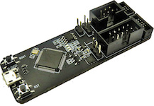

..  Copyright (c) 2014-present PlatformIO <contact@platformio.org>
    Licensed under the Apache License, Version 2.0 (the "License");
    you may not use this file except in compliance with the License.
    You may obtain a copy of the License at
       http://www.apache.org/licenses/LICENSE-2.0
    Unless required by applicable law or agreed to in writing, software
    distributed under the License is distributed on an "AS IS" BASIS,
    WITHOUT WARRANTIES OR CONDITIONS OF ANY KIND, either express or implied.
    See the License for the specific language governing permissions and
    limitations under the License.

.. _debugging_tool_esp-prog:

ESP-Prog
========

:Configuration:
  :ref:`projectconf_debug_tool` = ``esp-prog``

ESP-Prog is one of Espressif’s development and debugging tools, with functions
including automatic firmware downloading, serial communication, and JTAG
online debugging. ESP-Prog's automatic firmware downloading and serial
communication functions are supported on both the ESP8266 and ESP32
platforms, while the JTAG online debugging is supported only on the ESP32
platform. `Vendor information... <https://github.com/espressif/esp-iot-solution/blob/master/documents/evaluation_boards/ESP-Prog_guide_en.md?utm_source=platformio&utm_medium=docs>`__

Drivers
-------

:Windows:
  See https://community.platformio.org/t/esp32-pio-unified-debugger/4541/20

:Mac:
  macOS contains default FTDIUSBSerialDriver driver which conflicts with
  debug tools which are based on this chip. FTDI Chip company recommends
  removing this default driver from a system. Everything should work after system rebooting. See detailed instruction in official application note
  (Page 16, Section 4: Uninstalling FTDI Drivers on OS X)
  `AN134: FTDI Drivers Installation guide for MAC OS X <http://www.ftdichip.com/Support/Documents/AppNotes/AN_134_FTDI_Drivers_Installation_Guide_for_MAC_OSX.pdf>`__

:Linux:
  Please install "udev" rules :ref:`faq_udev_rules`. If you already installed
  them before, please check that your rules are up-to-date or repeat steps.

.. begin_compatible_platforms

Compatible Platforms
--------------------

* :ref:`platform_espressif32`
* :ref:`platform_riscv`
* :ref:`platform_samsung_artik`

.. end_compatible_platforms