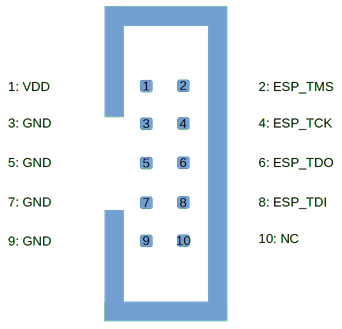

..  Copyright (c) 2014-present PlatformIO <contact@platformio.org>
    Licensed under the Apache License, Version 2.0 (the "License");
    you may not use this file except in compliance with the License.
    You may obtain a copy of the License at
       http://www.apache.org/licenses/LICENSE-2.0
    Unless required by applicable law or agreed to in writing, software
    distributed under the License is distributed on an "AS IS" BASIS,
    WITHOUT WARRANTIES OR CONDITIONS OF ANY KIND, either express or implied.
    See the License for the specific language governing permissions and
    limitations under the License.

.. _debugging_tool_esp-prog:

ESP-Prog
========

.. image:: ../../_static/images/debug_probes/esp-prog.jpg
  :target: https://github.com/espressif/esp-iot-solution/blob/master/documents/evaluation_boards/ESP-Prog_guide_en.md?utm_source=platformio&utm_medium=docs

ESP-Prog is one of Espressif’s development and debugging tools, with functions
including automatic firmware downloading, serial communication, and JTAG
online debugging. ESP-Prog's automatic firmware downloading and serial
communication functions are supported on both the ESP8266 and ESP32
platforms, while the JTAG online debugging is supported only on the ESP32
platform. `Vendor information... <https://github.com/espressif/esp-iot-solution/blob/master/documents/evaluation_boards/ESP-Prog_guide_en.md?utm_source=platformio&utm_medium=docs>`__

.. contents:: Contents
    :local:

Configuration
-------------

You can configure debugging tool using :ref:`projectconf_debug_tool` option in
:ref:`projectconf`:

.. code-block:: ini

    [env:myenv]
    platform = ...
    board = ...
    debug_tool = esp-prog

If you would like to use this tool for firmware uploading, please change
upload protocol:

.. code-block:: ini

    [env:myenv]
    platform = ...
    board = ...
    debug_tool = esp-prog
    upload_protocol = esp-prog

More options:

* :ref:`projectconf_section_env_debug`
* :ref:`projectconf_section_env_upload`

.. include:: _common_jtag_drivers.rst

Wiring Connections
------------------

.. list-table::
  :header-rows:  1

  * - ESP-Prog JTAG 10-Pin Connector
    - Board JTAG Pin
    - Description
  * - 1
    - VDD
    - Positive Supply Voltage — Power supply for JTAG interface drivers
  * - 3
    - GND
    - Digital ground
  * - 2
    - ESP_TMS
    - Test Mode State
  * - 4
    - ESP_TCK
    - JTAG Return Test Clock
  * - 6
    - ESP_TDO
    - Test Data Out
  * - 8
    - ESP_TDI
    - Test Data In

.. begin_platforms

Platforms
---------
.. list-table::
    :header-rows:  1

    * - Name
      - Description

    * - :ref:`platform_espressif32`
      - Espressif Systems is a privately held fabless semiconductor company. They provide wireless communications and Wi-Fi chips which are widely used in mobile devices and the Internet of Things applications.

Frameworks
----------
.. list-table::
    :header-rows:  1

    * - Name
      - Description

    * - :ref:`framework_arduino`
      - Arduino Wiring-based Framework allows writing cross-platform software to control devices attached to a wide range of Arduino boards to create all kinds of creative coding, interactive objects, spaces or physical experiences.

    * - :ref:`framework_espidf`
      - Espressif IoT Development Framework. Official development framework for ESP32.

    * - :ref:`framework_simba`
      - Simba is an RTOS and build framework. It aims to make embedded programming easy and portable.

Boards
------

.. note::
    For more detailed ``board`` information please scroll tables below by horizontal.

.. list-table::
    :header-rows:  1

    * - Name
      - Platform
      - Debug
      - MCU
      - Frequency
      - Flash
      - RAM
    * - :ref:`board_espressif32_alksesp32`
      - :ref:`platform_espressif32`
      - External
      - ESP32
      - 240MHz
      - 4MB
      - 320KB
    * - :ref:`board_espressif32_featheresp32`
      - :ref:`platform_espressif32`
      - External
      - ESP32
      - 240MHz
      - 4MB
      - 320KB
    * - :ref:`board_espressif32_d-duino-32`
      - :ref:`platform_espressif32`
      - External
      - ESP32
      - 240MHz
      - 4MB
      - 320KB
    * - :ref:`board_espressif32_esp32doit-devkit-v1`
      - :ref:`platform_espressif32`
      - External
      - ESP32
      - 240MHz
      - 4MB
      - 320KB
    * - :ref:`board_espressif32_pocket_32`
      - :ref:`platform_espressif32`
      - External
      - ESP32
      - 240MHz
      - 4MB
      - 320KB
    * - :ref:`board_espressif32_fm-devkit`
      - :ref:`platform_espressif32`
      - External
      - ESP32
      - 240MHz
      - 4MB
      - 320KB
    * - :ref:`board_espressif32_esp32vn-iot-uno`
      - :ref:`platform_espressif32`
      - External
      - ESP32
      - 240MHz
      - 4MB
      - 320KB
    * - :ref:`board_espressif32_espectro32`
      - :ref:`platform_espressif32`
      - External
      - ESP32
      - 240MHz
      - 4MB
      - 320KB
    * - :ref:`board_espressif32_espino32`
      - :ref:`platform_espressif32`
      - External
      - ESP32
      - 240MHz
      - 4MB
      - 320KB
    * - :ref:`board_espressif32_esp-wrover-kit`
      - :ref:`platform_espressif32`
      - On-board
      - ESP32
      - 240MHz
      - 4MB
      - 320KB
    * - :ref:`board_espressif32_esp32dev`
      - :ref:`platform_espressif32`
      - External
      - ESP32
      - 240MHz
      - 4MB
      - 320KB
    * - :ref:`board_espressif32_firebeetle32`
      - :ref:`platform_espressif32`
      - External
      - ESP32
      - 240MHz
      - 4MB
      - 320KB
    * - :ref:`board_espressif32_heltec_wifi_lora_32`
      - :ref:`platform_espressif32`
      - External
      - ESP32
      - 240MHz
      - 4MB
      - 320KB
    * - :ref:`board_espressif32_hornbill32dev`
      - :ref:`platform_espressif32`
      - External
      - ESP32
      - 240MHz
      - 4MB
      - 320KB
    * - :ref:`board_espressif32_hornbill32minima`
      - :ref:`platform_espressif32`
      - External
      - ESP32
      - 240MHz
      - 4MB
      - 320KB
    * - :ref:`board_espressif32_mhetesp32devkit`
      - :ref:`platform_espressif32`
      - External
      - ESP32
      - 240MHz
      - 4MB
      - 320KB
    * - :ref:`board_espressif32_mhetesp32minikit`
      - :ref:`platform_espressif32`
      - External
      - ESP32
      - 240MHz
      - 4MB
      - 320KB
    * - :ref:`board_espressif32_node32s`
      - :ref:`platform_espressif32`
      - External
      - ESP32
      - 240MHz
      - 4MB
      - 320KB
    * - :ref:`board_espressif32_nodemcu-32s`
      - :ref:`platform_espressif32`
      - External
      - ESP32
      - 240MHz
      - 4MB
      - 320KB
    * - :ref:`board_espressif32_esp32-evb`
      - :ref:`platform_espressif32`
      - External
      - ESP32
      - 240MHz
      - 4MB
      - 320KB
    * - :ref:`board_espressif32_esp32-gateway`
      - :ref:`platform_espressif32`
      - External
      - ESP32
      - 240MHz
      - 4MB
      - 320KB
    * - :ref:`board_espressif32_lopy`
      - :ref:`platform_espressif32`
      - External
      - ESP32
      - 240MHz
      - 4MB
      - 320KB
    * - :ref:`board_espressif32_lopy4`
      - :ref:`platform_espressif32`
      - External
      - ESP32
      - 240MHz
      - 4MB
      - 1.25MB
    * - :ref:`board_espressif32_wesp32`
      - :ref:`platform_espressif32`
      - External
      - ESP32
      - 240MHz
      - 4MB
      - 320KB
    * - :ref:`board_espressif32_esp32thing`
      - :ref:`platform_espressif32`
      - External
      - ESP32
      - 240MHz
      - 4MB
      - 320KB
    * - :ref:`board_espressif32_ttgo-lora32-v1`
      - :ref:`platform_espressif32`
      - External
      - ESP32
      - 240MHz
      - 4MB
      - 320KB
    * - :ref:`board_espressif32_ttgo-t-beam`
      - :ref:`platform_espressif32`
      - External
      - ESP32
      - 240MHz
      - 4MB
      - 1.25MB
    * - :ref:`board_espressif32_lolin_d32`
      - :ref:`platform_espressif32`
      - External
      - ESP32
      - 240MHz
      - 4MB
      - 320KB
    * - :ref:`board_espressif32_lolin_d32_pro`
      - :ref:`platform_espressif32`
      - External
      - ESP32
      - 240MHz
      - 4MB
      - 320KB
    * - :ref:`board_espressif32_lolin32`
      - :ref:`platform_espressif32`
      - External
      - ESP32
      - 240MHz
      - 4MB
      - 320KB
    * - :ref:`board_espressif32_wemosbat`
      - :ref:`platform_espressif32`
      - External
      - ESP32
      - 240MHz
      - 4MB
      - 320KB
    * - :ref:`board_espressif32_xinabox_cw02`
      - :ref:`platform_espressif32`
      - External
      - ESP32
      - 240MHz
      - 4MB
      - 320KB
    * - :ref:`board_espressif32_iotbusio`
      - :ref:`platform_espressif32`
      - External
      - ESP32
      - 240MHz
      - 4MB
      - 320KB
    * - :ref:`board_espressif32_iotbusproteus`
      - :ref:`platform_espressif32`
      - External
      - ESP32
      - 240MHz
      - 4MB
      - 320KB
