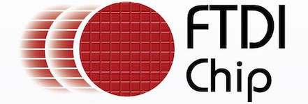

..  Copyright (c) 2014-present PlatformIO <contact@platformio.org>
    Licensed under the Apache License, Version 2.0 (the "License");
    you may not use this file except in compliance with the License.
    You may obtain a copy of the License at
       http://www.apache.org/licenses/LICENSE-2.0
    Unless required by applicable law or agreed to in writing, software
    distributed under the License is distributed on an "AS IS" BASIS,
    WITHOUT WARRANTIES OR CONDITIONS OF ANY KIND, either express or implied.
    See the License for the specific language governing permissions and
    limitations under the License.

.. _debugging_tool_ftdi:

FTDI Chip
=========

FTDI Chip develops innovative silicon solutions that enhance interaction with
today’s technology. When a designer needs to add a USB port, rest assured that
FTDI Chip has a full range of USB solutions to get the job done.
Official reference can be found `here  <http://www.ftdichip.com/USB.html?utm_source=platformio&utm_medium=docs>`__.

.. contents:: Contents
    :local:

Configuration
-------------

You can configure debugging tool using :ref:`projectconf_debug_tool` option in
:ref:`projectconf`:

.. code-block:: ini

    [env:myenv]
    platform = ...
    board = ...
    debug_tool = ftdi

If you would like to use this tool for firmware uploading, please change
upload protocol:

.. code-block:: ini

    [env:myenv]
    platform = ...
    board = ...
    debug_tool = ftdi
    upload_protocol = ftdi

More options:

* :ref:`projectconf_section_env_debug`
* :ref:`projectconf_section_env_upload`

.. include:: _common_jtag_drivers.rst

.. begin_platforms

Platforms
---------
.. list-table::
    :header-rows:  1

    * - Name
      - Description

    * - :ref:`platform_espressif32`
      - Espressif Systems is a privately held fabless semiconductor company. They provide wireless communications and Wi-Fi chips which are widely used in mobile devices and the Internet of Things applications.

    * - :ref:`platform_riscv_gap`
      - GreenWaves GAP8 IoT application processor enables the cost-effective development, deployment and autonomous operation of intelligent sensing devices that capture, analyze, classify and act on the fusion of rich data sources such as images, sounds or vibrations.

    * - :ref:`platform_shakti`
      - Shakti is an open-source initiative by the RISE group at IIT-Madras, which is not only building open source, production grade processors, but also associated components like interconnect fabrics, verification tools, storage controllers, peripheral IPs and SOC tools.

    * - :ref:`platform_sifive`
      - SiFive brings the power of open source and software automation to the semiconductor industry, making it possible to develop new hardware faster and more affordably than ever before. 

Frameworks
----------
.. list-table::
    :header-rows:  1

    * - Name
      - Description

    * - :ref:`framework_arduino`
      - Arduino Wiring-based Framework allows writing cross-platform software to control devices attached to a wide range of Arduino boards to create all kinds of creative coding, interactive objects, spaces or physical experiences

    * - :ref:`framework_espidf`
      - ESP-IDF is the official development framework for the ESP32 and ESP32-S Series SoCs.

    * - :ref:`framework_freertos`
      - FreeRTOS is a real-time operating system kernel for embedded devices that has been ported to 40 microcontroller platforms

    * - :ref:`framework_freedom-e-sdk`
      - Open Source Software for Developing on the SiFive Freedom E Platform

    * - :ref:`framework_mbed`
      - Arm Mbed OS is an open source embedded operating system designed specifically for the 'things' in the Internet of Things. It includes all the features you need to develop a connected product based on an Arm Cortex-M microcontroller, including security, connectivity, an RTOS and drivers for sensors and I/O devices

    * - :ref:`framework_pulp-os`
      - PULP is a silicon-proven Parallel Ultra Low Power platform targeting high energy efficiencies. The platform is organized in clusters of RISC-V cores that share a tightly-coupled data memory

    * - :ref:`framework_shakti-sdk`
      - A software development kit for developing applications on Shakti class of processors

    * - :ref:`framework_simba`
      - Simba is an RTOS and build framework with aims to make embedded programming easy and portable

    * - :ref:`framework_zephyr`
      - The Zephyr Project is a scalable real-time operating system (RTOS) supporting multiple hardware architectures, optimized for resource constrained devices, and built with safety and security in mind

Boards
------

.. note::
    For more detailed ``board`` information please scroll tables below by horizontal.

.. list-table::
    :header-rows:  1

    * - Name
      - Platform
      - Debug
      - MCU
      - Frequency
      - Flash
      - RAM
    * - :ref:`board_shakti_artix7_35t`
      - :ref:`platform_shakti`
      - On-board
      - E-CLASS
      - 50MHz
      - 0B
      - 128KB
    * - :ref:`board_shakti_artix7_100t`
      - :ref:`platform_shakti`
      - On-board
      - C-CLASS
      - 50MHz
      - 0B
      - 128MB
    * - :ref:`board_sifive_e310-arty`
      - :ref:`platform_sifive`
      - On-board
      - FE310
      - 450MHz
      - 16MB
      - 256MB
    * - :ref:`board_espressif32_esp-wrover-kit`
      - :ref:`platform_espressif32`
      - On-board
      - ESP32
      - 240MHz
      - 4MB
      - 320KB
    * - :ref:`board_riscv_gap_gapuino`
      - :ref:`platform_riscv_gap`
      - On-board
      - GAP8
      - 250MHz
      - 64MB
      - 8MB
    * - :ref:`board_sifive_hifive-unleashed`
      - :ref:`platform_sifive`
      - On-board
      - FU540
      - 1500MHz
      - 32MB
      - 8GB
    * - :ref:`board_sifive_hifive1`
      - :ref:`platform_sifive`
      - On-board
      - FE310
      - 320MHz
      - 16MB
      - 16KB
    * - :ref:`board_shakti_parashu`
      - :ref:`platform_shakti`
      - On-board
      - E-CLASS
      - 50MHz
      - 0B
      - 128KB
    * - :ref:`board_shakti_pinaka`
      - :ref:`platform_shakti`
      - On-board
      - E-CLASS
      - 50MHz
      - 0B
      - 128KB
    * - :ref:`board_shakti_vajra`
      - :ref:`platform_shakti`
      - On-board
      - C-CLASS
      - 50MHz
      - 0B
      - 128MB
