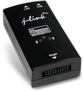

..  Copyright (c) 2014-present PlatformIO <contact@platformio.org>
    Licensed under the Apache License, Version 2.0 (the "License");
    you may not use this file except in compliance with the License.
    You may obtain a copy of the License at
       http://www.apache.org/licenses/LICENSE-2.0
    Unless required by applicable law or agreed to in writing, software
    distributed under the License is distributed on an "AS IS" BASIS,
    WITHOUT WARRANTIES OR CONDITIONS OF ANY KIND, either express or implied.
    See the License for the specific language governing permissions and
    limitations under the License.

.. _debugging_tool_jlink:

J-LINK
======

SEGGER J-Links are the most widely used line of debug probes available today.
They've proven their value for more than 10 years with over 400,000 units sold,
including OEM versions and on-board solutions. This popularity stems from the
unparalleled performance, extensive feature set, large number of supported
CPUs, and compatibility with all popular development environments.
Official reference can be found `here <https://www.segger.com/jlink-debug-probes.html?utm_source=platformio&utm_medium=docs>`__.

* `J-Link Supported Devices <https://www.segger.com/downloads/supported_devices_jlink.php?utm_source=platformio&utm_medium=docs>`__

Also, see :ref:`debugging_tool_custom` debugging configuration with
J-Link GDB Server.

.. contents:: Contents
    :local:

Configuration
-------------

You can configure debugging tool using :ref:`projectconf_debug_tool` option in
:ref:`projectconf`:

.. code-block:: ini

    [env:myenv]
    platform = ...
    board = ...
    debug_tool = jlink

If you would like to use this tool for firmware uploading, please change
upload protocol:

.. code-block:: ini

    [env:myenv]
    platform = ...
    board = ...
    debug_tool = jlink

    ; SWD interface
    upload_protocol = jlink

    ; JTAG interface
    upload_protocol = jlink-jtag

More options:

* :ref:`projectconf_section_env_debug`
* :ref:`projectconf_section_env_upload`

Custom Server
~~~~~~~~~~~~~

.. code-block:: ini

    [env:debug_jlink]
    platform = ststm32
    framework = mbed
    board = nucleo_f446re

    debug_tool = jlink
    debug_port = :2331

    debug_server =
      /full/path/to/JLinkGDBServerCL
      -singlerun
      -if
      SWD
      -select
      USB
      -port
      2331
      -device
      STM32F446RE

Multiple debug probes
~~~~~~~~~~~~~~~~~~~~~

In case there are several J-Link probes connected to the same host machine, it's
possible to specify the precise serial number of the desired probe to avoid erroneous
device selection.

.. code-block:: ini

    [env:nrf52_dk]
    platform = nordicnrf52
    framework = arduino
    board = nrf52_dk
    upload_flags =
        -SelectEmuBySN
        123456789

Drivers
-------

:Windows:
  1. Start debugging session using :ref:`pioide`. PlatformIO will install
     J-Link software dependencies
  2. Navigate to :ref:`projectconf_pio_core_dir`/packages/tool-jlink/USBDriver
  3. Run ``InstDrivers.exe``.

:Mac:
  Not required.

:Linux:
  Please install "udev" rules :ref:`platformio_udev_rules`. If you already installed
  them before, please check that your rules are up-to-date or repeat steps.

Wiring Connections
------------------

.. image:: ../../_static/images/debug_probes/generic_jtag_swd_connector.jpg

JTAG Interface
~~~~~~~~~~~~~~

.. list-table::
  :header-rows:  1

  * - J-Link JTAG 20-Pin Connector
    - Board JTAG Pin
    - Description
  * - 1
    - VCC
    - Positive Supply Voltage — Power supply for JTAG interface drivers
  * - 4
    - GND
    - Digital ground
  * - 5
    - TDI
    - Test Data In pin
  * - 7
    - TMS
    - Test Mode State pin
  * - 9
    - TCK
    - JTAG Return Test Clock
  * - 13
    - TDO
    - Test Data Out pin
  * - 15
    - RESET
    - Connect this pin to the (active low) reset input of the target CPU (EN for ESP32)

Serial Wire Mode Interface (SWD)
~~~~~~~~~~~~~~~~~~~~~~~~~~~~~~~~

.. list-table::
  :header-rows:  1

  * - J-Link SWD 20-Pin Connector
    - Board SWD Pin
    - Description
  * - 1
    - VCC
    - Positive Supply Voltage — Power supply for JTAG interface drivers
  * - 4
    - GND
    - Digital ground
  * - 7
    - SWDIO
    - Data I/O
  * - 9
    - SWCLK
    - Clock
  * - 15
    - RESET
    - Connect this pin to the (active low) reset input of the target CPU

.. begin_platforms

Platforms
---------
.. list-table::
    :header-rows:  1

    * - Name
      - Description

    * - :ref:`platform_aceinna_imu`
      - Open-source, embedded development platform for Aceinna IMU hardware. Run custom algorithms and navigation code on Aceinna IMU/INS hardware.

    * - :ref:`platform_atmelsam`
      - Atmel | SMART offers Flash- based ARM products based on the ARM Cortex-M0+, Cortex-M3 and Cortex-M4 architectures, ranging from 8KB to 2MB of Flash including a rich peripheral and feature mix.

    * - :ref:`platform_espressif32`
      - ESP32 is a series of low-cost, low-power system on a chip microcontrollers with integrated Wi-Fi and Bluetooth. ESP32 integrates an antenna switch, RF balun, power amplifier, low-noise receive amplifier, filters, and power management modules.

    * - :ref:`platform_freescalekinetis`
      - Freescale Kinetis Microcontrollers is family of multiple hardware- and software-compatible ARM Cortex-M0+, Cortex-M4 and Cortex-M7-based MCU series. Kinetis MCUs offer exceptional low-power performance, scalability and feature integration.

    * - :ref:`platform_maxim32`
      - Maxim's microcontrollers provide low-power, efficient, and secure solutions for challenging embedded applications. Maxim's processors embed cutting-edge technologies to secure data and intellectual property, proven analog circuitry for real-world applications, and battery-conserving low power operation.

    * - :ref:`platform_nordicnrf51`
      - The Nordic nRF51 Series is a family of highly flexible, multi-protocol, system-on-chip (SoC) devices for ultra-low power wireless applications. nRF51 Series devices support a range of protocol stacks including Bluetooth Smart (previously called Bluetooth low energy), ANT and proprietary 2.4GHz protocols such as Gazell.

    * - :ref:`platform_nordicnrf52`
      - The nRF52 Series are built for speed to carry out increasingly complex tasks in the shortest possible time and return to sleep, conserving precious battery power. They have a Cortex-M4F processor which makes them quite capable Bluetooth Smart SoCs.

    * - :ref:`platform_nxpimxrt`
      - The i.MX RT series of crossover processors features the Arm Cortex-M core, real-time functionality and MCU usability at a cost-effective price.

    * - :ref:`platform_nxplpc`
      - The NXP LPC is a family of 32-bit microcontroller integrated circuits by NXP Semiconductors. The LPC chips are grouped into related series that are based around the same 32-bit ARM processor core, such as the Cortex-M4F, Cortex-M3, Cortex-M0+, or Cortex-M0. Internally, each microcontroller consists of the processor core, static RAM memory, flash memory, debugging interface, and various peripherals.

    * - :ref:`platform_raspberrypi`
      - RP2040 is a low-cost, high-performance microcontroller device with a large on-chip memory, symmetric dual-core processor complex, and rich peripheral.

    * - :ref:`platform_renesas-ra`
      - Renesas Advanced (RA) 32-bit microcontrollers with the Arm Cortex-M33, -M23 and -M4 processor cores deliver key advantages compared to competitive Arm Cortex-M MCUs by providing stronger embedded security, superior CoreMark performance and ultra-low power operation.

    * - :ref:`platform_shakti`
      - Shakti is an open-source initiative by the RISE group at IIT-Madras, which is not only building open source, production grade processors, but also associated components like interconnect fabrics, verification tools, storage controllers, peripheral IPs and SOC tools.

    * - :ref:`platform_sifive`
      - SiFive brings the power of open source and software automation to the semiconductor industry, making it possible to develop new hardware faster and more affordably than ever before. 

    * - :ref:`platform_siliconlabsefm32`
      - Silicon Labs EFM32 Gecko 32-bit microcontroller (MCU) family includes devices that offer flash memory configurations up to 256 kB, 32 kB of RAM and CPU speeds up to 48 MHz. Based on the powerful ARM Cortex-M core, the Gecko family features innovative low energy techniques, short wake-up time from energy saving modes and a wide selection of peripherals, making it ideal for battery operated applications and other systems requiring high performance and low-energy consumption.

    * - :ref:`platform_ststm32`
      - The STM32 family of 32-bit Flash MCUs based on the ARM Cortex-M processor is designed to offer new degrees of freedom to MCU users. It offers a 32-bit product range that combines very high performance, real-time capabilities, digital signal processing, and low-power, low-voltage operation, while maintaining full integration and ease of development.

    * - :ref:`platform_teensy`
      - Teensy is a complete USB-based microcontroller development system, in a very small footprint, capable of implementing many types of projects. All programming is done via the USB port. No special programmer is needed, only a standard USB cable and a PC or Macintosh with a USB port.

Frameworks
----------
.. list-table::
    :header-rows:  1

    * - Name
      - Description

    * - :ref:`framework_arduino`
      - Arduino Wiring-based Framework allows writing cross-platform software to control devices attached to a wide range of Arduino boards to create all kinds of creative coding, interactive objects, spaces or physical experiences.

    * - :ref:`framework_cmsis`
      - Vendor-independent hardware abstraction layer for the Cortex-M processor series

    * - :ref:`framework_espidf`
      - Espressif IoT Development Framework. Official development framework for ESP32 chip

    * - :ref:`framework_freedom-e-sdk`
      - Open Source Software for Developing on the SiFive Freedom E Platform

    * - :ref:`framework_freertos`
      - FreeRTOS is a real-time operating system kernel for embedded devices that has been ported to 40 microcontroller platforms.

    * - :ref:`framework_fsp`
      - The Renesas Flexible Software Package (FSP) is an enhanced software package designed to provide easy-to-use, scalable, high-quality software for embedded system designs using Renesas RA family of Arm Microcontrollers.

    * - :ref:`framework_libopencm3`
      - The libopencm3 project aims to create an open-source firmware library for various ARM Cortex-M microcontrollers.

    * - :ref:`framework_mbed`
      - Arm Mbed OS is a platform operating system designed for the internet of things

    * - :ref:`framework_shakti-sdk`
      - A software development kit for developing applications on Shakti class of processors

    * - :ref:`framework_spl`
      - Standard Peripheral Library for ST STM32 microcontrollers

    * - :ref:`framework_stm32cube`
      - STM32Cube embedded software libraries, including: The HAL hardware abstraction layer, enabling portability between different STM32 devices via standardized API calls; The Low-Layer (LL) APIs, a light-weight, optimized, expert oriented set of APIs designed for both performance and runtime efficiency

    * - :ref:`framework_zephyr`
      - Zephyr is a new generation, scalable, optimized, secure RTOS for multiple hardware architectures

Boards
------

.. note::
    For more detailed ``board`` information please scroll tables below by horizontal.

.. list-table::
    :header-rows:  1

    * - Name
      - Platform
      - Debug
      - MCU
      - Frequency
      - Flash
      - RAM
    * - :ref:`board_ststm32_1bitsy_stm32f415rgt`
      - :ref:`platform_ststm32`
      - External
      - STM32F415RGT
      - 168MHz
      - 1MB
      - 128KB
    * - :ref:`board_ststm32_disco_f412zg`
      - :ref:`platform_ststm32`
      - On-board
      - STM32F412ZGT6
      - 100MHz
      - 1MB
      - 256KB
    * - :ref:`board_ststm32_disco_f723ie`
      - :ref:`platform_ststm32`
      - On-board
      - STM32F723IEK6
      - 216MHz
      - 512KB
      - 192KB
    * - :ref:`board_ststm32_armed_v1`
      - :ref:`platform_ststm32`
      - External
      - STM32F407VET6
      - 168MHz
      - 512KB
      - 128KB
    * - :ref:`board_ststm32_rumba32_f446ve`
      - :ref:`platform_ststm32`
      - External
      - STM32F446RET6
      - 180MHz
      - 512KB
      - 128KB
    * - :ref:`board_ststm32_remram_v1`
      - :ref:`platform_ststm32`
      - On-board
      - STM32F765VIT6
      - 216MHz
      - 2MB
      - 512KB
    * - :ref:`board_ststm32_st3dp001_eval`
      - :ref:`platform_ststm32`
      - On-board
      - STM32F401VET6
      - 84MHz
      - 512KB
      - 96KB
    * - :ref:`board_espressif32_4d_systems_esp32s3_gen4_r8n16`
      - :ref:`platform_espressif32`
      - External
      - ESP32S3
      - 240MHz
      - 16MB
      - 320KB
    * - :ref:`board_ststm32_b96b_argonkey`
      - :ref:`platform_ststm32`
      - External
      - STM32F412CG
      - 100MHz
      - 1MB
      - 256KB
    * - :ref:`board_ststm32_b96b_f446ve`
      - :ref:`platform_ststm32`
      - On-board
      - STM32F446VET6
      - 168MHz
      - 512KB
      - 128KB
    * - :ref:`board_ststm32_b96b_aerocore2`
      - :ref:`platform_ststm32`
      - External
      - STM32F427VIT6
      - 168MHz
      - 1.99MB
      - 256KB
    * - :ref:`board_ststm32_b96b_neonkey`
      - :ref:`platform_ststm32`
      - External
      - STM32F411CE
      - 100MHz
      - 512KB
      - 128KB
    * - :ref:`board_nordicnrf52_96b_nitrogen`
      - :ref:`platform_nordicnrf52`
      - External
      - NRF52832
      - 64MHz
      - 512KB
      - 64KB
    * - :ref:`board_ststm32_acsip_s76s`
      - :ref:`platform_ststm32`
      - External
      - STM32L073RZ
      - 32MHz
      - 192KB
      - 20KB
    * - :ref:`board_espressif32_esp32cam`
      - :ref:`platform_espressif32`
      - External
      - ESP32
      - 240MHz
      - 4MB
      - 320KB
    * - :ref:`board_espressif32_alksesp32`
      - :ref:`platform_espressif32`
      - External
      - ESP32
      - 240MHz
      - 4MB
      - 320KB
    * - :ref:`board_espressif32_az-delivery-devkit-v4`
      - :ref:`platform_espressif32`
      - External
      - ESP32
      - 240MHz
      - 4MB
      - 520KB
    * - :ref:`board_aceinna_imu_LowCostRTK`
      - :ref:`platform_aceinna_imu`
      - On-board
      - STM32F469NIH6
      - 180MHz
      - 1MB
      - 384KB
    * - :ref:`board_aceinna_imu_OpenIMU335`
      - :ref:`platform_aceinna_imu`
      - External
      - STM32F405RG
      - 120MHz
      - 1MB
      - 128KB
    * - :ref:`board_aceinna_imu_OpenIMU300`
      - :ref:`platform_aceinna_imu`
      - External
      - STM32F405RG
      - 120MHz
      - 1MB
      - 128KB
    * - :ref:`board_aceinna_imu_OpenIMU300ZA`
      - :ref:`platform_aceinna_imu`
      - External
      - STM32F405RG
      - 120MHz
      - 1MB
      - 128KB
    * - :ref:`board_aceinna_imu_OpenIMU330`
      - :ref:`platform_aceinna_imu`
      - External
      - STM32L431CB
      - 80MHz
      - 128KB
      - 64KB
    * - :ref:`board_aceinna_imu_OpenRTK`
      - :ref:`platform_aceinna_imu`
      - External
      - STM32F469IG
      - 180MHz
      - 1MB
      - 384KB
    * - :ref:`board_aceinna_imu_OpenRTK330L`
      - :ref:`platform_aceinna_imu`
      - External
      - STM32F469IG
      - 180MHz
      - 1MB
      - 384KB
    * - :ref:`board_atmelsam_adafruit_blm_badge`
      - :ref:`platform_atmelsam`
      - External
      - SAMD21E18A
      - 48MHz
      - 256KB
      - 32KB
    * - :ref:`board_nordicnrf52_adafruit_feather_nrf52832`
      - :ref:`platform_nordicnrf52`
      - External
      - NRF52832
      - 64MHz
      - 512KB
      - 64KB
    * - :ref:`board_nordicnrf52_adafruit_clue_nrf52840`
      - :ref:`platform_nordicnrf52`
      - External
      - NRF52840
      - 64MHz
      - 796KB
      - 243KB
    * - :ref:`board_atmelsam_adafruit_circuitplayground_m0`
      - :ref:`platform_atmelsam`
      - External
      - SAMD21G18A
      - 48MHz
      - 256KB
      - 32KB
    * - :ref:`board_atmelsam_adafruit_crickit_m0`
      - :ref:`platform_atmelsam`
      - External
      - SAMD21G18A
      - 48MHz
      - 256KB
      - 32KB
    * - :ref:`board_espressif32_featheresp32`
      - :ref:`platform_espressif32`
      - External
      - ESP32
      - 240MHz
      - 4MB
      - 320KB
    * - :ref:`board_espressif32_featheresp32-s2`
      - :ref:`platform_espressif32`
      - External
      - ESP32S2
      - 240MHz
      - 4MB
      - 320KB
    * - :ref:`board_nordicnrf52_adafruit_feather_nrf52840_sense`
      - :ref:`platform_nordicnrf52`
      - External
      - NRF52840
      - 64MHz
      - 796KB
      - 243KB
    * - :ref:`board_espressif32_adafruit_feather_esp32_v2`
      - :ref:`platform_espressif32`
      - External
      - ESP32
      - 240MHz
      - 8MB
      - 320KB
    * - :ref:`board_espressif32_adafruit_feather_esp32s2`
      - :ref:`platform_espressif32`
      - External
      - ESP32S2
      - 240MHz
      - 4MB
      - 320KB
    * - :ref:`board_espressif32_adafruit_feather_esp32s2_reversetft`
      - :ref:`platform_espressif32`
      - External
      - ESP32S2
      - 240MHz
      - 4MB
      - 320KB
    * - :ref:`board_espressif32_adafruit_feather_esp32s2_tft`
      - :ref:`platform_espressif32`
      - External
      - ESP32S2
      - 240MHz
      - 4MB
      - 320KB
    * - :ref:`board_espressif32_adafruit_feather_esp32s3`
      - :ref:`platform_espressif32`
      - External
      - ESP32S3
      - 240MHz
      - 4MB
      - 320KB
    * - :ref:`board_espressif32_adafruit_feather_esp32s3_nopsram`
      - :ref:`platform_espressif32`
      - External
      - ESP32S3
      - 240MHz
      - 8MB
      - 320KB
    * - :ref:`board_espressif32_adafruit_feather_esp32s3_reversetft`
      - :ref:`platform_espressif32`
      - External
      - ESP32S3
      - 240MHz
      - 4MB
      - 320KB
    * - :ref:`board_espressif32_adafruit_feather_esp32s3_tft`
      - :ref:`platform_espressif32`
      - External
      - ESP32S3
      - 240MHz
      - 4MB
      - 320KB
    * - :ref:`board_atmelsam_adafruit_feather_m0`
      - :ref:`platform_atmelsam`
      - External
      - SAMD21G18A
      - 48MHz
      - 256KB
      - 32KB
    * - :ref:`board_atmelsam_adafruit_feather_m0_express`
      - :ref:`platform_atmelsam`
      - External
      - SAMD21G18A
      - 48MHz
      - 256KB
      - 32KB
    * - :ref:`board_atmelsam_adafruit_feather_m4_can`
      - :ref:`platform_atmelsam`
      - External
      - SAME51J19A
      - 120MHz
      - 496KB
      - 192KB
    * - :ref:`board_atmelsam_adafruit_feather_m4`
      - :ref:`platform_atmelsam`
      - External
      - SAMD51J19A
      - 120MHz
      - 512KB
      - 192KB
    * - :ref:`board_ststm32_adafruit_feather_f405`
      - :ref:`platform_ststm32`
      - External
      - STM32F405RGT6
      - 168MHz
      - 1MB
      - 128KB
    * - :ref:`board_nordicnrf52_adafruit_feather_nrf52840`
      - :ref:`platform_nordicnrf52`
      - External
      - NRF52840
      - 64MHz
      - 796KB
      - 243KB
    * - :ref:`board_espressif32_adafruit_funhouse_esp32s2`
      - :ref:`platform_espressif32`
      - External
      - ESP32S2
      - 240MHz
      - 4MB
      - 320KB
    * - :ref:`board_atmelsam_adafruit_gemma_m0`
      - :ref:`platform_atmelsam`
      - External
      - SAMD21E18A
      - 48MHz
      - 256KB
      - 32KB
    * - :ref:`board_atmelsam_adafruit_grandcentral_m4`
      - :ref:`platform_atmelsam`
      - External
      - SAMD51P20A
      - 120MHz
      - 1MB
      - 256KB
    * - :ref:`board_atmelsam_adafruit_hallowing`
      - :ref:`platform_atmelsam`
      - External
      - SAMD21G18A
      - 48MHz
      - 256KB
      - 32KB
    * - :ref:`board_atmelsam_adafruit_hallowing_m4`
      - :ref:`platform_atmelsam`
      - External
      - SAMD51J19A
      - 120MHz
      - 496KB
      - 192KB
    * - :ref:`board_espressif32_adafruit_itsybitsy_esp32`
      - :ref:`platform_espressif32`
      - External
      - ESP32
      - 240MHz
      - 8MB
      - 320KB
    * - :ref:`board_atmelsam_adafruit_itsybitsy_m0`
      - :ref:`platform_atmelsam`
      - External
      - SAMD21G18A
      - 48MHz
      - 256KB
      - 32KB
    * - :ref:`board_atmelsam_adafruit_itsybitsy_m4`
      - :ref:`platform_atmelsam`
      - External
      - SAMD51G19A
      - 120MHz
      - 512KB
      - 192KB
    * - :ref:`board_nordicnrf52_adafruit_ledglasses_nrf52840`
      - :ref:`platform_nordicnrf52`
      - External
      - NRF52840
      - 64MHz
      - 796KB
      - 232KB
    * - :ref:`board_atmelsam_adafruit_monster_m4sk`
      - :ref:`platform_atmelsam`
      - External
      - SAMD51G19A
      - 120MHz
      - 496KB
      - 192KB
    * - :ref:`board_espressif32_adafruit_magtag29_esp32s2`
      - :ref:`platform_espressif32`
      - External
      - ESP32S2
      - 240MHz
      - 4MB
      - 320KB
    * - :ref:`board_atmelsam_adafruit_matrix_portal_m4`
      - :ref:`platform_atmelsam`
      - External
      - SAMD51J19A
      - 120MHz
      - 496KB
      - 192KB
    * - :ref:`board_espressif32_adafruit_matrixportal_esp32s3`
      - :ref:`platform_espressif32`
      - External
      - ESP32S3
      - 240MHz
      - 8MB
      - 320KB
    * - :ref:`board_espressif32_adafruit_metro_esp32s2`
      - :ref:`platform_espressif32`
      - External
      - ESP32S2
      - 240MHz
      - 4MB
      - 320KB
    * - :ref:`board_espressif32_adafruit_metro_esp32s3`
      - :ref:`platform_espressif32`
      - External
      - ESP32S3
      - 240MHz
      - 16MB
      - 320KB
    * - :ref:`board_atmelsam_adafruit_metro_m0`
      - :ref:`platform_atmelsam`
      - External
      - SAMD21G18A
      - 48MHz
      - 256KB
      - 32KB
    * - :ref:`board_atmelsam_adafruit_metro_m4`
      - :ref:`platform_atmelsam`
      - External
      - SAMD51J19A
      - 120MHz
      - 512KB
      - 192KB
    * - :ref:`board_atmelsam_adafruit_metro_m4_airliftlite`
      - :ref:`platform_atmelsam`
      - External
      - SAMD51J19A
      - 120MHz
      - 512KB
      - 192KB
    * - :ref:`board_atmelsam_adafruit_neokeytrinkey_m0`
      - :ref:`platform_atmelsam`
      - External
      - SAMD21E18A
      - 48MHz
      - 256KB
      - 32KB
    * - :ref:`board_atmelsam_adafruit_neotrinkey_m0`
      - :ref:`platform_atmelsam`
      - External
      - SAMD21E18A
      - 48MHz
      - 256KB
      - 32KB
    * - :ref:`board_atmelsam_adafruit_proxlighttrinkey_m0`
      - :ref:`platform_atmelsam`
      - External
      - SAMD21E18A
      - 48MHz
      - 256KB
      - 32KB
    * - :ref:`board_atmelsam_adafruit_pygamer_advance_m4`
      - :ref:`platform_atmelsam`
      - External
      - SAMD51J20A
      - 120MHz
      - 1MB
      - 256KB
    * - :ref:`board_atmelsam_adafruit_pygamer_m4`
      - :ref:`platform_atmelsam`
      - External
      - SAMD51J19A
      - 120MHz
      - 512KB
      - 192KB
    * - :ref:`board_atmelsam_adafruit_pyportal_m4`
      - :ref:`platform_atmelsam`
      - External
      - SAMD51J20A
      - 120MHz
      - 1MB
      - 256KB
    * - :ref:`board_atmelsam_adafruit_pyportal_m4_titano`
      - :ref:`platform_atmelsam`
      - External
      - SAMD51J20A
      - 120MHz
      - 1MB
      - 256KB
    * - :ref:`board_espressif32_adafruit_qtpy_esp32`
      - :ref:`platform_espressif32`
      - External
      - ESP32
      - 240MHz
      - 8MB
      - 320KB
    * - :ref:`board_espressif32_adafruit_qtpy_esp32c3`
      - :ref:`platform_espressif32`
      - External
      - ESP32C3
      - 160MHz
      - 4MB
      - 320KB
    * - :ref:`board_espressif32_adafruit_qtpy_esp32s2`
      - :ref:`platform_espressif32`
      - External
      - ESP32S2
      - 240MHz
      - 4MB
      - 320KB
    * - :ref:`board_espressif32_adafruit_qtpy_esp32s3_n4r2`
      - :ref:`platform_espressif32`
      - External
      - ESP32S3
      - 240MHz
      - 4MB
      - 320KB
    * - :ref:`board_espressif32_adafruit_qtpy_esp32s3_nopsram`
      - :ref:`platform_espressif32`
      - External
      - ESP32S3
      - 240MHz
      - 8MB
      - 320KB
    * - :ref:`board_atmelsam_adafruit_qt_py_m0`
      - :ref:`platform_atmelsam`
      - External
      - SAMD21E18A
      - 48MHz
      - 256KB
      - 32KB
    * - :ref:`board_espressif32_adafruit_qualia_s3_rgb666`
      - :ref:`platform_espressif32`
      - External
      - ESP32S3
      - 240MHz
      - 16MB
      - 320KB
    * - :ref:`board_atmelsam_adafruit_rotarytrinkey_m0`
      - :ref:`platform_atmelsam`
      - External
      - SAMD21E18A
      - 48MHz
      - 256KB
      - 32KB
    * - :ref:`board_atmelsam_adafruit_slidetrinkey_m0`
      - :ref:`platform_atmelsam`
      - External
      - SAMD21E18A
      - 48MHz
      - 256KB
      - 32KB
    * - :ref:`board_atmelsam_adafruit_trellis_m4`
      - :ref:`platform_atmelsam`
      - External
      - SAMD51J19A
      - 120MHz
      - 512KB
      - 192KB
    * - :ref:`board_atmelsam_adafruit_trinket_m0`
      - :ref:`platform_atmelsam`
      - External
      - SAMD21E18A
      - 48MHz
      - 256KB
      - 32KB
    * - :ref:`board_atmelsam_adafruit_pirkey`
      - :ref:`platform_atmelsam`
      - External
      - SAMD21E18A
      - 48MHz
      - 256KB
      - 32KB
    * - :ref:`board_atmelsam_adafruit_pybadge_airlift_m4`
      - :ref:`platform_atmelsam`
      - External
      - SAMD51J20A
      - 120MHz
      - 1008KB
      - 192KB
    * - :ref:`board_atmelsam_adafruit_pybadge_m4`
      - :ref:`platform_atmelsam`
      - External
      - SAMD51J19A
      - 120MHz
      - 512KB
      - 192KB
    * - :ref:`board_espressif32_adafruit_camera_esp32s3`
      - :ref:`platform_espressif32`
      - External
      - ESP32S3
      - 240MHz
      - 4MB
      - 320KB
    * - :ref:`board_ststm32_afroflight_f103cb`
      - :ref:`platform_ststm32`
      - External
      - STM32F103CBT6
      - 72MHz
      - 128KB
      - 20KB
    * - :ref:`board_espressif32_esp32-c3-m1i-kit`
      - :ref:`platform_espressif32`
      - External
      - ESP32C3
      - 160MHz
      - 4MB
      - 320KB
    * - :ref:`board_espressif32_nodemcu-32s2`
      - :ref:`platform_espressif32`
      - External
      - ESP32S2
      - 240MHz
      - 4MB
      - 320KB
    * - :ref:`board_espressif32_airm2m_core_esp32c3`
      - :ref:`platform_espressif32`
      - External
      - ESP32C3
      - 160MHz
      - 4MB
      - 320KB
    * - :ref:`board_atmelsam_due`
      - :ref:`platform_atmelsam`
      - External
      - AT91SAM3X8E
      - 84MHz
      - 512KB
      - 96KB
    * - :ref:`board_atmelsam_dueUSB`
      - :ref:`platform_atmelsam`
      - External
      - AT91SAM3X8E
      - 84MHz
      - 512KB
      - 96KB
    * - :ref:`board_ststm32_giga_r1_m4`
      - :ref:`platform_ststm32`
      - External
      - STM32H747XIH6
      - 480MHz
      - 1MB
      - 287.35KB
    * - :ref:`board_ststm32_giga_r1_m7`
      - :ref:`platform_ststm32`
      - External
      - STM32H747XIH6
      - 480MHz
      - 768KB
      - 511.35KB
    * - :ref:`board_atmelsam_mzeroUSB`
      - :ref:`platform_atmelsam`
      - External
      - SAMD21G18A
      - 48MHz
      - 256KB
      - 32KB
    * - :ref:`board_atmelsam_mzeroproUSB`
      - :ref:`platform_atmelsam`
      - External
      - SAMD21G18A
      - 48MHz
      - 256KB
      - 32KB
    * - :ref:`board_atmelsam_mzeropro`
      - :ref:`platform_atmelsam`
      - On-board
      - SAMD21G18A
      - 48MHz
      - 256KB
      - 32KB
    * - :ref:`board_atmelsam_mkrfox1200`
      - :ref:`platform_atmelsam`
      - External
      - SAMD21G18A
      - 48MHz
      - 256KB
      - 32KB
    * - :ref:`board_atmelsam_mkrgsm1400`
      - :ref:`platform_atmelsam`
      - External
      - SAMD21G18A
      - 48MHz
      - 256KB
      - 32KB
    * - :ref:`board_atmelsam_mkrnb1500`
      - :ref:`platform_atmelsam`
      - External
      - SAMD21G18A
      - 48MHz
      - 256KB
      - 32KB
    * - :ref:`board_atmelsam_mkrwan1300`
      - :ref:`platform_atmelsam`
      - External
      - SAMD21G18A
      - 48MHz
      - 256KB
      - 32KB
    * - :ref:`board_atmelsam_mkrwan1310`
      - :ref:`platform_atmelsam`
      - External
      - SAMD21G18A
      - 48MHz
      - 256KB
      - 32KB
    * - :ref:`board_atmelsam_mkrwifi1010`
      - :ref:`platform_atmelsam`
      - External
      - SAMD21G18A
      - 48MHz
      - 256KB
      - 32KB
    * - :ref:`board_atmelsam_mkr1000USB`
      - :ref:`platform_atmelsam`
      - External
      - SAMD21G18A
      - 48MHz
      - 256KB
      - 32KB
    * - :ref:`board_atmelsam_mkrzero`
      - :ref:`platform_atmelsam`
      - External
      - SAMD21G18A
      - 48MHz
      - 256KB
      - 32KB
    * - :ref:`board_nordicnrf52_nano33ble`
      - :ref:`platform_nordicnrf52`
      - External
      - NRF52840
      - 64MHz
      - 960KB
      - 256KB
    * - :ref:`board_espressif32_arduino_nano_esp32`
      - :ref:`platform_espressif32`
      - External
      - ESP32S3
      - 240MHz
      - 16MB
      - 320KB
    * - :ref:`board_raspberrypi_nanorp2040connect`
      - :ref:`platform_raspberrypi`
      - External
      - RP2040
      - 133MHz
      - 2MB
      - 264KB
    * - :ref:`board_nordicnrf52_nicla_sense_me`
      - :ref:`platform_nordicnrf52`
      - On-board
      - NRF52832
      - 64MHz
      - 515.25KB
      - 62.78KB
    * - :ref:`board_ststm32_nicla_vision`
      - :ref:`platform_ststm32`
      - External
      - STM32H747XIH6
      - 480MHz
      - 768KB
      - 511.35KB
    * - :ref:`board_ststm32_nicla_vision_m4`
      - :ref:`platform_ststm32`
      - External
      - STM32H747XIH6
      - 480MHz
      - 1MB
      - 287.35KB
    * - :ref:`board_ststm32_opta`
      - :ref:`platform_ststm32`
      - External
      - STM32H747XIH6
      - 480MHz
      - 768KB
      - 511.35KB
    * - :ref:`board_ststm32_opta_m4`
      - :ref:`platform_ststm32`
      - External
      - STM32H747XIH6
      - 480MHz
      - 1MB
      - 287.35KB
    * - :ref:`board_renesas-ra_portenta_c33`
      - :ref:`platform_renesas-ra`
      - External
      - R7FA6M5BH2CBG
      - 200MHz
      - 2MB
      - 511.35KB
    * - :ref:`board_ststm32_portenta_h7_m4`
      - :ref:`platform_ststm32`
      - External
      - STM32H747XIH6
      - 480MHz
      - 1MB
      - 287.35KB
    * - :ref:`board_ststm32_portenta_h7_m7`
      - :ref:`platform_ststm32`
      - External
      - STM32H747XIH6
      - 480MHz
      - 768KB
      - 511.35KB
    * - :ref:`board_atmelsam_tian`
      - :ref:`platform_atmelsam`
      - External
      - SAMD21G18A
      - 48MHz
      - 256KB
      - 32KB
    * - :ref:`board_renesas-ra_uno_r4_minima`
      - :ref:`platform_renesas-ra`
      - External
      - RA4M1
      - 48MHz
      - 256KB
      - 32KB
    * - :ref:`board_renesas-ra_uno_r4_wifi`
      - :ref:`platform_renesas-ra`
      - On-board
      - RA4M1
      - 48MHz
      - 256KB
      - 32KB
    * - :ref:`board_atmelsam_zero`
      - :ref:`platform_atmelsam`
      - On-board
      - SAMD21G18A
      - 48MHz
      - 256KB
      - 32KB
    * - :ref:`board_atmelsam_zeroUSB`
      - :ref:`platform_atmelsam`
      - External
      - SAMD21G18A
      - 48MHz
      - 256KB
      - 32KB
    * - :ref:`board_ststm32_armstrap_eagle1024`
      - :ref:`platform_ststm32`
      - On-board
      - STM32F417VGT6
      - 168MHz
      - 1MB
      - 192KB
    * - :ref:`board_ststm32_armstrap_eagle2048`
      - :ref:`platform_ststm32`
      - On-board
      - STM32F427VIT6
      - 168MHz
      - 1.99MB
      - 256KB
    * - :ref:`board_ststm32_armstrap_eagle512`
      - :ref:`platform_ststm32`
      - On-board
      - STM32F407VET6
      - 168MHz
      - 512KB
      - 192KB
    * - :ref:`board_shakti_artix7_35t`
      - :ref:`platform_shakti`
      - On-board
      - E-CLASS
      - 50MHz
      - 0B
      - 128KB
    * - :ref:`board_espressif32_atd147_s3`
      - :ref:`platform_espressif32`
      - External
      - ESP32S3
      - 240MHz
      - 8MB
      - 320KB
    * - :ref:`board_espressif32_ioxesp32`
      - :ref:`platform_espressif32`
      - External
      - ESP32
      - 240MHz
      - 4MB
      - 320KB
    * - :ref:`board_espressif32_ioxesp32ps`
      - :ref:`platform_espressif32`
      - External
      - ESP32
      - 240MHz
      - 4MB
      - 320KB
    * - :ref:`board_shakti_artix7_100t`
      - :ref:`platform_shakti`
      - On-board
      - C-CLASS
      - 50MHz
      - 0B
      - 128MB
    * - :ref:`board_sifive_e310-arty`
      - :ref:`platform_sifive`
      - On-board
      - FE310
      - 450MHz
      - 16MB
      - 256MB
    * - :ref:`board_atmelsam_samr21_xpro`
      - :ref:`platform_atmelsam`
      - On-board
      - SAMR21G18A
      - 48MHz
      - 256KB
      - 32KB
    * - :ref:`board_atmelsam_samd21g18a`
      - :ref:`platform_atmelsam`
      - On-board
      - SAMD21G18A
      - 48MHz
      - 256KB
      - 32KB
    * - :ref:`board_atmelsam_samc21_xpro`
      - :ref:`platform_atmelsam`
      - On-board
      - SAMC21J18A
      - 48MHz
      - 256KB
      - 32KB
    * - :ref:`board_atmelsam_samd21_xpro`
      - :ref:`platform_atmelsam`
      - On-board
      - SAMD21J18A
      - 48MHz
      - 256KB
      - 32KB
    * - :ref:`board_espressif32_aventen_s3_sync`
      - :ref:`platform_espressif32`
      - External
      - ESP32S3
      - 240MHz
      - 16MB
      - 320KB
    * - :ref:`board_nordicnrf51_bbcmicrobit`
      - :ref:`platform_nordicnrf51`
      - On-board
      - NRF51822
      - 16MHz
      - 256KB
      - 16KB
    * - :ref:`board_nordicnrf52_bbcmicrobit_v2`
      - :ref:`platform_nordicnrf52`
      - On-board
      - NRF52833
      - 64MHz
      - 512KB
      - 128KB
    * - :ref:`board_nordicnrf52_laird_bl652_dvk`
      - :ref:`platform_nordicnrf52`
      - On-board
      - NRF52832
      - 64MHz
      - 512KB
      - 64KB
    * - :ref:`board_nordicnrf52_laird_bl653_dvk`
      - :ref:`platform_nordicnrf52`
      - On-board
      - NRF52833
      - 64MHz
      - 512KB
      - 128KB
    * - :ref:`board_nordicnrf52_laird_bl654_dvk`
      - :ref:`platform_nordicnrf52`
      - On-board
      - NRF52840
      - 64MHz
      - 1MB
      - 256KB
    * - :ref:`board_espressif32_bpi_leaf_s3`
      - :ref:`platform_espressif32`
      - External
      - ESP32S3
      - 240MHz
      - 8MB
      - 320KB
    * - :ref:`board_ststm32_btt_ebb42_v1_1`
      - :ref:`platform_ststm32`
      - On-board
      - STM32G0B1RET6
      - 64MHz
      - 128KB
      - 144KB
    * - :ref:`board_ststm32_black_f407ve`
      - :ref:`platform_ststm32`
      - External
      - STM32F407VET6
      - 168MHz
      - 512KB
      - 128KB
    * - :ref:`board_ststm32_black_f407vg`
      - :ref:`platform_ststm32`
      - External
      - STM32F407VGT6
      - 168MHz
      - 512KB
      - 128KB
    * - :ref:`board_ststm32_black_f407ze`
      - :ref:`platform_ststm32`
      - External
      - STM32F407ZET6
      - 168MHz
      - 512KB
      - 128KB
    * - :ref:`board_ststm32_black_f407zg`
      - :ref:`platform_ststm32`
      - External
      - STM32F407ZGT6
      - 168MHz
      - 1MB
      - 128KB
    * - :ref:`board_ststm32_blackpill_f103c8`
      - :ref:`platform_ststm32`
      - External
      - STM32F103C8T6
      - 72MHz
      - 64KB
      - 20KB
    * - :ref:`board_ststm32_blackpill_f103c8_128`
      - :ref:`platform_ststm32`
      - External
      - STM32F103C8T6
      - 72MHz
      - 128KB
      - 20KB
    * - :ref:`board_ststm32_robotdyn_blackpill_f303cc`
      - :ref:`platform_ststm32`
      - External
      - STM32F303CCT6
      - 72MHz
      - 256KB
      - 40KB
    * - :ref:`board_espressif32_wifiduino32s3`
      - :ref:`platform_espressif32`
      - External
      - ESP32S3
      - 240MHz
      - 8MB
      - 320KB
    * - :ref:`board_espressif32_wifiduino32c3`
      - :ref:`platform_espressif32`
      - External
      - ESP32C3
      - 160MHz
      - 4MB
      - 320KB
    * - :ref:`board_ststm32_blue_f407ve_mini`
      - :ref:`platform_ststm32`
      - External
      - STM32F407VET6
      - 168MHz
      - 512KB
      - 128KB
    * - :ref:`board_ststm32_bluepill_f103c6`
      - :ref:`platform_ststm32`
      - External
      - STM32F103C6T6
      - 72MHz
      - 32KB
      - 10KB
    * - :ref:`board_ststm32_bluepill_f103c8`
      - :ref:`platform_ststm32`
      - External
      - STM32F103C8T6
      - 72MHz
      - 64KB
      - 20KB
    * - :ref:`board_ststm32_bluepill_f103c8_128k`
      - :ref:`platform_ststm32`
      - External
      - STM32F103C8T6
      - 72MHz
      - 128KB
      - 20KB
    * - :ref:`board_ststm32_blues_cygnet`
      - :ref:`platform_ststm32`
      - External
      - STM32L433CCT6
      - 80MHz
      - 256KB
      - 64KB
    * - :ref:`board_ststm32_blues_swan_r5`
      - :ref:`platform_ststm32`
      - External
      - STM32L4R5ZIY6
      - 120MHz
      - 2MB
      - 640KB
    * - :ref:`board_ststm32_bw_swan_r5`
      - :ref:`platform_ststm32`
      - External
      - STM32L4R5ZIY6
      - 120MHz
      - 2MB
      - 640KB
    * - :ref:`board_nordicnrf52_bluey`
      - :ref:`platform_nordicnrf52`
      - External
      - NRF52832
      - 64MHz
      - 512KB
      - 64KB
    * - :ref:`board_nordicnrf51_bluz_dk`
      - :ref:`platform_nordicnrf51`
      - External
      - NRF51822
      - 32MHz
      - 256KB
      - 32KB
    * - :ref:`board_nordicnrf52_calliopemini_v3`
      - :ref:`platform_nordicnrf52`
      - External
      - NRF52833
      - 64MHz
      - 512KB
      - 128KB
    * - :ref:`board_nordicnrf51_calliope_mini`
      - :ref:`platform_nordicnrf51`
      - On-board
      - NRF51822
      - 16MHz
      - 256KB
      - 16KB
    * - :ref:`board_ststm32_cicada_l082cz`
      - :ref:`platform_ststm32`
      - External
      - STM32L082CZY6
      - 32MHz
      - 192KB
      - 20KB
    * - :ref:`board_nordicnrf52_adafruit_cplaynrf52840`
      - :ref:`platform_nordicnrf52`
      - External
      - NRF52840
      - 64MHz
      - 796KB
      - 243KB
    * - :ref:`board_espressif32_connaxio_espoir`
      - :ref:`platform_espressif32`
      - External
      - ESP32
      - 240MHz
      - 4MB
      - 320KB
    * - :ref:`board_ststm32_coreboard_f401rc`
      - :ref:`platform_ststm32`
      - External
      - STM32F401RCT6
      - 84MHz
      - 256KB
      - 64KB
    * - :ref:`board_ststm32_cricket_l082cz`
      - :ref:`platform_ststm32`
      - External
      - STM32L082CZY6
      - 32MHz
      - 192KB
      - 20KB
    * - :ref:`board_espressif32_cytron_maker_feather_aiot_s3`
      - :ref:`platform_espressif32`
      - External
      - ESP32S3
      - 240MHz
      - 8MB
      - 320KB
    * - :ref:`board_espressif32_d-duino-32`
      - :ref:`platform_espressif32`
      - External
      - ESP32
      - 240MHz
      - 4MB
      - 320KB
    * - :ref:`board_espressif32_dfrobot_beetle_esp32c3`
      - :ref:`platform_espressif32`
      - External
      - ESP32C3
      - 160MHz
      - 4MB
      - 320KB
    * - :ref:`board_espressif32_dfrobot_firebeetle2_esp32e`
      - :ref:`platform_espressif32`
      - External
      - ESP32
      - 240MHz
      - 4MB
      - 320KB
    * - :ref:`board_espressif32_dfrobot_firebeetle2_esp32s3`
      - :ref:`platform_espressif32`
      - External
      - ESP32S3
      - 240MHz
      - 4MB
      - 320KB
    * - :ref:`board_espressif32_dfrobot_romeo_esp32s3`
      - :ref:`platform_espressif32`
      - External
      - ESP32S3
      - 240MHz
      - 16MB
      - 320KB
    * - :ref:`board_espressif32_esp32doit-devkit-v1`
      - :ref:`platform_espressif32`
      - External
      - ESP32
      - 240MHz
      - 4MB
      - 320KB
    * - :ref:`board_espressif32_esp32doit-espduino`
      - :ref:`platform_espressif32`
      - External
      - ESP32
      - 240MHz
      - 4MB
      - 320KB
    * - :ref:`board_nordicnrf52_delta_dfbm_nq620`
      - :ref:`platform_nordicnrf52`
      - On-board
      - NRF52832
      - 64MHz
      - 512KB
      - 64KB
    * - :ref:`board_ststm32_demo_f030f4`
      - :ref:`platform_ststm32`
      - External
      - STM32F030F4P6
      - 48MHz
      - 16KB
      - 4KB
    * - :ref:`board_espressif32_deneyapkart`
      - :ref:`platform_espressif32`
      - External
      - ESP32
      - 240MHz
      - 4MB
      - 320KB
    * - :ref:`board_espressif32_deneyapkart1A`
      - :ref:`platform_espressif32`
      - External
      - ESP32
      - 240MHz
      - 4MB
      - 320KB
    * - :ref:`board_espressif32_deneyapkart1Av2`
      - :ref:`platform_espressif32`
      - External
      - ESP32S3
      - 240MHz
      - 4MB
      - 320KB
    * - :ref:`board_espressif32_deneyapkartg`
      - :ref:`platform_espressif32`
      - External
      - ESP32C3
      - 160MHz
      - 4MB
      - 320KB
    * - :ref:`board_espressif32_deneyapmini`
      - :ref:`platform_espressif32`
      - External
      - ESP32S2
      - 240MHz
      - 4MB
      - 320KB
    * - :ref:`board_espressif32_deneyapminiv2`
      - :ref:`platform_espressif32`
      - External
      - ESP32S2
      - 240MHz
      - 4MB
      - 320KB
    * - :ref:`board_espressif32_minimain_esp32s2`
      - :ref:`platform_espressif32`
      - External
      - ESP32S2
      - 240MHz
      - 4MB
      - 320KB
    * - :ref:`board_ststm32_devebox_h743vitx`
      - :ref:`platform_ststm32`
      - External
      - STM32H743VIT6
      - 480MHz
      - 2MB
      - 512KB
    * - :ref:`board_ststm32_devebox_h750vbtx`
      - :ref:`platform_ststm32`
      - External
      - STM32H750VBT6
      - 480MHz
      - 512KB
      - 128KB
    * - :ref:`board_atmelsam_digix`
      - :ref:`platform_atmelsam`
      - External
      - AT91SAM3X8E
      - 84MHz
      - 512KB
      - 96KB
    * - :ref:`board_espressif32_pocket_32`
      - :ref:`platform_espressif32`
      - External
      - ESP32
      - 240MHz
      - 4MB
      - 320KB
    * - :ref:`board_siliconlabsefm32_efm32gg_stk3700`
      - :ref:`platform_siliconlabsefm32`
      - On-board
      - EFM32GG990F1024
      - 48MHz
      - 1MB
      - 128KB
    * - :ref:`board_siliconlabsefm32_efm32wg_stk3800`
      - :ref:`platform_siliconlabsefm32`
      - On-board
      - EFM32WG990F256
      - 48MHz
      - 256KB
      - 32KB
    * - :ref:`board_espressif32_fm-devkit`
      - :ref:`platform_espressif32`
      - External
      - ESP32
      - 240MHz
      - 4MB
      - 320KB
    * - :ref:`board_espressif32_pico32`
      - :ref:`platform_espressif32`
      - External
      - ESP32
      - 240MHz
      - 4MB
      - 320KB
    * - :ref:`board_espressif32_esp32s3_powerfeather`
      - :ref:`platform_espressif32`
      - External
      - ESP32S3
      - 240MHz
      - 8MB
      - 320KB
    * - :ref:`board_espressif32_esp32s3camlcd`
      - :ref:`platform_espressif32`
      - External
      - ESP32S3
      - 240MHz
      - 8MB
      - 320KB
    * - :ref:`board_espressif32_esp32vn-iot-uno`
      - :ref:`platform_espressif32`
      - External
      - ESP32
      - 240MHz
      - 4MB
      - 320KB
    * - :ref:`board_espressif32_espectro32`
      - :ref:`platform_espressif32`
      - External
      - ESP32
      - 240MHz
      - 4MB
      - 320KB
    * - :ref:`board_espressif32_espino32`
      - :ref:`platform_espressif32`
      - External
      - ESP32
      - 240MHz
      - 4MB
      - 320KB
    * - :ref:`board_ststm32_econode_l082cz`
      - :ref:`platform_ststm32`
      - External
      - STM32L082CZY6
      - 32MHz
      - 192KB
      - 20KB
    * - :ref:`board_nordicnrf52_electronut_blip`
      - :ref:`platform_nordicnrf52`
      - On-board
      - NRF52840
      - 64MHz
      - 1MB
      - 256KB
    * - :ref:`board_nordicnrf52_electronut_papyr`
      - :ref:`platform_nordicnrf52`
      - On-board
      - NRF52840
      - 64MHz
      - 1MB
      - 256KB
    * - :ref:`board_ststm32_electrosmith_daisy`
      - :ref:`platform_ststm32`
      - External
      - STM32H750IBK6
      - 400MHz
      - 128KB
      - 512KB
    * - :ref:`board_ststm32_electrosmith_daisy_patch_sm`
      - :ref:`platform_ststm32`
      - External
      - STM32H750IBK6
      - 400MHz
      - 128KB
      - 512KB
    * - :ref:`board_ststm32_electrosmith_daisy_petal_sm`
      - :ref:`platform_ststm32`
      - External
      - STM32H750IBK6
      - 400MHz
      - 128KB
      - 512KB
    * - :ref:`board_ststm32_elektor_f072cb`
      - :ref:`platform_ststm32`
      - External
      - STM32F072C8T6
      - 48MHz
      - 128KB
      - 16KB
    * - :ref:`board_ststm32_elektor_f072c8`
      - :ref:`platform_ststm32`
      - External
      - STM32F072C8T6
      - 48MHz
      - 64KB
      - 16KB
    * - :ref:`board_espressif32_atmegazero_esp32s2`
      - :ref:`platform_espressif32`
      - External
      - ESP32S2
      - 240MHz
      - 16MB
      - 320KB
    * - :ref:`board_ststm32_elmo_f411re`
      - :ref:`platform_ststm32`
      - External
      - STM32F411RET6
      - 100MHz
      - 512KB
      - 128KB
    * - :ref:`board_espressif32_esp-wrover-kit`
      - :ref:`platform_espressif32`
      - On-board
      - ESP32
      - 240MHz
      - 4MB
      - 320KB
    * - :ref:`board_espressif32_esp32dev`
      - :ref:`platform_espressif32`
      - External
      - ESP32
      - 240MHz
      - 4MB
      - 320KB
    * - :ref:`board_espressif32_esp32-c3-devkitc-02`
      - :ref:`platform_espressif32`
      - External
      - ESP32C3
      - 160MHz
      - 4MB
      - 320KB
    * - :ref:`board_espressif32_esp32-c3-devkitm-1`
      - :ref:`platform_espressif32`
      - External
      - ESP32C3
      - 160MHz
      - 4MB
      - 320KB
    * - :ref:`board_espressif32_esp32-c6-devkitm-1`
      - :ref:`platform_espressif32`
      - External
      - ESP32C6
      - 160MHz
      - 4MB
      - 320KB
    * - :ref:`board_espressif32_esp32-s2-kaluga-1`
      - :ref:`platform_espressif32`
      - On-board
      - ESP32S2
      - 240MHz
      - 4MB
      - 320KB
    * - :ref:`board_espressif32_esp32-s2-saola-1`
      - :ref:`platform_espressif32`
      - External
      - ESP32S2
      - 240MHz
      - 4MB
      - 320KB
    * - :ref:`board_espressif32_esp32s3box`
      - :ref:`platform_espressif32`
      - External
      - ESP32S3
      - 240MHz
      - 16MB
      - 320KB
    * - :ref:`board_espressif32_esp32-s3-devkitc-1`
      - :ref:`platform_espressif32`
      - On-board
      - ESP32S3
      - 240MHz
      - 8MB
      - 320KB
    * - :ref:`board_espressif32_esp32-s3-devkitm-1`
      - :ref:`platform_espressif32`
      - On-board
      - ESP32S3
      - 240MHz
      - 8MB
      - 320KB
    * - :ref:`board_espressif32_esp32s3usbotg`
      - :ref:`platform_espressif32`
      - On-board
      - ESP32S3
      - 240MHz
      - 8MB
      - 320KB
    * - :ref:`board_freescalekinetis_IBMEthernetKit`
      - :ref:`platform_freescalekinetis`
      - On-board
      - MK64FN1M0VLL12
      - 120MHz
      - 1MB
      - 256KB
    * - :ref:`board_ststm32_diymore_f407vgt`
      - :ref:`platform_ststm32`
      - External
      - STM32F407VGT6
      - 168MHz
      - 1MB
      - 128KB
    * - :ref:`board_ststm32_fk407m1`
      - :ref:`platform_ststm32`
      - External
      - STM32F407VET6
      - 168MHz
      - 512KB
      - 128KB
    * - :ref:`board_ststm32_fysetc_s6`
      - :ref:`platform_ststm32`
      - External
      - STM32F446VET6
      - 168MHz
      - 512KB
      - 128KB
    * - :ref:`board_espressif32_firebeetle32`
      - :ref:`platform_espressif32`
      - External
      - ESP32
      - 240MHz
      - 16MB
      - 520KB
    * - :ref:`board_espressif32_franzininho_wifi_esp32s2`
      - :ref:`platform_espressif32`
      - External
      - ESP32S2
      - 240MHz
      - 4MB
      - 320KB
    * - :ref:`board_espressif32_esp32-s2-franzininho`
      - :ref:`platform_espressif32`
      - External
      - ESP32S2
      - 240MHz
      - 4MB
      - 320KB
    * - :ref:`board_espressif32_franzininho_wifi_msc_esp32s2`
      - :ref:`platform_espressif32`
      - External
      - ESP32S2
      - 240MHz
      - 4MB
      - 320KB
    * - :ref:`board_espressif32_freenove_esp32_s3_wroom`
      - :ref:`platform_espressif32`
      - On-board
      - ESP32S3
      - 240MHz
      - 8MB
      - 320KB
    * - :ref:`board_espressif32_freenove_esp32_wrover`
      - :ref:`platform_espressif32`
      - External
      - ESP32
      - 240MHz
      - 4MB
      - 320KB
    * - :ref:`board_freescalekinetis_frdm_k22f`
      - :ref:`platform_freescalekinetis`
      - On-board
      - MK22FN512VLH12
      - 120MHz
      - 512KB
      - 128KB
    * - :ref:`board_freescalekinetis_frdm_k64f`
      - :ref:`platform_freescalekinetis`
      - On-board
      - MK64FN1M0VLL12
      - 120MHz
      - 1MB
      - 256KB
    * - :ref:`board_freescalekinetis_frdm_k66f`
      - :ref:`platform_freescalekinetis`
      - On-board
      - MK66FN2M0VMD18
      - 180MHz
      - 2MB
      - 256KB
    * - :ref:`board_freescalekinetis_frdm_k82f`
      - :ref:`platform_freescalekinetis`
      - On-board
      - MK82FN256VLL15
      - 150MHz
      - 256KB
      - 256KB
    * - :ref:`board_freescalekinetis_frdm_kl25z`
      - :ref:`platform_freescalekinetis`
      - On-board
      - MKL25Z128VLK4
      - 48MHz
      - 128KB
      - 16KB
    * - :ref:`board_freescalekinetis_frdm_kl43z`
      - :ref:`platform_freescalekinetis`
      - On-board
      - MKL43Z256VLH4
      - 48MHz
      - 256KB
      - 32KB
    * - :ref:`board_freescalekinetis_frdm_kl46z`
      - :ref:`platform_freescalekinetis`
      - On-board
      - MKL46Z256VLL4
      - 48MHz
      - 256KB
      - 32KB
    * - :ref:`board_freescalekinetis_frdm_kw24d`
      - :ref:`platform_freescalekinetis`
      - External
      - MKW24D512
      - 50MHz
      - 512KB
      - 64KB
    * - :ref:`board_freescalekinetis_frdm_kw41z`
      - :ref:`platform_freescalekinetis`
      - On-board
      - MKW41Z512VHT4
      - 48MHz
      - 512KB
      - 128KB
    * - :ref:`board_espressif32_frogboard`
      - :ref:`platform_espressif32`
      - External
      - ESP32
      - 240MHz
      - 4MB
      - 320KB
    * - :ref:`board_ststm32_gnat_l082cz`
      - :ref:`platform_ststm32`
      - External
      - STM32L082CZY6
      - 32MHz
      - 192KB
      - 20KB
    * - :ref:`board_ststm32_grasshopper_l082cz`
      - :ref:`platform_ststm32`
      - External
      - STM32L082CZY6
      - 32MHz
      - 192KB
      - 20KB
    * - :ref:`board_espressif32_honeylemon`
      - :ref:`platform_espressif32`
      - External
      - ESP32
      - 240MHz
      - 4MB
      - 320KB
    * - :ref:`board_espressif32_heltec_wifi_kit_32_V3`
      - :ref:`platform_espressif32`
      - External
      - ESP32S3
      - 240MHz
      - 8MB
      - 320KB
    * - :ref:`board_espressif32_heltec_wifi_lora_32`
      - :ref:`platform_espressif32`
      - External
      - ESP32
      - 240MHz
      - 4MB
      - 320KB
    * - :ref:`board_espressif32_heltec_wifi_lora_32_V2`
      - :ref:`platform_espressif32`
      - External
      - ESP32
      - 240MHz
      - 8MB
      - 320KB
    * - :ref:`board_espressif32_heltec_wifi_lora_32_V3`
      - :ref:`platform_espressif32`
      - External
      - ESP32S3
      - 240MHz
      - 8MB
      - 320KB
    * - :ref:`board_espressif32_heltec_wireless_stick`
      - :ref:`platform_espressif32`
      - External
      - ESP32
      - 240MHz
      - 8MB
      - 320KB
    * - :ref:`board_freescalekinetis_hexiwear`
      - :ref:`platform_freescalekinetis`
      - External
      - MK64FN1M0VDC12
      - 120MHz
      - 1MB
      - 256KB
    * - :ref:`board_sifive_hifive1-revb`
      - :ref:`platform_sifive`
      - On-board
      - FE310
      - 320MHz
      - 16MB
      - 16KB
    * - :ref:`board_nordicnrf52_holyiot_yj16019`
      - :ref:`platform_nordicnrf52`
      - External
      - NRF52832
      - 64MHz
      - 512KB
      - 64KB
    * - :ref:`board_espressif32_hornbill32dev`
      - :ref:`platform_espressif32`
      - External
      - ESP32
      - 240MHz
      - 4MB
      - 320KB
    * - :ref:`board_espressif32_hornbill32minima`
      - :ref:`platform_espressif32`
      - External
      - ESP32
      - 240MHz
      - 4MB
      - 320KB
    * - :ref:`board_espressif32_iotaap_magnolia`
      - :ref:`platform_espressif32`
      - External
      - ESP32
      - 240MHz
      - 4MB
      - 320KB
    * - :ref:`board_nordicnrf52_adafruit_itsybitsy_nrf52840`
      - :ref:`platform_nordicnrf52`
      - External
      - NRF52840
      - 64MHz
      - 796KB
      - 243KB
    * - :ref:`board_espressif32_nebulas3`
      - :ref:`platform_espressif32`
      - External
      - ESP32S3
      - 240MHz
      - 4MB
      - 320KB
    * - :ref:`board_ststm32_rhombio_l476dmw1k`
      - :ref:`platform_ststm32`
      - On-board
      - STM32L476VGT6
      - 80MHz
      - 1MB
      - 128KB
    * - :ref:`board_espressif32_sensesiot_weizen`
      - :ref:`platform_espressif32`
      - External
      - ESP32
      - 240MHz
      - 4MB
      - 320KB
    * - :ref:`board_nxplpc_lpc11u68`
      - :ref:`platform_nxplpc`
      - On-board
      - LPC11U68
      - 50MHz
      - 256KB
      - 36KB
    * - :ref:`board_nordicnrf52_laird_pinnacle_100_dvk`
      - :ref:`platform_nordicnrf52`
      - External
      - NRF52840
      - 64MHz
      - 1MB
      - 256KB
    * - :ref:`board_ststm32_leafony_ap03`
      - :ref:`platform_ststm32`
      - On-board
      - STM32L452RET6
      - 80MHz
      - 512KB
      - 160KB
    * - :ref:`board_espressif32_lilka_v2`
      - :ref:`platform_espressif32`
      - External
      - ESP32S3
      - 240MHz
      - 16MB
      - 320KB
    * - :ref:`board_espressif32_lilygo-t-display-s3`
      - :ref:`platform_espressif32`
      - External
      - ESP32S3
      - 240MHz
      - 16MB
      - 320KB
    * - :ref:`board_espressif32_lilygo-t3-s3`
      - :ref:`platform_espressif32`
      - External
      - ESP32S3
      - 240MHz
      - 4MB
      - 320KB
    * - :ref:`board_espressif32_lionbit`
      - :ref:`platform_espressif32`
      - External
      - ESP32
      - 240MHz
      - 4MB
      - 320KB
    * - :ref:`board_espressif32_lionbits3`
      - :ref:`platform_espressif32`
      - On-board
      - ESP32S3
      - 240MHz
      - 4MB
      - 320KB
    * - :ref:`board_ststm32_malyanm200_f070cb`
      - :ref:`platform_ststm32`
      - External
      - STM32F070CBT6
      - 48MHz
      - 120KB
      - 14.81KB
    * - :ref:`board_ststm32_malyanm300_f070cb`
      - :ref:`platform_ststm32`
      - External
      - STM32F070CBT6
      - 48MHz
      - 120KB
      - 14.81KB
    * - :ref:`board_espressif32_m5stack-atoms3`
      - :ref:`platform_espressif32`
      - External
      - ESP32S3
      - 240MHz
      - 8MB
      - 320KB
    * - :ref:`board_espressif32_m5stack-cores3`
      - :ref:`platform_espressif32`
      - External
      - ESP32S3
      - 240MHz
      - 16MB
      - 320KB
    * - :ref:`board_espressif32_m5stack-stamps3`
      - :ref:`platform_espressif32`
      - External
      - ESP32S3
      - 240MHz
      - 8MB
      - 320KB
    * - :ref:`board_maxim32_max32620fthr`
      - :ref:`platform_maxim32`
      - External
      - MAX32620FTHR
      - 96MHz
      - 2MB
      - 256KB
    * - :ref:`board_espressif32_mhetesp32devkit`
      - :ref:`platform_espressif32`
      - External
      - ESP32
      - 240MHz
      - 4MB
      - 320KB
    * - :ref:`board_espressif32_mhetesp32minikit`
      - :ref:`platform_espressif32`
      - External
      - ESP32
      - 240MHz
      - 4MB
      - 320KB
    * - :ref:`board_ststm32_mkr_sharky`
      - :ref:`platform_ststm32`
      - External
      - STM32WB55CG
      - 64MHz
      - 512KB
      - 192KB
    * - :ref:`board_atmelsam_mkrvidor4000`
      - :ref:`platform_atmelsam`
      - External
      - SAMD21G18A
      - 48MHz
      - 256KB
      - 32KB
    * - :ref:`board_ststm32_mts_dragonfly_f411re`
      - :ref:`platform_ststm32`
      - External
      - STM32F411RET6
      - 100MHz
      - 512KB
      - 128KB
    * - :ref:`board_espressif32_kb32-ft`
      - :ref:`platform_espressif32`
      - External
      - ESP32
      - 240MHz
      - 4MB
      - 320KB
    * - :ref:`board_nordicnrf52_nrf52832_mdk`
      - :ref:`platform_nordicnrf52`
      - On-board
      - NRF52832
      - 64MHz
      - 512KB
      - 64KB
    * - :ref:`board_nordicnrf52_nrf52840_mdk`
      - :ref:`platform_nordicnrf52`
      - On-board
      - NRF52840
      - 64MHz
      - 1MB
      - 256KB
    * - :ref:`board_ststm32_malyanm200_f103cb`
      - :ref:`platform_ststm32`
      - External
      - STM32F103CBT6
      - 72MHz
      - 120KB
      - 20KB
    * - :ref:`board_ststm32_maple`
      - :ref:`platform_ststm32`
      - External
      - STM32F103RBT6
      - 72MHz
      - 108KB
      - 17KB
    * - :ref:`board_ststm32_maple_ret6`
      - :ref:`platform_ststm32`
      - External
      - STM32F103RET6
      - 72MHz
      - 256KB
      - 48KB
    * - :ref:`board_ststm32_maple_mini_b20`
      - :ref:`platform_ststm32`
      - External
      - STM32F103CBT6
      - 72MHz
      - 120KB
      - 20KB
    * - :ref:`board_ststm32_maple_mini_origin`
      - :ref:`platform_ststm32`
      - External
      - STM32F103CBT6
      - 72MHz
      - 108KB
      - 20KB
    * - :ref:`board_maxim32_max32620hsp`
      - :ref:`platform_maxim32`
      - External
      - MAX32620
      - 96MHz
      - 2MB
      - 256KB
    * - :ref:`board_ststm32_mbed_connect_odin`
      - :ref:`platform_ststm32`
      - On-board
      - STM32F439ZIY6
      - 168MHz
      - 2MB
      - 256KB
    * - :ref:`board_nordicnrf52_adafruit_metro_nrf52840`
      - :ref:`platform_nordicnrf52`
      - External
      - NRF52840
      - 64MHz
      - 796KB
      - 243KB
    * - :ref:`board_ststm32_microduino32_flash`
      - :ref:`platform_ststm32`
      - External
      - STM32F103CBT6
      - 72MHz
      - 105.47KB
      - 20KB
    * - :ref:`board_ststm32_mxchip_az3166`
      - :ref:`platform_ststm32`
      - On-board
      - STM32F412ZGT6
      - 100MHz
      - 1MB
      - 256KB
    * - :ref:`board_atmelsam_minitronics20`
      - :ref:`platform_atmelsam`
      - External
      - SAMD21J18A
      - 48MHz
      - 256KB
      - 32KB
    * - :ref:`board_atmelsam_moteino_zero`
      - :ref:`platform_atmelsam`
      - External
      - SAMD21G18A
      - 48MHz
      - 256KB
      - 32KB
    * - :ref:`board_espressif32_motorgo_mini_1`
      - :ref:`platform_espressif32`
      - External
      - ESP32S3
      - 240MHz
      - 4MB
      - 320KB
    * - :ref:`board_ststm32_mts_mdot_f405rg`
      - :ref:`platform_ststm32`
      - External
      - STM32F411RET6
      - 100MHz
      - 512KB
      - 128KB
    * - :ref:`board_ststm32_mts_mdot_f411re`
      - :ref:`platform_ststm32`
      - External
      - STM32F411RET6
      - 100MHz
      - 512KB
      - 128KB
    * - :ref:`board_ststm32_xdot_l151cc`
      - :ref:`platform_ststm32`
      - External
      - STM32L151CCU6
      - 32MHz
      - 256KB
      - 32KB
    * - :ref:`board_espressif32_redpill_esp32s3`
      - :ref:`platform_espressif32`
      - External
      - ESP32S3
      - 240MHz
      - 8MB
      - 320KB
    * - :ref:`board_ststm32_netduino2plus`
      - :ref:`platform_ststm32`
      - External
      - STM32F405RGT6
      - 168MHz
      - 1MB
      - 128KB
    * - :ref:`board_ststm32_mote_l152rc`
      - :ref:`platform_ststm32`
      - External
      - STM32L152RC
      - 32MHz
      - 256KB
      - 32KB
    * - :ref:`board_atmelsam_nano_33_iot`
      - :ref:`platform_atmelsam`
      - External
      - SAMD21G18A
      - 48MHz
      - 256KB
      - 32KB
    * - :ref:`board_nxplpc_lpc54114`
      - :ref:`platform_nxplpc`
      - On-board
      - LPC54114J256BD64
      - 100MHz
      - 256KB
      - 192KB
    * - :ref:`board_nxplpc_lpc546xx`
      - :ref:`platform_nxplpc`
      - On-board
      - LPC54608ET512
      - 180MHz
      - 512KB
      - 200KB
    * - :ref:`board_nxplpc_lpcxpresso55s16`
      - :ref:`platform_nxplpc`
      - On-board
      - LPC55S16
      - 150MHz
      - 256KB
      - 96KB
    * - :ref:`board_nxpimxrt_mimxrt1010_evk`
      - :ref:`platform_nxpimxrt`
      - On-board
      - MIMXRT1011DAE5A
      - 500MHz
      - 64KB
      - 128KB
    * - :ref:`board_nxpimxrt_mimxrt1015_evk`
      - :ref:`platform_nxpimxrt`
      - On-board
      - MIMXRT1015DAF5A
      - 500MHz
      - 96KB
      - 128KB
    * - :ref:`board_nxpimxrt_mimxrt1020_evk`
      - :ref:`platform_nxpimxrt`
      - On-board
      - MIMXRT1021DAG5A
      - 500MHz
      - 8MB
      - 32MB
    * - :ref:`board_nxpimxrt_mimxrt1050_evk`
      - :ref:`platform_nxpimxrt`
      - On-board
      - MIMXRT1052DVL6B
      - 600MHz
      - 8MB
      - 32MB
    * - :ref:`board_nxpimxrt_mimxrt1060_evk`
      - :ref:`platform_nxpimxrt`
      - On-board
      - MIMXRT1062DVL6A
      - 600MHz
      - 8MB
      - 32MB
    * - :ref:`board_nxpimxrt_mimxrt1064_evk`
      - :ref:`platform_nxpimxrt`
      - On-board
      - MIMXRT1064DVL6A
      - 600MHz
      - 8MB
      - 32MB
    * - :ref:`board_nxplpc_lpc1768`
      - :ref:`platform_nxplpc`
      - On-board
      - LPC1768
      - 96MHz
      - 512KB
      - 64KB
    * - :ref:`board_espressif32_namino_arancio`
      - :ref:`platform_espressif32`
      - External
      - ESP32S3
      - 240MHz
      - 4MB
      - 320KB
    * - :ref:`board_espressif32_namino_rosso`
      - :ref:`platform_espressif32`
      - External
      - ESP32S3
      - 240MHz
      - 4MB
      - 320KB
    * - :ref:`board_espressif32_node32s`
      - :ref:`platform_espressif32`
      - External
      - ESP32
      - 240MHz
      - 4MB
      - 320KB
    * - :ref:`board_espressif32_nodemcu-32s`
      - :ref:`platform_espressif32`
      - External
      - ESP32
      - 240MHz
      - 4MB
      - 320KB
    * - :ref:`board_nordicnrf51_nrf51_beacon`
      - :ref:`platform_nordicnrf51`
      - On-board
      - NRF51822
      - 32MHz
      - 256KB
      - 32KB
    * - :ref:`board_nordicnrf52_thingy_52`
      - :ref:`platform_nordicnrf52`
      - External
      - NRF52832
      - 64MHz
      - 512KB
      - 64KB
    * - :ref:`board_nordicnrf51_nrf51_dongle`
      - :ref:`platform_nordicnrf51`
      - On-board
      - NRF51822
      - 32MHz
      - 256KB
      - 32KB
    * - :ref:`board_nordicnrf51_nrf51_dk`
      - :ref:`platform_nordicnrf51`
      - On-board
      - NRF51822
      - 32MHz
      - 256KB
      - 32KB
    * - :ref:`board_nordicnrf52_nrf52_dk`
      - :ref:`platform_nordicnrf52`
      - On-board
      - NRF52832
      - 64MHz
      - 512KB
      - 64KB
    * - :ref:`board_nordicnrf52_nrf52833_dk`
      - :ref:`platform_nordicnrf52`
      - On-board
      - NRF52833
      - 64MHz
      - 512KB
      - 128KB
    * - :ref:`board_nordicnrf52_nrf52840_dk`
      - :ref:`platform_nordicnrf52`
      - On-board
      - NRF52840
      - 64MHz
      - 1MB
      - 256KB
    * - :ref:`board_nordicnrf52_nrf52840_dk_adafruit`
      - :ref:`platform_nordicnrf52`
      - On-board
      - NRF52840
      - 64MHz
      - 796KB
      - 243KB
    * - :ref:`board_ststm32_nucleo_g070rb`
      - :ref:`platform_ststm32`
      - On-board
      - STM32G070RBT6
      - 64MHz
      - 128KB
      - 36KB
    * - :ref:`board_ststm32_nucleo_g071rb`
      - :ref:`platform_ststm32`
      - On-board
      - STM32G071RBT6
      - 64MHz
      - 128KB
      - 36KB
    * - :ref:`board_ststm32_nucleo_g431kb`
      - :ref:`platform_ststm32`
      - On-board
      - STM32G431KBT6
      - 170MHz
      - 128KB
      - 32KB
    * - :ref:`board_ststm32_nucleo_g431rb`
      - :ref:`platform_ststm32`
      - On-board
      - STM32G431RBT6
      - 170MHz
      - 128KB
      - 32KB
    * - :ref:`board_ststm32_nucleo_g474re`
      - :ref:`platform_ststm32`
      - On-board
      - STM32G474RET6
      - 170MHz
      - 512KB
      - 128KB
    * - :ref:`board_espressif32_esp32-devkitlipo`
      - :ref:`platform_espressif32`
      - External
      - ESP32
      - 240MHz
      - 4MB
      - 320KB
    * - :ref:`board_espressif32_esp32-evb`
      - :ref:`platform_espressif32`
      - External
      - ESP32
      - 240MHz
      - 4MB
      - 320KB
    * - :ref:`board_espressif32_esp32-gateway`
      - :ref:`platform_espressif32`
      - External
      - ESP32
      - 240MHz
      - 4MB
      - 320KB
    * - :ref:`board_ststm32_olimexino`
      - :ref:`platform_ststm32`
      - External
      - STM32F103RBT6
      - 72MHz
      - 128KB
      - 20KB
    * - :ref:`board_nordicnrf51_oshchip`
      - :ref:`platform_nordicnrf51`
      - External
      - NRF51822
      - 32MHz
      - 256KB
      - 32KB
    * - :ref:`board_ststm32_olimexino_stm32f3`
      - :ref:`platform_ststm32`
      - External
      - STM32F303RCT6
      - 72MHz
      - 256KB
      - 40KB
    * - :ref:`board_ststm32_olimex_f103`
      - :ref:`platform_ststm32`
      - External
      - STM32F103RBT6
      - 72MHz
      - 128KB
      - 20KB
    * - :ref:`board_ststm32_olimex_p405`
      - :ref:`platform_ststm32`
      - External
      - STM32F405RGT6
      - 168MHz
      - 1MB
      - 128KB
    * - :ref:`board_ststm32_nucleo_wb55rg_p`
      - :ref:`platform_ststm32`
      - On-board
      - STM32WB55RG
      - 64MHz
      - 512KB
      - 192KB
    * - :ref:`board_nordicnrf52_reel_board`
      - :ref:`platform_nordicnrf52`
      - On-board
      - NRF52840
      - 64MHz
      - 1MB
      - 256KB
    * - :ref:`board_nordicnrf52_reel_board_v2`
      - :ref:`platform_nordicnrf52`
      - On-board
      - NRF52840
      - 64MHz
      - 1MB
      - 256KB
    * - :ref:`board_ststm32_pybstick26_duino`
      - :ref:`platform_ststm32`
      - External
      - STM32F072RB
      - 48MHz
      - 128KB
      - 16KB
    * - :ref:`board_ststm32_pybstick26_pro`
      - :ref:`platform_ststm32`
      - External
      - STM32F412RE
      - 100MHz
      - 512KB
      - 256KB
    * - :ref:`board_ststm32_pybstick26_lite`
      - :ref:`platform_ststm32`
      - External
      - STM32F401CEU6
      - 84MHz
      - 512KB
      - 96KB
    * - :ref:`board_ststm32_pybstick26_std`
      - :ref:`platform_ststm32`
      - External
      - STM32F411CEU6
      - 100MHz
      - 512KB
      - 128KB
    * - :ref:`board_shakti_parashu`
      - :ref:`platform_shakti`
      - On-board
      - E-CLASS
      - 50MHz
      - 0B
      - 128KB
    * - :ref:`board_nordicnrf52_particle_argon`
      - :ref:`platform_nordicnrf52`
      - External
      - NRF52840
      - 64MHz
      - 796KB
      - 243KB
    * - :ref:`board_nordicnrf52_particle_boron`
      - :ref:`platform_nordicnrf52`
      - External
      - NRF52840
      - 64MHz
      - 796KB
      - 243KB
    * - :ref:`board_nordicnrf52_particle_xenon`
      - :ref:`platform_nordicnrf52`
      - External
      - NRF52840
      - 64MHz
      - 796KB
      - 243KB
    * - :ref:`board_ststm32_piconomix_px_her0`
      - :ref:`platform_ststm32`
      - External
      - STM32L072RB
      - 32MHz
      - 128KB
      - 20KB
    * - :ref:`board_shakti_pinaka`
      - :ref:`platform_shakti`
      - On-board
      - E-CLASS
      - 50MHz
      - 0B
      - 128KB
    * - :ref:`board_ststm32_prntr_v2`
      - :ref:`platform_ststm32`
      - External
      - STM32F407VET6
      - 168MHz
      - 512KB
      - 128KB
    * - :ref:`board_espressif32_lopy`
      - :ref:`platform_espressif32`
      - External
      - ESP32
      - 240MHz
      - 4MB
      - 320KB
    * - :ref:`board_espressif32_lopy4`
      - :ref:`platform_espressif32`
      - External
      - ESP32
      - 240MHz
      - 4MB
      - 1.25MB
    * - :ref:`board_espressif32_wipy3`
      - :ref:`platform_espressif32`
      - External
      - ESP32
      - 240MHz
      - 4MB
      - 1.25MB
    * - :ref:`board_ststm32_rak811_tracker`
      - :ref:`platform_ststm32`
      - External
      - STM32L151RBT6
      - 32MHz
      - 128KB
      - 16KB
    * - :ref:`board_ststm32_rak811_tracker_32`
      - :ref:`platform_ststm32`
      - External
      - STM32L151RBT6
      - 32MHz
      - 128KB
      - 32KB
    * - :ref:`board_ststm32_rhf76_052`
      - :ref:`platform_ststm32`
      - External
      - STM32L051C8T6
      - 32MHz
      - 64KB
      - 8KB
    * - :ref:`board_espressif32_rymcu-esp32-c3-devkitm-1`
      - :ref:`platform_espressif32`
      - External
      - ESP32C3
      - 160MHz
      - 4MB
      - 320KB
    * - :ref:`board_espressif32_rymcu-esp32-devkitc`
      - :ref:`platform_espressif32`
      - External
      - ESP32
      - 240MHz
      - 4MB
      - 320KB
    * - :ref:`board_espressif32_rymcu-esp32-s3-devkitc-1`
      - :ref:`platform_espressif32`
      - On-board
      - ESP32S3
      - 240MHz
      - 8MB
      - 320KB
    * - :ref:`board_ststm32_rymcu_nebulapi_f103ve`
      - :ref:`platform_ststm32`
      - External
      - STM32F103VET6
      - 72MHz
      - 512KB
      - 64KB
    * - :ref:`board_ststm32_rymcu_f407ve`
      - :ref:`platform_ststm32`
      - External
      - STM32F407VET6
      - 168MHz
      - 502.23KB
      - 128KB
    * - :ref:`board_raspberrypi_pico`
      - :ref:`platform_raspberrypi`
      - External
      - RP2040
      - 133MHz
      - 2MB
      - 264KB
    * - :ref:`board_nordicnrf52_raytac_mdbt50q_rx`
      - :ref:`platform_nordicnrf52`
      - External
      - NRF52840
      - 64MHz
      - 796KB
      - 243KB
    * - :ref:`board_nordicnrf51_redBearLabBLENano`
      - :ref:`platform_nordicnrf51`
      - On-board
      - NRF51822
      - 16MHz
      - 256KB
      - 32KB
    * - :ref:`board_nordicnrf52_redbear_blenano2`
      - :ref:`platform_nordicnrf52`
      - On-board
      - NRF52832
      - 64MHz
      - 512KB
      - 64KB
    * - :ref:`board_nordicnrf52_redbear_blend2`
      - :ref:`platform_nordicnrf52`
      - On-board
      - NRF52832
      - 64MHz
      - 512KB
      - 64KB
    * - :ref:`board_nordicnrf51_redBearLab`
      - :ref:`platform_nordicnrf51`
      - On-board
      - NRF51822
      - 16MHz
      - 256KB
      - 16KB
    * - :ref:`board_ststm32_cloud_jam`
      - :ref:`platform_ststm32`
      - On-board
      - STM32F401RET6
      - 84MHz
      - 512KB
      - 96KB
    * - :ref:`board_ststm32_cloud_jam_l4`
      - :ref:`platform_ststm32`
      - On-board
      - STM32L476RGT6
      - 80MHz
      - 1MB
      - 128KB
    * - :ref:`board_nordicnrf52_ruuvitag`
      - :ref:`platform_nordicnrf52`
      - External
      - NRF52832
      - 64MHz
      - 512KB
      - 64KB
    * - :ref:`board_nordicnrf52_sdt52832b`
      - :ref:`platform_nordicnrf52`
      - External
      - NRF52832
      - 64MHz
      - 512KB
      - 64KB
    * - :ref:`board_freescalekinetis_segger_ip_switch`
      - :ref:`platform_freescalekinetis`
      - External
      - MK66FN2M0VMD18
      - 180MHz
      - 2MB
      - 256KB
    * - :ref:`board_espressif32_sg-o_airMon`
      - :ref:`platform_espressif32`
      - External
      - ESP32
      - 240MHz
      - 4MB
      - 320KB
    * - :ref:`board_siliconlabsefm32_efm32hg_stk3400`
      - :ref:`platform_siliconlabsefm32`
      - On-board
      - EFM32HG322F64
      - 25MHz
      - 64KB
      - 8KB
    * - :ref:`board_siliconlabsefm32_efm32gg11_stk3701`
      - :ref:`platform_siliconlabsefm32`
      - On-board
      - EFM32GG11B820F2048GL192
      - 48MHz
      - 2MB
      - 512KB
    * - :ref:`board_atmelsam_sodaq_autonomo`
      - :ref:`platform_atmelsam`
      - External
      - SAMD21J18A
      - 48MHz
      - 256KB
      - 32KB
    * - :ref:`board_atmelsam_sodaq_explorer`
      - :ref:`platform_atmelsam`
      - External
      - SAMD21J18A
      - 48MHz
      - 256KB
      - 32KB
    * - :ref:`board_atmelsam_sodaq_one`
      - :ref:`platform_atmelsam`
      - External
      - SAMD21G18A
      - 48MHz
      - 256KB
      - 32KB
    * - :ref:`board_atmelsam_sodaq_sara`
      - :ref:`platform_atmelsam`
      - External
      - SAMD21J18A
      - 48MHz
      - 256KB
      - 32KB
    * - :ref:`board_atmelsam_sodaq_sff`
      - :ref:`platform_atmelsam`
      - External
      - SAMD21G18A
      - 48MHz
      - 256KB
      - 32KB
    * - :ref:`board_espressif32_watchy`
      - :ref:`platform_espressif32`
      - External
      - ESP32
      - 240MHz
      - 4MB
      - 320KB
    * - :ref:`board_ststm32_disco_f334c8`
      - :ref:`platform_ststm32`
      - On-board
      - STM32F334C8T6
      - 72MHz
      - 64KB
      - 12KB
    * - :ref:`board_ststm32_disco_f401vc`
      - :ref:`platform_ststm32`
      - On-board
      - STM32F401VCT6
      - 84MHz
      - 256KB
      - 64KB
    * - :ref:`board_ststm32_disco_f411ve`
      - :ref:`platform_ststm32`
      - On-board
      - STM32F411VET6
      - 100MHz
      - 512KB
      - 128KB
    * - :ref:`board_ststm32_disco_f413zh`
      - :ref:`platform_ststm32`
      - On-board
      - STM32F413ZHT6
      - 100MHz
      - 1.50MB
      - 320KB
    * - :ref:`board_ststm32_disco_f429zi`
      - :ref:`platform_ststm32`
      - On-board
      - STM32F429ZIT6
      - 180MHz
      - 2MB
      - 256KB
    * - :ref:`board_ststm32_disco_f469ni`
      - :ref:`platform_ststm32`
      - On-board
      - STM32F469NIH6
      - 180MHz
      - 2MB
      - 384KB
    * - :ref:`board_ststm32_disco_f746ng`
      - :ref:`platform_ststm32`
      - On-board
      - STM32F746NGH6
      - 216MHz
      - 1MB
      - 320KB
    * - :ref:`board_ststm32_disco_f769ni`
      - :ref:`platform_ststm32`
      - On-board
      - STM32F769NIH6
      - 216MHz
      - 2MB
      - 512KB
    * - :ref:`board_ststm32_disco_l053c8`
      - :ref:`platform_ststm32`
      - On-board
      - STM32L053C8T6
      - 32MHz
      - 64KB
      - 8KB
    * - :ref:`board_ststm32_disco_l100rc`
      - :ref:`platform_ststm32`
      - On-board
      - STM32L100RCT6
      - 32MHz
      - 256KB
      - 16KB
    * - :ref:`board_ststm32_disco_l476vg`
      - :ref:`platform_ststm32`
      - On-board
      - STM32L476VGT6
      - 80MHz
      - 1MB
      - 128KB
    * - :ref:`board_ststm32_disco_l496ag`
      - :ref:`platform_ststm32`
      - On-board
      - STM32L496AGI6
      - 80MHz
      - 1MB
      - 320KB
    * - :ref:`board_ststm32_disco_b_g431b_esc1`
      - :ref:`platform_ststm32`
      - On-board
      - STM32G431CBU6
      - 170MHz
      - 128KB
      - 32KB
    * - :ref:`board_ststm32_disco_l475vg_iot01a`
      - :ref:`platform_ststm32`
      - On-board
      - STM32L475VGT6
      - 80MHz
      - 1MB
      - 96KB
    * - :ref:`board_ststm32_disco_b_u585i_iot02a`
      - :ref:`platform_ststm32`
      - On-board
      - STM32U585AII6Q
      - 160MHz
      - 2MB
      - 256KB
    * - :ref:`board_ststm32_disco_l072cz_lrwan1`
      - :ref:`platform_ststm32`
      - On-board
      - STM32L072CZ
      - 32MHz
      - 192KB
      - 20KB
    * - :ref:`board_ststm32_disco_f072rb`
      - :ref:`platform_ststm32`
      - On-board
      - STM32F072RBT6
      - 48MHz
      - 128KB
      - 16KB
    * - :ref:`board_ststm32_nucleo_g031k8`
      - :ref:`platform_ststm32`
      - On-board
      - STM32G031K8
      - 64MHz
      - 64KB
      - 8KB
    * - :ref:`board_ststm32_nucleo_f030r8`
      - :ref:`platform_ststm32`
      - On-board
      - STM32F030R8T6
      - 48MHz
      - 64KB
      - 8KB
    * - :ref:`board_ststm32_nucleo_f031k6`
      - :ref:`platform_ststm32`
      - On-board
      - STM32F031K6T6
      - 48MHz
      - 32KB
      - 4KB
    * - :ref:`board_ststm32_nucleo_f042k6`
      - :ref:`platform_ststm32`
      - On-board
      - STM32F042K6T6
      - 48MHz
      - 32KB
      - 6KB
    * - :ref:`board_ststm32_nucleo_f070rb`
      - :ref:`platform_ststm32`
      - On-board
      - STM32F070RBT6
      - 48MHz
      - 128KB
      - 16KB
    * - :ref:`board_ststm32_nucleo_f072rb`
      - :ref:`platform_ststm32`
      - On-board
      - STM32F072RBT6
      - 48MHz
      - 128KB
      - 16KB
    * - :ref:`board_ststm32_nucleo_f091rc`
      - :ref:`platform_ststm32`
      - On-board
      - STM32F091RCT6
      - 48MHz
      - 256KB
      - 32KB
    * - :ref:`board_ststm32_nucleo_f103rb`
      - :ref:`platform_ststm32`
      - On-board
      - STM32F103RBT6
      - 72MHz
      - 128KB
      - 20KB
    * - :ref:`board_ststm32_nucleo_f207zg`
      - :ref:`platform_ststm32`
      - On-board
      - STM32F207ZGT6
      - 120MHz
      - 1MB
      - 128KB
    * - :ref:`board_ststm32_nucleo_f302r8`
      - :ref:`platform_ststm32`
      - On-board
      - STM32F302R8T6
      - 72MHz
      - 64KB
      - 16KB
    * - :ref:`board_ststm32_nucleo_f303k8`
      - :ref:`platform_ststm32`
      - On-board
      - STM32F303K8T6
      - 72MHz
      - 64KB
      - 12KB
    * - :ref:`board_ststm32_nucleo_f303re`
      - :ref:`platform_ststm32`
      - On-board
      - STM32F303RET6
      - 72MHz
      - 512KB
      - 64KB
    * - :ref:`board_ststm32_nucleo_f303ze`
      - :ref:`platform_ststm32`
      - On-board
      - STM32F303ZET6
      - 72MHz
      - 512KB
      - 64KB
    * - :ref:`board_ststm32_nucleo_f334r8`
      - :ref:`platform_ststm32`
      - On-board
      - STM32F334R8T6
      - 72MHz
      - 64KB
      - 16KB
    * - :ref:`board_ststm32_nucleo_f401re`
      - :ref:`platform_ststm32`
      - On-board
      - STM32F401RET6
      - 84MHz
      - 512KB
      - 96KB
    * - :ref:`board_ststm32_nucleo_f410rb`
      - :ref:`platform_ststm32`
      - On-board
      - STM32F410RBT6
      - 100MHz
      - 128KB
      - 32KB
    * - :ref:`board_ststm32_nucleo_f411re`
      - :ref:`platform_ststm32`
      - On-board
      - STM32F411RET6
      - 100MHz
      - 512KB
      - 128KB
    * - :ref:`board_ststm32_nucleo_f412zg`
      - :ref:`platform_ststm32`
      - On-board
      - STM32F412ZGT6
      - 100MHz
      - 1MB
      - 256KB
    * - :ref:`board_ststm32_nucleo_f413zh`
      - :ref:`platform_ststm32`
      - On-board
      - STM32F413ZHT6
      - 100MHz
      - 1.50MB
      - 320KB
    * - :ref:`board_ststm32_nucleo_f429zi`
      - :ref:`platform_ststm32`
      - On-board
      - STM32F429ZIT6
      - 180MHz
      - 2MB
      - 192KB
    * - :ref:`board_ststm32_nucleo_f439zi`
      - :ref:`platform_ststm32`
      - On-board
      - STM32F439ZIT6
      - 180MHz
      - 2MB
      - 192KB
    * - :ref:`board_ststm32_nucleo_f446re`
      - :ref:`platform_ststm32`
      - On-board
      - STM32F446RET6
      - 180MHz
      - 512KB
      - 128KB
    * - :ref:`board_ststm32_nucleo_f446ze`
      - :ref:`platform_ststm32`
      - On-board
      - STM32F446ZET6
      - 180MHz
      - 512KB
      - 128KB
    * - :ref:`board_ststm32_nucleo_f722ze`
      - :ref:`platform_ststm32`
      - On-board
      - STM32F722ZET6
      - 216MHz
      - 512KB
      - 256KB
    * - :ref:`board_ststm32_nucleo_f746zg`
      - :ref:`platform_ststm32`
      - On-board
      - STM32F746ZGT6
      - 216MHz
      - 1MB
      - 320KB
    * - :ref:`board_ststm32_nucleo_f756zg`
      - :ref:`platform_ststm32`
      - On-board
      - STM32F756ZG
      - 216MHz
      - 1MB
      - 320KB
    * - :ref:`board_ststm32_nucleo_f767zi`
      - :ref:`platform_ststm32`
      - On-board
      - STM32F767ZIT6
      - 216MHz
      - 2MB
      - 512KB
    * - :ref:`board_ststm32_nucleo_g0b1re`
      - :ref:`platform_ststm32`
      - On-board
      - STM32G0B1RET6
      - 64MHz
      - 512KB
      - 144KB
    * - :ref:`board_ststm32_nucleo_h723zg`
      - :ref:`platform_ststm32`
      - On-board
      - STM32H723ZGT6
      - 550MHz
      - 1MB
      - 320KB
    * - :ref:`board_ststm32_nucleo_h743zi`
      - :ref:`platform_ststm32`
      - On-board
      - STM32H743ZIT6
      - 400MHz
      - 2MB
      - 512KB
    * - :ref:`board_ststm32_nucleo_h745zi_q`
      - :ref:`platform_ststm32`
      - On-board
      - STM32H745ZIT6
      - 480MHz
      - 1MB
      - 512KB
    * - :ref:`board_ststm32_nucleo_h753zi`
      - :ref:`platform_ststm32`
      - On-board
      - STM32H753ZIT6
      - 400MHz
      - 2MB
      - 512KB
    * - :ref:`board_ststm32_nucleo_l010rb`
      - :ref:`platform_ststm32`
      - On-board
      - STM32L010RBT6
      - 32MHz
      - 128KB
      - 20KB
    * - :ref:`board_ststm32_nucleo_l011k4`
      - :ref:`platform_ststm32`
      - On-board
      - STM32L011K4T6
      - 32MHz
      - 16KB
      - 2KB
    * - :ref:`board_ststm32_nucleo_l031k6`
      - :ref:`platform_ststm32`
      - On-board
      - STM32L031K6T6
      - 32MHz
      - 32KB
      - 8KB
    * - :ref:`board_ststm32_nucleo_l053r8`
      - :ref:`platform_ststm32`
      - On-board
      - STM32L053R8T6
      - 32MHz
      - 64KB
      - 8KB
    * - :ref:`board_ststm32_nucleo_l073rz`
      - :ref:`platform_ststm32`
      - On-board
      - STM32L073RZ
      - 32MHz
      - 192KB
      - 20KB
    * - :ref:`board_ststm32_nucleo_l152re`
      - :ref:`platform_ststm32`
      - On-board
      - STM32L152RET6
      - 32MHz
      - 512KB
      - 80KB
    * - :ref:`board_ststm32_nucleo_l412kb`
      - :ref:`platform_ststm32`
      - On-board
      - STM32L412KBU6
      - 80MHz
      - 128KB
      - 40KB
    * - :ref:`board_ststm32_nucleo_l412rb_p`
      - :ref:`platform_ststm32`
      - On-board
      - STM32L412RBT6P
      - 80MHz
      - 128KB
      - 40KB
    * - :ref:`board_ststm32_nucleo_l432kc`
      - :ref:`platform_ststm32`
      - On-board
      - STM32L432KCU6
      - 80MHz
      - 256KB
      - 64KB
    * - :ref:`board_ststm32_nucleo_l433rc_p`
      - :ref:`platform_ststm32`
      - On-board
      - STM32L433RC
      - 80MHz
      - 256KB
      - 64KB
    * - :ref:`board_ststm32_nucleo_l452re`
      - :ref:`platform_ststm32`
      - On-board
      - STM32L452RET6
      - 80MHz
      - 512KB
      - 160KB
    * - :ref:`board_ststm32_nucleo_l476rg`
      - :ref:`platform_ststm32`
      - On-board
      - STM32L476RGT6
      - 80MHz
      - 1MB
      - 96KB
    * - :ref:`board_ststm32_nucleo_l486rg`
      - :ref:`platform_ststm32`
      - On-board
      - STM32L486RGT6
      - 80MHz
      - 1MB
      - 128KB
    * - :ref:`board_ststm32_nucleo_l496zg`
      - :ref:`platform_ststm32`
      - On-board
      - STM32L496ZGT6
      - 80MHz
      - 1MB
      - 320KB
    * - :ref:`board_ststm32_nucleo_l496zg_p`
      - :ref:`platform_ststm32`
      - On-board
      - STM32L496ZGT6P
      - 80MHz
      - 1MB
      - 320KB
    * - :ref:`board_ststm32_nucleo_l4r5zi`
      - :ref:`platform_ststm32`
      - On-board
      - STM32L4R5ZIT6
      - 120MHz
      - 2MB
      - 640KB
    * - :ref:`board_ststm32_nucleo_l552ze_q`
      - :ref:`platform_ststm32`
      - On-board
      - STM32L552ZET6
      - 80MHz
      - 512KB
      - 192KB
    * - :ref:`board_ststm32_nucleo_u575zi_q`
      - :ref:`platform_ststm32`
      - On-board
      - STM32U575ZIT6Q
      - 160MHz
      - 2MB
      - 256KB
    * - :ref:`board_ststm32_nucleo_wl55jc`
      - :ref:`platform_ststm32`
      - On-board
      - STM32WL55JC
      - 48MHz
      - 256KB
      - 64KB
    * - :ref:`board_ststm32_disco_f030r8`
      - :ref:`platform_ststm32`
      - On-board
      - STM32F030R8T6
      - 48MHz
      - 64KB
      - 8KB
    * - :ref:`board_ststm32_disco_f051r8`
      - :ref:`platform_ststm32`
      - On-board
      - STM32F051R8T6
      - 48MHz
      - 64KB
      - 8KB
    * - :ref:`board_ststm32_disco_f303vc`
      - :ref:`platform_ststm32`
      - On-board
      - STM32F303VCT6
      - 72MHz
      - 256KB
      - 40KB
    * - :ref:`board_ststm32_disco_f407vg`
      - :ref:`platform_ststm32`
      - On-board
      - STM32F407VGT6
      - 168MHz
      - 1MB
      - 128KB
    * - :ref:`board_ststm32_disco_g031j6`
      - :ref:`platform_ststm32`
      - External
      - STM32G031J6
      - 64MHz
      - 32KB
      - 8KB
    * - :ref:`board_ststm32_disco_g071rb`
      - :ref:`platform_ststm32`
      - On-board
      - STM32G071RBT6
      - 64MHz
      - 128KB
      - 36KB
    * - :ref:`board_ststm32_eval_l073z`
      - :ref:`platform_ststm32`
      - On-board
      - STM32L073VZT6
      - 32MHz
      - 192KB
      - 20KB
    * - :ref:`board_ststm32_disco_l4s5i_iot01a`
      - :ref:`platform_ststm32`
      - On-board
      - STM32L4S5VIT6
      - 80MHz
      - 2MB
      - 640KB
    * - :ref:`board_ststm32_disco_l152rb`
      - :ref:`platform_ststm32`
      - On-board
      - STM32L152RBT6
      - 32MHz
      - 128KB
      - 16KB
    * - :ref:`board_ststm32_disco_f100rb`
      - :ref:`platform_ststm32`
      - On-board
      - STM32F100RBT6
      - 24MHz
      - 128KB
      - 8KB
    * - :ref:`board_ststm32_silica_sensor_node`
      - :ref:`platform_ststm32`
      - On-board
      - STM32L476JG
      - 80MHz
      - 1MB
      - 128KB
    * - :ref:`board_ststm32_steval_fcu001v1`
      - :ref:`platform_ststm32`
      - External
      - STM32F401CCU6
      - 84MHz
      - 256KB
      - 64KB
    * - :ref:`board_ststm32_olimex_e407`
      - :ref:`platform_ststm32`
      - External
      - STM32F407ZGT6
      - 168MHz
      - 1MB
      - 128KB
    * - :ref:`board_ststm32_olimex_h407`
      - :ref:`platform_ststm32`
      - External
      - STM32F407ZGT6
      - 168MHz
      - 1MB
      - 128KB
    * - :ref:`board_ststm32_eval_f107vc`
      - :ref:`platform_ststm32`
      - External
      - STM32F107VCT6
      - 72MHz
      - 256KB
      - 64KB
    * - :ref:`board_ststm32_eval_f373vc`
      - :ref:`platform_ststm32`
      - External
      - STM32F373VCT6
      - 72MHz
      - 256KB
      - 32KB
    * - :ref:`board_ststm32_eval_f072vb`
      - :ref:`platform_ststm32`
      - External
      - STM32F072VBT6
      - 48MHz
      - 128KB
      - 16KB
    * - :ref:`board_ststm32_genericSTM32F103C4`
      - :ref:`platform_ststm32`
      - External
      - STM32F103C4T6
      - 72MHz
      - 16KB
      - 6KB
    * - :ref:`board_ststm32_genericSTM32F103C6`
      - :ref:`platform_ststm32`
      - External
      - STM32F103C6T6
      - 72MHz
      - 32KB
      - 10KB
    * - :ref:`board_ststm32_genericSTM32F103C8`
      - :ref:`platform_ststm32`
      - External
      - STM32F103C8T6
      - 72MHz
      - 64KB
      - 20KB
    * - :ref:`board_ststm32_genericSTM32F103CB`
      - :ref:`platform_ststm32`
      - External
      - STM32F103CBT6
      - 72MHz
      - 128KB
      - 20KB
    * - :ref:`board_ststm32_genericSTM32F103R4`
      - :ref:`platform_ststm32`
      - External
      - STM32F103R4T6
      - 72MHz
      - 16KB
      - 6KB
    * - :ref:`board_ststm32_genericSTM32F103R6`
      - :ref:`platform_ststm32`
      - External
      - STM32F103R6T6
      - 72MHz
      - 32KB
      - 10KB
    * - :ref:`board_ststm32_genericSTM32F103R8`
      - :ref:`platform_ststm32`
      - External
      - STM32F103R8T6
      - 72MHz
      - 64KB
      - 20KB
    * - :ref:`board_ststm32_genericSTM32F103RB`
      - :ref:`platform_ststm32`
      - External
      - STM32F103RBT6
      - 72MHz
      - 128KB
      - 20KB
    * - :ref:`board_ststm32_genericSTM32F103RC`
      - :ref:`platform_ststm32`
      - External
      - STM32F103RCT6
      - 72MHz
      - 256KB
      - 48KB
    * - :ref:`board_ststm32_genericSTM32F103RD`
      - :ref:`platform_ststm32`
      - External
      - STM32F103RDT6
      - 72MHz
      - 384KB
      - 64KB
    * - :ref:`board_ststm32_genericSTM32F103RE`
      - :ref:`platform_ststm32`
      - External
      - STM32F103RET6
      - 72MHz
      - 512KB
      - 64KB
    * - :ref:`board_ststm32_genericSTM32F103RF`
      - :ref:`platform_ststm32`
      - External
      - STM32F103RFT6
      - 72MHz
      - 768KB
      - 96KB
    * - :ref:`board_ststm32_genericSTM32F103RG`
      - :ref:`platform_ststm32`
      - External
      - STM32F103RGT6
      - 72MHz
      - 1MB
      - 96KB
    * - :ref:`board_ststm32_genericSTM32F103T4`
      - :ref:`platform_ststm32`
      - External
      - STM32F103T4U6
      - 72MHz
      - 16KB
      - 6KB
    * - :ref:`board_ststm32_genericSTM32F103T6`
      - :ref:`platform_ststm32`
      - External
      - STM32F103T6U6
      - 72MHz
      - 32KB
      - 10KB
    * - :ref:`board_ststm32_genericSTM32F103T8`
      - :ref:`platform_ststm32`
      - External
      - STM32F103T8U6
      - 72MHz
      - 64KB
      - 20KB
    * - :ref:`board_ststm32_genericSTM32F103TB`
      - :ref:`platform_ststm32`
      - External
      - STM32F103TBU6
      - 72MHz
      - 128KB
      - 20KB
    * - :ref:`board_ststm32_genericSTM32F103V8`
      - :ref:`platform_ststm32`
      - External
      - STM32F103V8T6
      - 72MHz
      - 64KB
      - 20KB
    * - :ref:`board_ststm32_genericSTM32F103VB`
      - :ref:`platform_ststm32`
      - External
      - STM32F103VBT6
      - 72MHz
      - 128KB
      - 20KB
    * - :ref:`board_ststm32_genericSTM32F103VC`
      - :ref:`platform_ststm32`
      - External
      - STM32F103VCT6
      - 72MHz
      - 256KB
      - 48KB
    * - :ref:`board_ststm32_genericSTM32F103VD`
      - :ref:`platform_ststm32`
      - External
      - STM32F103VDT6
      - 72MHz
      - 384KB
      - 64KB
    * - :ref:`board_ststm32_genericSTM32F103VE`
      - :ref:`platform_ststm32`
      - External
      - STM32F103VET6
      - 72MHz
      - 512KB
      - 64KB
    * - :ref:`board_ststm32_genericSTM32F103VF`
      - :ref:`platform_ststm32`
      - External
      - STM32F103VFT6
      - 72MHz
      - 768KB
      - 96KB
    * - :ref:`board_ststm32_genericSTM32F103VG`
      - :ref:`platform_ststm32`
      - External
      - STM32F103VGT6
      - 72MHz
      - 1MB
      - 96KB
    * - :ref:`board_ststm32_genericSTM32F103ZC`
      - :ref:`platform_ststm32`
      - External
      - STM32F103ZCT6
      - 72MHz
      - 256KB
      - 48KB
    * - :ref:`board_ststm32_genericSTM32F103ZD`
      - :ref:`platform_ststm32`
      - External
      - STM32F103ZDT6
      - 72MHz
      - 384KB
      - 64KB
    * - :ref:`board_ststm32_genericSTM32F103ZE`
      - :ref:`platform_ststm32`
      - External
      - STM32F103ZET6
      - 72MHz
      - 512KB
      - 64KB
    * - :ref:`board_ststm32_genericSTM32F103ZF`
      - :ref:`platform_ststm32`
      - External
      - STM32F103ZFT6
      - 72MHz
      - 768KB
      - 96KB
    * - :ref:`board_ststm32_genericSTM32F103ZG`
      - :ref:`platform_ststm32`
      - External
      - STM32F103ZGT6
      - 72MHz
      - 1MB
      - 96KB
    * - :ref:`board_ststm32_genericSTM32F303CB`
      - :ref:`platform_ststm32`
      - External
      - STM32F303CBT6
      - 72MHz
      - 128KB
      - 32KB
    * - :ref:`board_ststm32_genericSTM32F373RC`
      - :ref:`platform_ststm32`
      - External
      - STM32F373RCT6
      - 72MHz
      - 256KB
      - 32KB
    * - :ref:`board_ststm32_genericSTM32F401CB`
      - :ref:`platform_ststm32`
      - External
      - STM32F401CBU6
      - 84MHz
      - 128KB
      - 64KB
    * - :ref:`board_ststm32_genericSTM32F401CC`
      - :ref:`platform_ststm32`
      - External
      - STM32F401CCU6
      - 84MHz
      - 256KB
      - 64KB
    * - :ref:`board_ststm32_genericSTM32F401CD`
      - :ref:`platform_ststm32`
      - External
      - STM32F401CDU6
      - 84MHz
      - 384KB
      - 96KB
    * - :ref:`board_ststm32_genericSTM32F401CE`
      - :ref:`platform_ststm32`
      - External
      - STM32F401CEU6
      - 84MHz
      - 512KB
      - 96KB
    * - :ref:`board_ststm32_genericSTM32F401RB`
      - :ref:`platform_ststm32`
      - External
      - STM32F401RBT6
      - 84MHz
      - 128KB
      - 64KB
    * - :ref:`board_ststm32_genericSTM32F401RC`
      - :ref:`platform_ststm32`
      - External
      - STM32F401RCT6
      - 84MHz
      - 256KB
      - 64KB
    * - :ref:`board_ststm32_genericSTM32F401RD`
      - :ref:`platform_ststm32`
      - External
      - STM32F401RDT6
      - 84MHz
      - 384KB
      - 96KB
    * - :ref:`board_ststm32_genericSTM32F401RE`
      - :ref:`platform_ststm32`
      - External
      - STM32F401RET6
      - 84MHz
      - 512KB
      - 96KB
    * - :ref:`board_ststm32_genericSTM32F405RG`
      - :ref:`platform_ststm32`
      - External
      - STM32F405RGT6
      - 168MHz
      - 1MB
      - 128KB
    * - :ref:`board_ststm32_genericSTM32F407IGT6`
      - :ref:`platform_ststm32`
      - External
      - STM32F407IGT6
      - 168MHz
      - 1MB
      - 192KB
    * - :ref:`board_ststm32_genericSTM32F407VET6`
      - :ref:`platform_ststm32`
      - External
      - STM32F407VET6
      - 168MHz
      - 502.23KB
      - 128KB
    * - :ref:`board_ststm32_genericSTM32F407VGT6`
      - :ref:`platform_ststm32`
      - External
      - STM32F407VGT6
      - 168MHz
      - 1MB
      - 128KB
    * - :ref:`board_ststm32_genericSTM32F410C8`
      - :ref:`platform_ststm32`
      - External
      - STM32F410C8T6
      - 100MHz
      - 64KB
      - 32KB
    * - :ref:`board_ststm32_genericSTM32F410CB`
      - :ref:`platform_ststm32`
      - External
      - STM32F410CBT6
      - 100MHz
      - 128KB
      - 32KB
    * - :ref:`board_ststm32_genericSTM32F410R8`
      - :ref:`platform_ststm32`
      - External
      - STM32F410R8T6
      - 100MHz
      - 64KB
      - 32KB
    * - :ref:`board_ststm32_genericSTM32F410RB`
      - :ref:`platform_ststm32`
      - External
      - STM32F410RBT6
      - 100MHz
      - 128KB
      - 32KB
    * - :ref:`board_ststm32_genericSTM32F411CC`
      - :ref:`platform_ststm32`
      - External
      - STM32F411CCU6
      - 100MHz
      - 256KB
      - 128KB
    * - :ref:`board_ststm32_genericSTM32F411CE`
      - :ref:`platform_ststm32`
      - External
      - STM32F411CEU6
      - 100MHz
      - 512KB
      - 128KB
    * - :ref:`board_ststm32_genericSTM32F411RC`
      - :ref:`platform_ststm32`
      - External
      - STM32F411RCT6
      - 100MHz
      - 256KB
      - 128KB
    * - :ref:`board_ststm32_genericSTM32F411RE`
      - :ref:`platform_ststm32`
      - External
      - STM32F411RET6
      - 100MHz
      - 512KB
      - 128KB
    * - :ref:`board_ststm32_genericSTM32F412CE`
      - :ref:`platform_ststm32`
      - External
      - STM32F412CEU6
      - 100MHz
      - 512KB
      - 256KB
    * - :ref:`board_ststm32_genericSTM32F412CG`
      - :ref:`platform_ststm32`
      - External
      - STM32F412CGU6
      - 100MHz
      - 1MB
      - 256KB
    * - :ref:`board_ststm32_genericSTM32F412RE`
      - :ref:`platform_ststm32`
      - External
      - STM32F412RET6
      - 100MHz
      - 512KB
      - 256KB
    * - :ref:`board_ststm32_genericSTM32F412RG`
      - :ref:`platform_ststm32`
      - External
      - STM32F412RGT6
      - 100MHz
      - 1MB
      - 256KB
    * - :ref:`board_ststm32_genericSTM32F413CG`
      - :ref:`platform_ststm32`
      - External
      - STM32F413CGU6
      - 100MHz
      - 1MB
      - 320KB
    * - :ref:`board_ststm32_genericSTM32F413CH`
      - :ref:`platform_ststm32`
      - External
      - STM32F413CHU6
      - 100MHz
      - 1.50MB
      - 320KB
    * - :ref:`board_ststm32_genericSTM32F413RG`
      - :ref:`platform_ststm32`
      - External
      - STM32F413RGT6
      - 100MHz
      - 1MB
      - 320KB
    * - :ref:`board_ststm32_genericSTM32F413RH`
      - :ref:`platform_ststm32`
      - External
      - STM32F413RHT6
      - 100MHz
      - 1.50MB
      - 320KB
    * - :ref:`board_ststm32_genericSTM32F415RG`
      - :ref:`platform_ststm32`
      - External
      - STM32F415RGT6
      - 168MHz
      - 1MB
      - 128KB
    * - :ref:`board_ststm32_genericSTM32F417VE`
      - :ref:`platform_ststm32`
      - External
      - STM32F417VET6
      - 168MHz
      - 512KB
      - 128KB
    * - :ref:`board_ststm32_genericSTM32F417VG`
      - :ref:`platform_ststm32`
      - External
      - STM32F417VGT6
      - 168MHz
      - 1MB
      - 128KB
    * - :ref:`board_ststm32_genericSTM32F423CH`
      - :ref:`platform_ststm32`
      - External
      - STM32F423CHU6
      - 100MHz
      - 1.50MB
      - 320KB
    * - :ref:`board_ststm32_genericSTM32F423RH`
      - :ref:`platform_ststm32`
      - External
      - STM32F423RHT6
      - 100MHz
      - 1.50MB
      - 320KB
    * - :ref:`board_ststm32_genericSTM32F446RC`
      - :ref:`platform_ststm32`
      - External
      - STM32F446RCT6
      - 180MHz
      - 256KB
      - 128KB
    * - :ref:`board_ststm32_genericSTM32F446RE`
      - :ref:`platform_ststm32`
      - External
      - STM32F446RET6
      - 180MHz
      - 512KB
      - 128KB
    * - :ref:`board_ststm32_stm32f4stamp`
      - :ref:`platform_ststm32`
      - External
      - STM32F405RGT6
      - 168MHz
      - 1MB
      - 128KB
    * - :ref:`board_ststm32_disco_f750n8`
      - :ref:`platform_ststm32`
      - On-board
      - STM32F750N8H6
      - 216MHz
      - 64KB
      - 340KB
    * - :ref:`board_ststm32_genericSTM32G431CB`
      - :ref:`platform_ststm32`
      - External
      - STM32G431CBU6
      - 170MHz
      - 128KB
      - 32KB
    * - :ref:`board_ststm32_disco_h735ig`
      - :ref:`platform_ststm32`
      - On-board
      - STM32H735IGK6
      - 550MHz
      - 1MB
      - 432KB
    * - :ref:`board_ststm32_disco_h747xi`
      - :ref:`platform_ststm32`
      - On-board
      - STM32H747XIH6
      - 400MHz
      - 2MB
      - 512KB
    * - :ref:`board_ststm32_genericSTM32H750VB`
      - :ref:`platform_ststm32`
      - External
      - STM32H750VBT6
      - 480MHz
      - 128KB
      - 1MB
    * - :ref:`board_ststm32_storm32_v1_31_rc`
      - :ref:`platform_ststm32`
      - External
      - STM32F103RCT6
      - 72MHz
      - 256KB
      - 48KB
    * - :ref:`board_atmelsam_sainSmartDue`
      - :ref:`platform_atmelsam`
      - External
      - AT91SAM3X8E
      - 84MHz
      - 512KB
      - 96KB
    * - :ref:`board_atmelsam_sainSmartDueUSB`
      - :ref:`platform_atmelsam`
      - External
      - AT91SAM3X8E
      - 84MHz
      - 512KB
      - 96KB
    * - :ref:`board_ststm32_seeedArchMax`
      - :ref:`platform_ststm32`
      - On-board
      - STM32F407VET6
      - 168MHz
      - 512KB
      - 192KB
    * - :ref:`board_espressif32_edgebox-esp-100`
      - :ref:`platform_espressif32`
      - External
      - ESP32S3
      - 240MHz
      - 4MB
      - 320KB
    * - :ref:`board_espressif32_seeed_xiao_esp32c3`
      - :ref:`platform_espressif32`
      - External
      - ESP32C3
      - 160MHz
      - 4MB
      - 320KB
    * - :ref:`board_espressif32_seeed_xiao_esp32s3`
      - :ref:`platform_espressif32`
      - External
      - ESP32S3
      - 240MHz
      - 8MB
      - 320KB
    * - :ref:`board_nordicnrf51_seeedTinyBLE`
      - :ref:`platform_nordicnrf51`
      - On-board
      - NRF51822
      - 16MHz
      - 256KB
      - 16KB
    * - :ref:`board_ststm32_wio_3g`
      - :ref:`platform_ststm32`
      - On-board
      - STM32F439VI
      - 180MHz
      - 2MB
      - 256KB
    * - :ref:`board_ststm32_lora_e5_dev_board`
      - :ref:`platform_ststm32`
      - External
      - STM32WLE5JC
      - 48MHz
      - 256KB
      - 64KB
    * - :ref:`board_atmelsam_seeed_femto`
      - :ref:`platform_atmelsam`
      - External
      - SAMD21G18A
      - 48MHz
      - 256KB
      - 32KB
    * - :ref:`board_atmelsam_seeeduino_lorawan`
      - :ref:`platform_atmelsam`
      - External
      - SAMD21G18A
      - 48MHz
      - 256KB
      - 32KB
    * - :ref:`board_atmelsam_seeed_wio_lite_mg126`
      - :ref:`platform_atmelsam`
      - External
      - SAMD21G18A
      - 48MHz
      - 256KB
      - 32KB
    * - :ref:`board_atmelsam_seeed_wio_terminal`
      - :ref:`platform_atmelsam`
      - External
      - SAMD51P19A
      - 120MHz
      - 496KB
      - 192KB
    * - :ref:`board_atmelsam_seeed_xiao`
      - :ref:`platform_atmelsam`
      - External
      - SAMD21G18A
      - 48MHz
      - 256KB
      - 32KB
    * - :ref:`board_atmelsam_seeed_zero`
      - :ref:`platform_atmelsam`
      - External
      - SAMD21G18A
      - 48MHz
      - 256KB
      - 32KB
    * - :ref:`board_ststm32_steval_mksboxv1`
      - :ref:`platform_ststm32`
      - External
      - STM32L4R9ZI
      - 120MHz
      - 2MB
      - 640KB
    * - :ref:`board_ststm32_agafia_sg0`
      - :ref:`platform_ststm32`
      - External
      - STM32G071RBT6
      - 64MHz
      - 128KB
      - 36KB
    * - :ref:`board_espressif32_wesp32`
      - :ref:`platform_espressif32`
      - External
      - ESP32
      - 240MHz
      - 4MB
      - 320KB
    * - :ref:`board_nordicnrf51_Sinobit`
      - :ref:`platform_nordicnrf51`
      - External
      - NRF51822
      - 32MHz
      - 256KB
      - 32KB
    * - :ref:`board_espressif32_bee_data_logger`
      - :ref:`platform_espressif32`
      - External
      - ESP32S3
      - 240MHz
      - 8MB
      - 320KB
    * - :ref:`board_espressif32_bee_motion`
      - :ref:`platform_espressif32`
      - External
      - ESP32S2
      - 240MHz
      - 4MB
      - 320KB
    * - :ref:`board_espressif32_bee_motion_mini`
      - :ref:`platform_espressif32`
      - External
      - ESP32C3
      - 160MHz
      - 4MB
      - 320KB
    * - :ref:`board_espressif32_bee_motion_s3`
      - :ref:`platform_espressif32`
      - External
      - ESP32S3
      - 240MHz
      - 8MB
      - 320KB
    * - :ref:`board_espressif32_bee_s3`
      - :ref:`platform_espressif32`
      - External
      - ESP32S3
      - 240MHz
      - 8MB
      - 320KB
    * - :ref:`board_atmelsam_sparkfun_samd21_9dof`
      - :ref:`platform_atmelsam`
      - External
      - SAMD21G18A
      - 48MHz
      - 256KB
      - 32KB
    * - :ref:`board_espressif32_sparkfun_esp32_iot_redboard`
      - :ref:`platform_espressif32`
      - External
      - ESP32
      - 240MHz
      - 4MB
      - 320KB
    * - :ref:`board_espressif32_esp32thing`
      - :ref:`platform_espressif32`
      - External
      - ESP32
      - 240MHz
      - 4MB
      - 320KB
    * - :ref:`board_espressif32_esp32thing_plus`
      - :ref:`platform_espressif32`
      - External
      - ESP32
      - 240MHz
      - 16MB
      - 320KB
    * - :ref:`board_espressif32_sparkfun_esp32s2_thing_plus_c`
      - :ref:`platform_espressif32`
      - External
      - ESP32
      - 240MHz
      - 16MB
      - 320KB
    * - :ref:`board_espressif32_sparkfun_esp32s2_thing_plus`
      - :ref:`platform_espressif32`
      - External
      - ESP32S2
      - 240MHz
      - 4MB
      - 320KB
    * - :ref:`board_espressif32_sparkfun_lora_gateway_1-channel`
      - :ref:`platform_espressif32`
      - External
      - ESP32
      - 240MHz
      - 4MB
      - 320KB
    * - :ref:`board_ststm32_sparkfun_micromod_f405`
      - :ref:`platform_ststm32`
      - External
      - STM32F405RGT6
      - 168MHz
      - 1MB
      - 128KB
    * - :ref:`board_teensy_teensymm`
      - :ref:`platform_teensy`
      - External
      - IMXRT1062
      - 600MHz
      - 7.75MB
      - 512KB
    * - :ref:`board_atmelsam_sparkfun_qwiic_micro_samd21e`
      - :ref:`platform_atmelsam`
      - External
      - SAMD21E18A
      - 48MHz
      - 256KB
      - 32KB
    * - :ref:`board_sifive_sparkfun_redboard_v`
      - :ref:`platform_sifive`
      - On-board
      - FE310
      - 320MHz
      - 16MB
      - 16KB
    * - :ref:`board_sifive_sparkfun_thing_plus_v`
      - :ref:`platform_sifive`
      - On-board
      - FE310
      - 320MHz
      - 16MB
      - 16KB
    * - :ref:`board_atmelsam_sparkfun_redboard_turbo`
      - :ref:`platform_atmelsam`
      - External
      - SAMD21G18A
      - 48MHz
      - 256KB
      - 32KB
    * - :ref:`board_atmelsam_sparkfun_samd21_dev_usb`
      - :ref:`platform_atmelsam`
      - External
      - SAMD21G18A
      - 48MHz
      - 256KB
      - 32KB
    * - :ref:`board_atmelsam_sparkfun_samd21_mini_usb`
      - :ref:`platform_atmelsam`
      - External
      - SAMD21G18A
      - 48MHz
      - 256KB
      - 32KB
    * - :ref:`board_atmelsam_sparkfun_samd21_proRF`
      - :ref:`platform_atmelsam`
      - External
      - SAMD21G18A
      - 48MHz
      - 256KB
      - 32KB
    * - :ref:`board_atmelsam_sparkfun_samd51_micromod`
      - :ref:`platform_atmelsam`
      - External
      - SAMD51J20A
      - 120MHz
      - 496KB
      - 192KB
    * - :ref:`board_atmelsam_sparkfun_samd51_thing_plus`
      - :ref:`platform_atmelsam`
      - External
      - SAMD51J20A
      - 120MHz
      - 496KB
      - 192KB
    * - :ref:`board_ststm32_sparky_v1`
      - :ref:`platform_ststm32`
      - External
      - STM32F303CCT6
      - 72MHz
      - 256KB
      - 40KB
    * - :ref:`board_espressif32_dpu_esp32`
      - :ref:`platform_espressif32`
      - External
      - ESP32
      - 240MHz
      - 8MB
      - 320KB
    * - :ref:`board_espressif32_tamc_termod_s3`
      - :ref:`platform_espressif32`
      - External
      - ESP32S3
      - 240MHz
      - 8MB
      - 320KB
    * - :ref:`board_espressif32_ttgo-lora32-v1`
      - :ref:`platform_espressif32`
      - External
      - ESP32
      - 240MHz
      - 4MB
      - 320KB
    * - :ref:`board_espressif32_ttgo-lora32-v2`
      - :ref:`platform_espressif32`
      - External
      - ESP32
      - 240MHz
      - 4MB
      - 320KB
    * - :ref:`board_espressif32_ttgo-lora32-v21`
      - :ref:`platform_espressif32`
      - External
      - ESP32
      - 240MHz
      - 4MB
      - 320KB
    * - :ref:`board_espressif32_ttgo-t-beam`
      - :ref:`platform_espressif32`
      - External
      - ESP32
      - 240MHz
      - 4MB
      - 1.25MB
    * - :ref:`board_espressif32_ttgo-t-oi-plus`
      - :ref:`platform_espressif32`
      - External
      - ESP32C3
      - 160MHz
      - 4MB
      - 320KB
    * - :ref:`board_espressif32_ttgo-t1`
      - :ref:`platform_espressif32`
      - External
      - ESP32
      - 240MHz
      - 4MB
      - 320KB
    * - :ref:`board_espressif32_ttgo-t7-v14-mini32`
      - :ref:`platform_espressif32`
      - External
      - ESP32
      - 240MHz
      - 4MB
      - 1.25MB
    * - :ref:`board_nordicnrf52_stct_nrf52_minidev`
      - :ref:`platform_nordicnrf52`
      - External
      - NRF52832
      - 64MHz
      - 512KB
      - 64KB
    * - :ref:`board_teensy_teensy31`
      - :ref:`platform_teensy`
      - External
      - MK20DX256
      - 72MHz
      - 256KB
      - 64KB
    * - :ref:`board_teensy_teensy35`
      - :ref:`platform_teensy`
      - External
      - MK64FX512
      - 120MHz
      - 512KB
      - 255.99KB
    * - :ref:`board_teensy_teensy36`
      - :ref:`platform_teensy`
      - External
      - MK66FX1M0
      - 180MHz
      - 1MB
      - 256KB
    * - :ref:`board_teensy_teensy40`
      - :ref:`platform_teensy`
      - External
      - IMXRT1062
      - 600MHz
      - 1.94MB
      - 512KB
    * - :ref:`board_teensy_teensy41`
      - :ref:`platform_teensy`
      - External
      - IMXRT1062
      - 600MHz
      - 7.75MB
      - 512KB
    * - :ref:`board_teensy_teensylc`
      - :ref:`platform_teensy`
      - External
      - MKL26Z64
      - 48MHz
      - 62KB
      - 8KB
    * - :ref:`board_ststm32_thunder_pack`
      - :ref:`platform_ststm32`
      - External
      - STM32L072KZ
      - 32MHz
      - 192KB
      - 20KB
    * - :ref:`board_ststm32_thunder_pack_f411`
      - :ref:`platform_ststm32`
      - External
      - STM32F411CEU6
      - 100MHz
      - 512KB
      - 128KB
    * - :ref:`board_siliconlabsefm32_tb_sense_12`
      - :ref:`platform_siliconlabsefm32`
      - On-board
      - EFR32MG12P432F1024
      - 40MHz
      - 1MB
      - 256KB
    * - :ref:`board_ststm32_hy_tinystm103tb`
      - :ref:`platform_ststm32`
      - External
      - STM32F103TBU6
      - 72MHz
      - 128KB
      - 20KB
    * - :ref:`board_espressif32_trueverit-iot-driver`
      - :ref:`platform_espressif32`
      - External
      - ESP32
      - 240MHz
      - 4MB
      - 320KB
    * - :ref:`board_espressif32_trueverit-iot-driver-mk2`
      - :ref:`platform_espressif32`
      - External
      - ESP32
      - 240MHz
      - 4MB
      - 320KB
    * - :ref:`board_espressif32_trueverit-iot-driver-mk3`
      - :ref:`platform_espressif32`
      - External
      - ESP32
      - 240MHz
      - 4MB
      - 320KB
    * - :ref:`board_atmelsam_tuinozero96`
      - :ref:`platform_atmelsam`
      - External
      - SAMD21G18A
      - 48MHz
      - 256KB
      - 32KB
    * - :ref:`board_espressif32_um_feathers2`
      - :ref:`platform_espressif32`
      - External
      - ESP32S2
      - 240MHz
      - 16MB
      - 320KB
    * - :ref:`board_espressif32_um_feathers2_neo`
      - :ref:`platform_espressif32`
      - External
      - ESP32S2
      - 240MHz
      - 4MB
      - 320KB
    * - :ref:`board_espressif32_um_feathers3`
      - :ref:`platform_espressif32`
      - External
      - ESP32S3
      - 240MHz
      - 16MB
      - 320KB
    * - :ref:`board_espressif32_um_nanos3`
      - :ref:`platform_espressif32`
      - External
      - ESP32S3
      - 240MHz
      - 8MB
      - 320KB
    * - :ref:`board_espressif32_um_pros3`
      - :ref:`platform_espressif32`
      - External
      - ESP32S3
      - 240MHz
      - 16MB
      - 320KB
    * - :ref:`board_espressif32_um_rmp`
      - :ref:`platform_espressif32`
      - External
      - ESP32S2
      - 240MHz
      - 4MB
      - 320KB
    * - :ref:`board_espressif32_um_tinys2`
      - :ref:`platform_espressif32`
      - External
      - ESP32S2
      - 240MHz
      - 4MB
      - 320KB
    * - :ref:`board_espressif32_um_tinys3`
      - :ref:`platform_espressif32`
      - External
      - ESP32S3
      - 240MHz
      - 8MB
      - 320KB
    * - :ref:`board_ststm32_vake_v1`
      - :ref:`platform_ststm32`
      - External
      - STM32F446RET6
      - 180MHz
      - 512KB
      - 128KB
    * - :ref:`board_ststm32_vccgnd_f103zet6`
      - :ref:`platform_ststm32`
      - External
      - STM32F103ZET6
      - 72MHz
      - 512KB
      - 64KB
    * - :ref:`board_ststm32_vccgnd_f407zg_mini`
      - :ref:`platform_ststm32`
      - External
      - STM32F407ZGT6
      - 168MHz
      - 1MB
      - 128KB
    * - :ref:`board_nordicnrf52_vbluno52`
      - :ref:`platform_nordicnrf52`
      - On-board
      - NRF52832
      - 64MHz
      - 512KB
      - 64KB
    * - :ref:`board_shakti_vajra`
      - :ref:`platform_shakti`
      - On-board
      - C-CLASS
      - 50MHz
      - 0B
      - 128MB
    * - :ref:`board_espressif32_valtrack_v4_mfw_esp32_c3`
      - :ref:`platform_espressif32`
      - External
      - ESP32C3
      - 160MHz
      - 4MB
      - 320KB
    * - :ref:`board_espressif32_valtrack_v4_vts_esp32_c3`
      - :ref:`platform_espressif32`
      - External
      - ESP32C3
      - 160MHz
      - 4MB
      - 320KB
    * - :ref:`board_espressif32_vintlabs-devkit-v1`
      - :ref:`platform_espressif32`
      - External
      - ESP32
      - 240MHz
      - 4MB
      - 320KB
    * - :ref:`board_espressif32_wemos_d1_mini32`
      - :ref:`platform_espressif32`
      - External
      - ESP32
      - 240MHz
      - 4MB
      - 320KB
    * - :ref:`board_espressif32_wemos_d1_uno32`
      - :ref:`platform_espressif32`
      - External
      - ESP32
      - 240MHz
      - 4MB
      - 320KB
    * - :ref:`board_espressif32_lolin_c3_mini`
      - :ref:`platform_espressif32`
      - External
      - ESP32C3
      - 160MHz
      - 4MB
      - 320KB
    * - :ref:`board_espressif32_lolin_d32`
      - :ref:`platform_espressif32`
      - External
      - ESP32
      - 240MHz
      - 4MB
      - 320KB
    * - :ref:`board_espressif32_lolin_d32_pro`
      - :ref:`platform_espressif32`
      - External
      - ESP32
      - 240MHz
      - 4MB
      - 320KB
    * - :ref:`board_espressif32_lolin_s2_mini`
      - :ref:`platform_espressif32`
      - External
      - ESP32S2
      - 240MHz
      - 4MB
      - 320KB
    * - :ref:`board_espressif32_lolin_s2_pico`
      - :ref:`platform_espressif32`
      - External
      - ESP32S2
      - 240MHz
      - 4MB
      - 320KB
    * - :ref:`board_espressif32_lolin_s3`
      - :ref:`platform_espressif32`
      - External
      - ESP32S3
      - 240MHz
      - 16MB
      - 320KB
    * - :ref:`board_espressif32_lolin_s3_mini`
      - :ref:`platform_espressif32`
      - External
      - ESP32S3
      - 240MHz
      - 4MB
      - 320KB
    * - :ref:`board_espressif32_lolin_s3_pro`
      - :ref:`platform_espressif32`
      - External
      - ESP32S3
      - 240MHz
      - 16MB
      - 320KB
    * - :ref:`board_espressif32_lolin32`
      - :ref:`platform_espressif32`
      - External
      - ESP32
      - 240MHz
      - 4MB
      - 320KB
    * - :ref:`board_espressif32_lolin32_lite`
      - :ref:`platform_espressif32`
      - External
      - ESP32
      - 240MHz
      - 4MB
      - 320KB
    * - :ref:`board_nordicnrf51_waveshare_ble400`
      - :ref:`platform_nordicnrf51`
      - External
      - NRF51822
      - 32MHz
      - 256KB
      - 32KB
    * - :ref:`board_ststm32_waveshare_open103z`
      - :ref:`platform_ststm32`
      - External
      - STM32F103ZET6
      - 72MHz
      - 512KB
      - 64KB
    * - :ref:`board_ststm32_blackpill_f401cc`
      - :ref:`platform_ststm32`
      - External
      - STM32F401CCU6
      - 84MHz
      - 256KB
      - 64KB
    * - :ref:`board_ststm32_blackpill_f411ce`
      - :ref:`platform_ststm32`
      - External
      - STM32F411CEU6
      - 100MHz
      - 512KB
      - 128KB
    * - :ref:`board_ststm32_blackpill_f401ce`
      - :ref:`platform_ststm32`
      - External
      - STM32F401CEU6
      - 84MHz
      - 512KB
      - 96KB
    * - :ref:`board_espressif32_weactstudio_esp32c3coreboard`
      - :ref:`platform_espressif32`
      - External
      - ESP32C3
      - 160MHz
      - 384KB
      - 400KB
    * - :ref:`board_ststm32_weact_mini_h743vitx`
      - :ref:`platform_ststm32`
      - External
      - STM32H743VIT6
      - 480MHz
      - 2MB
      - 512KB
    * - :ref:`board_ststm32_weact_mini_h750vbtx`
      - :ref:`platform_ststm32`
      - External
      - STM32H750VBT6
      - 480MHz
      - 512KB
      - 128KB
    * - :ref:`board_espressif32_wemosbat`
      - :ref:`platform_espressif32`
      - External
      - ESP32
      - 240MHz
      - 4MB
      - 320KB
    * - :ref:`board_espressif32_wt32-eth01`
      - :ref:`platform_espressif32`
      - External
      - ESP32
      - 240MHz
      - 4MB
      - 320KB
    * - :ref:`board_ststm32_wraith32_v1`
      - :ref:`platform_ststm32`
      - External
      - STM32F051K6
      - 48MHz
      - 32KB
      - 7.75KB
    * - :ref:`board_espressif32_xinabox_cw02`
      - :ref:`platform_espressif32`
      - External
      - ESP32
      - 240MHz
      - 4MB
      - 320KB
    * - :ref:`board_nordicnrf52_dwm1001_dev`
      - :ref:`platform_nordicnrf52`
      - On-board
      - NRF52832
      - 64MHz
      - 512KB
      - 64KB
    * - :ref:`board_nordicnrf52_hackaBLE`
      - :ref:`platform_nordicnrf52`
      - External
      - NRF52832
      - 64MHz
      - 512KB
      - 64KB
    * - :ref:`board_espressif32_micros2`
      - :ref:`platform_espressif32`
      - External
      - ESP32S2
      - 240MHz
      - 16MB
      - 320KB
    * - :ref:`board_nordicnrf51_ng_beacon`
      - :ref:`platform_nordicnrf51`
      - External
      - NRF51822
      - 16MHz
      - 256KB
      - 32KB
    * - :ref:`board_espressif32_iotbusio`
      - :ref:`platform_espressif32`
      - External
      - ESP32
      - 240MHz
      - 4MB
      - 320KB
    * - :ref:`board_espressif32_iotbusproteus`
      - :ref:`platform_espressif32`
      - External
      - ESP32
      - 240MHz
      - 4MB
      - 320KB
    * - :ref:`board_ststm32_sakuraio_evb_01`
      - :ref:`platform_ststm32`
      - On-board
      - STM32F411RET6
      - 100MHz
      - 1MB
      - 128KB
    * - :ref:`board_espressif32_sensebox_mcu_esp32s2`
      - :ref:`platform_espressif32`
      - External
      - ESP32S2
      - 240MHz
      - 4MB
      - 320KB
    * - :ref:`board_nordicnrf52_ublox_bmd345eval_nrf52840`
      - :ref:`platform_nordicnrf52`
      - On-board
      - NRF52840
      - 64MHz
      - 1MB
      - 256KB
    * - :ref:`board_ststm32_ublox_c030_n211`
      - :ref:`platform_ststm32`
      - External
      - STM32F437VG
      - 180MHz
      - 1MB
      - 256KB
    * - :ref:`board_ststm32_ublox_c030_r410m`
      - :ref:`platform_ststm32`
      - On-board
      - STM32F437VG
      - 180MHz
      - 1MB
      - 256KB
    * - :ref:`board_ststm32_ublox_c030_u201`
      - :ref:`platform_ststm32`
      - External
      - STM32F437VG
      - 180MHz
      - 1MB
      - 256KB
    * - :ref:`board_nordicnrf52_ublox_evk_nina_b1`
      - :ref:`platform_nordicnrf52`
      - On-board
      - NRF52832
      - 64MHz
      - 512KB
      - 64KB
    * - :ref:`board_ststm32_ublox_evk_odin_w2`
      - :ref:`platform_ststm32`
      - External
      - STM32F439ZIY6
      - 168MHz
      - 2MB
      - 256KB
    * - :ref:`board_ststm32_mtb_ublox_odin_w2`
      - :ref:`platform_ststm32`
      - On-board
      - STM32F439ZIY6
      - 168MHz
      - 2MB
      - 256KB
    * - :ref:`board_espressif32_upesy_wroom`
      - :ref:`platform_espressif32`
      - External
      - ESP32
      - 240MHz
      - 4MB
      - 320KB
    * - :ref:`board_espressif32_upesy_wrover`
      - :ref:`platform_espressif32`
      - External
      - ESP32
      - 240MHz
      - 4MB
      - 320KB
    * - :ref:`board_espressif32_unphone7`
      - :ref:`platform_espressif32`
      - External
      - ESP32
      - 240MHz
      - 4MB
      - 320KB
    * - :ref:`board_espressif32_unphone8`
      - :ref:`platform_espressif32`
      - External
      - ESP32S3
      - 240MHz
      - 7.94MB
      - 2.31MB
    * - :ref:`board_espressif32_unphone9`
      - :ref:`platform_espressif32`
      - External
      - ESP32S3
      - 240MHz
      - 7.94MB
      - 8.31MB
