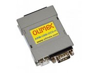
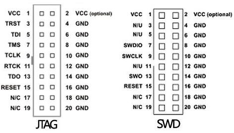

..  Copyright (c) 2014-present PlatformIO <contact@platformio.org>
    Licensed under the Apache License, Version 2.0 (the "License");
    you may not use this file except in compliance with the License.
    You may obtain a copy of the License at
       http://www.apache.org/licenses/LICENSE-2.0
    Unless required by applicable law or agreed to in writing, software
    distributed under the License is distributed on an "AS IS" BASIS,
    WITHOUT WARRANTIES OR CONDITIONS OF ANY KIND, either express or implied.
    See the License for the specific language governing permissions and
    limitations under the License.

.. _debugging_tool_olimex-arm-usb-ocd-h:

Olimex ARM-USB-OCD-H
====================

High-speed 3-IN-1 fast USB ARM/ESP32 JTAG, USB-to-RS232 virtual port and power
supply 5VDC device.
Official reference can be found `here <https://www.olimex.com/Products/ARM/JTAG/ARM-USB-OCD-H/?utm_source=platformio&utm_medium=docs>`__.

.. contents:: Contents
    :local:

Configuration
-------------

You can configure debugging tool using :ref:`projectconf_debug_tool` option in
:ref:`projectconf`:

.. code-block:: ini

    [env:myenv]
    platform = ...
    board = ...
    debug_tool = olimex-arm-usb-ocd-h

If you would like to use this tool for firmware uploading, please change
upload protocol:

.. code-block:: ini

    [env:myenv]
    platform = ...
    board = ...
    debug_tool = olimex-arm-usb-ocd-h
    upload_protocol = olimex-arm-usb-ocd-h

More options:

* :ref:`projectconf_section_env_debug`
* :ref:`projectconf_section_env_upload`

.. include:: _common_jtag_drivers.rst

Wiring Connections
------------------

.. list-table::
  :header-rows:  1

  * - Olimex ARM-USB-OCD-H JTAG 20-Pin Connector
    - Board JTAG Pin
    - Description
  * - 1
    - VCC
    - Positive Supply Voltage — Power supply for JTAG interface drivers
  * - 4
    - GND
    - Digital ground
  * - 5
    - TDI
    - Test Data In pin
  * - 7
    - TMS
    - Test Mode State pin
  * - 9
    - TCK
    - JTAG Return Test Clock
  * - 13
    - TDO
    - Test Data Out pin
  * - 3
    - RESET
    - Connect this pin to the (active low) reset input of the target CPU (EN for ESP32)

.. begin_platforms

Platforms
---------
.. list-table::
    :header-rows:  1

    * - Name
      - Description

    * - :ref:`platform_chipsalliance`
      - The CHIPS Alliance develops high-quality, open source hardware designs relevant to silicon devices and FPGAs.

    * - :ref:`platform_espressif32`
      - Espressif Systems is a privately held fabless semiconductor company. They provide wireless communications and Wi-Fi chips which are widely used in mobile devices and the Internet of Things applications.

    * - :ref:`platform_kendryte210`
      - Kendryte K210 is an AI capable RISCV64 dual core SoC.

    * - :ref:`platform_sifive`
      - SiFive brings the power of open source and software automation to the semiconductor industry, making it possible to develop new hardware faster and more affordably than ever before. 

Frameworks
----------
.. list-table::
    :header-rows:  1

    * - Name
      - Description

    * - :ref:`framework_arduino`
      - Arduino Wiring-based Framework allows writing cross-platform software to control devices attached to a wide range of Arduino boards to create all kinds of creative coding, interactive objects, spaces or physical experiences

    * - :ref:`framework_espidf`
      - ESP-IDF is the official development framework for the ESP32 and ESP32-S Series SoCs.

    * - :ref:`framework_freertos`
      - FreeRTOS is a real-time operating system kernel for embedded devices that has been ported to 40 microcontroller platforms

    * - :ref:`framework_freedom-e-sdk`
      - Open Source Software for Developing on the SiFive Freedom E Platform

    * - :ref:`framework_kendryte-freertos-sdk`
      - Kendryte SDK with FreeRTOS support

    * - :ref:`framework_kendryte-standalone-sdk`
      - Kendryte Standalone SDK without OS support

    * - :ref:`framework_simba`
      - Simba is an RTOS and build framework with aims to make embedded programming easy and portable

    * - :ref:`framework_wd-riscv-sdk`
      - The WD Firmware package contains firmware applications and Processor Support Package (PSP) for various cores, alongside demos which support all features

    * - :ref:`framework_zephyr`
      - The Zephyr Project is a scalable real-time operating system (RTOS) supporting multiple hardware architectures, optimized for resource constrained devices, and built with safety and security in mind

Boards
------

.. note::
    For more detailed ``board`` information please scroll tables below by horizontal.

.. list-table::
    :header-rows:  1

    * - Name
      - Platform
      - Debug
      - MCU
      - Frequency
      - Flash
      - RAM
    * - :ref:`board_espressif32_esp32cam`
      - :ref:`platform_espressif32`
      - External
      - ESP32
      - 240MHz
      - 4MB
      - 320KB
    * - :ref:`board_espressif32_alksesp32`
      - :ref:`platform_espressif32`
      - External
      - ESP32
      - 240MHz
      - 4MB
      - 320KB
    * - :ref:`board_espressif32_az-delivery-devkit-v4`
      - :ref:`platform_espressif32`
      - External
      - ESP32
      - 240MHz
      - 16MB
      - 520KB
    * - :ref:`board_espressif32_featheresp32`
      - :ref:`platform_espressif32`
      - External
      - ESP32
      - 240MHz
      - 4MB
      - 320KB
    * - :ref:`board_sifive_e310-arty`
      - :ref:`platform_sifive`
      - On-board
      - FE310
      - 450MHz
      - 16MB
      - 256MB
    * - :ref:`board_espressif32_briki_abc_esp32`
      - :ref:`platform_espressif32`
      - External
      - ESP32
      - 240MHz
      - 3.25MB
      - 320KB
    * - :ref:`board_espressif32_briki_mbc-wb_esp32`
      - :ref:`platform_espressif32`
      - External
      - ESP32
      - 240MHz
      - 3.25MB
      - 320KB
    * - :ref:`board_espressif32_d-duino-32`
      - :ref:`platform_espressif32`
      - External
      - ESP32
      - 240MHz
      - 4MB
      - 320KB
    * - :ref:`board_espressif32_esp32doit-devkit-v1`
      - :ref:`platform_espressif32`
      - External
      - ESP32
      - 240MHz
      - 4MB
      - 320KB
    * - :ref:`board_espressif32_pocket_32`
      - :ref:`platform_espressif32`
      - External
      - ESP32
      - 240MHz
      - 4MB
      - 320KB
    * - :ref:`board_espressif32_fm-devkit`
      - :ref:`platform_espressif32`
      - External
      - ESP32
      - 240MHz
      - 4MB
      - 320KB
    * - :ref:`board_espressif32_pico32`
      - :ref:`platform_espressif32`
      - External
      - ESP32
      - 240MHz
      - 4MB
      - 320KB
    * - :ref:`board_espressif32_esp32vn-iot-uno`
      - :ref:`platform_espressif32`
      - External
      - ESP32
      - 240MHz
      - 4MB
      - 320KB
    * - :ref:`board_espressif32_espectro32`
      - :ref:`platform_espressif32`
      - External
      - ESP32
      - 240MHz
      - 4MB
      - 320KB
    * - :ref:`board_espressif32_espino32`
      - :ref:`platform_espressif32`
      - External
      - ESP32
      - 240MHz
      - 4MB
      - 320KB
    * - :ref:`board_espressif32_esp-wrover-kit`
      - :ref:`platform_espressif32`
      - On-board
      - ESP32
      - 240MHz
      - 4MB
      - 320KB
    * - :ref:`board_espressif32_esp32dev`
      - :ref:`platform_espressif32`
      - External
      - ESP32
      - 240MHz
      - 4MB
      - 320KB
    * - :ref:`board_espressif32_firebeetle32`
      - :ref:`platform_espressif32`
      - External
      - ESP32
      - 240MHz
      - 4MB
      - 320KB
    * - :ref:`board_espressif32_frogboard`
      - :ref:`platform_espressif32`
      - External
      - ESP32
      - 240MHz
      - 4MB
      - 320KB
    * - :ref:`board_espressif32_heltec_wifi_lora_32`
      - :ref:`platform_espressif32`
      - External
      - ESP32
      - 240MHz
      - 4MB
      - 320KB
    * - :ref:`board_espressif32_heltec_wifi_lora_32_V2`
      - :ref:`platform_espressif32`
      - External
      - ESP32
      - 240MHz
      - 8MB
      - 320KB
    * - :ref:`board_espressif32_heltec_wireless_stick`
      - :ref:`platform_espressif32`
      - External
      - ESP32
      - 240MHz
      - 8MB
      - 320KB
    * - :ref:`board_espressif32_hornbill32dev`
      - :ref:`platform_espressif32`
      - External
      - ESP32
      - 240MHz
      - 4MB
      - 320KB
    * - :ref:`board_espressif32_hornbill32minima`
      - :ref:`platform_espressif32`
      - External
      - ESP32
      - 240MHz
      - 4MB
      - 320KB
    * - :ref:`board_espressif32_iotaap_magnolia`
      - :ref:`platform_espressif32`
      - External
      - ESP32
      - 240MHz
      - 4MB
      - 320KB
    * - :ref:`board_espressif32_mhetesp32devkit`
      - :ref:`platform_espressif32`
      - External
      - ESP32
      - 240MHz
      - 4MB
      - 320KB
    * - :ref:`board_espressif32_mhetesp32minikit`
      - :ref:`platform_espressif32`
      - External
      - ESP32
      - 240MHz
      - 4MB
      - 320KB
    * - :ref:`board_espressif32_node32s`
      - :ref:`platform_espressif32`
      - External
      - ESP32
      - 240MHz
      - 4MB
      - 320KB
    * - :ref:`board_espressif32_nodemcu-32s`
      - :ref:`platform_espressif32`
      - External
      - ESP32
      - 240MHz
      - 4MB
      - 320KB
    * - :ref:`board_espressif32_esp32-devkitlipo`
      - :ref:`platform_espressif32`
      - External
      - ESP32
      - 240MHz
      - 4MB
      - 320KB
    * - :ref:`board_espressif32_esp32-evb`
      - :ref:`platform_espressif32`
      - External
      - ESP32
      - 240MHz
      - 4MB
      - 320KB
    * - :ref:`board_espressif32_esp32-gateway`
      - :ref:`platform_espressif32`
      - External
      - ESP32
      - 240MHz
      - 4MB
      - 320KB
    * - :ref:`board_espressif32_lopy`
      - :ref:`platform_espressif32`
      - External
      - ESP32
      - 240MHz
      - 4MB
      - 320KB
    * - :ref:`board_espressif32_lopy4`
      - :ref:`platform_espressif32`
      - External
      - ESP32
      - 240MHz
      - 4MB
      - 1.25MB
    * - :ref:`board_chipsalliance_swervolf_nexys`
      - :ref:`platform_chipsalliance`
      - On-board
      - 
      - 320MHz
      - 16MB
      - 1.16MB
    * - :ref:`board_espressif32_sg-o_airMon`
      - :ref:`platform_espressif32`
      - External
      - ESP32
      - 240MHz
      - 4MB
      - 320KB
    * - :ref:`board_espressif32_wesp32`
      - :ref:`platform_espressif32`
      - External
      - ESP32
      - 240MHz
      - 4MB
      - 320KB
    * - :ref:`board_kendryte210_sipeed-maix-bit`
      - :ref:`platform_kendryte210`
      - External
      - K210
      - 400MHz
      - 16MB
      - 6MB
    * - :ref:`board_kendryte210_sipeed-maix-bit-mic`
      - :ref:`platform_kendryte210`
      - External
      - K210
      - 400MHz
      - 16MB
      - 6MB
    * - :ref:`board_kendryte210_sipeed-maix-go`
      - :ref:`platform_kendryte210`
      - External
      - K210
      - 400MHz
      - 16MB
      - 6MB
    * - :ref:`board_kendryte210_sipeed-maix-one-dock`
      - :ref:`platform_kendryte210`
      - External
      - K210
      - 400MHz
      - 16MB
      - 6MB
    * - :ref:`board_kendryte210_sipeed-maixduino`
      - :ref:`platform_kendryte210`
      - External
      - K210
      - 400MHz
      - 16MB
      - 6MB
    * - :ref:`board_kendryte210_sipeed-MF1`
      - :ref:`platform_kendryte210`
      - External
      - K210
      - 400MHz
      - 16MB
      - 6MB
    * - :ref:`board_espressif32_esp32thing`
      - :ref:`platform_espressif32`
      - External
      - ESP32
      - 240MHz
      - 4MB
      - 320KB
    * - :ref:`board_espressif32_sparkfun_lora_gateway_1-channel`
      - :ref:`platform_espressif32`
      - External
      - ESP32
      - 240MHz
      - 4MB
      - 320KB
    * - :ref:`board_espressif32_ttgo-lora32-v1`
      - :ref:`platform_espressif32`
      - External
      - ESP32
      - 240MHz
      - 4MB
      - 320KB
    * - :ref:`board_espressif32_ttgo-lora32-v2`
      - :ref:`platform_espressif32`
      - External
      - ESP32
      - 240MHz
      - 4MB
      - 320KB
    * - :ref:`board_espressif32_ttgo-t-beam`
      - :ref:`platform_espressif32`
      - External
      - ESP32
      - 240MHz
      - 4MB
      - 1.25MB
    * - :ref:`board_espressif32_ttgo-t1`
      - :ref:`platform_espressif32`
      - External
      - ESP32
      - 240MHz
      - 4MB
      - 320KB
    * - :ref:`board_espressif32_vintlabs-devkit-v1`
      - :ref:`platform_espressif32`
      - External
      - ESP32
      - 240MHz
      - 4MB
      - 320KB
    * - :ref:`board_espressif32_lolin_d32`
      - :ref:`platform_espressif32`
      - External
      - ESP32
      - 240MHz
      - 4MB
      - 320KB
    * - :ref:`board_espressif32_lolin_d32_pro`
      - :ref:`platform_espressif32`
      - External
      - ESP32
      - 240MHz
      - 4MB
      - 320KB
    * - :ref:`board_espressif32_lolin32`
      - :ref:`platform_espressif32`
      - External
      - ESP32
      - 240MHz
      - 4MB
      - 320KB
    * - :ref:`board_espressif32_wemos_d1_mini32`
      - :ref:`platform_espressif32`
      - External
      - ESP32
      - 240MHz
      - 4MB
      - 320KB
    * - :ref:`board_espressif32_wemosbat`
      - :ref:`platform_espressif32`
      - External
      - ESP32
      - 240MHz
      - 4MB
      - 320KB
    * - :ref:`board_espressif32_xinabox_cw02`
      - :ref:`platform_espressif32`
      - External
      - ESP32
      - 240MHz
      - 4MB
      - 320KB
    * - :ref:`board_espressif32_iotbusio`
      - :ref:`platform_espressif32`
      - External
      - ESP32
      - 240MHz
      - 4MB
      - 320KB
    * - :ref:`board_espressif32_iotbusproteus`
      - :ref:`platform_espressif32`
      - External
      - ESP32
      - 240MHz
      - 4MB
      - 320KB
