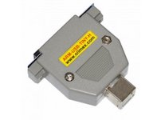

..  Copyright (c) 2014-present PlatformIO <contact@platformio.org>
    Licensed under the Apache License, Version 2.0 (the "License");
    you may not use this file except in compliance with the License.
    You may obtain a copy of the License at
       http://www.apache.org/licenses/LICENSE-2.0
    Unless required by applicable law or agreed to in writing, software
    distributed under the License is distributed on an "AS IS" BASIS,
    WITHOUT WARRANTIES OR CONDITIONS OF ANY KIND, either express or implied.
    See the License for the specific language governing permissions and
    limitations under the License.

.. _debugging_tool_olimex-arm-usb-tiny-h:

Olimex ARM-USB-TINY-H
=====================

Low-cost and high-speed ARM/ESP32 USB JTAG.
Official reference can be found `here <https://www.olimex.com/Products/ARM/JTAG/ARM-USB-TINY-H/?utm_source=platformio&utm_medium=docs>`__.

.. contents:: Contents
    :local:

Configuration
-------------

You can configure debugging tool using :ref:`projectconf_debug_tool` option in
:ref:`projectconf`:

.. code-block:: ini

    [env:myenv]
    platform = ...
    board = ...
    debug_tool = olimex-arm-usb-tiny-h

If you would like to use this tool for firmware uploading, please change
upload protocol:

.. code-block:: ini

    [env:myenv]
    platform = ...
    board = ...
    debug_tool = olimex-arm-usb-tiny-h
    upload_protocol = olimex-arm-usb-tiny-h

More options:

* :ref:`projectconf_section_env_debug`
* :ref:`projectconf_section_env_upload`

.. include:: _common_jtag_drivers.rst

Wiring Connections
------------------

.. image:: ../../_static/images/debug_probes/generic_jtag_swd_connector.jpg

.. list-table::
  :header-rows:  1

  * - Olimex ARM-USB-TINY-H JTAG 20-Pin Connector
    - Board JTAG Pin
    - Description
  * - 1
    - VCC
    - Positive Supply Voltage — Power supply for JTAG interface drivers
  * - 4
    - GND
    - Digital ground
  * - 5
    - TDI
    - Test Data In pin
  * - 7
    - TMS
    - Test Mode State pin
  * - 9
    - TCK
    - JTAG Return Test Clock
  * - 13
    - TDO
    - Test Data Out pin
  * - 3
    - RESET
    - Connect this pin to the (active low) reset input of the target CPU (EN for ESP32)

.. begin_platforms

Platforms
---------
.. list-table::
    :header-rows:  1

    * - Name
      - Description

    * - :ref:`platform_chipsalliance`
      - The CHIPS Alliance develops high-quality, open source hardware designs relevant to silicon devices and FPGAs.

    * - :ref:`platform_espressif32`
      - ESP32 is a series of low-cost, low-power system on a chip microcontrollers with integrated Wi-Fi and Bluetooth. ESP32 integrates an antenna switch, RF balun, power amplifier, low-noise receive amplifier, filters, and power management modules.

    * - :ref:`platform_openhw`
      - OpenHW Group is a not-for-profit, global organization that provides an infrastructure for hosting high quality open-source HW developments in line with industry best practices. The OpenHW CV32E40P RISC-V core is the first open-source core for high-volume chips verified with the state-of-the-art process required for high-integrity, commercial SoCs.

    * - :ref:`platform_sifive`
      - SiFive brings the power of open source and software automation to the semiconductor industry, making it possible to develop new hardware faster and more affordably than ever before. 

Frameworks
----------
.. list-table::
    :header-rows:  1

    * - Name
      - Description

    * - :ref:`framework_arduino`
      - Arduino Wiring-based Framework allows writing cross-platform software to control devices attached to a wide range of Arduino boards to create all kinds of creative coding, interactive objects, spaces or physical experiences.

    * - :ref:`framework_espidf`
      - Espressif IoT Development Framework. Official development framework for ESP32 chip

    * - :ref:`framework_freedom-e-sdk`
      - Open Source Software for Developing on the SiFive Freedom E Platform

    * - :ref:`framework_freertos`
      - FreeRTOS is a real-time operating system kernel for embedded devices that has been ported to 40 microcontroller platforms.

    * - :ref:`framework_pulp-runtime`
      - Runtime Environment for Parallel Ultra Low Power platform

    * - :ref:`framework_pulp-sdk`
      - Software Development Kit for Parallel Ultra Low Power platform

    * - :ref:`framework_wd-riscv-sdk`
      - The WD Firmware package contains Firmware applications and Processor Support Package (PSP) for various cores, alongside demos which support all features.

    * - :ref:`framework_zephyr`
      - Zephyr is a new generation, scalable, optimized, secure RTOS for multiple hardware architectures

Boards
------

.. note::
    For more detailed ``board`` information please scroll tables below by horizontal.

.. list-table::
    :header-rows:  1

    * - Name
      - Platform
      - Debug
      - MCU
      - Frequency
      - Flash
      - RAM
    * - :ref:`board_espressif32_4d_systems_esp32s3_gen4_r8n16`
      - :ref:`platform_espressif32`
      - External
      - ESP32S3
      - 240MHz
      - 16MB
      - 320KB
    * - :ref:`board_espressif32_esp32cam`
      - :ref:`platform_espressif32`
      - External
      - ESP32
      - 240MHz
      - 4MB
      - 320KB
    * - :ref:`board_espressif32_alksesp32`
      - :ref:`platform_espressif32`
      - External
      - ESP32
      - 240MHz
      - 4MB
      - 320KB
    * - :ref:`board_espressif32_az-delivery-devkit-v4`
      - :ref:`platform_espressif32`
      - External
      - ESP32
      - 240MHz
      - 4MB
      - 520KB
    * - :ref:`board_espressif32_featheresp32`
      - :ref:`platform_espressif32`
      - External
      - ESP32
      - 240MHz
      - 4MB
      - 320KB
    * - :ref:`board_espressif32_featheresp32-s2`
      - :ref:`platform_espressif32`
      - External
      - ESP32S2
      - 240MHz
      - 4MB
      - 320KB
    * - :ref:`board_espressif32_adafruit_feather_esp32_v2`
      - :ref:`platform_espressif32`
      - External
      - ESP32
      - 240MHz
      - 8MB
      - 320KB
    * - :ref:`board_espressif32_adafruit_feather_esp32s2`
      - :ref:`platform_espressif32`
      - External
      - ESP32S2
      - 240MHz
      - 4MB
      - 320KB
    * - :ref:`board_espressif32_adafruit_feather_esp32s2_reversetft`
      - :ref:`platform_espressif32`
      - External
      - ESP32S2
      - 240MHz
      - 4MB
      - 320KB
    * - :ref:`board_espressif32_adafruit_feather_esp32s2_tft`
      - :ref:`platform_espressif32`
      - External
      - ESP32S2
      - 240MHz
      - 4MB
      - 320KB
    * - :ref:`board_espressif32_adafruit_feather_esp32s3`
      - :ref:`platform_espressif32`
      - External
      - ESP32S3
      - 240MHz
      - 4MB
      - 320KB
    * - :ref:`board_espressif32_adafruit_feather_esp32s3_nopsram`
      - :ref:`platform_espressif32`
      - External
      - ESP32S3
      - 240MHz
      - 8MB
      - 320KB
    * - :ref:`board_espressif32_adafruit_feather_esp32s3_reversetft`
      - :ref:`platform_espressif32`
      - External
      - ESP32S3
      - 240MHz
      - 4MB
      - 320KB
    * - :ref:`board_espressif32_adafruit_feather_esp32s3_tft`
      - :ref:`platform_espressif32`
      - External
      - ESP32S3
      - 240MHz
      - 4MB
      - 320KB
    * - :ref:`board_espressif32_adafruit_funhouse_esp32s2`
      - :ref:`platform_espressif32`
      - External
      - ESP32S2
      - 240MHz
      - 4MB
      - 320KB
    * - :ref:`board_espressif32_adafruit_itsybitsy_esp32`
      - :ref:`platform_espressif32`
      - External
      - ESP32
      - 240MHz
      - 8MB
      - 320KB
    * - :ref:`board_espressif32_adafruit_magtag29_esp32s2`
      - :ref:`platform_espressif32`
      - External
      - ESP32S2
      - 240MHz
      - 4MB
      - 320KB
    * - :ref:`board_espressif32_adafruit_matrixportal_esp32s3`
      - :ref:`platform_espressif32`
      - External
      - ESP32S3
      - 240MHz
      - 8MB
      - 320KB
    * - :ref:`board_espressif32_adafruit_metro_esp32s2`
      - :ref:`platform_espressif32`
      - External
      - ESP32S2
      - 240MHz
      - 4MB
      - 320KB
    * - :ref:`board_espressif32_adafruit_metro_esp32s3`
      - :ref:`platform_espressif32`
      - External
      - ESP32S3
      - 240MHz
      - 16MB
      - 320KB
    * - :ref:`board_espressif32_adafruit_qtpy_esp32`
      - :ref:`platform_espressif32`
      - External
      - ESP32
      - 240MHz
      - 8MB
      - 320KB
    * - :ref:`board_espressif32_adafruit_qtpy_esp32c3`
      - :ref:`platform_espressif32`
      - External
      - ESP32C3
      - 160MHz
      - 4MB
      - 320KB
    * - :ref:`board_espressif32_adafruit_qtpy_esp32s2`
      - :ref:`platform_espressif32`
      - External
      - ESP32S2
      - 240MHz
      - 4MB
      - 320KB
    * - :ref:`board_espressif32_adafruit_qtpy_esp32s3_n4r2`
      - :ref:`platform_espressif32`
      - External
      - ESP32S3
      - 240MHz
      - 4MB
      - 320KB
    * - :ref:`board_espressif32_adafruit_qtpy_esp32s3_nopsram`
      - :ref:`platform_espressif32`
      - External
      - ESP32S3
      - 240MHz
      - 8MB
      - 320KB
    * - :ref:`board_espressif32_adafruit_qualia_s3_rgb666`
      - :ref:`platform_espressif32`
      - External
      - ESP32S3
      - 240MHz
      - 16MB
      - 320KB
    * - :ref:`board_espressif32_adafruit_camera_esp32s3`
      - :ref:`platform_espressif32`
      - External
      - ESP32S3
      - 240MHz
      - 4MB
      - 320KB
    * - :ref:`board_espressif32_esp32-c3-m1i-kit`
      - :ref:`platform_espressif32`
      - External
      - ESP32C3
      - 160MHz
      - 4MB
      - 320KB
    * - :ref:`board_espressif32_nodemcu-32s2`
      - :ref:`platform_espressif32`
      - External
      - ESP32S2
      - 240MHz
      - 4MB
      - 320KB
    * - :ref:`board_espressif32_airm2m_core_esp32c3`
      - :ref:`platform_espressif32`
      - External
      - ESP32C3
      - 160MHz
      - 4MB
      - 320KB
    * - :ref:`board_espressif32_arduino_nano_esp32`
      - :ref:`platform_espressif32`
      - External
      - ESP32S3
      - 240MHz
      - 16MB
      - 320KB
    * - :ref:`board_espressif32_atd147_s3`
      - :ref:`platform_espressif32`
      - External
      - ESP32S3
      - 240MHz
      - 8MB
      - 320KB
    * - :ref:`board_espressif32_ioxesp32`
      - :ref:`platform_espressif32`
      - External
      - ESP32
      - 240MHz
      - 4MB
      - 320KB
    * - :ref:`board_espressif32_ioxesp32ps`
      - :ref:`platform_espressif32`
      - External
      - ESP32
      - 240MHz
      - 4MB
      - 320KB
    * - :ref:`board_sifive_e310-arty`
      - :ref:`platform_sifive`
      - On-board
      - FE310
      - 450MHz
      - 16MB
      - 256MB
    * - :ref:`board_espressif32_aventen_s3_sync`
      - :ref:`platform_espressif32`
      - External
      - ESP32S3
      - 240MHz
      - 16MB
      - 320KB
    * - :ref:`board_espressif32_bpi_leaf_s3`
      - :ref:`platform_espressif32`
      - External
      - ESP32S3
      - 240MHz
      - 8MB
      - 320KB
    * - :ref:`board_espressif32_wifiduino32s3`
      - :ref:`platform_espressif32`
      - External
      - ESP32S3
      - 240MHz
      - 8MB
      - 320KB
    * - :ref:`board_espressif32_wifiduino32c3`
      - :ref:`platform_espressif32`
      - External
      - ESP32C3
      - 160MHz
      - 4MB
      - 320KB
    * - :ref:`board_espressif32_connaxio_espoir`
      - :ref:`platform_espressif32`
      - External
      - ESP32
      - 240MHz
      - 4MB
      - 320KB
    * - :ref:`board_espressif32_cytron_maker_feather_aiot_s3`
      - :ref:`platform_espressif32`
      - External
      - ESP32S3
      - 240MHz
      - 8MB
      - 320KB
    * - :ref:`board_espressif32_d-duino-32`
      - :ref:`platform_espressif32`
      - External
      - ESP32
      - 240MHz
      - 4MB
      - 320KB
    * - :ref:`board_espressif32_dfrobot_beetle_esp32c3`
      - :ref:`platform_espressif32`
      - External
      - ESP32C3
      - 160MHz
      - 4MB
      - 320KB
    * - :ref:`board_espressif32_dfrobot_firebeetle2_esp32e`
      - :ref:`platform_espressif32`
      - External
      - ESP32
      - 240MHz
      - 4MB
      - 320KB
    * - :ref:`board_espressif32_dfrobot_firebeetle2_esp32s3`
      - :ref:`platform_espressif32`
      - External
      - ESP32S3
      - 240MHz
      - 4MB
      - 320KB
    * - :ref:`board_espressif32_dfrobot_romeo_esp32s3`
      - :ref:`platform_espressif32`
      - External
      - ESP32S3
      - 240MHz
      - 16MB
      - 320KB
    * - :ref:`board_espressif32_esp32doit-devkit-v1`
      - :ref:`platform_espressif32`
      - External
      - ESP32
      - 240MHz
      - 4MB
      - 320KB
    * - :ref:`board_espressif32_esp32doit-espduino`
      - :ref:`platform_espressif32`
      - External
      - ESP32
      - 240MHz
      - 4MB
      - 320KB
    * - :ref:`board_espressif32_deneyapkart`
      - :ref:`platform_espressif32`
      - External
      - ESP32
      - 240MHz
      - 4MB
      - 320KB
    * - :ref:`board_espressif32_deneyapkart1A`
      - :ref:`platform_espressif32`
      - External
      - ESP32
      - 240MHz
      - 4MB
      - 320KB
    * - :ref:`board_espressif32_deneyapkart1Av2`
      - :ref:`platform_espressif32`
      - External
      - ESP32S3
      - 240MHz
      - 4MB
      - 320KB
    * - :ref:`board_espressif32_deneyapkartg`
      - :ref:`platform_espressif32`
      - External
      - ESP32C3
      - 160MHz
      - 4MB
      - 320KB
    * - :ref:`board_espressif32_deneyapmini`
      - :ref:`platform_espressif32`
      - External
      - ESP32S2
      - 240MHz
      - 4MB
      - 320KB
    * - :ref:`board_espressif32_deneyapminiv2`
      - :ref:`platform_espressif32`
      - External
      - ESP32S2
      - 240MHz
      - 4MB
      - 320KB
    * - :ref:`board_espressif32_minimain_esp32s2`
      - :ref:`platform_espressif32`
      - External
      - ESP32S2
      - 240MHz
      - 4MB
      - 320KB
    * - :ref:`board_openhw_nexys_a7`
      - :ref:`platform_openhw`
      - On-board
      - 
      - 320MHz
      - 16MB
      - 1.16MB
    * - :ref:`board_espressif32_pocket_32`
      - :ref:`platform_espressif32`
      - External
      - ESP32
      - 240MHz
      - 4MB
      - 320KB
    * - :ref:`board_espressif32_fm-devkit`
      - :ref:`platform_espressif32`
      - External
      - ESP32
      - 240MHz
      - 4MB
      - 320KB
    * - :ref:`board_espressif32_pico32`
      - :ref:`platform_espressif32`
      - External
      - ESP32
      - 240MHz
      - 4MB
      - 320KB
    * - :ref:`board_espressif32_esp32s3_powerfeather`
      - :ref:`platform_espressif32`
      - External
      - ESP32S3
      - 240MHz
      - 8MB
      - 320KB
    * - :ref:`board_espressif32_esp32s3camlcd`
      - :ref:`platform_espressif32`
      - External
      - ESP32S3
      - 240MHz
      - 8MB
      - 320KB
    * - :ref:`board_espressif32_esp32vn-iot-uno`
      - :ref:`platform_espressif32`
      - External
      - ESP32
      - 240MHz
      - 4MB
      - 320KB
    * - :ref:`board_espressif32_espectro32`
      - :ref:`platform_espressif32`
      - External
      - ESP32
      - 240MHz
      - 4MB
      - 320KB
    * - :ref:`board_espressif32_espino32`
      - :ref:`platform_espressif32`
      - External
      - ESP32
      - 240MHz
      - 4MB
      - 320KB
    * - :ref:`board_espressif32_atmegazero_esp32s2`
      - :ref:`platform_espressif32`
      - External
      - ESP32S2
      - 240MHz
      - 16MB
      - 320KB
    * - :ref:`board_espressif32_esp-wrover-kit`
      - :ref:`platform_espressif32`
      - On-board
      - ESP32
      - 240MHz
      - 4MB
      - 320KB
    * - :ref:`board_espressif32_esp32dev`
      - :ref:`platform_espressif32`
      - External
      - ESP32
      - 240MHz
      - 4MB
      - 320KB
    * - :ref:`board_espressif32_esp32-c3-devkitc-02`
      - :ref:`platform_espressif32`
      - External
      - ESP32C3
      - 160MHz
      - 4MB
      - 320KB
    * - :ref:`board_espressif32_esp32-c3-devkitm-1`
      - :ref:`platform_espressif32`
      - External
      - ESP32C3
      - 160MHz
      - 4MB
      - 320KB
    * - :ref:`board_espressif32_esp32-c6-devkitm-1`
      - :ref:`platform_espressif32`
      - External
      - ESP32C6
      - 160MHz
      - 4MB
      - 320KB
    * - :ref:`board_espressif32_esp32-s2-kaluga-1`
      - :ref:`platform_espressif32`
      - On-board
      - ESP32S2
      - 240MHz
      - 4MB
      - 320KB
    * - :ref:`board_espressif32_esp32-s2-saola-1`
      - :ref:`platform_espressif32`
      - External
      - ESP32S2
      - 240MHz
      - 4MB
      - 320KB
    * - :ref:`board_espressif32_esp32s3box`
      - :ref:`platform_espressif32`
      - External
      - ESP32S3
      - 240MHz
      - 16MB
      - 320KB
    * - :ref:`board_espressif32_esp32-s3-devkitc-1`
      - :ref:`platform_espressif32`
      - On-board
      - ESP32S3
      - 240MHz
      - 8MB
      - 320KB
    * - :ref:`board_espressif32_esp32-s3-devkitm-1`
      - :ref:`platform_espressif32`
      - On-board
      - ESP32S3
      - 240MHz
      - 8MB
      - 320KB
    * - :ref:`board_espressif32_esp32s3usbotg`
      - :ref:`platform_espressif32`
      - On-board
      - ESP32S3
      - 240MHz
      - 8MB
      - 320KB
    * - :ref:`board_espressif32_firebeetle32`
      - :ref:`platform_espressif32`
      - External
      - ESP32
      - 240MHz
      - 16MB
      - 520KB
    * - :ref:`board_espressif32_franzininho_wifi_esp32s2`
      - :ref:`platform_espressif32`
      - External
      - ESP32S2
      - 240MHz
      - 4MB
      - 320KB
    * - :ref:`board_espressif32_esp32-s2-franzininho`
      - :ref:`platform_espressif32`
      - External
      - ESP32S2
      - 240MHz
      - 4MB
      - 320KB
    * - :ref:`board_espressif32_franzininho_wifi_msc_esp32s2`
      - :ref:`platform_espressif32`
      - External
      - ESP32S2
      - 240MHz
      - 4MB
      - 320KB
    * - :ref:`board_espressif32_freenove_esp32_s3_wroom`
      - :ref:`platform_espressif32`
      - On-board
      - ESP32S3
      - 240MHz
      - 8MB
      - 320KB
    * - :ref:`board_espressif32_freenove_esp32_wrover`
      - :ref:`platform_espressif32`
      - External
      - ESP32
      - 240MHz
      - 4MB
      - 320KB
    * - :ref:`board_espressif32_frogboard`
      - :ref:`platform_espressif32`
      - External
      - ESP32
      - 240MHz
      - 4MB
      - 320KB
    * - :ref:`board_espressif32_honeylemon`
      - :ref:`platform_espressif32`
      - External
      - ESP32
      - 240MHz
      - 4MB
      - 320KB
    * - :ref:`board_espressif32_heltec_wifi_kit_32_V3`
      - :ref:`platform_espressif32`
      - External
      - ESP32S3
      - 240MHz
      - 8MB
      - 320KB
    * - :ref:`board_espressif32_heltec_wifi_lora_32`
      - :ref:`platform_espressif32`
      - External
      - ESP32
      - 240MHz
      - 4MB
      - 320KB
    * - :ref:`board_espressif32_heltec_wifi_lora_32_V2`
      - :ref:`platform_espressif32`
      - External
      - ESP32
      - 240MHz
      - 8MB
      - 320KB
    * - :ref:`board_espressif32_heltec_wifi_lora_32_V3`
      - :ref:`platform_espressif32`
      - External
      - ESP32S3
      - 240MHz
      - 8MB
      - 320KB
    * - :ref:`board_espressif32_heltec_wireless_stick`
      - :ref:`platform_espressif32`
      - External
      - ESP32
      - 240MHz
      - 8MB
      - 320KB
    * - :ref:`board_espressif32_hornbill32dev`
      - :ref:`platform_espressif32`
      - External
      - ESP32
      - 240MHz
      - 4MB
      - 320KB
    * - :ref:`board_espressif32_hornbill32minima`
      - :ref:`platform_espressif32`
      - External
      - ESP32
      - 240MHz
      - 4MB
      - 320KB
    * - :ref:`board_espressif32_iotaap_magnolia`
      - :ref:`platform_espressif32`
      - External
      - ESP32
      - 240MHz
      - 4MB
      - 320KB
    * - :ref:`board_espressif32_nebulas3`
      - :ref:`platform_espressif32`
      - External
      - ESP32S3
      - 240MHz
      - 4MB
      - 320KB
    * - :ref:`board_espressif32_sensesiot_weizen`
      - :ref:`platform_espressif32`
      - External
      - ESP32
      - 240MHz
      - 4MB
      - 320KB
    * - :ref:`board_espressif32_lilka_v2`
      - :ref:`platform_espressif32`
      - External
      - ESP32S3
      - 240MHz
      - 16MB
      - 320KB
    * - :ref:`board_espressif32_lilygo-t-display-s3`
      - :ref:`platform_espressif32`
      - External
      - ESP32S3
      - 240MHz
      - 16MB
      - 320KB
    * - :ref:`board_espressif32_lilygo-t3-s3`
      - :ref:`platform_espressif32`
      - External
      - ESP32S3
      - 240MHz
      - 4MB
      - 320KB
    * - :ref:`board_espressif32_lionbit`
      - :ref:`platform_espressif32`
      - External
      - ESP32
      - 240MHz
      - 4MB
      - 320KB
    * - :ref:`board_espressif32_lionbits3`
      - :ref:`platform_espressif32`
      - On-board
      - ESP32S3
      - 240MHz
      - 4MB
      - 320KB
    * - :ref:`board_espressif32_m5stack-atoms3`
      - :ref:`platform_espressif32`
      - External
      - ESP32S3
      - 240MHz
      - 8MB
      - 320KB
    * - :ref:`board_espressif32_m5stack-cores3`
      - :ref:`platform_espressif32`
      - External
      - ESP32S3
      - 240MHz
      - 16MB
      - 320KB
    * - :ref:`board_espressif32_m5stack-stamps3`
      - :ref:`platform_espressif32`
      - External
      - ESP32S3
      - 240MHz
      - 8MB
      - 320KB
    * - :ref:`board_espressif32_mhetesp32devkit`
      - :ref:`platform_espressif32`
      - External
      - ESP32
      - 240MHz
      - 4MB
      - 320KB
    * - :ref:`board_espressif32_mhetesp32minikit`
      - :ref:`platform_espressif32`
      - External
      - ESP32
      - 240MHz
      - 4MB
      - 320KB
    * - :ref:`board_espressif32_kb32-ft`
      - :ref:`platform_espressif32`
      - External
      - ESP32
      - 240MHz
      - 4MB
      - 320KB
    * - :ref:`board_espressif32_motorgo_mini_1`
      - :ref:`platform_espressif32`
      - External
      - ESP32S3
      - 240MHz
      - 4MB
      - 320KB
    * - :ref:`board_espressif32_redpill_esp32s3`
      - :ref:`platform_espressif32`
      - External
      - ESP32S3
      - 240MHz
      - 8MB
      - 320KB
    * - :ref:`board_espressif32_namino_arancio`
      - :ref:`platform_espressif32`
      - External
      - ESP32S3
      - 240MHz
      - 4MB
      - 320KB
    * - :ref:`board_espressif32_namino_rosso`
      - :ref:`platform_espressif32`
      - External
      - ESP32S3
      - 240MHz
      - 4MB
      - 320KB
    * - :ref:`board_espressif32_node32s`
      - :ref:`platform_espressif32`
      - External
      - ESP32
      - 240MHz
      - 4MB
      - 320KB
    * - :ref:`board_espressif32_nodemcu-32s`
      - :ref:`platform_espressif32`
      - External
      - ESP32
      - 240MHz
      - 4MB
      - 320KB
    * - :ref:`board_espressif32_esp32-devkitlipo`
      - :ref:`platform_espressif32`
      - External
      - ESP32
      - 240MHz
      - 4MB
      - 320KB
    * - :ref:`board_espressif32_esp32-evb`
      - :ref:`platform_espressif32`
      - External
      - ESP32
      - 240MHz
      - 4MB
      - 320KB
    * - :ref:`board_espressif32_esp32-gateway`
      - :ref:`platform_espressif32`
      - External
      - ESP32
      - 240MHz
      - 4MB
      - 320KB
    * - :ref:`board_espressif32_lopy`
      - :ref:`platform_espressif32`
      - External
      - ESP32
      - 240MHz
      - 4MB
      - 320KB
    * - :ref:`board_espressif32_lopy4`
      - :ref:`platform_espressif32`
      - External
      - ESP32
      - 240MHz
      - 4MB
      - 1.25MB
    * - :ref:`board_espressif32_wipy3`
      - :ref:`platform_espressif32`
      - External
      - ESP32
      - 240MHz
      - 4MB
      - 1.25MB
    * - :ref:`board_chipsalliance_swervolf_nexys`
      - :ref:`platform_chipsalliance`
      - On-board
      - 
      - 320MHz
      - 16MB
      - 1.16MB
    * - :ref:`board_espressif32_rymcu-esp32-c3-devkitm-1`
      - :ref:`platform_espressif32`
      - External
      - ESP32C3
      - 160MHz
      - 4MB
      - 320KB
    * - :ref:`board_espressif32_rymcu-esp32-devkitc`
      - :ref:`platform_espressif32`
      - External
      - ESP32
      - 240MHz
      - 4MB
      - 320KB
    * - :ref:`board_espressif32_rymcu-esp32-s3-devkitc-1`
      - :ref:`platform_espressif32`
      - On-board
      - ESP32S3
      - 240MHz
      - 8MB
      - 320KB
    * - :ref:`board_espressif32_sg-o_airMon`
      - :ref:`platform_espressif32`
      - External
      - ESP32
      - 240MHz
      - 4MB
      - 320KB
    * - :ref:`board_espressif32_watchy`
      - :ref:`platform_espressif32`
      - External
      - ESP32
      - 240MHz
      - 4MB
      - 320KB
    * - :ref:`board_espressif32_edgebox-esp-100`
      - :ref:`platform_espressif32`
      - External
      - ESP32S3
      - 240MHz
      - 4MB
      - 320KB
    * - :ref:`board_espressif32_seeed_xiao_esp32c3`
      - :ref:`platform_espressif32`
      - External
      - ESP32C3
      - 160MHz
      - 4MB
      - 320KB
    * - :ref:`board_espressif32_seeed_xiao_esp32s3`
      - :ref:`platform_espressif32`
      - External
      - ESP32S3
      - 240MHz
      - 8MB
      - 320KB
    * - :ref:`board_espressif32_wesp32`
      - :ref:`platform_espressif32`
      - External
      - ESP32
      - 240MHz
      - 4MB
      - 320KB
    * - :ref:`board_espressif32_bee_data_logger`
      - :ref:`platform_espressif32`
      - External
      - ESP32S3
      - 240MHz
      - 8MB
      - 320KB
    * - :ref:`board_espressif32_bee_motion`
      - :ref:`platform_espressif32`
      - External
      - ESP32S2
      - 240MHz
      - 4MB
      - 320KB
    * - :ref:`board_espressif32_bee_motion_mini`
      - :ref:`platform_espressif32`
      - External
      - ESP32C3
      - 160MHz
      - 4MB
      - 320KB
    * - :ref:`board_espressif32_bee_motion_s3`
      - :ref:`platform_espressif32`
      - External
      - ESP32S3
      - 240MHz
      - 8MB
      - 320KB
    * - :ref:`board_espressif32_bee_s3`
      - :ref:`platform_espressif32`
      - External
      - ESP32S3
      - 240MHz
      - 8MB
      - 320KB
    * - :ref:`board_espressif32_sparkfun_esp32_iot_redboard`
      - :ref:`platform_espressif32`
      - External
      - ESP32
      - 240MHz
      - 4MB
      - 320KB
    * - :ref:`board_espressif32_esp32thing`
      - :ref:`platform_espressif32`
      - External
      - ESP32
      - 240MHz
      - 4MB
      - 320KB
    * - :ref:`board_espressif32_esp32thing_plus`
      - :ref:`platform_espressif32`
      - External
      - ESP32
      - 240MHz
      - 16MB
      - 320KB
    * - :ref:`board_espressif32_sparkfun_esp32s2_thing_plus_c`
      - :ref:`platform_espressif32`
      - External
      - ESP32
      - 240MHz
      - 16MB
      - 320KB
    * - :ref:`board_espressif32_sparkfun_esp32s2_thing_plus`
      - :ref:`platform_espressif32`
      - External
      - ESP32S2
      - 240MHz
      - 4MB
      - 320KB
    * - :ref:`board_espressif32_sparkfun_lora_gateway_1-channel`
      - :ref:`platform_espressif32`
      - External
      - ESP32
      - 240MHz
      - 4MB
      - 320KB
    * - :ref:`board_espressif32_dpu_esp32`
      - :ref:`platform_espressif32`
      - External
      - ESP32
      - 240MHz
      - 8MB
      - 320KB
    * - :ref:`board_espressif32_tamc_termod_s3`
      - :ref:`platform_espressif32`
      - External
      - ESP32S3
      - 240MHz
      - 8MB
      - 320KB
    * - :ref:`board_espressif32_ttgo-lora32-v1`
      - :ref:`platform_espressif32`
      - External
      - ESP32
      - 240MHz
      - 4MB
      - 320KB
    * - :ref:`board_espressif32_ttgo-lora32-v2`
      - :ref:`platform_espressif32`
      - External
      - ESP32
      - 240MHz
      - 4MB
      - 320KB
    * - :ref:`board_espressif32_ttgo-lora32-v21`
      - :ref:`platform_espressif32`
      - External
      - ESP32
      - 240MHz
      - 4MB
      - 320KB
    * - :ref:`board_espressif32_ttgo-t-beam`
      - :ref:`platform_espressif32`
      - External
      - ESP32
      - 240MHz
      - 4MB
      - 1.25MB
    * - :ref:`board_espressif32_ttgo-t-oi-plus`
      - :ref:`platform_espressif32`
      - External
      - ESP32C3
      - 160MHz
      - 4MB
      - 320KB
    * - :ref:`board_espressif32_ttgo-t1`
      - :ref:`platform_espressif32`
      - External
      - ESP32
      - 240MHz
      - 4MB
      - 320KB
    * - :ref:`board_espressif32_ttgo-t7-v14-mini32`
      - :ref:`platform_espressif32`
      - External
      - ESP32
      - 240MHz
      - 4MB
      - 1.25MB
    * - :ref:`board_espressif32_trueverit-iot-driver`
      - :ref:`platform_espressif32`
      - External
      - ESP32
      - 240MHz
      - 4MB
      - 320KB
    * - :ref:`board_espressif32_trueverit-iot-driver-mk2`
      - :ref:`platform_espressif32`
      - External
      - ESP32
      - 240MHz
      - 4MB
      - 320KB
    * - :ref:`board_espressif32_trueverit-iot-driver-mk3`
      - :ref:`platform_espressif32`
      - External
      - ESP32
      - 240MHz
      - 4MB
      - 320KB
    * - :ref:`board_espressif32_um_feathers2`
      - :ref:`platform_espressif32`
      - External
      - ESP32S2
      - 240MHz
      - 16MB
      - 320KB
    * - :ref:`board_espressif32_um_feathers2_neo`
      - :ref:`platform_espressif32`
      - External
      - ESP32S2
      - 240MHz
      - 4MB
      - 320KB
    * - :ref:`board_espressif32_um_feathers3`
      - :ref:`platform_espressif32`
      - External
      - ESP32S3
      - 240MHz
      - 16MB
      - 320KB
    * - :ref:`board_espressif32_um_nanos3`
      - :ref:`platform_espressif32`
      - External
      - ESP32S3
      - 240MHz
      - 8MB
      - 320KB
    * - :ref:`board_espressif32_um_pros3`
      - :ref:`platform_espressif32`
      - External
      - ESP32S3
      - 240MHz
      - 16MB
      - 320KB
    * - :ref:`board_espressif32_um_rmp`
      - :ref:`platform_espressif32`
      - External
      - ESP32S2
      - 240MHz
      - 4MB
      - 320KB
    * - :ref:`board_espressif32_um_tinys2`
      - :ref:`platform_espressif32`
      - External
      - ESP32S2
      - 240MHz
      - 4MB
      - 320KB
    * - :ref:`board_espressif32_um_tinys3`
      - :ref:`platform_espressif32`
      - External
      - ESP32S3
      - 240MHz
      - 8MB
      - 320KB
    * - :ref:`board_espressif32_valtrack_v4_mfw_esp32_c3`
      - :ref:`platform_espressif32`
      - External
      - ESP32C3
      - 160MHz
      - 4MB
      - 320KB
    * - :ref:`board_espressif32_valtrack_v4_vts_esp32_c3`
      - :ref:`platform_espressif32`
      - External
      - ESP32C3
      - 160MHz
      - 4MB
      - 320KB
    * - :ref:`board_espressif32_vintlabs-devkit-v1`
      - :ref:`platform_espressif32`
      - External
      - ESP32
      - 240MHz
      - 4MB
      - 320KB
    * - :ref:`board_espressif32_wemos_d1_mini32`
      - :ref:`platform_espressif32`
      - External
      - ESP32
      - 240MHz
      - 4MB
      - 320KB
    * - :ref:`board_espressif32_wemos_d1_uno32`
      - :ref:`platform_espressif32`
      - External
      - ESP32
      - 240MHz
      - 4MB
      - 320KB
    * - :ref:`board_espressif32_lolin_c3_mini`
      - :ref:`platform_espressif32`
      - External
      - ESP32C3
      - 160MHz
      - 4MB
      - 320KB
    * - :ref:`board_espressif32_lolin_d32`
      - :ref:`platform_espressif32`
      - External
      - ESP32
      - 240MHz
      - 4MB
      - 320KB
    * - :ref:`board_espressif32_lolin_d32_pro`
      - :ref:`platform_espressif32`
      - External
      - ESP32
      - 240MHz
      - 4MB
      - 320KB
    * - :ref:`board_espressif32_lolin_s2_mini`
      - :ref:`platform_espressif32`
      - External
      - ESP32S2
      - 240MHz
      - 4MB
      - 320KB
    * - :ref:`board_espressif32_lolin_s2_pico`
      - :ref:`platform_espressif32`
      - External
      - ESP32S2
      - 240MHz
      - 4MB
      - 320KB
    * - :ref:`board_espressif32_lolin_s3`
      - :ref:`platform_espressif32`
      - External
      - ESP32S3
      - 240MHz
      - 16MB
      - 320KB
    * - :ref:`board_espressif32_lolin_s3_mini`
      - :ref:`platform_espressif32`
      - External
      - ESP32S3
      - 240MHz
      - 4MB
      - 320KB
    * - :ref:`board_espressif32_lolin_s3_pro`
      - :ref:`platform_espressif32`
      - External
      - ESP32S3
      - 240MHz
      - 16MB
      - 320KB
    * - :ref:`board_espressif32_lolin32`
      - :ref:`platform_espressif32`
      - External
      - ESP32
      - 240MHz
      - 4MB
      - 320KB
    * - :ref:`board_espressif32_lolin32_lite`
      - :ref:`platform_espressif32`
      - External
      - ESP32
      - 240MHz
      - 4MB
      - 320KB
    * - :ref:`board_espressif32_weactstudio_esp32c3coreboard`
      - :ref:`platform_espressif32`
      - External
      - ESP32C3
      - 160MHz
      - 384KB
      - 400KB
    * - :ref:`board_espressif32_wemosbat`
      - :ref:`platform_espressif32`
      - External
      - ESP32
      - 240MHz
      - 4MB
      - 320KB
    * - :ref:`board_espressif32_wt32-eth01`
      - :ref:`platform_espressif32`
      - External
      - ESP32
      - 240MHz
      - 4MB
      - 320KB
    * - :ref:`board_espressif32_xinabox_cw02`
      - :ref:`platform_espressif32`
      - External
      - ESP32
      - 240MHz
      - 4MB
      - 320KB
    * - :ref:`board_espressif32_micros2`
      - :ref:`platform_espressif32`
      - External
      - ESP32S2
      - 240MHz
      - 16MB
      - 320KB
    * - :ref:`board_espressif32_iotbusio`
      - :ref:`platform_espressif32`
      - External
      - ESP32
      - 240MHz
      - 4MB
      - 320KB
    * - :ref:`board_espressif32_iotbusproteus`
      - :ref:`platform_espressif32`
      - External
      - ESP32
      - 240MHz
      - 4MB
      - 320KB
    * - :ref:`board_espressif32_sensebox_mcu_esp32s2`
      - :ref:`platform_espressif32`
      - External
      - ESP32S2
      - 240MHz
      - 4MB
      - 320KB
    * - :ref:`board_espressif32_upesy_wroom`
      - :ref:`platform_espressif32`
      - External
      - ESP32
      - 240MHz
      - 4MB
      - 320KB
    * - :ref:`board_espressif32_upesy_wrover`
      - :ref:`platform_espressif32`
      - External
      - ESP32
      - 240MHz
      - 4MB
      - 320KB
    * - :ref:`board_espressif32_unphone7`
      - :ref:`platform_espressif32`
      - External
      - ESP32
      - 240MHz
      - 4MB
      - 320KB
    * - :ref:`board_espressif32_unphone8`
      - :ref:`platform_espressif32`
      - External
      - ESP32S3
      - 240MHz
      - 7.94MB
      - 2.31MB
    * - :ref:`board_espressif32_unphone9`
      - :ref:`platform_espressif32`
      - External
      - ESP32S3
      - 240MHz
      - 7.94MB
      - 8.31MB
