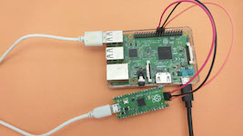

..  Copyright (c) 2014-present PlatformIO <contact@platformio.org>
    Licensed under the Apache License, Version 2.0 (the "License");
    you may not use this file except in compliance with the License.
    You may obtain a copy of the License at
       http://www.apache.org/licenses/LICENSE-2.0
    Unless required by applicable law or agreed to in writing, software
    distributed under the License is distributed on an "AS IS" BASIS,
    WITHOUT WARRANTIES OR CONDITIONS OF ANY KIND, either express or implied.
    See the License for the specific language governing permissions and
    limitations under the License.

.. _debugging_tool_raspberrypi-swd:

Raspberry Pi SWD
================

`Learn how to Program and Debug Raspberry Pi Pico with SWD <https://www.electronicshub.org/programming-raspberry-pi-pico-with-swd/>`__.

.. contents:: Contents
    :local:

Configuration
-------------

You can configure debugging tool using :ref:`projectconf_debug_tool` option in
:ref:`projectconf`:

.. code-block:: ini

    [env:myenv]
    platform = ...
    board = ...
    debug_tool = raspberrypi-swd

If you would like to use this tool for firmware uploading, please change
upload protocol:

.. code-block:: ini

    [env:myenv]
    platform = ...
    board = ...
    debug_tool = raspberrypi-swd
    upload_protocol = raspberrypi-swd

More options:

* :ref:`projectconf_section_env_debug`
* :ref:`projectconf_section_env_upload`

.. begin_platforms

Platforms
---------
.. list-table::
    :header-rows:  1

    * - Name
      - Description

    * - :ref:`platform_raspberrypi`
      - RP2040 is a low-cost, high-performance microcontroller device with with a large on-chip memory, symmetric dual-core processor complex, and rich peripheral.

Frameworks
----------
.. list-table::
    :header-rows:  1

    * - Name
      - Description

    * - :ref:`framework_arduino`
      - Arduino Wiring-based Framework allows writing cross-platform software to control devices attached to a wide range of Arduino boards to create all kinds of creative coding, interactive objects, spaces or physical experiences

Boards
------

.. note::
    For more detailed ``board`` information please scroll tables below by horizontal.

.. list-table::
    :header-rows:  1

    * - Name
      - Platform
      - Debug
      - MCU
      - Frequency
      - Flash
      - RAM
    * - :ref:`board_raspberrypi_nanorp2040connect`
      - :ref:`platform_raspberrypi`
      - External
      - RP2040
      - 133MHz
      - 2MB
      - 264KB
    * - :ref:`board_raspberrypi_pico`
      - :ref:`platform_raspberrypi`
      - External
      - RP2040
      - 133MHz
      - 2MB
      - 264KB
