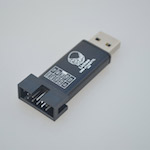

..  Copyright (c) 2014-present PlatformIO <contact@platformio.org>
    Licensed under the Apache License, Version 2.0 (the "License");
    you may not use this file except in compliance with the License.
    You may obtain a copy of the License at
       http://www.apache.org/licenses/LICENSE-2.0
    Unless required by applicable law or agreed to in writing, software
    distributed under the License is distributed on an "AS IS" BASIS,
    WITHOUT WARRANTIES OR CONDITIONS OF ANY KIND, either express or implied.
    See the License for the specific language governing permissions and
    limitations under the License.

.. _debugging_tool_sipeed-rv-debugger:

Sipeed RV Debugger
==================

High-speed 3-IN-1 fast USB ARM/ESP32 JTAG, USB-to-RS232 virtual port and power
supply 5VDC device.
Official reference can be found `here <https://tang.sipeed.com/en/hardware-overview/rv-debugger/?utm_source=platformio&utm_medium=docs>`__.

.. contents:: Contents
    :local:

Configuration
-------------

You can configure debugging tool using :ref:`projectconf_debug_tool` option in
:ref:`projectconf`:

.. code-block:: ini

    [env:myenv]
    platform = ...
    board = ...
    debug_tool = sipeed-rv-debugger

If you would like to use this tool for firmware uploading, please change
upload protocol:

.. code-block:: ini

    [env:myenv]
    platform = ...
    board = ...
    debug_tool = sipeed-rv-debugger
    upload_protocol = sipeed-rv-debugger

More options:

* :ref:`projectconf_section_env_debug`
* :ref:`projectconf_section_env_upload`

.. include:: _common_jtag_drivers.rst

Wiring Connections
------------------

.. list-table::
  :header-rows:  1

  * - Sipeed RV Debugger Connector
    - Board JTAG Pin
    - Description
  * - 1
    - GND
    - Digital ground
  * - 2
    - TDI
    - Test Data In pin
  * - 6
    - TMS
    - Test Mode State pin
  * - 10
    - TCK
    - JTAG Return Test Clock
  * - 8
    - TDO
    - Test Data Out pin
  * - 4
    - RST
    - Connect this pin to the (active low) reset input of the target CPU

.. begin_platforms

Platforms
---------
.. list-table::
    :header-rows:  1

    * - Name
      - Description

    * - :ref:`platform_gd32v`
      - The GigaDevice GD32V device is a 32-bit general-purpose microcontroller based on the RISC-V core with an impressive balance of processing power, reduced power consumption and peripheral set.

    * - :ref:`platform_kendryte210`
      - Kendryte K210 is an AI capable RISCV64 dual core SoC.

Frameworks
----------
.. list-table::
    :header-rows:  1

    * - Name
      - Description

    * - :ref:`framework_arduino`
      - Arduino Wiring-based Framework allows writing cross-platform software to control devices attached to a wide range of Arduino boards to create all kinds of creative coding, interactive objects, spaces or physical experiences

    * - :ref:`framework_gd32vf103-sdk`
      - GigaDevice GD32VF103 Firmware Library (SDK) is a firmware function package, including programs, data structures and macro definitions, all the performance features of peripherals of GD32VF103 devices are involved in the package

    * - :ref:`framework_kendryte-freertos-sdk`
      - Kendryte SDK with FreeRTOS support

    * - :ref:`framework_kendryte-standalone-sdk`
      - Kendryte Standalone SDK without OS support

Boards
------

.. note::
    For more detailed ``board`` information please scroll tables below by horizontal.

.. list-table::
    :header-rows:  1

    * - Name
      - Platform
      - Debug
      - MCU
      - Frequency
      - Flash
      - RAM
    * - :ref:`board_gd32v_gd32vf103v-eval`
      - :ref:`platform_gd32v`
      - External
      - GD32VF103VBT6
      - 108MHz
      - 128KB
      - 32KB
    * - :ref:`board_gd32v_sipeed-longan-nano`
      - :ref:`platform_gd32v`
      - External
      - GD32VF103CBT6
      - 108MHz
      - 128KB
      - 32KB
    * - :ref:`board_gd32v_sipeed-longan-nano-lite`
      - :ref:`platform_gd32v`
      - External
      - GD32VF103C8T6
      - 108MHz
      - 64KB
      - 20KB
    * - :ref:`board_kendryte210_sipeed-maix-bit`
      - :ref:`platform_kendryte210`
      - External
      - K210
      - 400MHz
      - 16MB
      - 6MB
    * - :ref:`board_kendryte210_sipeed-maix-bit-mic`
      - :ref:`platform_kendryte210`
      - External
      - K210
      - 400MHz
      - 16MB
      - 6MB
    * - :ref:`board_kendryte210_sipeed-maix-go`
      - :ref:`platform_kendryte210`
      - External
      - K210
      - 400MHz
      - 16MB
      - 6MB
    * - :ref:`board_kendryte210_sipeed-maix-one-dock`
      - :ref:`platform_kendryte210`
      - External
      - K210
      - 400MHz
      - 16MB
      - 6MB
    * - :ref:`board_kendryte210_sipeed-maixduino`
      - :ref:`platform_kendryte210`
      - External
      - K210
      - 400MHz
      - 16MB
      - 6MB
    * - :ref:`board_kendryte210_sipeed-MF1`
      - :ref:`platform_kendryte210`
      - External
      - K210
      - 400MHz
      - 16MB
      - 6MB
    * - :ref:`board_gd32v_wio_lite_risc-v`
      - :ref:`platform_gd32v`
      - External
      - GD32VF103CBT6
      - 108MHz
      - 128KB
      - 32KB
