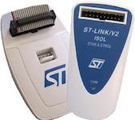

..  Copyright (c) 2014-present PlatformIO <contact@platformio.org>
    Licensed under the Apache License, Version 2.0 (the "License");
    you may not use this file except in compliance with the License.
    You may obtain a copy of the License at
       http://www.apache.org/licenses/LICENSE-2.0
    Unless required by applicable law or agreed to in writing, software
    distributed under the License is distributed on an "AS IS" BASIS,
    WITHOUT WARRANTIES OR CONDITIONS OF ANY KIND, either express or implied.
    See the License for the specific language governing permissions and
    limitations under the License.

.. _debugging_tool_stlink:

ST-LINK
=======

:Configuration:
  :ref:`projectconf_debug_tool` = ``stlink``

The ST-LINK is an in-circuit debugger and programmer for the STM8 and STM32
microcontroller families. The single wire interface module (SWIM) and
JTAG/serial wire debugging (SWD) interfaces are used to communicate with any
STM8 or STM32 microcontroller located on an application board.
`Vendor information... <http://www.st.com/en/development-tools/st-link-v2.1.html?utm_source=platformio&utm_medium=docs>`__

Drivers
-------

:Windows:
  Please install official `ST-LINK USB driver <https://www.st.com/en/development-tools/stsw-link009.html>`_.

:Mac:
  Not required.

:Linux:
  Please install "udev" rules :ref:`faq_udev_rules`. If you already installed
  them before, please check that your rules are up-to-date or repeat steps.

.. begin_compatible_platforms

Compatible Platforms
--------------------

* :ref:`platform_nordicnrf51`
* :ref:`platform_nordicnrf52`
* :ref:`platform_ststm32`

.. end_compatible_platforms