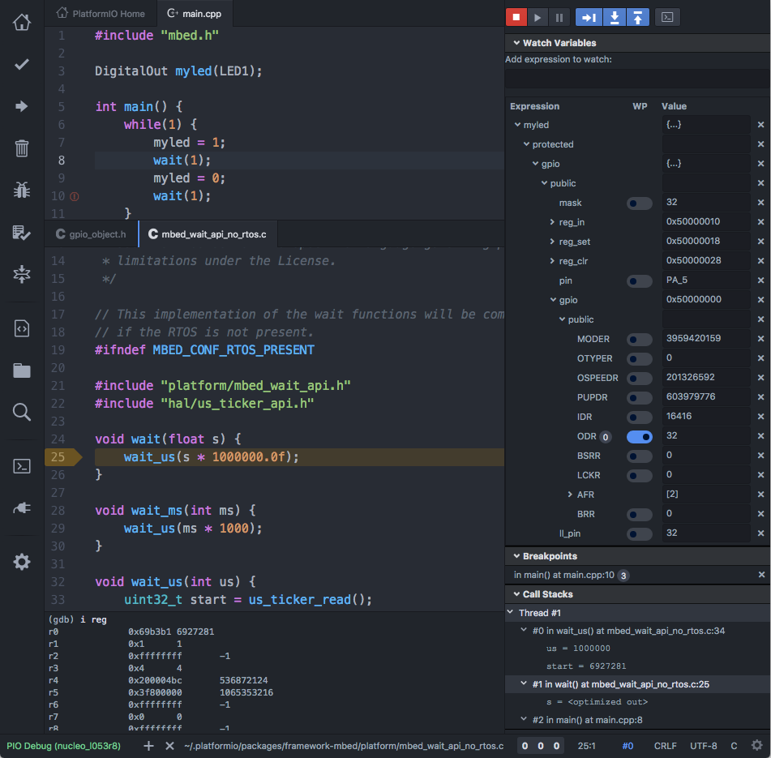

..  Copyright 2014-present PlatformIO <contact@platformio.org>
    Licensed under the Apache License, Version 2.0 (the "License");
    you may not use this file except in compliance with the License.
    You may obtain a copy of the License at
       http://www.apache.org/licenses/LICENSE-2.0
    Unless required by applicable law or agreed to in writing, software
    distributed under the License is distributed on an "AS IS" BASIS,
    WITHOUT WARRANTIES OR CONDITIONS OF ANY KIND, either express or implied.
    See the License for the specific language governing permissions and
    limitations under the License.

.. |PIODebug| replace:: **PIO Unified Debugger**

.. _debugging:

PIO Unified Debugger
====================

**It Just Works. Easier than ever before!**

.. versionadded:: 3.4 (`PlatformIO Plus <https://pioplus.com>`__)

.. note::

  `Demo, discussions, request a support for new hardware. <https://community.platformio.org/t/pio-unified-debugger/1704>`_

* 100+ boards
* Multiple architectures and development platforms
* Zero Configuration
* Compatibility with the popular IDEs: :ref:`ide_atom`, Eclipse, VSCode, Sublime Text, etc
* Windows, MacOS, Linux (+ARMv6-8)

You should have :ref:`cmd_account` to work with |PIODebug|.
A registration is **FREE**.

.. tip::
  `QUESTIONS? Chat with us! <https://pioplus.com>`_
  (chat button is located in the bottom right corner)

.. contents::

Configuration
-------------

|PIODebug| can be configured from :ref:`projectconf`

* :ref:`projectconf_debug_tool`
* :ref:`projectconf_debug_init_break`
* :ref:`projectconf_debug_init_cmds`
* :ref:`projectconf_debug_extra_cmds` (conditional project breakpoints, extra
  configuration, etc.)
* :ref:`projectconf_debug_server`
* :ref:`projectconf_debug_port`
* :ref:`projectconf_debug_preload`

User Guide (CLI)
----------------

.. toctree::
    :maxdepth: 3

    platformio debug <../userguide/cmd_debug>

.. _debugging_tools:

Tools
-----

You can change debugging tool via :ref:`projectconf_debug_tool` option.

.. _debugging_tool_blackmagic:

Black Magic Probe
~~~~~~~~~~~~~~~~~

:ref:`projectconf_debug_tool` = ``blackmagic``

The Black Magic Probe is a modern, in-application debugging tool for embedded
microprocessors. It is able to control and examine the state of the target
microprocessor using a JTAG or Serial Wire Debugging (SWD) port and on-chip
debug logic provided by the microprocessor. The probe connects to a host
computer using a standard USB interface.

`More details <https://github.com/blacksphere/blackmagic/wiki>`__

.. _debugging_tool_cmsis-dap:

CMSIS-DAP
~~~~~~~~~

:ref:`projectconf_debug_tool` = ``cmsis-dap``

CMSIS-DAP is generally implemented as an on-board interface chip, providing
direct USB connection from a development board to a debugger running on a host
computer on one side, and over JTAG (Joint Test Action Group) or SWD
(Serial Wire Debug) to the target device to access the Coresight DAP on the other.

`More details <https://developer.mbed.org/handbook/CMSIS-DAP>`__

.. _debugging_tool_jlink:

J-LINK
~~~~~~

:ref:`projectconf_debug_tool` = ``jlink``

SEGGER J-Links are the most widely used line of debug probes available today.
They've proven their value for more than 10 years with over 400,000 units sold,
including OEM versions and on-board solutions. This popularity stems from the
unparalleled performance, extensive feature set, large number of supported
CPUs, and compatibility with all popular development environments.

Also, see :ref:`debugging_tool_custom` debugging configuration.

`More details <https://www.segger.com/jlink-debug-probes.html>`__

.. _debugging_tool_mspdebug:

MSP Debug
~~~~~~~~~

:ref:`projectconf_debug_tool` = ``mspdebug``

The MSP debug stack (MSPDS) for all MSP430™ microcontrollers (MCUs) and
SimpleLink™ MSP432™ devices consists of a static library on the host system
side as well as an embedded firmware that runs on debug tools including the
MSP-FET, MSP-FET430UIF or on-board eZ debuggers. It is the bridging element
between all PC software and all MSP430 and SimpleLink MSP432 microcontroller
derivatives and handles tasks such as code download, stepping through code or
break points

`More details <http://www.ti.com/tool/mspds>`__

.. _debugging_tool_ti-icdi:

TI-ICDI
~~~~~~~

:ref:`projectconf_debug_tool` = ``ti-icdi``

Tiva™ C Series evaluation and reference design kits provide an integrated
In-Circuit Debug Interface (ICDI) which allows programming and debugging of
the onboard C Series microcontroller

`More details <http://www.ti.com/tool/stellaris_icdi_drivers>`__

.. _debugging_tool_stlink:

ST-LINK
~~~~~~~

:ref:`projectconf_debug_tool` = ``stlink``

The ST-LINK is an in-circuit debugger and programmer for the STM8 and STM32
microcontroller families. The single wire interface module (SWIM) and
JTAG/serial wire debugging (SWD) interfaces are used to communicate with any
STM8 or STM32 microcontroller located on an application board.

`More details <http://www.st.com/en/development-tools/st-link-v2.1.html>`__

.. _debugging_tool_stlink-v1:

ST-LINK/V1
~~~~~~~~~~

:ref:`projectconf_debug_tool` = ``stlink-v1``

ST-LINK/V1 in-circuit debugger/programmer for STM8 and STM32.
Details :ref:`debugging_tool_stlink`.

.. _debugging_tool_stlink-v2:

ST-LINK/V2
~~~~~~~~~~

:ref:`projectconf_debug_tool` = ``stlink-v2``

ST-LINK/V2 in-circuit debugger/programmer for STM8 and STM32.
Details :ref:`debugging_tool_stlink`.

.. _debugging_tool_stlink-v2-1:

ST-LINK/V2-1
~~~~~~~~~~~~

:ref:`projectconf_debug_tool` = ``stlink-v2-1``

ST-LINK/V2-1 in-circuit debugger/programmer for STM8 and STM32.
Details :ref:`debugging_tool_stlink`.

.. _debugging_tool_custom:

Custom
~~~~~~

:ref:`projectconf_debug_tool` = ``custom``

Custom debugging configuration:

* :ref:`projectconf_debug_init_break` (setup initial breakpoint)
* :ref:`projectconf_debug_init_cmds`
* :ref:`projectconf_debug_extra_cmds` (conditional project breakpoints, extra
  configuration, etc.)
* :ref:`projectconf_debug_server` (custom debugging server)
* :ref:`projectconf_debug_port`

**Examples**

1. `Segger J-Link <https://www.segger.com/jlink-st-link.html>`_ probe and ST Nucleo F446RE board in pair with `J-Link GDB Server <https://www.segger.com/jlink-gdb-server.html>`_:

.. code-block:: ini

    [env:debug_jlink]
    platform = ststm32
    framework = mbed
    board = nucleo_f446re
    debug_port = :2331
    debug_tool = custom
    debug_init_cmds =
      target remote $DEBUG_PORT
      file "$PROG_PATH"
      load
      tb main
      mon reset
      mon halt
    debug_server =
      C:/Program Files (x86)/SEGGER/JLink_V612e/JLinkGDBServerCL.exe
      -select
      USB
      -device
      STM32F446RE

2. On-board ST-Link V2/V2-1 in pair with `ST-Util GDB Server <https://github.com/texane/stlink>`_:

.. code-block:: ini

    [env:debug]
    platform = ststm32
    framework = mbed
    board = ...
    debug_tool = custom
    debug_port = :4242
    debug_server = $PLATFORMIO_HOME_DIR/packages/tool-stlink/st-util

3. On-board ST-Link V2/V2-1 in pair with `OpenOCD GDB Server <http://openocd.org>`_:

.. code-block:: ini

    [env:debug]
    platform = ststm32
    framework = mbed
    board = ...
    debug_tool = custom
    debug_server =
      $PLATFORMIO_HOME_DIR/packages/tool-openocd/bin/openocd
      -f
      $PLATFORMIO_HOME_DIR/packages/tool-openocd/scripts/board/st_nucleo_f4.cfg

.. _debugging_platforms:

Platforms
---------
.. list-table::
    :header-rows:  1

    * - Name
      - Description

    * - :ref:`platform_atmelsam`
      - Atmel | SMART offers Flash- based ARM products based on the ARM Cortex-M0+, Cortex-M3 and Cortex-M4 architectures, ranging from 8KB to 2MB of Flash including a rich peripheral and feature mix.

    * - :ref:`platform_freescalekinetis`
      - Freescale Kinetis Microcontrollers is family of multiple hardware- and software-compatible ARM Cortex-M0+, Cortex-M4 and Cortex-M7-based MCU series. Kinetis MCUs offer exceptional low-power performance, scalability and feature integration.

    * - :ref:`platform_nordicnrf51`
      - The Nordic nRF51 Series is a family of highly flexible, multi-protocol, system-on-chip (SoC) devices for ultra-low power wireless applications. nRF51 Series devices support a range of protocol stacks including Bluetooth Smart (previously called Bluetooth low energy), ANT and proprietary 2.4GHz protocols such as Gazell.

    * - :ref:`platform_nxplpc`
      - The NXP LPC is a family of 32-bit microcontroller integrated circuits by NXP Semiconductors. The LPC chips are grouped into related series that are based around the same 32-bit ARM processor core, such as the Cortex-M4F, Cortex-M3, Cortex-M0+, or Cortex-M0. Internally, each microcontroller consists of the processor core, static RAM memory, flash memory, debugging interface, and various peripherals.

    * - :ref:`platform_siliconlabsefm32`
      - Silicon Labs EFM32 Gecko 32-bit microcontroller (MCU) family includes devices that offer flash memory configurations up to 256 kB, 32 kB of RAM and CPU speeds up to 48 MHz. Based on the powerful ARM Cortex-M core, the Gecko family features innovative low energy techniques, short wake-up time from energy saving modes and a wide selection of peripherals, making it ideal for battery operated applications and other systems requiring high performance and low-energy consumption.

    * - :ref:`platform_ststm32`
      - The STM32 family of 32-bit Flash MCUs based on the ARM Cortex-M processor is designed to offer new degrees of freedom to MCU users. It offers a 32-bit product range that combines very high performance, real-time capabilities, digital signal processing, and low-power, low-voltage operation, while maintaining full integration and ease of development.

    * - :ref:`platform_timsp430`
      - MSP430 microcontrollers (MCUs) from Texas Instruments (TI) are 16-bit, RISC-based, mixed-signal processors designed for ultra-low power. These MCUs offer the lowest power consumption and the perfect mix of integrated peripherals for thousands of applications.

    * - :ref:`platform_titiva`
      - Texas Instruments TM4C12x MCUs offer the industrys most popular ARM Cortex-M4 core with scalable memory and package options, unparalleled connectivity peripherals, advanced application functions, industry-leading analog integration, and extensive software solutions.

Frameworks
----------
.. list-table::
    :header-rows:  1

    * - Name
      - Description

    * - :ref:`framework_arduino`
      - Arduino Wiring-based Framework allows writing cross-platform software to control devices attached to a wide range of Arduino boards to create all kinds of creative coding, interactive objects, spaces or physical experiences.

    * - :ref:`framework_cmsis`
      - The ARM Cortex Microcontroller Software Interface Standard (CMSIS) is a vendor-independent hardware abstraction layer for the Cortex-M processor series and specifies debugger interfaces. The CMSIS enables consistent and simple software interfaces to the processor for interface peripherals, real-time operating systems, and middleware. It simplifies software re-use, reducing the learning curve for new microcontroller developers and cutting the time-to-market for devices.

    * - :ref:`framework_energia`
      - Energia Wiring-based framework enables pretty much anyone to start easily creating microcontroller-based projects and applications. Its easy-to-use libraries and functions provide developers of all experience levels to start blinking LEDs, buzzing buzzers and sensing sensors more quickly than ever before.

    * - :ref:`framework_libopencm3`
      - The libOpenCM3 framework aims to create a free/libre/open-source firmware library for various ARM Cortex-M0(+)/M3/M4 microcontrollers, including ST STM32, Ti Tiva and Stellaris, NXP LPC 11xx, 13xx, 15xx, 17xx parts, Atmel SAM3, Energy Micro EFM32 and others.

    * - :ref:`framework_mbed`
      - The mbed framework The mbed SDK has been designed to provide enough hardware abstraction to be intuitive and concise, yet powerful enough to build complex projects. It is built on the low-level ARM CMSIS APIs, allowing you to code down to the metal if needed. In addition to RTOS, USB and Networking libraries, a cookbook of hundreds of reusable peripheral and module libraries have been built on top of the SDK by the mbed Developer Community.

    * - :ref:`framework_spl`
      - The ST Standard Peripheral Library provides a set of functions for handling the peripherals on the STM32 Cortex-M3 family. The idea is to save the user (the new user, in particular) having to deal directly with the registers.

Boards
------

.. note::
    For more detailed ``board`` information please scroll tables below by horizontal.

96Boards
~~~~~~~~

.. list-table::
    :header-rows:  1

    * - ID
      - Name
      - Platform
      - Debug
      - Microcontroller
      - Frequency
      - Flash
      - RAM

    * - ``b96b_f446ve``
      - `96Boards B96B-F446VE <https://developer.mbed.org/platforms/ST-B96B-F446VE/>`_
      - :ref:`ST STM32 <platform_ststm32>`
      - :ref:`debugging_tool_stlink-v2-1` (on-board)
      - STM32F446VET6
      - 168 MHz
      - 512 Kb
      - 128 Kb

Arduino
~~~~~~~

.. list-table::
    :header-rows:  1

    * - ID
      - Name
      - Platform
      - Debug
      - Microcontroller
      - Frequency
      - Flash
      - RAM

    * - ``mzeropro``
      - `Arduino M0 Pro (Programming/Debug Port) <http://www.arduino.org/products/boards/arduino-m0-pro>`_
      - :ref:`Atmel SAM <platform_atmelsam>`
      - :ref:`debugging_tool_cmsis-dap` (on-board)
      - SAMD21G18A
      - 48 MHz
      - 256 Kb
      - 32 Kb

    * - ``zero``
      - `Arduino Zero (Programming/Debug Port) <https://www.arduino.cc/en/Main/ArduinoBoardZero>`_
      - :ref:`Atmel SAM <platform_atmelsam>`
      - :ref:`debugging_tool_cmsis-dap` (on-board)
      - SAMD21G18A
      - 48 MHz
      - 256 Kb
      - 32 Kb

Armstrap
~~~~~~~~

.. list-table::
    :header-rows:  1

    * - ID
      - Name
      - Platform
      - Debug
      - Microcontroller
      - Frequency
      - Flash
      - RAM

    * - ``armstrap_eagle1024``
      - `Armstrap Eagle 1024 <http://docs.armstrap.org/en/latest/hardware-overview.html>`_
      - :ref:`ST STM32 <platform_ststm32>`
      - :ref:`debugging_tool_stlink-v2-1` (on-board)
      - STM32F417VGT6
      - 168 MHz
      - 1024 Kb
      - 192 Kb

    * - ``armstrap_eagle2048``
      - `Armstrap Eagle 2048 <http://docs.armstrap.org/en/latest/hardware-overview.html>`_
      - :ref:`ST STM32 <platform_ststm32>`
      - :ref:`debugging_tool_stlink-v2-1` (on-board)
      - STM32F427VIT6
      - 168 MHz
      - 2048 Kb
      - 256 Kb

    * - ``armstrap_eagle512``
      - `Armstrap Eagle 512 <http://docs.armstrap.org/en/latest/hardware-overview.html>`_
      - :ref:`ST STM32 <platform_ststm32>`
      - :ref:`debugging_tool_stlink-v2-1` (on-board)
      - STM32F407VET6
      - 168 MHz
      - 512 Kb
      - 192 Kb

Atmel
~~~~~

.. list-table::
    :header-rows:  1

    * - ID
      - Name
      - Platform
      - Debug
      - Microcontroller
      - Frequency
      - Flash
      - RAM

    * - ``samd21_xpro``
      - `Atmel SAMD21-XPRO <https://developer.mbed.org/platforms/SAMD21-XPRO/>`_
      - :ref:`Atmel SAM <platform_atmelsam>`
      - :ref:`debugging_tool_cmsis-dap` (on-board)
      - ATSAMD21J18A
      - 48 MHz
      - 256 Kb
      - 32 Kb

    * - ``samd21g18a``
      - `Atmel ATSAMW25-XPRO <https://developer.mbed.org/platforms/SAMW25-XPRO/>`_
      - :ref:`Atmel SAM <platform_atmelsam>`
      - :ref:`debugging_tool_cmsis-dap` (on-board)
      - ATSAMD21G18A
      - 48 MHz
      - 256 Kb
      - 32 Kb

    * - ``saml21_xpro_b``
      - `Atmel SAML21-XPRO-B <https://developer.mbed.org/platforms/SAML21-XPRO/>`_
      - :ref:`Atmel SAM <platform_atmelsam>`
      - :ref:`debugging_tool_cmsis-dap` (on-board)
      - ATSAML21J18B
      - 48 MHz
      - 256 Kb
      - 32 Kb

    * - ``samr21_xpro``
      - `Atmel ATSAMR21-XPRO <https://developer.mbed.org/platforms/SAMR21-XPRO/>`_
      - :ref:`Atmel SAM <platform_atmelsam>`
      - :ref:`debugging_tool_cmsis-dap` (on-board)
      - ATSAMR21G18A
      - 48 MHz
      - 256 Kb
      - 32 Kb

Delta
~~~~~

.. list-table::
    :header-rows:  1

    * - ID
      - Name
      - Platform
      - Debug
      - Microcontroller
      - Frequency
      - Flash
      - RAM

    * - ``dfcm_nnn40``
      - `Delta DFCM-NNN40 <https://developer.mbed.org/platforms/Delta-DFCM-NNN40/>`_
      - :ref:`Nordic nRF51 <platform_nordicnrf51>`
      - :ref:`debugging_tool_cmsis-dap` (on-board)
      - NRF51822
      - 32 MHz
      - 256 Kb
      - 32 Kb

Elektor Labs
~~~~~~~~~~~~

.. list-table::
    :header-rows:  1

    * - ID
      - Name
      - Platform
      - Debug
      - Microcontroller
      - Frequency
      - Flash
      - RAM

    * - ``elektor_cocorico``
      - `CoCo-ri-Co! <https://developer.mbed.org/platforms/CoCo-ri-Co/>`_
      - :ref:`NXP LPC <platform_nxplpc>`
      - :ref:`debugging_tool_cmsis-dap` (on-board)
      - LPC812
      - 30 MHz
      - 16 Kb
      - 4 Kb

Embedded Artists
~~~~~~~~~~~~~~~~

.. list-table::
    :header-rows:  1

    * - ID
      - Name
      - Platform
      - Debug
      - Microcontroller
      - Frequency
      - Flash
      - RAM

    * - ``lpc4088``
      - `Embedded Artists LPC4088 QuickStart Board <https://developer.mbed.org/platforms/EA-LPC4088/>`_
      - :ref:`NXP LPC <platform_nxplpc>`
      - :ref:`debugging_tool_cmsis-dap` (on-board)
      - LPC4088
      - 120 MHz
      - 512 Kb
      - 96 Kb

    * - ``lpc4088_dm``
      - `Embedded Artists LPC4088 Display Module <https://developer.mbed.org/platforms/EA-LPC4088-Display-Module/>`_
      - :ref:`NXP LPC <platform_nxplpc>`
      - :ref:`debugging_tool_cmsis-dap` (on-board)
      - LPC4088
      - 120 MHz
      - 512 Kb
      - 96 Kb

Espotel
~~~~~~~

.. list-table::
    :header-rows:  1

    * - ID
      - Name
      - Platform
      - Debug
      - Microcontroller
      - Frequency
      - Flash
      - RAM

    * - ``elmo_f411re``
      - `Espotel LoRa Module <https://developer.mbed.org/platforms/Espotel-ELMO/>`_
      - :ref:`ST STM32 <platform_ststm32>`
      - :ref:`debugging_tool_stlink-v2-1`
      - STM32F411RET6
      - 100 MHz
      - 512 Kb
      - 128 Kb

Freescale
~~~~~~~~~

.. list-table::
    :header-rows:  1

    * - ID
      - Name
      - Platform
      - Debug
      - Microcontroller
      - Frequency
      - Flash
      - RAM

    * - ``IBMEthernetKit``
      - `Ethernet IoT Starter Kit <http://developer.mbed.org/platforms/IBMEthernetKit/>`_
      - :ref:`Freescale Kinetis <platform_freescalekinetis>`
      - :ref:`debugging_tool_cmsis-dap` (on-board)
      - MK64FN1M0VLL12
      - 120 MHz
      - 1024 Kb
      - 256 Kb

    * - ``frdm_k20d50m``
      - `Freescale Kinetis FRDM-K20D50M <https://developer.mbed.org/platforms/FRDM-K20D50M/>`_
      - :ref:`Freescale Kinetis <platform_freescalekinetis>`
      - :ref:`debugging_tool_cmsis-dap` (on-board)
      - MK20DX128VLH5
      - 48 MHz
      - 128 Kb
      - 16 Kb

    * - ``frdm_k22f``
      - `Freescale Kinetis FRDM-K22F <https://developer.mbed.org/platforms/FRDM-K22F/>`_
      - :ref:`Freescale Kinetis <platform_freescalekinetis>`
      - :ref:`debugging_tool_cmsis-dap` (on-board)
      - MK22FN512VLH12
      - 120 MHz
      - 512 Kb
      - 128 Kb

    * - ``frdm_k64f``
      - `Freescale Kinetis FRDM-K64F <https://developer.mbed.org/platforms/FRDM-K64F/>`_
      - :ref:`Freescale Kinetis <platform_freescalekinetis>`
      - :ref:`debugging_tool_cmsis-dap` (on-board)
      - MK64FN1M0VLL12
      - 120 MHz
      - 1024 Kb
      - 256 Kb

    * - ``frdm_kl05z``
      - `Freescale Kinetis FRDM-KL05Z <https://developer.mbed.org/platforms/FRDM-KL05Z/>`_
      - :ref:`Freescale Kinetis <platform_freescalekinetis>`
      - :ref:`debugging_tool_cmsis-dap` (on-board)
      - MKL05Z32VFM4
      - 48 MHz
      - 32 Kb
      - 4 Kb

    * - ``frdm_kl25z``
      - `Freescale Kinetis FRDM-KL25Z <https://developer.mbed.org/platforms/KL25Z/>`_
      - :ref:`Freescale Kinetis <platform_freescalekinetis>`
      - :ref:`debugging_tool_cmsis-dap` (on-board)
      - MKL25Z128VLK4
      - 48 MHz
      - 128 Kb
      - 16 Kb

    * - ``frdm_kl26z``
      - `Freescale Kinetis FRDM-KL26Z <http://www.nxp.com/products/software-and-tools/hardware-development-tools/freedom-development-boards/freedom-development-platform-for-kinetis-kl16-and-kl26-mcus-up-to-128-kb-flash:FRDM-KL26Z>`_
      - :ref:`Freescale Kinetis <platform_freescalekinetis>`
      - :ref:`debugging_tool_cmsis-dap` (on-board)
      - MKL26Z128VLH4
      - 48 MHz
      - 128 Kb
      - 16 Kb

    * - ``frdm_kl27z``
      - `Freescale Kinetis FRDM-KL27Z <http://www.nxp.com/products/software-and-tools/hardware-development-tools/freedom-development-boards/freedom-development-platform-for-kinetis-kl17-and-kl27-mcus:FRDM-KL27Z>`_
      - :ref:`Freescale Kinetis <platform_freescalekinetis>`
      - :ref:`debugging_tool_cmsis-dap` (on-board)
      - MKL27Z64VLH4
      - 48 MHz
      - 64 Kb
      - 16 Kb

    * - ``frdm_kl43z``
      - `Freescale Kinetis FRDM-KL43Z <http://www.nxp.com/products/software-and-tools/hardware-development-tools/freedom-development-boards/freedom-development-platform-for-kinetis-kl43-kl33-kl27-kl17-and-kl13-mcus:FRDM-KL43Z>`_
      - :ref:`Freescale Kinetis <platform_freescalekinetis>`
      - :ref:`debugging_tool_cmsis-dap` (on-board)
      - MKL43Z256VLH4
      - 48 MHz
      - 256 Kb
      - 32 Kb

    * - ``frdm_kl46z``
      - `Freescale Kinetis FRDM-KL46Z <https://developer.mbed.org/platforms/FRDM-KL46Z/>`_
      - :ref:`Freescale Kinetis <platform_freescalekinetis>`
      - :ref:`debugging_tool_cmsis-dap` (on-board)
      - MKL46Z256VLL4
      - 48 MHz
      - 256 Kb
      - 32 Kb

Generic
~~~~~~~

.. list-table::
    :header-rows:  1

    * - ID
      - Name
      - Platform
      - Debug
      - Microcontroller
      - Frequency
      - Flash
      - RAM

    * - ``bluepill_f103c8``
      - `BluePill F103C8 <http://www.st.com/content/st_com/en/products/microcontrollers/stm32-32-bit-arm-cortex-mcus/stm32f1-series/stm32f103/stm32f103c8.html>`_
      - :ref:`ST STM32 <platform_ststm32>`
      - :ref:`debugging_tool_blackmagic`, :ref:`debugging_tool_stlink-v2` (default), :ref:`debugging_tool_stlink-v2-1`
      - STM32F103C8T6
      - 72 MHz
      - 64 Kb
      - 20 Kb

    * - ``genericSTM32F103C8``
      - `STM32F103C8 (20k RAM. 64k Flash) <http://www.st.com/content/st_com/en/products/microcontrollers/stm32-32-bit-arm-cortex-mcus/stm32f1-series/stm32f103/stm32f103c8.html>`_
      - :ref:`ST STM32 <platform_ststm32>`
      - :ref:`debugging_tool_blackmagic`, :ref:`debugging_tool_stlink-v2` (default), :ref:`debugging_tool_stlink-v2-1`
      - STM32F103C8
      - 72 MHz
      - 64 Kb
      - 20 Kb

    * - ``genericSTM32F103CB``
      - `STM32F103CB (20k RAM. 128k Flash) <http://www.st.com/content/st_com/en/products/microcontrollers/stm32-32-bit-arm-cortex-mcus/stm32f1-series/stm32f103/stm32f103cb.html>`_
      - :ref:`ST STM32 <platform_ststm32>`
      - :ref:`debugging_tool_blackmagic`, :ref:`debugging_tool_stlink-v2` (default), :ref:`debugging_tool_stlink-v2-1`
      - STM32F103CB
      - 72 MHz
      - 128 Kb
      - 20 Kb

    * - ``genericSTM32F103R8``
      - `STM32F103R8 (20k RAM. 64 Flash) <http://www.st.com/content/st_com/en/products/microcontrollers/stm32-32-bit-arm-cortex-mcus/stm32f1-series/stm32f103/stm32f103r8.html>`_
      - :ref:`ST STM32 <platform_ststm32>`
      - :ref:`debugging_tool_blackmagic`, :ref:`debugging_tool_stlink-v2` (default), :ref:`debugging_tool_stlink-v2-1`
      - STM32F103R8
      - 72 MHz
      - 64 Kb
      - 20 Kb

    * - ``genericSTM32F103RB``
      - `STM32F103RB (20k RAM. 128k Flash) <http://www.st.com/content/st_com/en/products/microcontrollers/stm32-32-bit-arm-cortex-mcus/stm32f1-series/stm32f103/stm32f103rb.html>`_
      - :ref:`ST STM32 <platform_ststm32>`
      - :ref:`debugging_tool_blackmagic`, :ref:`debugging_tool_stlink-v2` (default), :ref:`debugging_tool_stlink-v2-1`
      - STM32F103RB
      - 72 MHz
      - 128 Kb
      - 20 Kb

    * - ``genericSTM32F103RC``
      - `STM32F103RC (48k RAM. 256k Flash) <http://www.st.com/content/st_com/en/products/microcontrollers/stm32-32-bit-arm-cortex-mcus/stm32f1-series/stm32f103/stm32f103rc.html>`_
      - :ref:`ST STM32 <platform_ststm32>`
      - :ref:`debugging_tool_blackmagic`, :ref:`debugging_tool_stlink-v2` (default), :ref:`debugging_tool_stlink-v2-1`
      - STM32F103RC
      - 72 MHz
      - 256 Kb
      - 48 Kb

    * - ``genericSTM32F103RE``
      - `STM32F103RE (64k RAM. 512k Flash) <http://www.st.com/content/st_com/en/products/microcontrollers/stm32-32-bit-arm-cortex-mcus/stm32f1-series/stm32f103/stm32f103re.html>`_
      - :ref:`ST STM32 <platform_ststm32>`
      - :ref:`debugging_tool_blackmagic`, :ref:`debugging_tool_stlink-v2` (default), :ref:`debugging_tool_stlink-v2-1`
      - STM32F103RE
      - 72 MHz
      - 512 Kb
      - 64 Kb

JKSoft
~~~~~~

.. list-table::
    :header-rows:  1

    * - ID
      - Name
      - Platform
      - Debug
      - Microcontroller
      - Frequency
      - Flash
      - RAM

    * - ``wallbot_ble``
      - `JKSoft Wallbot BLE <https://developer.mbed.org/platforms/JKSoft-Wallbot-BLE/>`_
      - :ref:`Nordic nRF51 <platform_nordicnrf51>`
      - :ref:`debugging_tool_cmsis-dap` (on-board)
      - NRF51822
      - 16 MHz
      - 128 Kb
      - 16 Kb

Micromint
~~~~~~~~~

.. list-table::
    :header-rows:  1

    * - ID
      - Name
      - Platform
      - Debug
      - Microcontroller
      - Frequency
      - Flash
      - RAM

    * - ``lpc4330_m4``
      - `Bambino-210E <https://developer.mbed.org/platforms/Micromint-Bambino-210E/>`_
      - :ref:`NXP LPC <platform_nxplpc>`
      - :ref:`debugging_tool_cmsis-dap` (on-board)
      - LPC4330
      - 204 MHz
      - 8192 Kb
      - 264 Kb

MikroElektronika
~~~~~~~~~~~~~~~~

.. list-table::
    :header-rows:  1

    * - ID
      - Name
      - Platform
      - Debug
      - Microcontroller
      - Frequency
      - Flash
      - RAM

    * - ``hexiwear``
      - `Hexiwear <https://developer.mbed.org/platforms/Hexiwear/>`_
      - :ref:`Freescale Kinetis <platform_freescalekinetis>`
      - :ref:`debugging_tool_cmsis-dap`
      - MK64FN1M0VDC12
      - 120 MHz
      - 1024 Kb
      - 256 Kb

MultiTech
~~~~~~~~~

.. list-table::
    :header-rows:  1

    * - ID
      - Name
      - Platform
      - Debug
      - Microcontroller
      - Frequency
      - Flash
      - RAM

    * - ``mts_dragonfly_f411re``
      - `MTS Dragonfly <https://developer.mbed.org/platforms/MTS-Dragonfly/>`_
      - :ref:`ST STM32 <platform_ststm32>`
      - :ref:`debugging_tool_stlink-v2-1`
      - STM32F411RET6
      - 100 MHz
      - 512 Kb
      - 128 Kb

    * - ``mts_mdot_f405rg``
      - `MultiTech mDot <https://developer.mbed.org/platforms/MTS-mDot-F411/>`_
      - :ref:`ST STM32 <platform_ststm32>`
      - :ref:`debugging_tool_stlink-v2-1`
      - STM32F411RET6
      - 100 MHz
      - 512 Kb
      - 128 Kb

    * - ``mts_mdot_f411re``
      - `MultiTech mDot F411 <https://developer.mbed.org/platforms/MTS-mDot-F411/>`_
      - :ref:`ST STM32 <platform_ststm32>`
      - :ref:`debugging_tool_stlink-v2-1`
      - STM32F411RET6
      - 100 MHz
      - 512 Kb
      - 128 Kb

NXP
~~~

.. list-table::
    :header-rows:  1

    * - ID
      - Name
      - Platform
      - Debug
      - Microcontroller
      - Frequency
      - Flash
      - RAM

    * - ``lpc11u24``
      - `NXP mbed LPC11U24 <https://developer.mbed.org/platforms/mbed-LPC11U24/>`_
      - :ref:`NXP LPC <platform_nxplpc>`
      - :ref:`debugging_tool_cmsis-dap` (on-board)
      - LPC11U24
      - 48 MHz
      - 32 Kb
      - 8 Kb

    * - ``lpc11u24_301``
      - `ARM mbed LPC11U24 (+CAN) <https://developer.mbed.org/handbook/mbed-NXP-LPC11U24>`_
      - :ref:`NXP LPC <platform_nxplpc>`
      - :ref:`debugging_tool_cmsis-dap` (on-board)
      - LPC11U24
      - 48 MHz
      - 32 Kb
      - 8 Kb

    * - ``lpc11u68``
      - `LPCXpresso11U68 <https://developer.mbed.org/platforms/LPCXpresso11U68/>`_
      - :ref:`NXP LPC <platform_nxplpc>`
      - :ref:`debugging_tool_cmsis-dap` (on-board)
      - LPC11U68
      - 50 MHz
      - 256 Kb
      - 36 Kb

    * - ``lpc1768``
      - `NXP mbed LPC1768 <http://developer.mbed.org/platforms/mbed-LPC1768/>`_
      - :ref:`NXP LPC <platform_nxplpc>`
      - :ref:`debugging_tool_cmsis-dap` (on-board)
      - LPC1768
      - 96 MHz
      - 512 Kb
      - 64 Kb

    * - ``lpc2460``
      - `NXP LPC2460 <http://www.nxp.com/products/microcontrollers-and-processors/arm-processors/lpc-arm7-arm9-mcus/lpc-arm7-mcus/lpc2100-200-300-400/flashless-16-bit-32-bit-microcontroller-ethernet-can-isp-iap-usb-2.0-device-host-otg-external-memory-interface:LPC2460FBD208>`_
      - :ref:`NXP LPC <platform_nxplpc>`
      - :ref:`debugging_tool_cmsis-dap` (on-board)
      - LPC2460
      - 72 MHz
      - 64 Kb
      - 16 Kb

    * - ``lpc812``
      - `NXP LPC800-MAX <https://developer.mbed.org/platforms/NXP-LPC800-MAX/>`_
      - :ref:`NXP LPC <platform_nxplpc>`
      - :ref:`debugging_tool_cmsis-dap` (on-board)
      - LPC812
      - 30 MHz
      - 16 Kb
      - 4 Kb

    * - ``lpc824``
      - `LPCXpresso824-MAX <https://developer.mbed.org/platforms/LPCXpresso824-MAX/>`_
      - :ref:`NXP LPC <platform_nxplpc>`
      - :ref:`debugging_tool_cmsis-dap` (on-board)
      - LPC824
      - 30 MHz
      - 32 Kb
      - 8 Kb

Nordic
~~~~~~

.. list-table::
    :header-rows:  1

    * - ID
      - Name
      - Platform
      - Debug
      - Microcontroller
      - Frequency
      - Flash
      - RAM

    * - ``nrf51_dk``
      - `Nordic nRF51-DK <https://developer.mbed.org/platforms/Nordic-nRF51-DK/>`_
      - :ref:`Nordic nRF51 <platform_nordicnrf51>`
      - :ref:`debugging_tool_cmsis-dap` (on-board)
      - NRF51822
      - 32 MHz
      - 256 Kb
      - 32 Kb

    * - ``nrf51_dongle``
      - `Nordic nRF51-Dongle <https://developer.mbed.org/platforms/Nordic-nRF51-Dongle/>`_
      - :ref:`Nordic nRF51 <platform_nordicnrf51>`
      - :ref:`debugging_tool_cmsis-dap` (on-board)
      - NRF51822
      - 32 MHz
      - 256 Kb
      - 32 Kb

    * - ``nrf51_mkit``
      - `Nordic nRF51822-mKIT <http://developer.mbed.org/platforms/Nordic-nRF51822/>`_
      - :ref:`Nordic nRF51 <platform_nordicnrf51>`
      - :ref:`debugging_tool_cmsis-dap` (on-board)
      - NRF51822
      - 16 MHz
      - 128 Kb
      - 16 Kb

RedBearLab
~~~~~~~~~~

.. list-table::
    :header-rows:  1

    * - ID
      - Name
      - Platform
      - Debug
      - Microcontroller
      - Frequency
      - Flash
      - RAM

    * - ``redBearLab``
      - `RedBearLab nRF51822 <https://developer.mbed.org/platforms/RedBearLab-nRF51822/>`_
      - :ref:`Nordic nRF51 <platform_nordicnrf51>`
      - :ref:`debugging_tool_cmsis-dap` (on-board)
      - NRF51822
      - 16 MHz
      - 256 Kb
      - 16 Kb

    * - ``redBearLabBLENano``
      - `RedBearLab BLE Nano <https://developer.mbed.org/platforms/RedBearLab-BLE-Nano/>`_
      - :ref:`Nordic nRF51 <platform_nordicnrf51>`
      - :ref:`debugging_tool_cmsis-dap` (on-board)
      - NRF51822
      - 16 MHz
      - 256 Kb
      - 32 Kb

ST
~~

.. list-table::
    :header-rows:  1

    * - ID
      - Name
      - Platform
      - Debug
      - Microcontroller
      - Frequency
      - Flash
      - RAM

    * - ``disco_f030r8``
      - `ST STM32F0308DISCOVERY <http://www.st.com/en/evaluation-tools/32f0308discovery.html>`_
      - :ref:`ST STM32 <platform_ststm32>`
      - :ref:`debugging_tool_stlink-v2` (on-board)
      - STM32F030R8T6
      - 48 MHz
      - 64 Kb
      - 8 Kb

    * - ``disco_f051r8``
      - `ST STM32F0DISCOVERY <http://www.st.com/web/catalog/tools/FM116/SC959/SS1532/LN1848/PF253215>`_
      - :ref:`ST STM32 <platform_ststm32>`
      - :ref:`debugging_tool_stlink-v2` (on-board)
      - STM32F051R8T6
      - 48 MHz
      - 64 Kb
      - 8 Kb

    * - ``disco_f100rb``
      - `ST STM32VLDISCOVERY <http://www.st.com/web/catalog/tools/FM116/SC959/SS1532/LN1848/PF250863>`_
      - :ref:`ST STM32 <platform_ststm32>`
      - :ref:`debugging_tool_stlink-v1` (on-board)
      - STM32F100RBT6
      - 24 MHz
      - 128 Kb
      - 8 Kb

    * - ``disco_f303vc``
      - `ST STM32F3DISCOVERY <http://www.st.com/web/catalog/tools/FM116/SC959/SS1532/LN1848/PF254044>`_
      - :ref:`ST STM32 <platform_ststm32>`
      - :ref:`debugging_tool_stlink-v2` (on-board)
      - STM32F303VCT6
      - 72 MHz
      - 256 Kb
      - 48 Kb

    * - ``disco_f334c8``
      - `ST 32F3348DISCOVERY <http://www.st.com/web/en/catalog/tools/PF260318>`_
      - :ref:`ST STM32 <platform_ststm32>`
      - :ref:`debugging_tool_stlink-v2-1` (on-board)
      - STM32F334C8T6
      - 72 MHz
      - 64 Kb
      - 12 Kb

    * - ``disco_f401vc``
      - `ST 32F401CDISCOVERY <http://www.st.com/web/catalog/tools/FM116/SC959/SS1532/LN1848/PF259098>`_
      - :ref:`ST STM32 <platform_ststm32>`
      - :ref:`debugging_tool_stlink-v2` (on-board)
      - STM32F401VCT6
      - 84 MHz
      - 256 Kb
      - 64 Kb

    * - ``disco_f407vg``
      - `ST STM32F4DISCOVERY <http://www.st.com/web/catalog/tools/FM116/SC959/SS1532/LN1848/PF252419>`_
      - :ref:`ST STM32 <platform_ststm32>`
      - :ref:`debugging_tool_stlink-v2` (on-board)
      - STM32F407VGT6
      - 168 MHz
      - 1024 Kb
      - 128 Kb

    * - ``disco_f429zi``
      - `ST 32F429IDISCOVERY <http://www.st.com/web/catalog/tools/FM116/SC959/SS1532/LN1848/PF259090>`_
      - :ref:`ST STM32 <platform_ststm32>`
      - :ref:`debugging_tool_stlink-v2` (on-board)
      - STM32F429ZIT6
      - 180 MHz
      - 2048 Kb
      - 256 Kb

    * - ``disco_f469ni``
      - `ST 32F469IDISCOVERY <http://www.st.com/web/catalog/tools/FM116/CL1620/SC959/SS1532/LN1848/PF262395>`_
      - :ref:`ST STM32 <platform_ststm32>`
      - :ref:`debugging_tool_stlink-v2` (on-board)
      - STM32F469NIH6
      - 180 MHz
      - 1024 Kb
      - 384 Kb

    * - ``disco_f746ng``
      - `ST 32F746GDISCOVERY <http://www.st.com/content/st_com/en/products/evaluation-tools/product-evaluation-tools/mcu-eval-tools/stm32-mcu-eval-tools/stm32-mcu-discovery-kits/32f746gdiscovery.html>`_
      - :ref:`ST STM32 <platform_ststm32>`
      - :ref:`debugging_tool_stlink-v2-1` (on-board)
      - STM32F746NGH6
      - 216 MHz
      - 1024 Kb
      - 320 Kb

    * - ``disco_f769ni``
      - `ST 32F769IDISCOVERY <http://www.st.com/content/st_com/en/products/evaluation-tools/product-evaluation-tools/mcu-eval-tools/stm32-mcu-eval-tools/stm32-mcu-discovery-kits/32f769idiscovery.html>`_
      - :ref:`ST STM32 <platform_ststm32>`
      - :ref:`debugging_tool_stlink-v2-1` (on-board)
      - STM32F769NIH6
      - 80 MHz
      - 1024 Kb
      - 512 Kb

    * - ``disco_l053c8``
      - `ST 32L0538DISCOVERY <http://www.st.com/web/en/catalog/tools/PF260319>`_
      - :ref:`ST STM32 <platform_ststm32>`
      - :ref:`debugging_tool_stlink-v2-1` (on-board)
      - STM32L053C8T6
      - 32 MHz
      - 64 Kb
      - 8 Kb

    * - ``disco_l152rb``
      - `ST STM32LDISCOVERY <http://www.st.com/web/catalog/tools/FM116/SC959/SS1532/LN1848/PF258515>`_
      - :ref:`ST STM32 <platform_ststm32>`
      - :ref:`debugging_tool_stlink-v2-1` (on-board)
      - STM32L152RBT6
      - 32 MHz
      - 128 Kb
      - 16 Kb

    * - ``disco_l476vg``
      - `ST 32L476GDISCOVERY <http://www.st.com/web/catalog/tools/FM116/CL1620/SC959/SS1532/LN1848/PF261635>`_
      - :ref:`ST STM32 <platform_ststm32>`
      - :ref:`debugging_tool_stlink-v2-1` (on-board)
      - STM32L476VGT6
      - 80 MHz
      - 1024 Kb
      - 128 Kb

    * - ``nucleo_f030r8``
      - `ST Nucleo F030R8 <https://developer.mbed.org/platforms/ST-Nucleo-F030R8/>`_
      - :ref:`ST STM32 <platform_ststm32>`
      - :ref:`debugging_tool_stlink-v2-1` (on-board)
      - STM32F030R8T6
      - 48 MHz
      - 64 Kb
      - 8 Kb

    * - ``nucleo_f031k6``
      - `ST Nucleo F031K6 <https://developer.mbed.org/platforms/ST-Nucleo-F031K6/>`_
      - :ref:`ST STM32 <platform_ststm32>`
      - :ref:`debugging_tool_stlink-v2-1` (on-board)
      - STM32F031K6T6
      - 48 MHz
      - 32 Kb
      - 4 Kb

    * - ``nucleo_f042k6``
      - `ST Nucleo F042K6 <https://developer.mbed.org/platforms/ST-Nucleo-F042K6/>`_
      - :ref:`ST STM32 <platform_ststm32>`
      - :ref:`debugging_tool_stlink-v2-1` (on-board)
      - STM32F042K6T6
      - 48 MHz
      - 32 Kb
      - 6 Kb

    * - ``nucleo_f070rb``
      - `ST Nucleo F070RB <https://developer.mbed.org/platforms/ST-Nucleo-F070RB/>`_
      - :ref:`ST STM32 <platform_ststm32>`
      - :ref:`debugging_tool_stlink-v2-1` (on-board)
      - STM32F070RBT6
      - 48 MHz
      - 128 Kb
      - 16 Kb

    * - ``nucleo_f072rb``
      - `ST Nucleo F072RB <https://developer.mbed.org/platforms/ST-Nucleo-F072RB/>`_
      - :ref:`ST STM32 <platform_ststm32>`
      - :ref:`debugging_tool_stlink-v2-1` (on-board)
      - STM32F072RBT6
      - 48 MHz
      - 128 Kb
      - 16 Kb

    * - ``nucleo_f091rc``
      - `ST Nucleo F091RC <https://developer.mbed.org/platforms/ST-Nucleo-F091RC/>`_
      - :ref:`ST STM32 <platform_ststm32>`
      - :ref:`debugging_tool_stlink-v2-1` (on-board)
      - STM32F091RCT6
      - 48 MHz
      - 256 Kb
      - 32 Kb

    * - ``nucleo_f103rb``
      - `ST Nucleo F103RB <https://developer.mbed.org/platforms/ST-Nucleo-F103RB/>`_
      - :ref:`ST STM32 <platform_ststm32>`
      - :ref:`debugging_tool_stlink-v2-1` (on-board)
      - STM32F103RBT6
      - 72 MHz
      - 128 Kb
      - 20 Kb

    * - ``nucleo_f207zg``
      - `ST Nucleo F207ZG <https://developer.mbed.org/platforms/ST-Nucleo-F207ZG/>`_
      - :ref:`ST STM32 <platform_ststm32>`
      - :ref:`debugging_tool_stlink-v2-1` (on-board)
      - STM32F207ZGT6
      - 120 MHz
      - 1024 Kb
      - 128 Kb

    * - ``nucleo_f302r8``
      - `ST Nucleo F302R8 <https://developer.mbed.org/platforms/ST-Nucleo-F302R8/>`_
      - :ref:`ST STM32 <platform_ststm32>`
      - :ref:`debugging_tool_stlink-v2-1` (on-board)
      - STM32F302R8T6
      - 72 MHz
      - 64 Kb
      - 16 Kb

    * - ``nucleo_f303k8``
      - `ST Nucleo F303K8 <https://developer.mbed.org/platforms/ST-Nucleo-F303K8/>`_
      - :ref:`ST STM32 <platform_ststm32>`
      - :ref:`debugging_tool_stlink-v2-1` (on-board)
      - STM32F303K8T6
      - 72 MHz
      - 64 Kb
      - 16 Kb

    * - ``nucleo_f303re``
      - `ST Nucleo F303RE <http://developer.mbed.org/platforms/ST-Nucleo-F303RE/>`_
      - :ref:`ST STM32 <platform_ststm32>`
      - :ref:`debugging_tool_stlink-v2-1` (on-board)
      - STM32F303RET6
      - 72 MHz
      - 512 Kb
      - 64 Kb

    * - ``nucleo_f303ze``
      - `ST Nucleo F303ZE <https://developer.mbed.org/platforms/ST-Nucleo-F303ZE/>`_
      - :ref:`ST STM32 <platform_ststm32>`
      - :ref:`debugging_tool_stlink-v2-1` (on-board)
      - STM32F303ZET6
      - 72 MHz
      - 512 Kb
      - 64 Kb

    * - ``nucleo_f334r8``
      - `ST Nucleo F334R8 <https://developer.mbed.org/platforms/ST-Nucleo-F334R8/>`_
      - :ref:`ST STM32 <platform_ststm32>`
      - :ref:`debugging_tool_stlink-v2-1` (on-board)
      - STM32F334R8T6
      - 72 MHz
      - 64 Kb
      - 16 Kb

    * - ``nucleo_f401re``
      - `ST Nucleo F401RE <https://developer.mbed.org/platforms/ST-Nucleo-F401RE/>`_
      - :ref:`ST STM32 <platform_ststm32>`
      - :ref:`debugging_tool_stlink-v2-1` (on-board)
      - STM32F401RET6
      - 84 MHz
      - 512 Kb
      - 96 Kb

    * - ``nucleo_f410rb``
      - `ST Nucleo F410RB <https://developer.mbed.org/platforms/ST-Nucleo-F410RB/>`_
      - :ref:`ST STM32 <platform_ststm32>`
      - :ref:`debugging_tool_stlink-v2-1` (on-board)
      - STM32F410RBT6
      - 100 MHz
      - 128 Kb
      - 32 Kb

    * - ``nucleo_f411re``
      - `ST Nucleo F411RE <https://developer.mbed.org/platforms/ST-Nucleo-F411RE/>`_
      - :ref:`ST STM32 <platform_ststm32>`
      - :ref:`debugging_tool_stlink-v2-1` (on-board)
      - STM32F411RET6
      - 100 MHz
      - 512 Kb
      - 128 Kb

    * - ``nucleo_f429zi``
      - `ST Nucleo F429ZI <https://developer.mbed.org/platforms/ST-Nucleo-F429ZI/>`_
      - :ref:`ST STM32 <platform_ststm32>`
      - :ref:`debugging_tool_stlink-v2-1` (on-board)
      - STM32F429ZIT6
      - 180 MHz
      - 2048 Kb
      - 256 Kb

    * - ``nucleo_f446re``
      - `ST Nucleo F446RE <https://developer.mbed.org/platforms/ST-Nucleo-F446RE/>`_
      - :ref:`ST STM32 <platform_ststm32>`
      - :ref:`debugging_tool_stlink-v2-1` (on-board)
      - STM32F446RET6
      - 180 MHz
      - 512 Kb
      - 128 Kb

    * - ``nucleo_f446ze``
      - `ST Nucleo F446ZE <https://developer.mbed.org/platforms/ST-Nucleo-F446ZE/>`_
      - :ref:`ST STM32 <platform_ststm32>`
      - :ref:`debugging_tool_stlink-v2-1` (on-board)
      - STM32F446ZET6
      - 180 MHz
      - 512 Kb
      - 128 Kb

    * - ``nucleo_f746zg``
      - `ST Nucleo F746ZG <https://developer.mbed.org/platforms/ST-Nucleo-F446ZE/>`_
      - :ref:`ST STM32 <platform_ststm32>`
      - :ref:`debugging_tool_stlink-v2-1` (on-board)
      - STM32F746ZGT6
      - 216 MHz
      - 1024 Kb
      - 320 Kb

    * - ``nucleo_f767zi``
      - `ST Nucleo F767ZI <https://developer.mbed.org/platforms/ST-Nucleo-F767ZI/>`_
      - :ref:`ST STM32 <platform_ststm32>`
      - :ref:`debugging_tool_stlink-v2-1` (on-board)
      - STM32F746ZGT6
      - 216 MHz
      - 2048 Kb
      - 512 Kb

    * - ``nucleo_l011k4``
      - `ST Nucleo L011K4 <https://developer.mbed.org/platforms/ST-Nucleo-L011K4/>`_
      - :ref:`ST STM32 <platform_ststm32>`
      - :ref:`debugging_tool_stlink-v2-1` (on-board)
      - STM32L011K4T6
      - 32 MHz
      - 16 Kb
      - 2 Kb

    * - ``nucleo_l031k6``
      - `ST Nucleo L031K6 <https://developer.mbed.org/platforms/ST-Nucleo-L031K6/>`_
      - :ref:`ST STM32 <platform_ststm32>`
      - :ref:`debugging_tool_stlink-v2-1` (on-board)
      - STM32L031K6T6
      - 32 MHz
      - 32 Kb
      - 8 Kb

    * - ``nucleo_l053r8``
      - `ST Nucleo L053R8 <https://developer.mbed.org/platforms/ST-Nucleo-L053R8/>`_
      - :ref:`ST STM32 <platform_ststm32>`
      - :ref:`debugging_tool_stlink-v2-1` (on-board)
      - STM32L053R8T6
      - 48 MHz
      - 64 Kb
      - 8 Kb

    * - ``nucleo_l073rz``
      - `ST Nucleo L073RZ <https://developer.mbed.org/platforms/ST-Nucleo-L073RZ/>`_
      - :ref:`ST STM32 <platform_ststm32>`
      - :ref:`debugging_tool_stlink-v2-1` (on-board)
      - STM32L073RZ
      - 32 MHz
      - 192 Kb
      - 20 Kb

    * - ``nucleo_l152re``
      - `ST Nucleo L152RE <https://developer.mbed.org/platforms/ST-Nucleo-L152RE/>`_
      - :ref:`ST STM32 <platform_ststm32>`
      - :ref:`debugging_tool_stlink-v2-1` (on-board)
      - STM32L152RET6
      - 32 MHz
      - 512 Kb
      - 80 Kb

    * - ``nucleo_l432kc``
      - `ST Nucleo L432KC <https://developer.mbed.org/platforms/ST-Nucleo-L432KC/>`_
      - :ref:`ST STM32 <platform_ststm32>`
      - :ref:`debugging_tool_stlink-v2-1` (on-board)
      - STM32L432KCU6
      - 80 MHz
      - 256 Kb
      - 64 Kb

    * - ``nucleo_l476rg``
      - `ST Nucleo L476RG <https://developer.mbed.org/platforms/ST-Nucleo-L476RG/>`_
      - :ref:`ST STM32 <platform_ststm32>`
      - :ref:`debugging_tool_stlink-v2-1` (on-board)
      - STM32L476RGT6
      - 80 MHz
      - 1024 Kb
      - 128 Kb

SeeedStudio
~~~~~~~~~~~

.. list-table::
    :header-rows:  1

    * - ID
      - Name
      - Platform
      - Debug
      - Microcontroller
      - Frequency
      - Flash
      - RAM

    * - ``seeedArchBLE``
      - `Seeed Arch BLE <https://developer.mbed.org/platforms/Seeed-Arch-BLE/>`_
      - :ref:`Nordic nRF51 <platform_nordicnrf51>`
      - :ref:`debugging_tool_cmsis-dap` (on-board)
      - NRF51822
      - 16 MHz
      - 128 Kb
      - 16 Kb

    * - ``seeedArchLink``
      - `Seeed Arch Link <https://developer.mbed.org/platforms/Seeed-Arch-Link/>`_
      - :ref:`Nordic nRF51 <platform_nordicnrf51>`
      - :ref:`debugging_tool_cmsis-dap` (on-board)
      - NRF51822
      - 16 MHz
      - 256 Kb
      - 16 Kb

    * - ``seeedArchMax``
      - `Seeed Arch Max <https://developer.mbed.org/platforms/Seeed-Arch-Max/>`_
      - :ref:`ST STM32 <platform_ststm32>`
      - :ref:`debugging_tool_stlink-v2-1` (on-board)
      - STM32F407VET6
      - 168 MHz
      - 512 Kb
      - 192 Kb

    * - ``seeedArchPro``
      - `Seeed Arch Pro <https://developer.mbed.org/platforms/Seeeduino-Arch-Pro/>`_
      - :ref:`NXP LPC <platform_nxplpc>`
      - :ref:`debugging_tool_cmsis-dap` (on-board)
      - LPC1768
      - 96 MHz
      - 512 Kb
      - 64 Kb

    * - ``seeedTinyBLE``
      - `Seeed Tiny BLE <http://developer.mbed.org/platforms/Seeed-Tiny-BLE/>`_
      - :ref:`Nordic nRF51 <platform_nordicnrf51>`
      - :ref:`debugging_tool_cmsis-dap` (on-board)
      - NRF51822
      - 16 MHz
      - 256 Kb
      - 16 Kb

Semtech
~~~~~~~

.. list-table::
    :header-rows:  1

    * - ID
      - Name
      - Platform
      - Debug
      - Microcontroller
      - Frequency
      - Flash
      - RAM

    * - ``mote_l152rc``
      - `NAMote72 <https://developer.mbed.org/platforms/NAMote-72/>`_
      - :ref:`ST STM32 <platform_ststm32>`
      - :ref:`debugging_tool_stlink-v2-1`
      - STM32L152RC
      - 32 MHz
      - 256 Kb
      - 32 Kb

Silicon Labs
~~~~~~~~~~~~

.. list-table::
    :header-rows:  1

    * - ID
      - Name
      - Platform
      - Debug
      - Microcontroller
      - Frequency
      - Flash
      - RAM

    * - ``efm32gg_stk3700``
      - `Silicon Labs EFM32GG-STK3700 (Giant Gecko) <https://developer.mbed.org/platforms/EFM32-Giant-Gecko/>`_
      - :ref:`Silicon Labs EFM32 <platform_siliconlabsefm32>`
      - :ref:`debugging_tool_jlink` (on-board)
      - EFM32GG990F1024
      - 48 MHz
      - 1024 Kb
      - 128 Kb

    * - ``efm32hg_stk3400``
      - `Silicon Labs SLSTK3400A USB-enabled (Happy Gecko) <https://developer.mbed.org/platforms/EFM32-Happy-Gecko/>`_
      - :ref:`Silicon Labs EFM32 <platform_siliconlabsefm32>`
      - :ref:`debugging_tool_jlink` (on-board)
      - EFM32HG322F64
      - 24 MHz
      - 64 Kb
      - 8 Kb

    * - ``efm32lg_stk3600``
      - `Silicon Labs EFM32LG-STK3600 (Leopard Gecko) <https://developer.mbed.org/platforms/EFM32-Leopard-Gecko/>`_
      - :ref:`Silicon Labs EFM32 <platform_siliconlabsefm32>`
      - :ref:`debugging_tool_jlink` (on-board)
      - EFM32LG990F256
      - 48 MHz
      - 256 Kb
      - 32 Kb

    * - ``efm32pg_stk3401``
      - `Silicon Labs SLSTK3401A (Pearl Gecko) <https://developer.mbed.org/platforms/EFM32-Pearl-Gecko/>`_
      - :ref:`Silicon Labs EFM32 <platform_siliconlabsefm32>`
      - :ref:`debugging_tool_jlink` (on-board)
      - EFM32PG1B200F256
      - 40 MHz
      - 256 Kb
      - 32 Kb

    * - ``efm32wg_stk3800``
      - `Silicon Labs EFM32WG-STK3800 (Wonder Gecko) <https://developer.mbed.org/platforms/EFM32-Wonder-Gecko/>`_
      - :ref:`Silicon Labs EFM32 <platform_siliconlabsefm32>`
      - :ref:`debugging_tool_jlink` (on-board)
      - EFM32WG990F256
      - 48 MHz
      - 256 Kb
      - 32 Kb

    * - ``efm32zg_stk3200``
      - `Silicon Labs EFM32ZG-STK3200 (Zero Gecko) <https://developer.mbed.org/platforms/EFM32-Zero-Gecko/>`_
      - :ref:`Silicon Labs EFM32 <platform_siliconlabsefm32>`
      - :ref:`debugging_tool_jlink` (on-board)
      - EFM2ZG222F32
      - 24 MHz
      - 32 Kb
      - 4 Kb

Switch Science
~~~~~~~~~~~~~~

.. list-table::
    :header-rows:  1

    * - ID
      - Name
      - Platform
      - Debug
      - Microcontroller
      - Frequency
      - Flash
      - RAM

    * - ``hrm1017``
      - `Switch Science mbed HRM1017 <https://developer.mbed.org/platforms/mbed-HRM1017/>`_
      - :ref:`Nordic nRF51 <platform_nordicnrf51>`
      - :ref:`debugging_tool_cmsis-dap` (on-board)
      - NRF51822
      - 16 MHz
      - 256 Kb
      - 16 Kb

    * - ``lpc1114fn28``
      - `Switch Science mbed LPC1114FN28 <https://developer.mbed.org/platforms/LPC1114FN28/>`_
      - :ref:`NXP LPC <platform_nxplpc>`
      - :ref:`debugging_tool_cmsis-dap` (on-board)
      - LPC1114FN28
      - 48 MHz
      - 32 Kb
      - 4 Kb

    * - ``ssci824``
      - `Switch Science mbed LPC824 <https://developer.mbed.org/platforms/Switch-Science-mbed-LPC824/>`_
      - :ref:`NXP LPC <platform_nxplpc>`
      - :ref:`debugging_tool_cmsis-dap` (on-board)
      - LPC824
      - 30 MHz
      - 32 Kb
      - 8 Kb

    * - ``ty51822r3``
      - `Switch Science mbed TY51822r3 <https://developer.mbed.org/platforms/Switch-Science-mbed-TY51822r3/>`_
      - :ref:`Nordic nRF51 <platform_nordicnrf51>`
      - :ref:`debugging_tool_cmsis-dap` (on-board)
      - NRF51822
      - 32 MHz
      - 256 Kb
      - 32 Kb

TI
~~

.. list-table::
    :header-rows:  1

    * - ID
      - Name
      - Platform
      - Debug
      - Microcontroller
      - Frequency
      - Flash
      - RAM

    * - ``lplm4f120h5qr``
      - `TI LaunchPad (Stellaris) w/ lm4f120 (80MHz) <http://www.ti.com/tool/ek-lm4f120xl>`_
      - :ref:`TI TIVA <platform_titiva>`
      - :ref:`debugging_tool_ti-icdi` (on-board)
      - LPLM4F120H5QR
      - 80 MHz
      - 256 Kb
      - 32 Kb

    * - ``lpmsp430f5529``
      - `TI LaunchPad MSP-EXP430F5529LP <http://www.ti.com/ww/en/launchpad/launchpads-msp430-msp-exp430f5529lp.html>`_
      - :ref:`TI MSP430 <platform_timsp430>`
      - :ref:`debugging_tool_mspdebug` (on-board)
      - MSP430F5529
      - 16 MHz
      - 128 Kb
      - 8 Kb

    * - ``lpmsp430fr4133``
      - `TI LaunchPad MSP-EXP430FR4133LP <http://www.ti.com/tool/msp-exp430fr4133>`_
      - :ref:`TI MSP430 <platform_timsp430>`
      - :ref:`debugging_tool_mspdebug` (on-board)
      - MSP430FR4133
      - 8 MHz
      - 16 Kb
      - 2 Kb

    * - ``lpmsp430fr5739``
      - `TI FraunchPad MSP-EXP430FR5739LP <http://www.ti.com/tool/msp-exp430fr5739>`_
      - :ref:`TI MSP430 <platform_timsp430>`
      - :ref:`debugging_tool_mspdebug` (on-board)
      - MSP430FR5739
      - 16 MHz
      - 16 Kb
      - 0.5 Kb

    * - ``lpmsp430fr5969``
      - `TI LaunchPad MSP-EXP430FR5969LP <http://www.ti.com/ww/en/launchpad/launchpads-msp430-msp-exp430fr5969.html>`_
      - :ref:`TI MSP430 <platform_timsp430>`
      - :ref:`debugging_tool_mspdebug` (on-board)
      - MSP430FR5969
      - 8 MHz
      - 64 Kb
      - 2 Kb

    * - ``lpmsp430fr6989``
      - `TI LaunchPad MSP-EXP430FR6989LP <http://www.ti.com/tool/msp-exp430fr6989>`_
      - :ref:`TI MSP430 <platform_timsp430>`
      - :ref:`debugging_tool_mspdebug` (on-board)
      - MSP430FR6989
      - 8 MHz
      - 128 Kb
      - 2 Kb

    * - ``lpmsp430g2553``
      - `TI LaunchPad MSP-EXP430G2553LP <http://www.ti.com/ww/en/launchpad/launchpads-msp430-msp-exp430g2.html>`_
      - :ref:`TI MSP430 <platform_timsp430>`
      - :ref:`debugging_tool_mspdebug` (on-board)
      - MSP430G2553
      - 16 MHz
      - 16 Kb
      - 0.5 Kb

    * - ``lptm4c1230c3pm``
      - `TI LaunchPad (Tiva C) w/ tm4c123 (80MHz) <http://www.ti.com/ww/en/launchpad/launchpads-connected-ek-tm4c123gxl.html>`_
      - :ref:`TI TIVA <platform_titiva>`
      - :ref:`debugging_tool_ti-icdi` (on-board)
      - LPTM4C1230C3PM
      - 80 MHz
      - 256 Kb
      - 32 Kb

    * - ``lptm4c1294ncpdt``
      - `TI LaunchPad (Tiva C) w/ tm4c129 (120MHz) <http://www.ti.com/ww/en/launchpad/launchpads-connected-ek-tm4c1294xl.html>`_
      - :ref:`TI TIVA <platform_titiva>`
      - :ref:`debugging_tool_ti-icdi` (on-board)
      - LPTM4C1294NCPDT
      - 120 MHz
      - 1024 Kb
      - 256 Kb

u-blox
~~~~~~

.. list-table::
    :header-rows:  1

    * - ID
      - Name
      - Platform
      - Debug
      - Microcontroller
      - Frequency
      - Flash
      - RAM

    * - ``ublox_evk_odin_w2``
      - `u-blox EVK-ODIN-W2 <https://developer.mbed.org/platforms/ublox-EVK-ODIN-W2/>`_
      - :ref:`ST STM32 <platform_ststm32>`
      - :ref:`debugging_tool_stlink-v2-1`
      - STM32F439ZIY6
      - 168 MHz
      - 2048 Kb
      - 256 Kb

    * - ``ubloxc027``
      - `u-blox C027 <https://developer.mbed.org/platforms/u-blox-C027/>`_
      - :ref:`NXP LPC <platform_nxplpc>`
      - :ref:`debugging_tool_cmsis-dap` (on-board)
      - LPC1768
      - 96 MHz
      - 512 Kb
      - 64 Kb

y5 design
~~~~~~~~~

.. list-table::
    :header-rows:  1

    * - ID
      - Name
      - Platform
      - Debug
      - Microcontroller
      - Frequency
      - Flash
      - RAM

    * - ``nrf51822_y5_mbug``
      - `y5 nRF51822 mbug <https://developer.mbed.org/platforms/Y5-NRF51822-MBUG/>`_
      - :ref:`Nordic nRF51 <platform_nordicnrf51>`
      - :ref:`debugging_tool_cmsis-dap` (on-board)
      - NRF51822
      - 16 MHz
      - 256 Kb
      - 16 Kb
