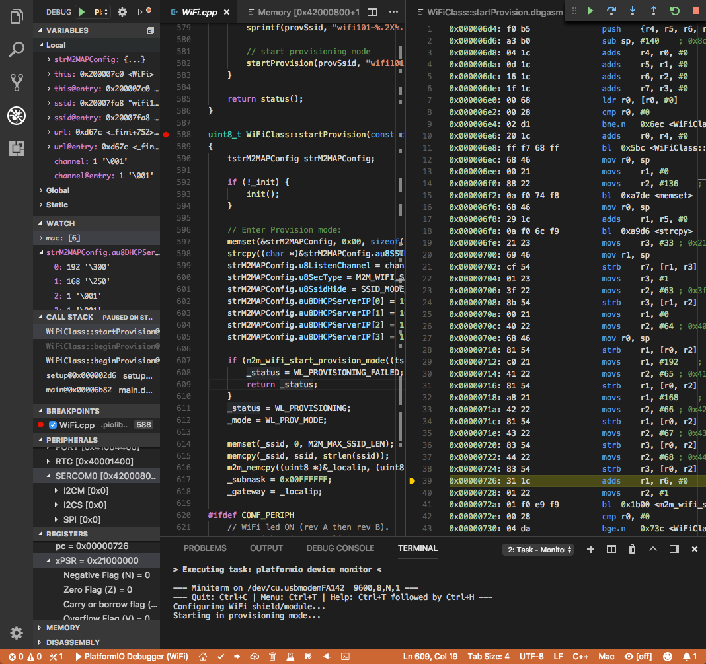

..  Copyright (c) 2014-present PlatformIO <contact@platformio.org>
    Licensed under the Apache License, Version 2.0 (the "License");
    you may not use this file except in compliance with the License.
    You may obtain a copy of the License at
       http://www.apache.org/licenses/LICENSE-2.0
    Unless required by applicable law or agreed to in writing, software
    distributed under the License is distributed on an "AS IS" BASIS,
    WITHOUT WARRANTIES OR CONDITIONS OF ANY KIND, either express or implied.
    See the License for the specific language governing permissions and
    limitations under the License.

.. |PIODebug| replace:: **PIO Unified Debugger**

.. _piodebug:

PIO Unified Debugger
====================

**It Simply Works. Easier than ever before!**

.. note::

  `Demo, discussions, request a support for new hardware. <https://community.platformio.org/t/finally-pio-unified-debugger-comes-to-vscode/4091>`_

PIO Plus offers a unique debugging experience for productive embedded
development. Using our multi-board and multi-architecture programming
experience, we simplified the debugging process in the same way. A zero
debugging configuration with support for the most popular debugging probes
and compatibility between IDEs and OS.

Developers can finally forget about complex UI windows which they need to
pre-configure before a simple “Hello World!” debugging session. No need to
know any aspects about the debugging server or how to configure it. PIO Plus
Unified Debugger does this complex work automatically having a rich
configuration database per each board and debugging probe.

Just select a board, connect debugging probe (if a board does not have
onboard debugging interface), specify it in PlatformIO project configuration
file “platformio.ini”, and a project is ready for 1-Click debugging.

* "1-click" solution, zero configuration
* Support over 300+ embedded boards (see below)
* Multiple architectures and development platforms
* Windows, MacOS, Linux
* Built-in into :ref:`ide_atom` and :ref:`ide_vscode`
* Integration with :ref:`ide_eclipse` and :ref:`ide_sublimetext`

You should have :ref:`pioaccount` to work with |PIODebug|.
A registration is **FREE**.

.. hint::
  In our experience, :ref:`ide_vscode` has the best system performance,
  modern interface for |PIODebug|, and users have found it easier to get started.
  Key debugging features of :ref:`ide_vscode`:

  - Local, Global, and Static Variable Explorer
  - Conditional Breakpoints
  - Expressions and Watchpoints
  - Generic Registers
  - Peripheral Registers
  - Memory Viewer
  - Disassembly
  - Multi-thread support
  - A hot restart of an active debugging session

.. contents:: Contents
    :local:
    :depth: 1

Tutorials
---------

* `ThingForward: First steps with PlatformIO’s Unified Debugger <https://www.thingforward.io/techblog/2018-07-04-first-steps-with-platformios-unified-debugger.html>`_
* `[VIDEO] ThingForward - Intro to PIO Unified Debugger using ARM mbed OS and PlatformIO IDE for VSCode <https://www.youtube.com/watch?v=GtlsW3FDN3E>`_
* :ref:`tutorial_espressif32_arduino_debugging_unit_testing`
* :ref:`tutorial_nordicnrf52_arduino_debugging_unit_testing`
* :ref:`tutorial_stm32cube_debugging_unit_testing`

Configuration
-------------

|PIODebug| can be configured from :ref:`projectconf`:

.. toctree::
  :maxdepth: 2

  ../projectconf/build_configurations
  ../projectconf/section_env_debug

.. _debugging_tools:

Tools & Debug Probes
--------------------

You can switch between debugging tools using :ref:`projectconf_debug_tool`
option.

.. warning::
  You will need to install debug tool drivers depending on your operating
  system. Please check "Drivers" section for debugging tool below.

.. toctree::
  :maxdepth: 1

  debug-tools/atmel-ice
  debug-tools/blackmagic
  debug-tools/cmsis-dap
  debug-tools/esp-prog
  debug-tools/ftdi
  debug-tools/iot-bus-jtag
  debug-tools/jlink
  debug-tools/minimodule
  debug-tools/mspdebug
  debug-tools/olimex-arm-usb-ocd-h
  debug-tools/olimex-arm-usb-ocd
  debug-tools/olimex-arm-usb-tiny-h
  debug-tools/olimex-jtag-tiny
  debug-tools/qemu
  debug-tools/stlink
  debug-tools/ti-icdi
  debug-tools/tumpa
  debug-tools/custom

CLI Guide
---------

.. toctree::
  :maxdepth: 3

  platformio debug <../userguide/cmd_debug>

.. _debugging_platforms:

Platforms
---------
.. list-table::
    :header-rows:  1

    * - Name
      - Description

    * - :ref:`platform_aceinna_imu`
      - Open-source, embedded development platform for Aceinna IMU hardware. Run custom algorithms and navigation code on Aceinna IMU/INS hardware.

    * - :ref:`platform_atmelsam`
      - Atmel | SMART offers Flash- based ARM products based on the ARM Cortex-M0+, Cortex-M3 and Cortex-M4 architectures, ranging from 8KB to 2MB of Flash including a rich peripheral and feature mix.

    * - :ref:`platform_espressif32`
      - Espressif Systems is a privately held fabless semiconductor company. They provide wireless communications and Wi-Fi chips which are widely used in mobile devices and the Internet of Things applications.

    * - :ref:`platform_freescalekinetis`
      - Freescale Kinetis Microcontrollers is family of multiple hardware- and software-compatible ARM Cortex-M0+, Cortex-M4 and Cortex-M7-based MCU series. Kinetis MCUs offer exceptional low-power performance, scalability and feature integration.

    * - :ref:`platform_infineonxmc`
      - Infineon has designed the XMC microcontrollers for real-time critical applications with an industry-standard core. The XMC microcontrollers can be integrated with the Arduino platform

    * - :ref:`platform_kendryte210`
      - Kendryte K210 is an AI capable RISCV64 dual core SoC, this platform is ported by Sipeed.

    * - :ref:`platform_maxim32`
      - Maxim's microcontrollers provide low-power, efficient, and secure solutions for challenging embedded applications. Maxim's processors embed cutting-edge technologies to secure data and intellectual property, proven analog circuitry for real-world applications, and battery-conserving low power operation.

    * - :ref:`platform_nordicnrf51`
      - The Nordic nRF51 Series is a family of highly flexible, multi-protocol, system-on-chip (SoC) devices for ultra-low power wireless applications. nRF51 Series devices support a range of protocol stacks including Bluetooth Smart (previously called Bluetooth low energy), ANT and proprietary 2.4GHz protocols such as Gazell.

    * - :ref:`platform_nordicnrf52`
      - The nRF52 Series are built for speed to carry out increasingly complex tasks in the shortest possible time and return to sleep, conserving precious battery power. They have a Cortex-M4F processor and are the most capable Bluetooth Smart SoCs on the market.

    * - :ref:`platform_nxplpc`
      - The NXP LPC is a family of 32-bit microcontroller integrated circuits by NXP Semiconductors. The LPC chips are grouped into related series that are based around the same 32-bit ARM processor core, such as the Cortex-M4F, Cortex-M3, Cortex-M0+, or Cortex-M0. Internally, each microcontroller consists of the processor core, static RAM memory, flash memory, debugging interface, and various peripherals.

    * - :ref:`platform_riscv_gap`
      - GreenWaves GAP8 IoT application processor enables the cost-effective development, deployment and autonomous operation of intelligent sensing devices that capture, analyze, classify and act on the fusion of rich data sources such as images, sounds or vibrations.

    * - :ref:`platform_samsung_artik`
      - The Samsung ARTIK Smart IoT platform brings hardware modules and cloud services together, with built-in security and an ecosystem of tools and partners to speed up your time-to-market.

    * - :ref:`platform_sifive`
      - SiFive brings the power of open source and software automation to the semiconductor industry, making it possible to develop new hardware faster and more affordably than ever before. 

    * - :ref:`platform_siliconlabsefm32`
      - Silicon Labs EFM32 Gecko 32-bit microcontroller (MCU) family includes devices that offer flash memory configurations up to 256 kB, 32 kB of RAM and CPU speeds up to 48 MHz. Based on the powerful ARM Cortex-M core, the Gecko family features innovative low energy techniques, short wake-up time from energy saving modes and a wide selection of peripherals, making it ideal for battery operated applications and other systems requiring high performance and low-energy consumption.

    * - :ref:`platform_ststm32`
      - The STM32 family of 32-bit Flash MCUs based on the ARM Cortex-M processor is designed to offer new degrees of freedom to MCU users. It offers a 32-bit product range that combines very high performance, real-time capabilities, digital signal processing, and low-power, low-voltage operation, while maintaining full integration and ease of development.

    * - :ref:`platform_ststm8`
      - The STM8 is an 8-bit microcontroller family by STMicroelectronics an extended variant of the ST7 microcontroller architecture. STM8 microcontrollers are particularly low cost for a full-featured 8-bit microcontroller.

    * - :ref:`platform_teensy`
      - Teensy is a complete USB-based microcontroller development system, in a very small footprint, capable of implementing many types of projects. All programming is done via the USB port. No special programmer is needed, only a standard USB cable and a PC or Macintosh with a USB port.

    * - :ref:`platform_timsp430`
      - MSP430 microcontrollers (MCUs) from Texas Instruments (TI) are 16-bit, RISC-based, mixed-signal processors designed for ultra-low power. These MCUs offer the lowest power consumption and the perfect mix of integrated peripherals for thousands of applications.

    * - :ref:`platform_titiva`
      - Texas Instruments TM4C12x MCUs offer the industrys most popular ARM Cortex-M4 core with scalable memory and package options, unparalleled connectivity peripherals, advanced application functions, industry-leading analog integration, and extensive software solutions.

    * - :ref:`platform_wiznet7500`
      - The IOP (Internet Offload Processor) W7500 is the one-chip solution which integrates an ARM Cortex-M0, 128KB Flash and hardwired TCP/IP core for various embedded application platform especially requiring Internet of things

Frameworks
----------
.. list-table::
    :header-rows:  1

    * - Name
      - Description

    * - :ref:`framework_arduino`
      - Arduino Wiring-based Framework allows writing cross-platform software to control devices attached to a wide range of Arduino boards to create all kinds of creative coding, interactive objects, spaces or physical experiences.

    * - :ref:`framework_cmsis`
      - The ARM Cortex Microcontroller Software Interface Standard (CMSIS) is a vendor-independent hardware abstraction layer for the Cortex-M processor series and specifies debugger interfaces. The CMSIS enables consistent and simple software interfaces to the processor for interface peripherals, real-time operating systems, and middleware. It simplifies software re-use, reducing the learning curve for new microcontroller developers and cutting the time-to-market for devices.

    * - :ref:`framework_energia`
      - Energia Wiring-based framework enables pretty much anyone to start easily creating microcontroller-based projects and applications. Its easy-to-use libraries and functions provide developers of all experience levels to start blinking LEDs, buzzing buzzers and sensing sensors more quickly than ever before.

    * - :ref:`framework_espidf`
      - Espressif IoT Development Framework. Official development framework for ESP32.

    * - :ref:`framework_freedom-e-sdk`
      - Open Source Software for Developing on the SiFive Freedom E Platform

    * - :ref:`framework_kendryte-standalone-sdk`
      - Kendryte Standalone SDK without OS support

    * - :ref:`framework_libopencm3`
      - The libOpenCM3 framework aims to create a free/libre/open-source firmware library for various ARM Cortex-M0(+)/M3/M4 microcontrollers, including ST STM32, Ti Tiva and Stellaris, NXP LPC 11xx, 13xx, 15xx, 17xx parts, Atmel SAM3, Energy Micro EFM32 and others.

    * - :ref:`framework_mbed`
      - The mbed framework The mbed SDK has been designed to provide enough hardware abstraction to be intuitive and concise, yet powerful enough to build complex projects. It is built on the low-level ARM CMSIS APIs, allowing you to code down to the metal if needed. In addition to RTOS, USB and Networking libraries, a cookbook of hundreds of reusable peripheral and module libraries have been built on top of the SDK by the mbed Developer Community.

    * - :ref:`framework_pulp-os`
      - PULP is a silicon-proven Parallel Ultra Low Power platform targeting high energy efficiencies. The platform is organized in clusters of RISC-V cores that share a tightly-coupled data memory.

    * - :ref:`framework_simba`
      - Simba is an RTOS and build framework. It aims to make embedded programming easy and portable.

    * - :ref:`framework_spl`
      - The ST Standard Peripheral Library provides a set of functions for handling the peripherals on the STM32 Cortex-M3 family. The idea is to save the user (the new user, in particular) having to deal directly with the registers.

    * - :ref:`framework_stm32cube`
      - STM32Cube embedded software libraries, including: The HAL hardware abstraction layer, enabling portability between different STM32 devices via standardized API calls; The Low-Layer (LL) APIs, a light-weight, optimized, expert oriented set of APIs designed for both performance and runtime efficiency.

    * - :ref:`framework_tizenrt`
      - Tizen RT is a lightweight RTOS-based platform to support low-end IoT devices

Boards
------

.. note::
    For more detailed ``board`` information please scroll tables below by horizontal.

1BitSquared
~~~~~~~~~~~

.. list-table::
    :header-rows:  1

    * - Name
      - Platform
      - Debug
      - MCU
      - Frequency
      - Flash
      - RAM
    * - :ref:`board_ststm32_1bitsy_stm32f415rgt`
      - :ref:`platform_ststm32`
      - External
      - STM32F415RGT
      - 168MHz
      - 1MB
      - 128KB

96Boards
~~~~~~~~

.. list-table::
    :header-rows:  1

    * - Name
      - Platform
      - Debug
      - MCU
      - Frequency
      - Flash
      - RAM
    * - :ref:`board_ststm32_b96b_f446ve`
      - :ref:`platform_ststm32`
      - On-board
      - STM32F446VET6
      - 168MHz
      - 512KB
      - 128KB

Aceinna
~~~~~~~

.. list-table::
    :header-rows:  1

    * - Name
      - Platform
      - Debug
      - MCU
      - Frequency
      - Flash
      - RAM
    * - :ref:`board_aceinna_imu_OpenIMU300ZA`
      - :ref:`platform_aceinna_imu`
      - External
      - STM32F405RG
      - 120MHz
      - 1MB
      - 128KB

Adafruit
~~~~~~~~

.. list-table::
    :header-rows:  1

    * - Name
      - Platform
      - Debug
      - MCU
      - Frequency
      - Flash
      - RAM
    * - :ref:`board_nordicnrf52_adafruit_feather_nrf52832`
      - :ref:`platform_nordicnrf52`
      - On-board
      - NRF52832
      - 64MHz
      - 512KB
      - 64KB
    * - :ref:`board_atmelsam_adafruit_circuitplayground_m0`
      - :ref:`platform_atmelsam`
      - External
      - SAMD21G18A
      - 48MHz
      - 256KB
      - 32KB
    * - :ref:`board_atmelsam_adafruit_crickit_m0`
      - :ref:`platform_atmelsam`
      - External
      - SAMD21G18A
      - 48MHz
      - 256KB
      - 32KB
    * - :ref:`board_espressif32_featheresp32`
      - :ref:`platform_espressif32`
      - External
      - ESP32
      - 240MHz
      - 4MB
      - 320KB
    * - :ref:`board_atmelsam_adafruit_feather_m0`
      - :ref:`platform_atmelsam`
      - External
      - SAMD21G18A
      - 48MHz
      - 256KB
      - 32KB
    * - :ref:`board_atmelsam_adafruit_feather_m0_express`
      - :ref:`platform_atmelsam`
      - External
      - SAMD21G18A
      - 48MHz
      - 256KB
      - 32KB
    * - :ref:`board_atmelsam_adafruit_feather_m4`
      - :ref:`platform_atmelsam`
      - External
      - SAMD51J19A
      - 120MHz
      - 512KB
      - 192KB
    * - :ref:`board_nordicnrf52_adafruit_feather_nrf52840`
      - :ref:`platform_nordicnrf52`
      - On-board
      - NRF52840
      - 64MHz
      - 796KB
      - 243KB
    * - :ref:`board_atmelsam_adafruit_gemma_m0`
      - :ref:`platform_atmelsam`
      - External
      - SAMD21E18A
      - 48MHz
      - 256KB
      - 32KB
    * - :ref:`board_atmelsam_adafruit_grandcentral_m4`
      - :ref:`platform_atmelsam`
      - External
      - SAMD51P20A
      - 120MHz
      - 1MB
      - 256KB
    * - :ref:`board_atmelsam_adafruit_hallowing`
      - :ref:`platform_atmelsam`
      - External
      - SAMD21G18A
      - 48MHz
      - 256KB
      - 32KB
    * - :ref:`board_atmelsam_adafruit_itsybitsy_m0`
      - :ref:`platform_atmelsam`
      - External
      - SAMD21G18A
      - 48MHz
      - 256KB
      - 32KB
    * - :ref:`board_atmelsam_adafruit_itsybitsy_m4`
      - :ref:`platform_atmelsam`
      - External
      - SAMD51G19A
      - 120MHz
      - 512KB
      - 192KB
    * - :ref:`board_atmelsam_adafruit_metro_m0`
      - :ref:`platform_atmelsam`
      - External
      - SAMD21G18A
      - 48MHz
      - 256KB
      - 32KB
    * - :ref:`board_atmelsam_adafruit_metro_m4`
      - :ref:`platform_atmelsam`
      - External
      - SAMD51J19A
      - 120MHz
      - 512KB
      - 192KB
    * - :ref:`board_atmelsam_adafruit_metro_m4_airliftlite`
      - :ref:`platform_atmelsam`
      - External
      - SAMD51J19A
      - 120MHz
      - 512KB
      - 192KB
    * - :ref:`board_atmelsam_adafruit_pygamer_m4`
      - :ref:`platform_atmelsam`
      - External
      - SAMD51J19A
      - 120MHz
      - 512KB
      - 192KB
    * - :ref:`board_atmelsam_adafruit_pyportal_m4`
      - :ref:`platform_atmelsam`
      - External
      - SAMD51J20A
      - 120MHz
      - 1MB
      - 256KB
    * - :ref:`board_atmelsam_adafruit_trellis_m4`
      - :ref:`platform_atmelsam`
      - External
      - SAMD51J19A
      - 120MHz
      - 512KB
      - 192KB
    * - :ref:`board_atmelsam_adafruit_trinket_m0`
      - :ref:`platform_atmelsam`
      - External
      - SAMD21E18A
      - 48MHz
      - 256KB
      - 32KB
    * - :ref:`board_atmelsam_adafruit_pirkey`
      - :ref:`platform_atmelsam`
      - External
      - SAMD21E18A
      - 48MHz
      - 256KB
      - 32KB
    * - :ref:`board_atmelsam_adafruit_pybadge_m4`
      - :ref:`platform_atmelsam`
      - External
      - SAMD51J19A
      - 120MHz
      - 512KB
      - 192KB

Aiyarafun
~~~~~~~~~

.. list-table::
    :header-rows:  1

    * - Name
      - Platform
      - Debug
      - MCU
      - Frequency
      - Flash
      - RAM
    * - :ref:`board_espressif32_node32s`
      - :ref:`platform_espressif32`
      - External
      - ESP32
      - 240MHz
      - 4MB
      - 320KB

Arduino
~~~~~~~

.. list-table::
    :header-rows:  1

    * - Name
      - Platform
      - Debug
      - MCU
      - Frequency
      - Flash
      - RAM
    * - :ref:`board_atmelsam_due`
      - :ref:`platform_atmelsam`
      - External
      - AT91SAM3X8E
      - 84MHz
      - 512KB
      - 96KB
    * - :ref:`board_atmelsam_dueUSB`
      - :ref:`platform_atmelsam`
      - External
      - AT91SAM3X8E
      - 84MHz
      - 512KB
      - 96KB
    * - :ref:`board_atmelsam_mzeroUSB`
      - :ref:`platform_atmelsam`
      - External
      - SAMD21G18A
      - 48MHz
      - 256KB
      - 32KB
    * - :ref:`board_atmelsam_mzeroproUSB`
      - :ref:`platform_atmelsam`
      - External
      - SAMD21G18A
      - 48MHz
      - 256KB
      - 32KB
    * - :ref:`board_atmelsam_mzeropro`
      - :ref:`platform_atmelsam`
      - On-board
      - SAMD21G18A
      - 48MHz
      - 256KB
      - 32KB
    * - :ref:`board_atmelsam_mkrfox1200`
      - :ref:`platform_atmelsam`
      - External
      - SAMD21G18A
      - 48MHz
      - 256KB
      - 32KB
    * - :ref:`board_atmelsam_mkrgsm1400`
      - :ref:`platform_atmelsam`
      - External
      - SAMD21G18A
      - 48MHz
      - 256KB
      - 32KB
    * - :ref:`board_atmelsam_mkrnb1500`
      - :ref:`platform_atmelsam`
      - External
      - SAMD21G18A
      - 48MHz
      - 256KB
      - 32KB
    * - :ref:`board_atmelsam_mkrwan1300`
      - :ref:`platform_atmelsam`
      - External
      - SAMD21G18A
      - 48MHz
      - 256KB
      - 32KB
    * - :ref:`board_atmelsam_mkrwifi1010`
      - :ref:`platform_atmelsam`
      - External
      - SAMD21G18A
      - 48MHz
      - 256KB
      - 32KB
    * - :ref:`board_atmelsam_mkr1000USB`
      - :ref:`platform_atmelsam`
      - External
      - SAMD21G18A
      - 48MHz
      - 256KB
      - 32KB
    * - :ref:`board_atmelsam_mkrzero`
      - :ref:`platform_atmelsam`
      - External
      - SAMD21G18A
      - 48MHz
      - 256KB
      - 32KB
    * - :ref:`board_atmelsam_tian`
      - :ref:`platform_atmelsam`
      - External
      - SAMD21G18A
      - 48MHz
      - 256KB
      - 32KB
    * - :ref:`board_atmelsam_zero`
      - :ref:`platform_atmelsam`
      - On-board
      - SAMD21G18A
      - 48MHz
      - 256KB
      - 32KB
    * - :ref:`board_atmelsam_zeroUSB`
      - :ref:`platform_atmelsam`
      - External
      - SAMD21G18A
      - 48MHz
      - 256KB
      - 32KB
    * - :ref:`board_atmelsam_mkrvidor4000`
      - :ref:`platform_atmelsam`
      - External
      - SAMD21G18A
      - 48MHz
      - 256KB
      - 32KB
    * - :ref:`board_atmelsam_nano_33_iot`
      - :ref:`platform_atmelsam`
      - External
      - SAMD21G18A
      - 48MHz
      - 256KB
      - 32KB

Armed
~~~~~

.. list-table::
    :header-rows:  1

    * - Name
      - Platform
      - Debug
      - MCU
      - Frequency
      - Flash
      - RAM
    * - :ref:`board_ststm32_armed_v1`
      - :ref:`platform_ststm32`
      - External
      - STM32F407VET6
      - 168MHz
      - 512KB
      - 192KB

Armstrap
~~~~~~~~

.. list-table::
    :header-rows:  1

    * - Name
      - Platform
      - Debug
      - MCU
      - Frequency
      - Flash
      - RAM
    * - :ref:`board_ststm32_armstrap_eagle1024`
      - :ref:`platform_ststm32`
      - External
      - STM32F417VGT6
      - 168MHz
      - 1MB
      - 192KB
    * - :ref:`board_ststm32_armstrap_eagle2048`
      - :ref:`platform_ststm32`
      - External
      - STM32F427VIT6
      - 168MHz
      - 1.99MB
      - 256KB
    * - :ref:`board_ststm32_armstrap_eagle512`
      - :ref:`platform_ststm32`
      - External
      - STM32F407VET6
      - 168MHz
      - 512KB
      - 192KB

Atmel
~~~~~

.. list-table::
    :header-rows:  1

    * - Name
      - Platform
      - Debug
      - MCU
      - Frequency
      - Flash
      - RAM
    * - :ref:`board_atmelsam_samr21_xpro`
      - :ref:`platform_atmelsam`
      - On-board
      - SAMR21G18A
      - 48MHz
      - 256KB
      - 32KB
    * - :ref:`board_atmelsam_samd21g18a`
      - :ref:`platform_atmelsam`
      - On-board
      - SAMD21G18A
      - 48MHz
      - 256KB
      - 32KB
    * - :ref:`board_atmelsam_samd21_xpro`
      - :ref:`platform_atmelsam`
      - On-board
      - SAMD21J18A
      - 48MHz
      - 256KB
      - 32KB
    * - :ref:`board_atmelsam_saml21_xpro_b`
      - :ref:`platform_atmelsam`
      - On-board
      - SAML21J18B
      - 48MHz
      - 256KB
      - 32KB

Avnet Silica
~~~~~~~~~~~~

.. list-table::
    :header-rows:  1

    * - Name
      - Platform
      - Debug
      - MCU
      - Frequency
      - Flash
      - RAM
    * - :ref:`board_ststm32_silica_sensor_node`
      - :ref:`platform_ststm32`
      - On-board
      - STM32L476JG
      - 80MHz
      - 1MB
      - 128KB

BBC
~~~

.. list-table::
    :header-rows:  1

    * - Name
      - Platform
      - Debug
      - MCU
      - Frequency
      - Flash
      - RAM
    * - :ref:`board_nordicnrf51_bbcmicrobit`
      - :ref:`platform_nordicnrf51`
      - On-board
      - NRF51822
      - 16MHz
      - 256KB
      - 16KB

BluzDK
~~~~~~

.. list-table::
    :header-rows:  1

    * - Name
      - Platform
      - Debug
      - MCU
      - Frequency
      - Flash
      - RAM
    * - :ref:`board_nordicnrf51_bluz_dk`
      - :ref:`platform_nordicnrf51`
      - External
      - NRF51822
      - 32MHz
      - 256KB
      - 32KB

CQ Publishing
~~~~~~~~~~~~~

.. list-table::
    :header-rows:  1

    * - Name
      - Platform
      - Debug
      - MCU
      - Frequency
      - Flash
      - RAM
    * - :ref:`board_nxplpc_lpc11u35_501`
      - :ref:`platform_nxplpc`
      - External
      - LPC11U35
      - 48MHz
      - 64KB
      - 10KB

Calliope
~~~~~~~~

.. list-table::
    :header-rows:  1

    * - Name
      - Platform
      - Debug
      - MCU
      - Frequency
      - Flash
      - RAM
    * - :ref:`board_nordicnrf51_calliope_mini`
      - :ref:`platform_nordicnrf51`
      - On-board
      - NRF51822
      - 16MHz
      - 256KB
      - 16KB

DFRobot
~~~~~~~

.. list-table::
    :header-rows:  1

    * - Name
      - Platform
      - Debug
      - MCU
      - Frequency
      - Flash
      - RAM
    * - :ref:`board_espressif32_firebeetle32`
      - :ref:`platform_espressif32`
      - External
      - ESP32
      - 240MHz
      - 4MB
      - 320KB

DOIT
~~~~

.. list-table::
    :header-rows:  1

    * - Name
      - Platform
      - Debug
      - MCU
      - Frequency
      - Flash
      - RAM
    * - :ref:`board_espressif32_esp32doit-devkit-v1`
      - :ref:`platform_espressif32`
      - External
      - ESP32
      - 240MHz
      - 4MB
      - 320KB

DSTIKE
~~~~~~

.. list-table::
    :header-rows:  1

    * - Name
      - Platform
      - Debug
      - MCU
      - Frequency
      - Flash
      - RAM
    * - :ref:`board_espressif32_d-duino-32`
      - :ref:`platform_espressif32`
      - External
      - ESP32
      - 240MHz
      - 4MB
      - 320KB

Delta
~~~~~

.. list-table::
    :header-rows:  1

    * - Name
      - Platform
      - Debug
      - MCU
      - Frequency
      - Flash
      - RAM
    * - :ref:`board_nordicnrf52_delta_dfbm_nq620`
      - :ref:`platform_nordicnrf52`
      - On-board
      - NRF52832
      - 64MHz
      - 512KB
      - 64KB
    * - :ref:`board_nordicnrf51_dfcm_nnn40`
      - :ref:`platform_nordicnrf51`
      - On-board
      - NRF51822
      - 32MHz
      - 256KB
      - 32KB
    * - :ref:`board_nordicnrf51_delta_dfcm_nnn50`
      - :ref:`platform_nordicnrf51`
      - On-board
      - NRF51822
      - 32MHz
      - 256KB
      - 16KB

Digistump
~~~~~~~~~

.. list-table::
    :header-rows:  1

    * - Name
      - Platform
      - Debug
      - MCU
      - Frequency
      - Flash
      - RAM
    * - :ref:`board_atmelsam_digix`
      - :ref:`platform_atmelsam`
      - External
      - AT91SAM3X8E
      - 84MHz
      - 512KB
      - 96KB

Diymore
~~~~~~~

.. list-table::
    :header-rows:  1

    * - Name
      - Platform
      - Debug
      - MCU
      - Frequency
      - Flash
      - RAM
    * - :ref:`board_ststm32_diymore_f407vgt`
      - :ref:`platform_ststm32`
      - External
      - STM32F407VGT6
      - 168MHz
      - 512KB
      - 192KB

Dongsen Technology
~~~~~~~~~~~~~~~~~~

.. list-table::
    :header-rows:  1

    * - Name
      - Platform
      - Debug
      - MCU
      - Frequency
      - Flash
      - RAM
    * - :ref:`board_espressif32_pocket_32`
      - :ref:`platform_espressif32`
      - External
      - ESP32
      - 240MHz
      - 4MB
      - 320KB

DycodeX
~~~~~~~

.. list-table::
    :header-rows:  1

    * - Name
      - Platform
      - Debug
      - MCU
      - Frequency
      - Flash
      - RAM
    * - :ref:`board_espressif32_espectro32`
      - :ref:`platform_espressif32`
      - External
      - ESP32
      - 240MHz
      - 4MB
      - 320KB

ESP32vn
~~~~~~~

.. list-table::
    :header-rows:  1

    * - Name
      - Platform
      - Debug
      - MCU
      - Frequency
      - Flash
      - RAM
    * - :ref:`board_espressif32_esp32vn-iot-uno`
      - :ref:`platform_espressif32`
      - External
      - ESP32
      - 240MHz
      - 4MB
      - 320KB

Electronut Labs
~~~~~~~~~~~~~~~

.. list-table::
    :header-rows:  1

    * - Name
      - Platform
      - Debug
      - MCU
      - Frequency
      - Flash
      - RAM
    * - :ref:`board_nordicnrf52_bluey`
      - :ref:`platform_nordicnrf52`
      - External
      - NRF52832
      - 64MHz
      - 512KB
      - 64KB
    * - :ref:`board_nordicnrf52_hackaBLE`
      - :ref:`platform_nordicnrf52`
      - External
      - NRF52832
      - 64MHz
      - 512KB
      - 64KB

Elektor Labs
~~~~~~~~~~~~

.. list-table::
    :header-rows:  1

    * - Name
      - Platform
      - Debug
      - MCU
      - Frequency
      - Flash
      - RAM
    * - :ref:`board_nxplpc_elektor_cocorico`
      - :ref:`platform_nxplpc`
      - On-board
      - LPC812
      - 30MHz
      - 16KB
      - 4KB

Embedded Artists
~~~~~~~~~~~~~~~~

.. list-table::
    :header-rows:  1

    * - Name
      - Platform
      - Debug
      - MCU
      - Frequency
      - Flash
      - RAM
    * - :ref:`board_nxplpc_lpc11u35`
      - :ref:`platform_nxplpc`
      - External
      - LPC11U35
      - 48MHz
      - 64KB
      - 10KB
    * - :ref:`board_nxplpc_lpc4088_dm`
      - :ref:`platform_nxplpc`
      - On-board
      - LPC4088
      - 120MHz
      - 512KB
      - 96KB
    * - :ref:`board_nxplpc_lpc4088`
      - :ref:`platform_nxplpc`
      - On-board
      - LPC4088
      - 120MHz
      - 512KB
      - 96KB

Espotel
~~~~~~~

.. list-table::
    :header-rows:  1

    * - Name
      - Platform
      - Debug
      - MCU
      - Frequency
      - Flash
      - RAM
    * - :ref:`board_ststm32_elmo_f411re`
      - :ref:`platform_ststm32`
      - External
      - STM32F411RET6
      - 100MHz
      - 512KB
      - 128KB

Espressif
~~~~~~~~~

.. list-table::
    :header-rows:  1

    * - Name
      - Platform
      - Debug
      - MCU
      - Frequency
      - Flash
      - RAM
    * - :ref:`board_espressif32_esp-wrover-kit`
      - :ref:`platform_espressif32`
      - On-board
      - ESP32
      - 240MHz
      - 4MB
      - 320KB
    * - :ref:`board_espressif32_esp32dev`
      - :ref:`platform_espressif32`
      - External
      - ESP32
      - 240MHz
      - 4MB
      - 320KB

Fred
~~~~

.. list-table::
    :header-rows:  1

    * - Name
      - Platform
      - Debug
      - MCU
      - Frequency
      - Flash
      - RAM
    * - :ref:`board_espressif32_frogboard`
      - :ref:`platform_espressif32`
      - External
      - ESP32
      - 240MHz
      - 4MB
      - 320KB

Freescale
~~~~~~~~~

.. list-table::
    :header-rows:  1

    * - Name
      - Platform
      - Debug
      - MCU
      - Frequency
      - Flash
      - RAM
    * - :ref:`board_freescalekinetis_IBMEthernetKit`
      - :ref:`platform_freescalekinetis`
      - On-board
      - MK64FN1M0VLL12
      - 120MHz
      - 1MB
      - 256KB
    * - :ref:`board_freescalekinetis_frdm_k20d50m`
      - :ref:`platform_freescalekinetis`
      - On-board
      - MK20DX128VLH5
      - 48MHz
      - 128KB
      - 16KB
    * - :ref:`board_freescalekinetis_frdm_k22f`
      - :ref:`platform_freescalekinetis`
      - On-board
      - MK22FN512VLH12
      - 120MHz
      - 512KB
      - 128KB
    * - :ref:`board_freescalekinetis_frdm_k64f`
      - :ref:`platform_freescalekinetis`
      - On-board
      - MK64FN1M0VLL12
      - 120MHz
      - 1MB
      - 256KB
    * - :ref:`board_freescalekinetis_frdm_k66f`
      - :ref:`platform_freescalekinetis`
      - On-board
      - MK66FN2M0VMD18
      - 180MHz
      - 2MB
      - 256KB
    * - :ref:`board_freescalekinetis_frdm_k82f`
      - :ref:`platform_freescalekinetis`
      - On-board
      - MK82FN256VLL15
      - 150MHz
      - 256KB
      - 256KB
    * - :ref:`board_freescalekinetis_frdm_kl05z`
      - :ref:`platform_freescalekinetis`
      - On-board
      - MKL05Z32VFM4
      - 48MHz
      - 32KB
      - 4KB
    * - :ref:`board_freescalekinetis_frdm_kl25z`
      - :ref:`platform_freescalekinetis`
      - On-board
      - MKL25Z128VLK4
      - 48MHz
      - 128KB
      - 16KB
    * - :ref:`board_freescalekinetis_frdm_kl27z`
      - :ref:`platform_freescalekinetis`
      - On-board
      - MKL27Z64VLH4
      - 48MHz
      - 64KB
      - 16KB
    * - :ref:`board_freescalekinetis_frdm_kl43z`
      - :ref:`platform_freescalekinetis`
      - On-board
      - MKL43Z256VLH4
      - 48MHz
      - 256KB
      - 32KB
    * - :ref:`board_freescalekinetis_frdm_kl46z`
      - :ref:`platform_freescalekinetis`
      - On-board
      - MKL46Z256VLL4
      - 48MHz
      - 256KB
      - 32KB
    * - :ref:`board_freescalekinetis_frdm_kl82z`
      - :ref:`platform_freescalekinetis`
      - External
      - MKL82Z128VLK7
      - 96MHz
      - 128KB
      - 96KB
    * - :ref:`board_freescalekinetis_frdm_kw24d`
      - :ref:`platform_freescalekinetis`
      - External
      - MKW24D512
      - 50MHz
      - 512KB
      - 64KB
    * - :ref:`board_freescalekinetis_frdm_kw41z`
      - :ref:`platform_freescalekinetis`
      - On-board
      - MKW41Z512VHT4
      - 48MHz
      - 512KB
      - 128KB

Generic
~~~~~~~

.. list-table::
    :header-rows:  1

    * - Name
      - Platform
      - Debug
      - MCU
      - Frequency
      - Flash
      - RAM
    * - :ref:`board_ststm32_blackpill_f103c8`
      - :ref:`platform_ststm32`
      - External
      - STM32F103C8T6
      - 72MHz
      - 64KB
      - 20KB
    * - :ref:`board_ststm32_blackpill_f103c8_128`
      - :ref:`platform_ststm32`
      - External
      - STM32F103C8T6
      - 72MHz
      - 128KB
      - 20KB
    * - :ref:`board_ststm32_bluepill_f103c6`
      - :ref:`platform_ststm32`
      - External
      - STM32F103C6T6
      - 72MHz
      - 32KB
      - 10KB
    * - :ref:`board_ststm32_bluepill_f103c8`
      - :ref:`platform_ststm32`
      - External
      - STM32F103C8T6
      - 72MHz
      - 64KB
      - 20KB
    * - :ref:`board_ststm32_bluepill_f103c8_128k`
      - :ref:`platform_ststm32`
      - External
      - STM32F103C8T6
      - 72MHz
      - 128KB
      - 20KB
    * - :ref:`board_ststm32_demo_f030f4`
      - :ref:`platform_ststm32`
      - External
      - STM32F030F4P6
      - 48MHz
      - 16KB
      - 4KB
    * - :ref:`board_ststm32_fk407m1`
      - :ref:`platform_ststm32`
      - External
      - STM32F407VET6
      - 168MHz
      - 512KB
      - 192KB
    * - :ref:`board_ststm32_genericSTM32F103C8`
      - :ref:`platform_ststm32`
      - External
      - STM32F103C8T6
      - 72MHz
      - 64KB
      - 20KB
    * - :ref:`board_ststm32_genericSTM32F103CB`
      - :ref:`platform_ststm32`
      - External
      - STM32F103CBT6
      - 72MHz
      - 128KB
      - 20KB
    * - :ref:`board_ststm32_genericSTM32F103R8`
      - :ref:`platform_ststm32`
      - External
      - STM32F103R8T6
      - 72MHz
      - 64KB
      - 20KB
    * - :ref:`board_ststm32_genericSTM32F103RB`
      - :ref:`platform_ststm32`
      - External
      - STM32F103RBT6
      - 72MHz
      - 128KB
      - 20KB
    * - :ref:`board_ststm32_genericSTM32F103RC`
      - :ref:`platform_ststm32`
      - External
      - STM32F103RCT6
      - 72MHz
      - 256KB
      - 48KB
    * - :ref:`board_ststm32_genericSTM32F103RE`
      - :ref:`platform_ststm32`
      - External
      - STM32F103RET6
      - 72MHz
      - 512KB
      - 64KB
    * - :ref:`board_ststm32_genericSTM32F103T8`
      - :ref:`platform_ststm32`
      - External
      - STM32F103T8T6
      - 72MHz
      - 20KB
      - 64KB
    * - :ref:`board_ststm32_genericSTM32F103TB`
      - :ref:`platform_ststm32`
      - External
      - STM32F103TBT6
      - 72MHz
      - 128KB
      - 20KB
    * - :ref:`board_ststm32_genericSTM32F103VB`
      - :ref:`platform_ststm32`
      - External
      - STM32F103VBT6
      - 72MHz
      - 128KB
      - 20KB
    * - :ref:`board_ststm32_genericSTM32F103VC`
      - :ref:`platform_ststm32`
      - External
      - STM32F103VCT6
      - 72MHz
      - 256KB
      - 48KB
    * - :ref:`board_ststm32_genericSTM32F103VD`
      - :ref:`platform_ststm32`
      - External
      - STM32F103VDT6
      - 72MHz
      - 384KB
      - 64KB
    * - :ref:`board_ststm32_genericSTM32F103VE`
      - :ref:`platform_ststm32`
      - External
      - STM32F103VET6
      - 72MHz
      - 512KB
      - 64KB
    * - :ref:`board_ststm32_genericSTM32F103ZC`
      - :ref:`platform_ststm32`
      - External
      - STM32F103ZCT6
      - 72MHz
      - 256KB
      - 48KB
    * - :ref:`board_ststm32_genericSTM32F103ZD`
      - :ref:`platform_ststm32`
      - External
      - STM32F103ZDT6
      - 72MHz
      - 384KB
      - 64KB
    * - :ref:`board_ststm32_genericSTM32F103ZE`
      - :ref:`platform_ststm32`
      - External
      - STM32F103ZET6
      - 72MHz
      - 512KB
      - 64KB
    * - :ref:`board_ststm32_genericSTM32F303CB`
      - :ref:`platform_ststm32`
      - External
      - STM32F303CBT6
      - 72MHz
      - 128KB
      - 32KB
    * - :ref:`board_ststm32_genericSTM32F407VET6`
      - :ref:`platform_ststm32`
      - External
      - STM32F407VET6
      - 168MHz
      - 502.23KB
      - 128KB
    * - :ref:`board_ststm32_genericSTM32F407VGT6`
      - :ref:`platform_ststm32`
      - External
      - STM32F407VGT6
      - 168MHz
      - 1MB
      - 192KB
    * - :ref:`board_ststm32_stm32f4stamp`
      - :ref:`platform_ststm32`
      - External
      - STM32F405RGT6
      - 168MHz
      - 1MB
      - 192KB

Gimasi
~~~~~~

.. list-table::
    :header-rows:  1

    * - Name
      - Platform
      - Debug
      - MCU
      - Frequency
      - Flash
      - RAM
    * - :ref:`board_atmelsam_tuinozero96`
      - :ref:`platform_atmelsam`
      - External
      - SAMD21G18A
      - 48MHz
      - 256KB
      - 32KB

GreenWaves Technologies
~~~~~~~~~~~~~~~~~~~~~~~

.. list-table::
    :header-rows:  1

    * - Name
      - Platform
      - Debug
      - MCU
      - Frequency
      - Flash
      - RAM
    * - :ref:`board_riscv_gap_gapuino`
      - :ref:`platform_riscv_gap`
      - On-board
      - GAP8
      - 250MHz
      - 64MB
      - 8MB

HY
~~

.. list-table::
    :header-rows:  1

    * - Name
      - Platform
      - Debug
      - MCU
      - Frequency
      - Flash
      - RAM
    * - :ref:`board_ststm32_hy_tinystm103tb`
      - :ref:`platform_ststm32`
      - External
      - STM32F103TBU6
      - 72MHz
      - 128KB
      - 20KB

Heltec Automation
~~~~~~~~~~~~~~~~~

.. list-table::
    :header-rows:  1

    * - Name
      - Platform
      - Debug
      - MCU
      - Frequency
      - Flash
      - RAM
    * - :ref:`board_espressif32_heltec_wifi_lora_32`
      - :ref:`platform_espressif32`
      - External
      - ESP32
      - 240MHz
      - 4MB
      - 320KB
    * - :ref:`board_espressif32_heltec_wifi_lora_32_V2`
      - :ref:`platform_espressif32`
      - External
      - ESP32
      - 240MHz
      - 8MB
      - 320KB
    * - :ref:`board_espressif32_heltec_wireless_stick`
      - :ref:`platform_espressif32`
      - External
      - ESP32
      - 240MHz
      - 8MB
      - 320KB

Hornbill
~~~~~~~~

.. list-table::
    :header-rows:  1

    * - Name
      - Platform
      - Debug
      - MCU
      - Frequency
      - Flash
      - RAM
    * - :ref:`board_espressif32_hornbill32dev`
      - :ref:`platform_espressif32`
      - External
      - ESP32
      - 240MHz
      - 4MB
      - 320KB
    * - :ref:`board_espressif32_hornbill32minima`
      - :ref:`platform_espressif32`
      - External
      - ESP32
      - 240MHz
      - 4MB
      - 320KB

Infineon
~~~~~~~~

.. list-table::
    :header-rows:  1

    * - Name
      - Platform
      - Debug
      - MCU
      - Frequency
      - Flash
      - RAM
    * - :ref:`board_infineonxmc_xmc1100_boot_kit`
      - :ref:`platform_infineonxmc`
      - On-board
      - XMC1100
      - 32MHz
      - 64KB
      - 16KB
    * - :ref:`board_infineonxmc_xmc1100_h_bridge2go`
      - :ref:`platform_infineonxmc`
      - On-board
      - XMC1100
      - 32MHz
      - 64KB
      - 16KB
    * - :ref:`board_infineonxmc_xmc1100_xmc2go`
      - :ref:`platform_infineonxmc`
      - On-board
      - XMC1100
      - 32MHz
      - 64KB
      - 16KB
    * - :ref:`board_infineonxmc_xmc1300_boot_kit`
      - :ref:`platform_infineonxmc`
      - On-board
      - XMC1300
      - 32MHz
      - 64KB
      - 16KB
    * - :ref:`board_infineonxmc_xmc1300_sense2gol`
      - :ref:`platform_infineonxmc`
      - On-board
      - XMC1300
      - 32MHz
      - 32KB
      - 16KB
    * - :ref:`board_infineonxmc_xmc1400_boot_kit`
      - :ref:`platform_infineonxmc`
      - On-board
      - XMC1400
      - 48MHz
      - 1.95MB
      - 16KB
    * - :ref:`board_infineonxmc_xmc4200_distance2go`
      - :ref:`platform_infineonxmc`
      - On-board
      - XMC4200
      - 80MHz
      - 256KB
      - 40KB
    * - :ref:`board_infineonxmc_xmc4700_relax_kit`
      - :ref:`platform_infineonxmc`
      - On-board
      - XMC4700
      - 144MHz
      - 2.00MB
      - 1.95MB

JKSoft
~~~~~~

.. list-table::
    :header-rows:  1

    * - Name
      - Platform
      - Debug
      - MCU
      - Frequency
      - Flash
      - RAM
    * - :ref:`board_nordicnrf51_wallbot_ble`
      - :ref:`platform_nordicnrf51`
      - On-board
      - NRF51822
      - 16MHz
      - 128KB
      - 16KB

LeafLabs
~~~~~~~~

.. list-table::
    :header-rows:  1

    * - Name
      - Platform
      - Debug
      - MCU
      - Frequency
      - Flash
      - RAM
    * - :ref:`board_ststm32_maple`
      - :ref:`platform_ststm32`
      - External
      - STM32F103RBT6
      - 72MHz
      - 108KB
      - 17KB
    * - :ref:`board_ststm32_maple_ret6`
      - :ref:`platform_ststm32`
      - External
      - STM32F103RET6
      - 72MHz
      - 256KB
      - 48KB
    * - :ref:`board_ststm32_maple_mini_b20`
      - :ref:`platform_ststm32`
      - External
      - STM32F103CBT6
      - 72MHz
      - 120KB
      - 20KB
    * - :ref:`board_ststm32_maple_mini_origin`
      - :ref:`platform_ststm32`
      - External
      - STM32F103CBT6
      - 72MHz
      - 108KB
      - 17KB

LowPowerLab
~~~~~~~~~~~

.. list-table::
    :header-rows:  1

    * - Name
      - Platform
      - Debug
      - MCU
      - Frequency
      - Flash
      - RAM
    * - :ref:`board_atmelsam_moteino_zero`
      - :ref:`platform_atmelsam`
      - External
      - SAMD21G18A
      - 48MHz
      - 256KB
      - 32KB

MH-ET Live
~~~~~~~~~~

.. list-table::
    :header-rows:  1

    * - Name
      - Platform
      - Debug
      - MCU
      - Frequency
      - Flash
      - RAM
    * - :ref:`board_espressif32_mhetesp32devkit`
      - :ref:`platform_espressif32`
      - External
      - ESP32
      - 240MHz
      - 4MB
      - 320KB
    * - :ref:`board_espressif32_mhetesp32minikit`
      - :ref:`platform_espressif32`
      - External
      - ESP32
      - 240MHz
      - 4MB
      - 320KB

MXChip
~~~~~~

.. list-table::
    :header-rows:  1

    * - Name
      - Platform
      - Debug
      - MCU
      - Frequency
      - Flash
      - RAM
    * - :ref:`board_ststm32_mxchip_az3166`
      - :ref:`platform_ststm32`
      - On-board
      - STM32F412ZGT6
      - 100MHz
      - 1MB
      - 256KB

Macchina
~~~~~~~~

.. list-table::
    :header-rows:  1

    * - Name
      - Platform
      - Debug
      - MCU
      - Frequency
      - Flash
      - RAM
    * - :ref:`board_atmelsam_macchina2`
      - :ref:`platform_atmelsam`
      - External
      - AT91SAM3X8E
      - 84MHz
      - 512KB
      - 96KB

Malyan
~~~~~~

.. list-table::
    :header-rows:  1

    * - Name
      - Platform
      - Debug
      - MCU
      - Frequency
      - Flash
      - RAM
    * - :ref:`board_ststm32_malyanm200_f070cb`
      - :ref:`platform_ststm32`
      - External
      - STM32F070CBT6
      - 48MHz
      - 120KB
      - 14.81KB
    * - :ref:`board_ststm32_malyanm200_f103cb`
      - :ref:`platform_ststm32`
      - External
      - STM32F103CBT6
      - 72MHz
      - 120KB
      - 20KB

Maxim
~~~~~

.. list-table::
    :header-rows:  1

    * - Name
      - Platform
      - Debug
      - MCU
      - Frequency
      - Flash
      - RAM
    * - :ref:`board_maxim32_max32620fthr`
      - :ref:`platform_maxim32`
      - External
      - MAX32620FTHR
      - 96MHz
      - 2MB
      - 256KB
    * - :ref:`board_maxim32_max32600mbed`
      - :ref:`platform_maxim32`
      - On-board
      - MAX32600
      - 24MHz
      - 256KB
      - 32KB
    * - :ref:`board_maxim32_max32620hsp`
      - :ref:`platform_maxim32`
      - External
      - MAX32620
      - 96MHz
      - 2MB
      - 256KB
    * - :ref:`board_maxim32_maxwsnenv`
      - :ref:`platform_maxim32`
      - External
      - MAX32610
      - 24MHz
      - 256KB
      - 32KB

Microduino
~~~~~~~~~~

.. list-table::
    :header-rows:  1

    * - Name
      - Platform
      - Debug
      - MCU
      - Frequency
      - Flash
      - RAM
    * - :ref:`board_ststm32_microduino32_flash`
      - :ref:`platform_ststm32`
      - External
      - STM32F103CBT6
      - 72MHz
      - 105.47KB
      - 16.60KB

Micromint
~~~~~~~~~

.. list-table::
    :header-rows:  1

    * - Name
      - Platform
      - Debug
      - MCU
      - Frequency
      - Flash
      - RAM
    * - :ref:`board_nxplpc_lpc4330_m4`
      - :ref:`platform_nxplpc`
      - On-board
      - LPC4330
      - 204MHz
      - 8MB
      - 264KB

MikroElektronika
~~~~~~~~~~~~~~~~

.. list-table::
    :header-rows:  1

    * - Name
      - Platform
      - Debug
      - MCU
      - Frequency
      - Flash
      - RAM
    * - :ref:`board_freescalekinetis_hexiwear`
      - :ref:`platform_freescalekinetis`
      - External
      - MK64FN1M0VDC12
      - 120MHz
      - 1MB
      - 256KB

MultiTech
~~~~~~~~~

.. list-table::
    :header-rows:  1

    * - Name
      - Platform
      - Debug
      - MCU
      - Frequency
      - Flash
      - RAM
    * - :ref:`board_ststm32_mts_dragonfly_f411re`
      - :ref:`platform_ststm32`
      - External
      - STM32F411RET6
      - 100MHz
      - 512KB
      - 128KB
    * - :ref:`board_ststm32_mts_mdot_f405rg`
      - :ref:`platform_ststm32`
      - External
      - STM32F411RET6
      - 100MHz
      - 512KB
      - 128KB
    * - :ref:`board_ststm32_mts_mdot_f411re`
      - :ref:`platform_ststm32`
      - External
      - STM32F411RET6
      - 100MHz
      - 512KB
      - 128KB
    * - :ref:`board_ststm32_xdot_l151cc`
      - :ref:`platform_ststm32`
      - External
      - STM32L151CCU6
      - 32MHz
      - 256KB
      - 32KB

NGX Technologies
~~~~~~~~~~~~~~~~

.. list-table::
    :header-rows:  1

    * - Name
      - Platform
      - Debug
      - MCU
      - Frequency
      - Flash
      - RAM
    * - :ref:`board_nxplpc_blueboard_lpc11u24`
      - :ref:`platform_nxplpc`
      - External
      - LPC11U24
      - 48MHz
      - 32KB
      - 8KB

NXP
~~~

.. list-table::
    :header-rows:  1

    * - Name
      - Platform
      - Debug
      - MCU
      - Frequency
      - Flash
      - RAM
    * - :ref:`board_nxplpc_lpc11u24_301`
      - :ref:`platform_nxplpc`
      - On-board
      - LPC11U24
      - 48MHz
      - 32KB
      - 8KB
    * - :ref:`board_nxplpc_lpc11u68`
      - :ref:`platform_nxplpc`
      - On-board
      - LPC11U68
      - 50MHz
      - 256KB
      - 36KB
    * - :ref:`board_nxplpc_lpc824`
      - :ref:`platform_nxplpc`
      - On-board
      - LPC824
      - 30MHz
      - 32KB
      - 8KB
    * - :ref:`board_nxplpc_lpc11c24`
      - :ref:`platform_nxplpc`
      - External
      - LPC11C24
      - 48MHz
      - 32KB
      - 8KB
    * - :ref:`board_nxplpc_lpc11u34_421`
      - :ref:`platform_nxplpc`
      - External
      - LPC11U34
      - 48MHz
      - 40KB
      - 8KB
    * - :ref:`board_nxplpc_lpc11u37_501`
      - :ref:`platform_nxplpc`
      - External
      - LPC11U37
      - 48MHz
      - 128KB
      - 10KB
    * - :ref:`board_nxplpc_lpc812`
      - :ref:`platform_nxplpc`
      - On-board
      - LPC812
      - 30MHz
      - 16KB
      - 4KB
    * - :ref:`board_nxplpc_lpc1549`
      - :ref:`platform_nxplpc`
      - External
      - LPC1549
      - 72MHz
      - 256KB
      - 36KB
    * - :ref:`board_nxplpc_lpc54114`
      - :ref:`platform_nxplpc`
      - On-board
      - LPC54114J256BD64
      - 100MHz
      - 256KB
      - 192KB
    * - :ref:`board_nxplpc_lpc546xx`
      - :ref:`platform_nxplpc`
      - On-board
      - LPC54608ET512
      - 180MHz
      - 512KB
      - 200KB
    * - :ref:`board_nxplpc_lpc11u24`
      - :ref:`platform_nxplpc`
      - On-board
      - LPC11U24
      - 48MHz
      - 32KB
      - 8KB
    * - :ref:`board_nxplpc_lpc1768`
      - :ref:`platform_nxplpc`
      - On-board
      - LPC1768
      - 96MHz
      - 512KB
      - 64KB

Netduino
~~~~~~~~

.. list-table::
    :header-rows:  1

    * - Name
      - Platform
      - Debug
      - MCU
      - Frequency
      - Flash
      - RAM
    * - :ref:`board_ststm32_netduino2plus`
      - :ref:`platform_ststm32`
      - External
      - STM32F405RGT6
      - 168MHz
      - 1MB
      - 192KB

NodeMCU
~~~~~~~

.. list-table::
    :header-rows:  1

    * - Name
      - Platform
      - Debug
      - MCU
      - Frequency
      - Flash
      - RAM
    * - :ref:`board_espressif32_nodemcu-32s`
      - :ref:`platform_espressif32`
      - External
      - ESP32
      - 240MHz
      - 4MB
      - 320KB

Nordic
~~~~~~

.. list-table::
    :header-rows:  1

    * - Name
      - Platform
      - Debug
      - MCU
      - Frequency
      - Flash
      - RAM
    * - :ref:`board_nordicnrf51_nrf51_beacon`
      - :ref:`platform_nordicnrf51`
      - On-board
      - NRF51822
      - 32MHz
      - 256KB
      - 32KB
    * - :ref:`board_nordicnrf51_nrf51_dongle`
      - :ref:`platform_nordicnrf51`
      - On-board
      - NRF51822
      - 32MHz
      - 256KB
      - 32KB
    * - :ref:`board_nordicnrf51_nrf51_mkit`
      - :ref:`platform_nordicnrf51`
      - On-board
      - NRF51822
      - 16MHz
      - 128KB
      - 16KB
    * - :ref:`board_nordicnrf51_nrf51_dk`
      - :ref:`platform_nordicnrf51`
      - On-board
      - NRF51822
      - 32MHz
      - 256KB
      - 32KB
    * - :ref:`board_nordicnrf52_nrf52_dk`
      - :ref:`platform_nordicnrf52`
      - On-board
      - NRF52832
      - 64MHz
      - 512KB
      - 64KB
    * - :ref:`board_nordicnrf52_nrf52840_dk`
      - :ref:`platform_nordicnrf52`
      - On-board
      - NRF52840
      - 64MHz
      - 1MB
      - 256KB
    * - :ref:`board_nordicnrf52_nrf52840_dk_adafruit`
      - :ref:`platform_nordicnrf52`
      - On-board
      - NRF52840
      - 64MHz
      - 796KB
      - 243KB

OLIMEX
~~~~~~

.. list-table::
    :header-rows:  1

    * - Name
      - Platform
      - Debug
      - MCU
      - Frequency
      - Flash
      - RAM
    * - :ref:`board_espressif32_esp32-evb`
      - :ref:`platform_espressif32`
      - External
      - ESP32
      - 240MHz
      - 4MB
      - 320KB
    * - :ref:`board_espressif32_esp32-gateway`
      - :ref:`platform_espressif32`
      - External
      - ESP32
      - 240MHz
      - 4MB
      - 320KB

OSHChip
~~~~~~~

.. list-table::
    :header-rows:  1

    * - Name
      - Platform
      - Debug
      - MCU
      - Frequency
      - Flash
      - RAM
    * - :ref:`board_nordicnrf51_oshchip`
      - :ref:`platform_nordicnrf51`
      - External
      - NRF51822
      - 32MHz
      - 256KB
      - 32KB

Pycom Ltd.
~~~~~~~~~~

.. list-table::
    :header-rows:  1

    * - Name
      - Platform
      - Debug
      - MCU
      - Frequency
      - Flash
      - RAM
    * - :ref:`board_espressif32_lopy`
      - :ref:`platform_espressif32`
      - External
      - ESP32
      - 240MHz
      - 4MB
      - 320KB
    * - :ref:`board_espressif32_lopy4`
      - :ref:`platform_espressif32`
      - External
      - ESP32
      - 240MHz
      - 4MB
      - 1.25MB

RAK
~~~

.. list-table::
    :header-rows:  1

    * - Name
      - Platform
      - Debug
      - MCU
      - Frequency
      - Flash
      - RAM
    * - :ref:`board_ststm32_rak811_tracker_32`
      - :ref:`platform_ststm32`
      - External
      - STM32L151RBT6
      - 32MHz
      - 128KB
      - 32KB
    * - :ref:`board_ststm32_rak811_tracker`
      - :ref:`platform_ststm32`
      - External
      - STM32L151RBT6
      - 32MHz
      - 128KB
      - 16KB

RUMBA
~~~~~

.. list-table::
    :header-rows:  1

    * - Name
      - Platform
      - Debug
      - MCU
      - Frequency
      - Flash
      - RAM
    * - :ref:`board_ststm32_rumba32_f446ve`
      - :ref:`platform_ststm32`
      - External
      - STM32F446RET6
      - 180MHz
      - 512KB
      - 128KB

RedBearLab
~~~~~~~~~~

.. list-table::
    :header-rows:  1

    * - Name
      - Platform
      - Debug
      - MCU
      - Frequency
      - Flash
      - RAM
    * - :ref:`board_nordicnrf51_redBearLabBLENano`
      - :ref:`platform_nordicnrf51`
      - On-board
      - NRF51822
      - 16MHz
      - 256KB
      - 32KB
    * - :ref:`board_nordicnrf52_redbear_blenano2`
      - :ref:`platform_nordicnrf52`
      - On-board
      - NRF52832
      - 64MHz
      - 512KB
      - 64KB
    * - :ref:`board_nordicnrf52_redbear_blend2`
      - :ref:`platform_nordicnrf52`
      - On-board
      - NRF52832
      - 64MHz
      - 512KB
      - 64KB
    * - :ref:`board_nordicnrf51_redBearLab`
      - :ref:`platform_nordicnrf51`
      - On-board
      - NRF51822
      - 16MHz
      - 256KB
      - 16KB

RemRam
~~~~~~

.. list-table::
    :header-rows:  1

    * - Name
      - Platform
      - Debug
      - MCU
      - Frequency
      - Flash
      - RAM
    * - :ref:`board_ststm32_remram_v1`
      - :ref:`platform_ststm32`
      - On-board
      - STM32F765VIT6
      - 216MHz
      - 2MB
      - 512KB

ReprapWorld
~~~~~~~~~~~

.. list-table::
    :header-rows:  1

    * - Name
      - Platform
      - Debug
      - MCU
      - Frequency
      - Flash
      - RAM
    * - :ref:`board_atmelsam_minitronics20`
      - :ref:`platform_atmelsam`
      - External
      - SAMD21J18A
      - 48MHz
      - 256KB
      - 32KB

RoboticsBrno
~~~~~~~~~~~~

.. list-table::
    :header-rows:  1

    * - Name
      - Platform
      - Debug
      - MCU
      - Frequency
      - Flash
      - RAM
    * - :ref:`board_espressif32_alksesp32`
      - :ref:`platform_espressif32`
      - External
      - ESP32
      - 240MHz
      - 4MB
      - 320KB

RushUp
~~~~~~

.. list-table::
    :header-rows:  1

    * - Name
      - Platform
      - Debug
      - MCU
      - Frequency
      - Flash
      - RAM
    * - :ref:`board_ststm32_cloud_jam`
      - :ref:`platform_ststm32`
      - On-board
      - STM32F401RET6
      - 84MHz
      - 512KB
      - 96KB
    * - :ref:`board_ststm32_cloud_jam_l4`
      - :ref:`platform_ststm32`
      - On-board
      - STM32L476RGT6
      - 80MHz
      - 1MB
      - 128KB

SODAQ
~~~~~

.. list-table::
    :header-rows:  1

    * - Name
      - Platform
      - Debug
      - MCU
      - Frequency
      - Flash
      - RAM
    * - :ref:`board_atmelsam_sodaq_autonomo`
      - :ref:`platform_atmelsam`
      - External
      - SAMD21J18A
      - 48MHz
      - 256KB
      - 32KB
    * - :ref:`board_atmelsam_sodaq_explorer`
      - :ref:`platform_atmelsam`
      - External
      - SAMD21J18A
      - 48MHz
      - 256KB
      - 32KB
    * - :ref:`board_atmelsam_sodaq_one`
      - :ref:`platform_atmelsam`
      - External
      - SAMD21G18A
      - 48MHz
      - 256KB
      - 32KB
    * - :ref:`board_atmelsam_sodaq_sara`
      - :ref:`platform_atmelsam`
      - External
      - SAMD21J18A
      - 48MHz
      - 256KB
      - 32KB
    * - :ref:`board_atmelsam_sodaq_sff`
      - :ref:`platform_atmelsam`
      - External
      - SAMD21G18A
      - 48MHz
      - 256KB
      - 32KB

ST
~~

.. list-table::
    :header-rows:  1

    * - Name
      - Platform
      - Debug
      - MCU
      - Frequency
      - Flash
      - RAM
    * - :ref:`board_ststm32_black_f407ve`
      - :ref:`platform_ststm32`
      - External
      - STM32F407VET6
      - 168MHz
      - 512KB
      - 192KB
    * - :ref:`board_ststm32_black_f407vg`
      - :ref:`platform_ststm32`
      - External
      - STM32F407VGT6
      - 168MHz
      - 512KB
      - 192KB
    * - :ref:`board_ststm32_black_f407zg`
      - :ref:`platform_ststm32`
      - External
      - STM32F407ZGT6
      - 168MHz
      - 1MB
      - 192KB
    * - :ref:`board_ststm32_black_f407ze`
      - :ref:`platform_ststm32`
      - External
      - STM32F407ZET6
      - 168MHz
      - 512KB
      - 192KB
    * - :ref:`board_ststm32_blue_f407ve_mini`
      - :ref:`platform_ststm32`
      - External
      - STM32F407VET6
      - 168MHz
      - 512KB
      - 192KB
    * - :ref:`board_ststm32_disco_f334c8`
      - :ref:`platform_ststm32`
      - On-board
      - STM32F334C8T6
      - 72MHz
      - 64KB
      - 12KB
    * - :ref:`board_ststm32_disco_f401vc`
      - :ref:`platform_ststm32`
      - On-board
      - STM32F401VCT6
      - 84MHz
      - 256KB
      - 64KB
    * - :ref:`board_ststm32_disco_f411ve`
      - :ref:`platform_ststm32`
      - On-board
      - STM32F411VET6
      - 100MHz
      - 512KB
      - 128KB
    * - :ref:`board_ststm32_disco_f413zh`
      - :ref:`platform_ststm32`
      - On-board
      - STM32F413ZHT6
      - 100MHz
      - 512KB
      - 128KB
    * - :ref:`board_ststm32_disco_f429zi`
      - :ref:`platform_ststm32`
      - On-board
      - STM32F429ZIT6
      - 180MHz
      - 2MB
      - 256KB
    * - :ref:`board_ststm32_disco_f469ni`
      - :ref:`platform_ststm32`
      - On-board
      - STM32F469NIH6
      - 180MHz
      - 1MB
      - 384KB
    * - :ref:`board_ststm32_disco_f746ng`
      - :ref:`platform_ststm32`
      - On-board
      - STM32F746NGH6
      - 216MHz
      - 1MB
      - 320KB
    * - :ref:`board_ststm32_disco_f769ni`
      - :ref:`platform_ststm32`
      - On-board
      - STM32F769NIH6
      - 216MHz
      - 1MB
      - 512KB
    * - :ref:`board_ststm32_disco_l053c8`
      - :ref:`platform_ststm32`
      - On-board
      - STM32L053C8T6
      - 32MHz
      - 64KB
      - 8KB
    * - :ref:`board_ststm32_disco_l100rc`
      - :ref:`platform_ststm32`
      - On-board
      - STM32L100RCT6
      - 32MHz
      - 256KB
      - 16KB
    * - :ref:`board_ststm32_disco_l476vg`
      - :ref:`platform_ststm32`
      - On-board
      - STM32L476VGT6
      - 80MHz
      - 1MB
      - 128KB
    * - :ref:`board_ststm32_disco_l496ag`
      - :ref:`platform_ststm32`
      - On-board
      - STM32L496AGI6
      - 80MHz
      - 1MB
      - 320KB
    * - :ref:`board_ststm32_disco_l072cz_lrwan1`
      - :ref:`platform_ststm32`
      - On-board
      - STM32L072CZ
      - 32MHz
      - 192KB
      - 20KB
    * - :ref:`board_ststm32_disco_l475vg_iot01a`
      - :ref:`platform_ststm32`
      - On-board
      - STM32L475VGT6
      - 80MHz
      - 1MB
      - 128KB
    * - :ref:`board_ststm32_disco_f072rb`
      - :ref:`platform_ststm32`
      - On-board
      - STM32F072RBT6
      - 48MHz
      - 128KB
      - 16KB
    * - :ref:`board_ststm32_nucleo_f030r8`
      - :ref:`platform_ststm32`
      - On-board
      - STM32F030R8T6
      - 48MHz
      - 64KB
      - 8KB
    * - :ref:`board_ststm32_nucleo_f031k6`
      - :ref:`platform_ststm32`
      - On-board
      - STM32F031K6T6
      - 48MHz
      - 32KB
      - 4KB
    * - :ref:`board_ststm32_nucleo_f042k6`
      - :ref:`platform_ststm32`
      - On-board
      - STM32F042K6T6
      - 48MHz
      - 32KB
      - 6KB
    * - :ref:`board_ststm32_nucleo_f070rb`
      - :ref:`platform_ststm32`
      - On-board
      - STM32F070RBT6
      - 48MHz
      - 128KB
      - 16KB
    * - :ref:`board_ststm32_nucleo_f072rb`
      - :ref:`platform_ststm32`
      - On-board
      - STM32F072RBT6
      - 48MHz
      - 128KB
      - 16KB
    * - :ref:`board_ststm32_nucleo_f091rc`
      - :ref:`platform_ststm32`
      - On-board
      - STM32F091RCT6
      - 48MHz
      - 256KB
      - 32KB
    * - :ref:`board_ststm32_nucleo_f103rb`
      - :ref:`platform_ststm32`
      - On-board
      - STM32F103RBT6
      - 72MHz
      - 128KB
      - 20KB
    * - :ref:`board_ststm32_nucleo_f207zg`
      - :ref:`platform_ststm32`
      - On-board
      - STM32F207ZGT6
      - 120MHz
      - 1MB
      - 128KB
    * - :ref:`board_ststm32_nucleo_f302r8`
      - :ref:`platform_ststm32`
      - On-board
      - STM32F302R8T6
      - 72MHz
      - 64KB
      - 16KB
    * - :ref:`board_ststm32_nucleo_f303k8`
      - :ref:`platform_ststm32`
      - On-board
      - STM32F303K8T6
      - 72MHz
      - 64KB
      - 16KB
    * - :ref:`board_ststm32_nucleo_f303re`
      - :ref:`platform_ststm32`
      - On-board
      - STM32F303RET6
      - 72MHz
      - 512KB
      - 64KB
    * - :ref:`board_ststm32_nucleo_f303ze`
      - :ref:`platform_ststm32`
      - On-board
      - STM32F303ZET6
      - 72MHz
      - 512KB
      - 64KB
    * - :ref:`board_ststm32_nucleo_f334r8`
      - :ref:`platform_ststm32`
      - On-board
      - STM32F334R8T6
      - 72MHz
      - 64KB
      - 16KB
    * - :ref:`board_ststm32_nucleo_f401re`
      - :ref:`platform_ststm32`
      - On-board
      - STM32F401RET6
      - 84MHz
      - 512KB
      - 96KB
    * - :ref:`board_ststm32_nucleo_f410rb`
      - :ref:`platform_ststm32`
      - On-board
      - STM32F410RBT6
      - 100MHz
      - 128KB
      - 32KB
    * - :ref:`board_ststm32_nucleo_f411re`
      - :ref:`platform_ststm32`
      - On-board
      - STM32F411RET6
      - 100MHz
      - 512KB
      - 128KB
    * - :ref:`board_ststm32_nucleo_f412zg`
      - :ref:`platform_ststm32`
      - On-board
      - STM32F412ZGT6
      - 100MHz
      - 1MB
      - 256KB
    * - :ref:`board_ststm32_nucleo_f413zh`
      - :ref:`platform_ststm32`
      - On-board
      - STM32F413ZHT6
      - 100MHz
      - 512KB
      - 128KB
    * - :ref:`board_ststm32_nucleo_f429zi`
      - :ref:`platform_ststm32`
      - On-board
      - STM32F429ZIT6
      - 180MHz
      - 2MB
      - 256KB
    * - :ref:`board_ststm32_nucleo_f439zi`
      - :ref:`platform_ststm32`
      - On-board
      - STM32F439ZIT6
      - 180MHz
      - 2MB
      - 256KB
    * - :ref:`board_ststm32_nucleo_f446re`
      - :ref:`platform_ststm32`
      - On-board
      - STM32F446RET6
      - 180MHz
      - 512KB
      - 128KB
    * - :ref:`board_ststm32_nucleo_f446ze`
      - :ref:`platform_ststm32`
      - On-board
      - STM32F446ZET6
      - 180MHz
      - 512KB
      - 128KB
    * - :ref:`board_ststm32_nucleo_f722ze`
      - :ref:`platform_ststm32`
      - On-board
      - STM32F722ZET6
      - 216MHz
      - 512KB
      - 256KB
    * - :ref:`board_ststm32_nucleo_f746zg`
      - :ref:`platform_ststm32`
      - On-board
      - STM32F746ZGT6
      - 216MHz
      - 1MB
      - 320KB
    * - :ref:`board_ststm32_nucleo_f756zg`
      - :ref:`platform_ststm32`
      - On-board
      - STM32F756ZG
      - 216MHz
      - 1MB
      - 320KB
    * - :ref:`board_ststm32_nucleo_f767zi`
      - :ref:`platform_ststm32`
      - On-board
      - STM32F767ZIT6
      - 216MHz
      - 2MB
      - 512KB
    * - :ref:`board_ststm32_nucleo_h743zi`
      - :ref:`platform_ststm32`
      - On-board
      - STM32H743ZIT6
      - 400MHz
      - 2MB
      - 1MB
    * - :ref:`board_ststm32_nucleo_l011k4`
      - :ref:`platform_ststm32`
      - On-board
      - STM32L011K4T6
      - 32MHz
      - 16KB
      - 2KB
    * - :ref:`board_ststm32_nucleo_l031k6`
      - :ref:`platform_ststm32`
      - On-board
      - STM32L031K6T6
      - 32MHz
      - 32KB
      - 8KB
    * - :ref:`board_ststm32_nucleo_l053r8`
      - :ref:`platform_ststm32`
      - On-board
      - STM32L053R8T6
      - 32MHz
      - 64KB
      - 8KB
    * - :ref:`board_ststm32_nucleo_l073rz`
      - :ref:`platform_ststm32`
      - On-board
      - STM32L073RZ
      - 32MHz
      - 192KB
      - 20KB
    * - :ref:`board_ststm32_nucleo_l152re`
      - :ref:`platform_ststm32`
      - On-board
      - STM32L152RET6
      - 32MHz
      - 512KB
      - 80KB
    * - :ref:`board_ststm32_nucleo_l412kb`
      - :ref:`platform_ststm32`
      - On-board
      - STM32L412KBU6
      - 80MHz
      - 128KB
      - 40KB
    * - :ref:`board_ststm32_nucleo_l432kc`
      - :ref:`platform_ststm32`
      - On-board
      - STM32L432KCU6
      - 80MHz
      - 256KB
      - 64KB
    * - :ref:`board_ststm32_nucleo_l433rc_p`
      - :ref:`platform_ststm32`
      - On-board
      - STM32L433RC
      - 80MHz
      - 256KB
      - 64KB
    * - :ref:`board_ststm32_nucleo_l452re`
      - :ref:`platform_ststm32`
      - On-board
      - STM32L452RET6
      - 80MHz
      - 256KB
      - 64KB
    * - :ref:`board_ststm32_nucleo_l486rg`
      - :ref:`platform_ststm32`
      - On-board
      - STM32L476RGT6
      - 80MHz
      - 1MB
      - 128KB
    * - :ref:`board_ststm32_nucleo_l476rg`
      - :ref:`platform_ststm32`
      - On-board
      - STM32L476RGT6
      - 80MHz
      - 1MB
      - 128KB
    * - :ref:`board_ststm32_nucleo_l496zg`
      - :ref:`platform_ststm32`
      - On-board
      - STM32L496ZGT6
      - 80MHz
      - 1MB
      - 128KB
    * - :ref:`board_ststm32_nucleo_l496zg_p`
      - :ref:`platform_ststm32`
      - On-board
      - STM32L496ZGT6P
      - 80MHz
      - 1MB
      - 320KB
    * - :ref:`board_ststm32_nucleo_l4r5zi`
      - :ref:`platform_ststm32`
      - On-board
      - STM32L4R5ZIT6
      - 120MHz
      - 2MB
      - 640KB
    * - :ref:`board_ststm32_disco_f030r8`
      - :ref:`platform_ststm32`
      - On-board
      - STM32F030R8T6
      - 48MHz
      - 64KB
      - 8KB
    * - :ref:`board_ststm32_disco_f051r8`
      - :ref:`platform_ststm32`
      - On-board
      - STM32F051R8T6
      - 48MHz
      - 64KB
      - 8KB
    * - :ref:`board_ststm32_disco_f303vc`
      - :ref:`platform_ststm32`
      - On-board
      - STM32F303VCT6
      - 72MHz
      - 256KB
      - 48KB
    * - :ref:`board_ststm32_disco_f407vg`
      - :ref:`platform_ststm32`
      - On-board
      - STM32F407VGT6
      - 168MHz
      - 1MB
      - 192KB
    * - :ref:`board_ststm32_eval_l073z`
      - :ref:`platform_ststm32`
      - On-board
      - STM32L073VZT6
      - 32MHz
      - 192KB
      - 20KB
    * - :ref:`board_ststm32_disco_l152rb`
      - :ref:`platform_ststm32`
      - On-board
      - STM32L152RBT6
      - 32MHz
      - 128KB
      - 16KB
    * - :ref:`board_ststm32_disco_f100rb`
      - :ref:`platform_ststm32`
      - On-board
      - STM32F100RBT6
      - 24MHz
      - 128KB
      - 8KB
    * - :ref:`board_ststm8_stm8sdisco`
      - :ref:`platform_ststm8`
      - On-board
      - STM8S105C6T6
      - 16MHz
      - 32KB
      - 2KB

SainSmart
~~~~~~~~~

.. list-table::
    :header-rows:  1

    * - Name
      - Platform
      - Debug
      - MCU
      - Frequency
      - Flash
      - RAM
    * - :ref:`board_atmelsam_sainSmartDue`
      - :ref:`platform_atmelsam`
      - External
      - AT91SAM3X8E
      - 84MHz
      - 512KB
      - 96KB
    * - :ref:`board_atmelsam_sainSmartDueUSB`
      - :ref:`platform_atmelsam`
      - External
      - AT91SAM3X8E
      - 84MHz
      - 512KB
      - 96KB

Samsung
~~~~~~~

.. list-table::
    :header-rows:  1

    * - Name
      - Platform
      - Debug
      - MCU
      - Frequency
      - Flash
      - RAM
    * - :ref:`board_samsung_artik_artik_053`
      - :ref:`platform_samsung_artik`
      - On-board
      - S5JT200
      - 320MHz
      - 8MB
      - 1.25MB

Seeed
~~~~~

.. list-table::
    :header-rows:  1

    * - Name
      - Platform
      - Debug
      - MCU
      - Frequency
      - Flash
      - RAM
    * - :ref:`board_atmelsam_seeeduino_lorawan`
      - :ref:`platform_atmelsam`
      - External
      - SAMD21G18A
      - 48MHz
      - 256KB
      - 32KB

SeeedStudio
~~~~~~~~~~~

.. list-table::
    :header-rows:  1

    * - Name
      - Platform
      - Debug
      - MCU
      - Frequency
      - Flash
      - RAM
    * - :ref:`board_nordicnrf51_seeedArchBLE`
      - :ref:`platform_nordicnrf51`
      - On-board
      - NRF51822
      - 16MHz
      - 128KB
      - 16KB
    * - :ref:`board_nordicnrf51_seeedArchLink`
      - :ref:`platform_nordicnrf51`
      - On-board
      - NRF51822
      - 16MHz
      - 256KB
      - 16KB
    * - :ref:`board_ststm32_seeedArchMax`
      - :ref:`platform_ststm32`
      - On-board
      - STM32F407VET6
      - 168MHz
      - 512KB
      - 192KB
    * - :ref:`board_nxplpc_seeedArchPro`
      - :ref:`platform_nxplpc`
      - On-board
      - LPC1768
      - 96MHz
      - 512KB
      - 64KB
    * - :ref:`board_nordicnrf51_seeedTinyBLE`
      - :ref:`platform_nordicnrf51`
      - On-board
      - NRF51822
      - 16MHz
      - 256KB
      - 16KB
    * - :ref:`board_ststm32_wio_3g`
      - :ref:`platform_ststm32`
      - On-board
      - STM32F439VI
      - 180MHz
      - 2MB
      - 256KB

Semtech
~~~~~~~

.. list-table::
    :header-rows:  1

    * - Name
      - Platform
      - Debug
      - MCU
      - Frequency
      - Flash
      - RAM
    * - :ref:`board_ststm32_mote_l152rc`
      - :ref:`platform_ststm32`
      - External
      - STM32L152RC
      - 32MHz
      - 256KB
      - 32KB

SiFive
~~~~~~

.. list-table::
    :header-rows:  1

    * - Name
      - Platform
      - Debug
      - MCU
      - Frequency
      - Flash
      - RAM
    * - :ref:`board_sifive_hifive-unleashed`
      - :ref:`platform_sifive`
      - On-board
      - FU540
      - 1500MHz
      - 32MB
      - 8GB
    * - :ref:`board_sifive_hifive1`
      - :ref:`platform_sifive`
      - On-board
      - FE310
      - 320MHz
      - 16MB
      - 16KB
    * - :ref:`board_sifive_hifive1-revb`
      - :ref:`platform_sifive`
      - On-board
      - FE310
      - 320MHz
      - 16MB
      - 16KB

Sigma Delta Technologies
~~~~~~~~~~~~~~~~~~~~~~~~

.. list-table::
    :header-rows:  1

    * - Name
      - Platform
      - Debug
      - MCU
      - Frequency
      - Flash
      - RAM
    * - :ref:`board_nordicnrf52_sdt52832b`
      - :ref:`platform_nordicnrf52`
      - External
      - NRF52832
      - 64MHz
      - 512KB
      - 64KB

Silicognition
~~~~~~~~~~~~~

.. list-table::
    :header-rows:  1

    * - Name
      - Platform
      - Debug
      - MCU
      - Frequency
      - Flash
      - RAM
    * - :ref:`board_espressif32_wesp32`
      - :ref:`platform_espressif32`
      - External
      - ESP32
      - 240MHz
      - 4MB
      - 320KB

Silicon Labs
~~~~~~~~~~~~

.. list-table::
    :header-rows:  1

    * - Name
      - Platform
      - Debug
      - MCU
      - Frequency
      - Flash
      - RAM
    * - :ref:`board_siliconlabsefm32_efm32gg_stk3700`
      - :ref:`platform_siliconlabsefm32`
      - On-board
      - EFM32GG990F1024
      - 48MHz
      - 1MB
      - 128KB
    * - :ref:`board_siliconlabsefm32_efm32lg_stk3600`
      - :ref:`platform_siliconlabsefm32`
      - On-board
      - EFM32LG990F256
      - 48MHz
      - 256KB
      - 32KB
    * - :ref:`board_siliconlabsefm32_efm32wg_stk3800`
      - :ref:`platform_siliconlabsefm32`
      - On-board
      - EFM32WG990F256
      - 48MHz
      - 256KB
      - 32KB
    * - :ref:`board_siliconlabsefm32_efm32zg_stk3200`
      - :ref:`platform_siliconlabsefm32`
      - On-board
      - EFM32ZG222F32
      - 24MHz
      - 32KB
      - 4KB
    * - :ref:`board_siliconlabsefm32_efm32hg_stk3400`
      - :ref:`platform_siliconlabsefm32`
      - On-board
      - EFM32HG322F64
      - 25MHz
      - 64KB
      - 8KB
    * - :ref:`board_siliconlabsefm32_efm32pg_stk3401`
      - :ref:`platform_siliconlabsefm32`
      - On-board
      - EFM32PG1B200F256GM48
      - 40MHz
      - 256KB
      - 32KB
    * - :ref:`board_siliconlabsefm32_tb_sense_12`
      - :ref:`platform_siliconlabsefm32`
      - On-board
      - EFR32MG12P432F1024
      - 40MHz
      - 1MB
      - 256KB

Sipeed
~~~~~~

.. list-table::
    :header-rows:  1

    * - Name
      - Platform
      - Debug
      - MCU
      - Frequency
      - Flash
      - RAM
    * - :ref:`board_kendryte210_sipeed-maix-bit`
      - :ref:`platform_kendryte210`
      - On-board
      - K210
      - 400MHz
      - 16MB
      - 6MB
    * - :ref:`board_kendryte210_sipeed-maix-go`
      - :ref:`platform_kendryte210`
      - On-board
      - K210
      - 400MHz
      - 16MB
      - 6MB
    * - :ref:`board_kendryte210_sipeed-maix-one`
      - :ref:`platform_kendryte210`
      - On-board
      - K210
      - 400MHz
      - 16MB
      - 6MB

Solder Splash Labs
~~~~~~~~~~~~~~~~~~

.. list-table::
    :header-rows:  1

    * - Name
      - Platform
      - Debug
      - MCU
      - Frequency
      - Flash
      - RAM
    * - :ref:`board_nxplpc_lpc1347`
      - :ref:`platform_nxplpc`
      - External
      - LPC1347
      - 72MHz
      - 64KB
      - 12KB
    * - :ref:`board_nxplpc_dipcortexm0`
      - :ref:`platform_nxplpc`
      - External
      - LPC11U24
      - 50MHz
      - 32KB
      - 8KB

SparkFun
~~~~~~~~

.. list-table::
    :header-rows:  1

    * - Name
      - Platform
      - Debug
      - MCU
      - Frequency
      - Flash
      - RAM
    * - :ref:`board_espressif32_sparkfun_lora_gateway_1-channel`
      - :ref:`platform_espressif32`
      - External
      - ESP32
      - 240MHz
      - 4MB
      - 320KB
    * - :ref:`board_atmelsam_sparkfun_samd21_dev_usb`
      - :ref:`platform_atmelsam`
      - External
      - SAMD21G18A
      - 48MHz
      - 256KB
      - 32KB
    * - :ref:`board_atmelsam_sparkfun_samd21_mini_usb`
      - :ref:`platform_atmelsam`
      - External
      - SAMD21G18A
      - 48MHz
      - 256KB
      - 32KB

SparkFun Electronics
~~~~~~~~~~~~~~~~~~~~

.. list-table::
    :header-rows:  1

    * - Name
      - Platform
      - Debug
      - MCU
      - Frequency
      - Flash
      - RAM
    * - :ref:`board_espressif32_esp32thing`
      - :ref:`platform_espressif32`
      - External
      - ESP32
      - 240MHz
      - 4MB
      - 320KB

Switch Science
~~~~~~~~~~~~~~

.. list-table::
    :header-rows:  1

    * - Name
      - Platform
      - Debug
      - MCU
      - Frequency
      - Flash
      - RAM
    * - :ref:`board_nordicnrf51_hrm1017`
      - :ref:`platform_nordicnrf51`
      - On-board
      - NRF51822
      - 16MHz
      - 256KB
      - 16KB
    * - :ref:`board_nxplpc_lpc1114fn28`
      - :ref:`platform_nxplpc`
      - On-board
      - LPC1114FN28
      - 48MHz
      - 32KB
      - 4KB
    * - :ref:`board_nxplpc_ssci824`
      - :ref:`platform_nxplpc`
      - On-board
      - LPC824
      - 30MHz
      - 32KB
      - 8KB
    * - :ref:`board_nordicnrf51_ty51822r3`
      - :ref:`platform_nordicnrf51`
      - On-board
      - NRF51822
      - 32MHz
      - 256KB
      - 32KB

TI
~~

.. list-table::
    :header-rows:  1

    * - Name
      - Platform
      - Debug
      - MCU
      - Frequency
      - Flash
      - RAM
    * - :ref:`board_timsp430_lpmsp430fr5739`
      - :ref:`platform_timsp430`
      - On-board
      - MSP430FR5739
      - 16MHz
      - 16KB
      - 512B
    * - :ref:`board_titiva_lplm4f120h5qr`
      - :ref:`platform_titiva`
      - On-board
      - LPLM4F120H5QR
      - 80MHz
      - 256KB
      - 32KB
    * - :ref:`board_titiva_lptm4c1230c3pm`
      - :ref:`platform_titiva`
      - On-board
      - LPTM4C1230C3PM
      - 80MHz
      - 256KB
      - 32KB
    * - :ref:`board_titiva_lptm4c1294ncpdt`
      - :ref:`platform_titiva`
      - On-board
      - LPTM4C1294NCPDT
      - 120MHz
      - 1MB
      - 256KB
    * - :ref:`board_timsp430_lpmsp430f5529`
      - :ref:`platform_timsp430`
      - On-board
      - MSP430F5529
      - 16MHz
      - 128KB
      - 8KB
    * - :ref:`board_timsp430_lpmsp430fr4133`
      - :ref:`platform_timsp430`
      - On-board
      - MSP430FR4133
      - 8MHz
      - 15KB
      - 2KB
    * - :ref:`board_timsp430_lpmsp430fr5969`
      - :ref:`platform_timsp430`
      - On-board
      - MSP430FR5969
      - 8MHz
      - 64KB
      - 2KB
    * - :ref:`board_timsp430_lpmsp430fr6989`
      - :ref:`platform_timsp430`
      - On-board
      - MSP430FR6989
      - 8MHz
      - 127KB
      - 2KB
    * - :ref:`board_timsp430_lpmsp430g2553`
      - :ref:`platform_timsp430`
      - On-board
      - MSP430G2553
      - 16MHz
      - 16KB
      - 512B

TTGO
~~~~

.. list-table::
    :header-rows:  1

    * - Name
      - Platform
      - Debug
      - MCU
      - Frequency
      - Flash
      - RAM
    * - :ref:`board_espressif32_ttgo-lora32-v1`
      - :ref:`platform_espressif32`
      - External
      - ESP32
      - 240MHz
      - 4MB
      - 320KB
    * - :ref:`board_espressif32_ttgo-t-beam`
      - :ref:`platform_espressif32`
      - External
      - ESP32
      - 240MHz
      - 4MB
      - 1.25MB

Taida Century
~~~~~~~~~~~~~

.. list-table::
    :header-rows:  1

    * - Name
      - Platform
      - Debug
      - MCU
      - Frequency
      - Flash
      - RAM
    * - :ref:`board_nordicnrf52_stct_nrf52_minidev`
      - :ref:`platform_nordicnrf52`
      - External
      - NRF52832
      - 64MHz
      - 512KB
      - 64KB

Teensy
~~~~~~

.. list-table::
    :header-rows:  1

    * - Name
      - Platform
      - Debug
      - MCU
      - Frequency
      - Flash
      - RAM
    * - :ref:`board_teensy_teensy31`
      - :ref:`platform_teensy`
      - External
      - MK20DX256
      - 72MHz
      - 256KB
      - 64KB
    * - :ref:`board_teensy_teensy35`
      - :ref:`platform_teensy`
      - External
      - MK64FX512
      - 120MHz
      - 512KB
      - 255.99KB
    * - :ref:`board_teensy_teensy36`
      - :ref:`platform_teensy`
      - External
      - MK66FX1M0
      - 180MHz
      - 1MB
      - 256KB
    * - :ref:`board_teensy_teensylc`
      - :ref:`platform_teensy`
      - External
      - MKL26Z64
      - 48MHz
      - 62KB
      - 8KB

ThaiEasyElec
~~~~~~~~~~~~

.. list-table::
    :header-rows:  1

    * - Name
      - Platform
      - Debug
      - MCU
      - Frequency
      - Flash
      - RAM
    * - :ref:`board_espressif32_espino32`
      - :ref:`platform_espressif32`
      - External
      - ESP32
      - 240MHz
      - 4MB
      - 320KB

Unknown
~~~~~~~

.. list-table::
    :header-rows:  1

    * - Name
      - Platform
      - Debug
      - MCU
      - Frequency
      - Flash
      - RAM
    * - :ref:`board_espressif32_fm-devkit`
      - :ref:`platform_espressif32`
      - External
      - ESP32
      - 240MHz
      - 4MB
      - 320KB

VNG
~~~

.. list-table::
    :header-rows:  1

    * - Name
      - Platform
      - Debug
      - MCU
      - Frequency
      - Flash
      - RAM
    * - :ref:`board_nordicnrf51_vbluno51`
      - :ref:`platform_nordicnrf51`
      - On-board
      - NRF51822
      - 16MHz
      - 128KB
      - 32KB

WEMOS
~~~~~

.. list-table::
    :header-rows:  1

    * - Name
      - Platform
      - Debug
      - MCU
      - Frequency
      - Flash
      - RAM
    * - :ref:`board_espressif32_lolin_d32`
      - :ref:`platform_espressif32`
      - External
      - ESP32
      - 240MHz
      - 4MB
      - 320KB
    * - :ref:`board_espressif32_lolin_d32_pro`
      - :ref:`platform_espressif32`
      - External
      - ESP32
      - 240MHz
      - 4MB
      - 320KB
    * - :ref:`board_espressif32_lolin32`
      - :ref:`platform_espressif32`
      - External
      - ESP32
      - 240MHz
      - 4MB
      - 320KB
    * - :ref:`board_espressif32_wemosbat`
      - :ref:`platform_espressif32`
      - External
      - ESP32
      - 240MHz
      - 4MB
      - 320KB

WIZNet
~~~~~~

.. list-table::
    :header-rows:  1

    * - Name
      - Platform
      - Debug
      - MCU
      - Frequency
      - Flash
      - RAM
    * - :ref:`board_wiznet7500_wizwiki_w7500`
      - :ref:`platform_wiznet7500`
      - On-board
      - WIZNET7500
      - 48MHz
      - 128KB
      - 48KB
    * - :ref:`board_wiznet7500_wizwiki_w7500eco`
      - :ref:`platform_wiznet7500`
      - On-board
      - WIZNET7500ECO
      - 48MHz
      - 128KB
      - 48KB
    * - :ref:`board_wiznet7500_wizwiki_w7500p`
      - :ref:`platform_wiznet7500`
      - On-board
      - WIZNET7500P
      - 48MHz
      - 128KB
      - 48KB

Waveshare
~~~~~~~~~

.. list-table::
    :header-rows:  1

    * - Name
      - Platform
      - Debug
      - MCU
      - Frequency
      - Flash
      - RAM
    * - :ref:`board_nordicnrf51_waveshare_ble400`
      - :ref:`platform_nordicnrf51`
      - External
      - NRF51822
      - 32MHz
      - 256KB
      - 32KB

Xilinx
~~~~~~

.. list-table::
    :header-rows:  1

    * - Name
      - Platform
      - Debug
      - MCU
      - Frequency
      - Flash
      - RAM
    * - :ref:`board_sifive_e310-arty`
      - :ref:`platform_sifive`
      - On-board
      - FE310
      - 450MHz
      - 16MB
      - 256MB

XinaBox
~~~~~~~

.. list-table::
    :header-rows:  1

    * - Name
      - Platform
      - Debug
      - MCU
      - Frequency
      - Flash
      - RAM
    * - :ref:`board_espressif32_xinabox_cw02`
      - :ref:`platform_espressif32`
      - External
      - ESP32
      - 240MHz
      - 4MB
      - 320KB

ng-beacon
~~~~~~~~~

.. list-table::
    :header-rows:  1

    * - Name
      - Platform
      - Debug
      - MCU
      - Frequency
      - Flash
      - RAM
    * - :ref:`board_nordicnrf51_ng_beacon`
      - :ref:`platform_nordicnrf51`
      - External
      - NRF51822
      - 16MHz
      - 256KB
      - 32KB

oddWires
~~~~~~~~

.. list-table::
    :header-rows:  1

    * - Name
      - Platform
      - Debug
      - MCU
      - Frequency
      - Flash
      - RAM
    * - :ref:`board_espressif32_iotbusio`
      - :ref:`platform_espressif32`
      - External
      - ESP32
      - 240MHz
      - 4MB
      - 320KB
    * - :ref:`board_espressif32_iotbusproteus`
      - :ref:`platform_espressif32`
      - External
      - ESP32
      - 240MHz
      - 4MB
      - 320KB

rhomb.io
~~~~~~~~

.. list-table::
    :header-rows:  1

    * - Name
      - Platform
      - Debug
      - MCU
      - Frequency
      - Flash
      - RAM
    * - :ref:`board_ststm32_rhombio_l476dmw1k`
      - :ref:`platform_ststm32`
      - On-board
      - STM32L476VGT6
      - 80MHz
      - 1MB
      - 128KB

sakura.io
~~~~~~~~~

.. list-table::
    :header-rows:  1

    * - Name
      - Platform
      - Debug
      - MCU
      - Frequency
      - Flash
      - RAM
    * - :ref:`board_ststm32_sakuraio_evb_01`
      - :ref:`platform_ststm32`
      - On-board
      - STM32F411RET6
      - 100MHz
      - 1MB
      - 128KB

sino:bit
~~~~~~~~

.. list-table::
    :header-rows:  1

    * - Name
      - Platform
      - Debug
      - MCU
      - Frequency
      - Flash
      - RAM
    * - :ref:`board_nordicnrf51_Sinobit`
      - :ref:`platform_nordicnrf51`
      - External
      - NRF51822
      - 32MHz
      - 256KB
      - 32KB

u-blox
~~~~~~

.. list-table::
    :header-rows:  1

    * - Name
      - Platform
      - Debug
      - MCU
      - Frequency
      - Flash
      - RAM
    * - :ref:`board_ststm32_mbed_connect_odin`
      - :ref:`platform_ststm32`
      - On-board
      - STM32F439ZIY6
      - 168MHz
      - 2MB
      - 256KB
    * - :ref:`board_nxplpc_ubloxc027`
      - :ref:`platform_nxplpc`
      - On-board
      - LPC1768
      - 96MHz
      - 512KB
      - 64KB
    * - :ref:`board_ststm32_ublox_c030_n211`
      - :ref:`platform_ststm32`
      - External
      - STM32F437VG
      - 180MHz
      - 1MB
      - 256KB
    * - :ref:`board_ststm32_ublox_c030_r410m`
      - :ref:`platform_ststm32`
      - On-board
      - STM32F437VG
      - 180MHz
      - 1MB
      - 256KB
    * - :ref:`board_ststm32_ublox_c030_u201`
      - :ref:`platform_ststm32`
      - External
      - STM32F437VG
      - 180MHz
      - 1MB
      - 256KB
    * - :ref:`board_nordicnrf52_ublox_evk_nina_b1`
      - :ref:`platform_nordicnrf52`
      - On-board
      - NRF52832
      - 64MHz
      - 512KB
      - 64KB
    * - :ref:`board_ststm32_ublox_evk_odin_w2`
      - :ref:`platform_ststm32`
      - External
      - STM32F439ZIY6
      - 168MHz
      - 2MB
      - 256KB
    * - :ref:`board_ststm32_mtb_ublox_odin_w2`
      - :ref:`platform_ststm32`
      - External
      - STM32F439ZIY6
      - 168MHz
      - 2MB
      - 256KB

y5 design
~~~~~~~~~

.. list-table::
    :header-rows:  1

    * - Name
      - Platform
      - Debug
      - MCU
      - Frequency
      - Flash
      - RAM
    * - :ref:`board_nxplpc_lpc11u35_y5_mbug`
      - :ref:`platform_nxplpc`
      - External
      - LPC11U35
      - 48MHz
      - 64KB
      - 10KB
    * - :ref:`board_nordicnrf51_nrf51822_y5_mbug`
      - :ref:`platform_nordicnrf51`
      - On-board
      - NRF51822
      - 16MHz
      - 256KB
      - 16KB
