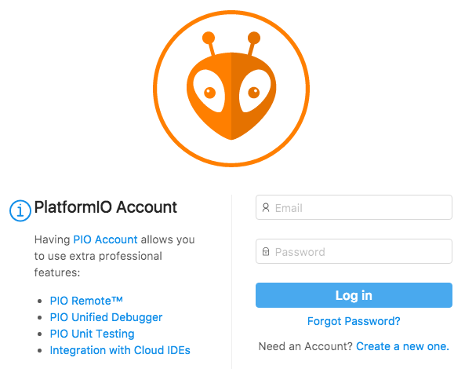

..  Copyright (c) 2014-present PlatformIO <contact@platformio.org>
    Licensed under the Apache License, Version 2.0 (the "License");
    you may not use this file except in compliance with the License.
    You may obtain a copy of the License at
       http://www.apache.org/licenses/LICENSE-2.0
    Unless required by applicable law or agreed to in writing, software
    distributed under the License is distributed on an "AS IS" BASIS,
    WITHOUT WARRANTIES OR CONDITIONS OF ANY KIND, either express or implied.
    See the License for the specific language governing permissions and
    limitations under the License.

.. _pioaccount:

PIO Account
===========

**PIO Account** is required for using:

* :ref:`pioremote`
* Integration with :ref:`ide_cloud`

A registration is **FREE**.

PlatformIO IDE
--------------

:ref:`pioide` has built-in UI in PIO Home to manage PIO Account. You can
create a new account, reset your password or fetch an authentication token.

CLI Guide
---------

.. toctree::
    :maxdepth: 2

    ../userguide/account/index
