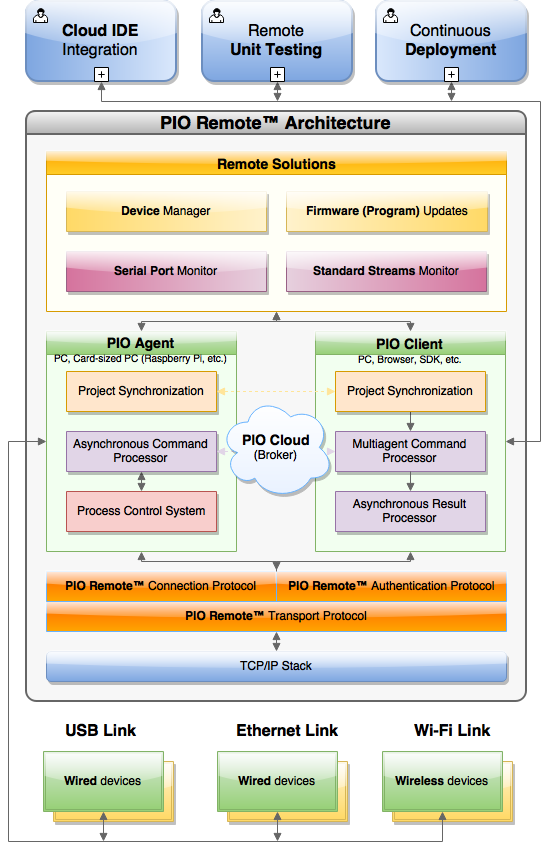

..  Copyright (c) 2014-present PlatformIO <contact@platformio.org>
    Licensed under the Apache License, Version 2.0 (the "License");
    you may not use this file except in compliance with the License.
    You may obtain a copy of the License at
       http://www.apache.org/licenses/LICENSE-2.0
    Unless required by applicable law or agreed to in writing, software
    distributed under the License is distributed on an "AS IS" BASIS,
    WITHOUT WARRANTIES OR CONDITIONS OF ANY KIND, either express or implied.
    See the License for the specific language governing permissions and
    limitations under the License.

.. |PIORemote| replace:: **PlatformIO Remote Development Solution**
.. |PIOCloud| replace:: PlatformIO Cloud

.. _pioremote:

Remote Development
==================

**Your devices are always with you!**

.. contents:: Contents
    :local:
    :depth: 1

|PIORemote| allows you to work remotely with devices from
*Anywhere In The World*. No matter where are you now! Run a small and
cross-platform :ref:`cmd_remote_agent` on a remote machine and you are able to
list active devices (wireless + wired), to upload firmware (program),
to process remote unit tests, or to start remote debugging session via
**Remote Serial Port Monitor**.

Using |PIORemote| you can share your devices with colleagues across your
organization or friends. In combination with :ref:`ide_cloud`, you can create
awesome things at any time when inspiration comes to you.

You should have :ref:`pioaccount` to use |PIORemote|.
A registration is **FREE**.

Features
--------

* :ref:`Remote Device Manager <cmd_remote_device>`
* :ref:`Remote Serial Port Monitor <cmd_remote_device_monitor>`
* :ref:`Remote Firmware Updates <cmd_remote_run>`
* Share devices with your team members
* Continuous Deployment
* Continuous Delivery
* Remote Unit Testing

Use Cases
---------

:Cloud IDE:
  Program your devices from anywhere in the world using the most popular
  :ref:`ide_cloud`. You do not need to install any extra software, no need to
  have static IP or open network ports. Everything works out of the box.

:Devices behind card sized PC:
  Work with your favorite development environment and program devices connected
  to card-sized PC (Raspberry Pi, Cubie Board, etc.). You do not need to open
  SSH ports, install any extra Linux packages, toolchains.

:Remote Unit Testing:
  Instruct any of :ref:`ci` services to run remote tests on a physical device.
  See the documentation for :ref:`Remote Test Runner <unit_testing_remote>`.

  How does it work?

  - You commit new changes to your source code repository
  - :ref:`ci` service deploys unit tests to a remote agent
  - :ref:`unit_testing` engine runs tests on a physical device, process them,
    and send results
  - :ref:`ci` service prints results in human readable format
  - If one test fails, current CI build will fail too.

:Board Farm:
  A similar concept as described in "Remote Unit Testing" above. Let's imagine
  that you need to test some logic on the unlimited number of target devices.
  Very often it can be the same hardware prototype but with different factory
  revisions.

  You connect these devices via USB hub to PC and instruct |PIORemote| to
  process your test on ALL targets connected to a specific agent. See
  documentation below.

:Remote Serial Monitor:
  Sometimes you don't have physical access to a target device but you need to
  read data from some serial port. |PIORemote| allows you to connect to a
  remote agent and list connected devices with their serial ports. See
  :ref:`cmd_remote_device_monitor` command for details.

Technology
----------

|PIORemote| is an own PlatformIO technology
for remote solutions without external dependencies to
operating system or its software based on `client-server architecture <https://en.wikipedia.org/wiki/Client–server_model>`_.
The Server component (|PIOCloud|) plays a role of coupling link between
:ref:`cmd_remote_agent` and Client (:ref:`cmd_remote`, :ref:`ide_cloud`,
:ref:`ci`, SDKs, etc.).
When you start :ref:`cmd_remote_agent`, it connects over the Internet with
|PIOCloud| and listen for the actions/commands which you can send in Client
role from anywhere in the world.

|PIORemote| is multi-agents and multi-clients system. A single agent can be
shared with multiple clients, where different clients can use the same agent.
This approach allows one to work with distributed hardware located in the different
places, networks, etc.

This technology allows one to work with remote devices in generic form as you
do that with local devices using PlatformIO ecosystem. The only one difference
is a prefix "remote" before each generic PlatformIO command. For example,
listing of local and remote devices will look like :ref:`cmd_device_list` and
:ref:`cmd_remote_device_list`.

Installation
------------

|PIORemote| is built into :ref:`pioide`. Please open PlatformIO IDE Terminal
and run ``pio remote --help`` command for usage (see :ref:`cmd_remote`).

If you do not have :ref:`pioide`, or use :ref:`ide_cloud` or a card-sized PC
(Raspberry Pi, BeagleBoard, etc.), please install :ref:`piocore`.

.. _pio_remote_quickstart:

Quick Start
-----------

1.  Start |PIORemote| Agent using :ref:`cmd_remote_agent_start` command on a
    **remote machine** where devices are connected physically or are accessible
    via network. |PIORemote| **Agent works on Windows, macOS, Linux and Linux ARMv6+**.
    It means that you can use desktop machine, laptop or credit card sized PC
    (Raspberry Pi, BeagleBoard, etc).

    You can share own devices/hardware with friends, team or other developers
    using :option:`pio remote agent start --share` option.

2.  Using **host machine** (:ref:`cmd_remote`, :ref:`ide_cloud` Terminal in
    a browser, SDKs, etc.), please authorize via :ref:`cmd_account_login`
    command with the same credentials that you used on the previous step.
    Now, you can use :ref:`cmd_remote` commands to work with
    **remote machine** and its devices.

    You don't need to have networking or other access to **remote machine**
    where |PIORemote| Agent is started.

    If you use |PIORemote| in pair with :ref:`ci` or want automatically authorize,
    please set :envvar:`PLATFORMIO_AUTH_TOKEN` system environment variable
    instead of using :ref:`cmd_account_login` command.

.. note::
    In case with :ref:`ide_cloud`, your browser with Cloud IDE's VM is a
    "host machine". The machine where devices are connected physically (your
    real PC) is called "remote machine" in this case. You should run
    |PIORemote| Agent here (not in Cloud IDE's Terminal).

.. note::
    Please use local IP as "upload port" when device is not connected directly
    to a remote machine where |PIORemote| Agent is started but supports natively
    Over-the-Air (OTA) updates. For example, :ref:`platform_espressif8266` and
    :ref:`platform_espressif_ota`. In this case, the final command for remote
    OTA update will look as ``pio remote run -t upload --upload-port 192.168.0.255``
    or ``pio remote run -t upload --upload-port myesp8266.local``.

CLI Guide
---------

.. toctree::
    :maxdepth: 3

    ../core/userguide/remote/index

