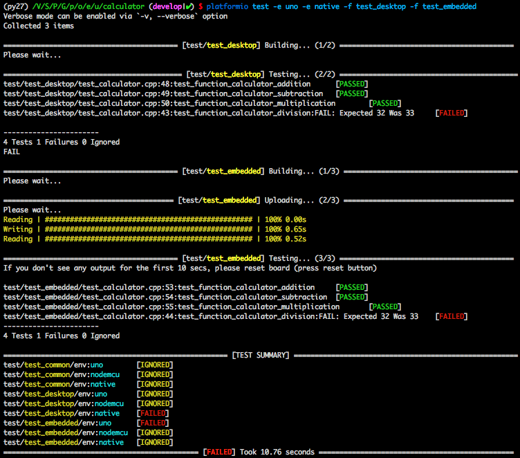

..  Copyright (c) 2014-present PlatformIO <contact@platformio.org>
    Licensed under the Apache License, Version 2.0 (the "License");
    you may not use this file except in compliance with the License.
    You may obtain a copy of the License at
       http://www.apache.org/licenses/LICENSE-2.0
    Unless required by applicable law or agreed to in writing, software
    distributed under the License is distributed on an "AS IS" BASIS,
    WITHOUT WARRANTIES OR CONDITIONS OF ANY KIND, either express or implied.
    See the License for the specific language governing permissions and
    limitations under the License.

.. |PIOUTS| replace:: **PlatformIO Unit Testing Solution**
.. |PIOUTE| replace:: **PlatformIO Unit Testing Engine**

.. _unit_testing:

Unit Testing
============

.. contents:: Contents
    :local:
    :depth: 1

Unit Testing allows you segregating each part of the firmware/program and testing that
the individual parts are working correctly. Using |PIOUTS| you can execute the same
tests on the local host machine (native), on the multiple local embedded devices/boards
(connected to local host machine), or on both. When testing both, PlatformIO builds
firmware on the host machine, uploads into a target device, starts tests, and collects
the test results into test reports. The final information will be shown on the host
side with informative output and statistic.

Using :ref:`pioremote` you can start unit tests on the **Remote Device** from anywhere in the world or integrate with :ref:`ci` systems.

Demo
----

This is a demo of `Local & Embedded: Calculator <https://github.com/platformio/platformio-examples/tree/develop/unit-testing/calculator>`_, which demonstrates running embedded tests on physical hardware
(:ref:`board_atmelavr_uno`) and native tests on host machine (desktop).

Learn more about :ref:`cmd_test` command.

Tutorials and Examples
----------------------

Tutorials
~~~~~~~~~

* :ref:`tutorial_unit_testing_blink`
* :ref:`tutorial_stm32cube_debugging_unit_testing`
* `ThingForward: Start Embedded Testing with PlatformIO <http://www.thingforward.io/techblog/2017-07-25-starting-embedded-testing-with-platformio.html>`_
* `ThingForward: Embedded Testing with PlatformIO - Part 2 <http://www.thingforward.io/techblog/2017-08-08-embedded-testing-with-platformio-part-2.html>`_
* `ThingForward: Embedded Testing with PlatformIO – Part 3: Remoting <http://www.thingforward.io/techblog/2017-09-06-embedded-testing-with-platformio-part-3-remoting.html>`_
* `ThingForward: Embedded Testing with PlatformIO – Part 4: Continuous Integration <http://www.thingforward.io/techblog/2017-09-18-embedded-testing-with-platformio-part-4-continuous-integration.html>`_
* `ThingForward, Webinar: Unit Testing for Embedded with PlatformIO and Qt Creator <https://www.youtube.com/watch?v=GJiMdmlBGlk>`_
* `Xose Pérez: Automated unit testing in the metal <https://tinkerman.cat/automated-unit-testing-metal/>`_

Project Examples
~~~~~~~~~~~~~~~~

* `Embedded: Wiring Blink <https://github.com/platformio/platformio-examples/tree/develop/unit-testing/wiring-blink>`_
* `Local & Embedded: Calculator <https://github.com/platformio/platformio-examples/tree/develop/unit-testing/calculator>`__
* `PlatformIO Remote Unit Testing Example <https://github.com/platformio/platformio-remote-unit-testing-example>`__

For the other examples and source code please follow to
`PlatformIO Unit Testing Examples <https://github.com/platformio/platformio-examples/tree/develop/unit-testing>`_ repository.

Configuration
-------------

|PIOUTS| can be configured using :ref:`projectconf`

.. toctree::
  :maxdepth: 2

  ../projectconf/section_env_test

Test Types
----------

Desktop
~~~~~~~

|PIOUTE| builds a test program for a host machine using :ref:`platform_native` development platform. This test could be run only with the desktop or :ref:`ci` VM instance.

.. note::
    PlatformIO does not install any toolchains automatically for
    :ref:`platform_native` and requires ``GCC`` toolchain to be installed
    on your host machine.
    Please open Terminal and check that the ``gcc`` command is installed.

Embedded
~~~~~~~~

|PIOUTE| builds a special firmware for a target device (board) and programs it. Then, it connects to this device using configured Serial :ref:`projectconf_test_port` and communicates via :ref:`projectconf_test_transport`. Finally, it runs tests on the embedded side, collects results, analyzes them, and provides a summary on a host machine side (desktop).

.. note::
    Please note that the |PIOUTE| uses the first available ``Serial/UART``
    implementation (depending on a :ref:`projectconf_env_framework`) as a
    communication interface between the |PIOUTE| and target device. If you use
    ``Serial`` in your project libraries, please wrap/hide Serial-based blocks
    with ``#ifndef UNIT_TEST`` macro.

    Also, you can create custom :ref:`projectconf_test_transport` and implement
    the base interface.

Test Runner
-----------

Test Runner allows you to process specific environments or ignore a test using
"Glob patterns". You can also ignore a test for specific environments using a
:ref:`projectconf_test_ignore` option from :ref:`projectconf`.

Local
~~~~~

Allows you to run a test on a host machine or on a target device (board), which
is directly connected to the host machine. In this case, you need to use the
:ref:`cmd_test` command.

.. _unit_testing_remote:

Remote
~~~~~~

Allows you to run test on a remote machine or remote target device (board)
without having to depend on OS software, extra software, SSH, VPN or opening
network ports. Remote Unit Testing works in pair with :ref:`pioremote`. In this
case, you need to use the special command :ref:`cmd_remote_test`.

PlatformIO supports multiple :ref:`ci` systems where you can run unit tests
at each integration stage. See real
`PlatformIO Remote Unit Testing Example <https://github.com/platformio/platformio-remote-unit-testing-example>`__.

.. _unit_testing_transport:

Test Transport
--------------

|PIOUTE| uses different transports to communicate with a
target device. By default, it uses ``Serial/UART`` transport provided
by a :ref:`projectconf_env_framework`. For example, when
":ref:`projectconf_env_framework` = ``arduino``", the first available
``Serial`` will be used.
When :ref:`platform_native` dev-platform is used a ``native`` transport will be
activated automatically. See example below.

Default baudrate/speed is set to :ref:`projectconf_test_speed`.

You can also define ``custom`` transport and implement its interface:

* ``unittest_uart_begin();``
* ``unittest_uart_putchar(char c);``
* ``unittest_uart_flush();``
* ``unittest_uart_end();``

**Examples**

1. Custom transport for :ref:`platform_native` platform

  * Set ``test_transport = custom`` in :ref:`projectconf`

  .. code-block:: ini

    [env:mycustomtransport]
    platform = native
    test_transport = custom

  * Create ``unittest_transport.h`` file in ``project/test`` directory and
    implement prototypes above

  .. code-block:: c

    #ifndef UNITTEST_TRANSPORT_H
    #define UNITTEST_TRANSPORT_H

    #include <stdio.h>

    void unittest_uart_begin() {

    }

    void unittest_uart_putchar(char c) {
      putchar(c);
    }

    void unittest_uart_flush() {
      fflush(stdout);
    }

    void unittest_uart_end() {

    }

    #endif

2. :ref:`tutorial_stm32cube_debugging_unit_testing`

Workflow
--------

1. Create PlatformIO project using the :ref:`cmd_project_init` command. For Desktop Unit
   Testing (on a host machine), you need to use :ref:`platform_native`.

   .. code-block:: ini

        ; PlatformIO Project Configuration File
        ;
        ;   Build options: build flags, source filter, extra scripting
        ;   Upload options: custom port, speed and extra flags
        ;   Library options: dependencies, extra library storages
        ;
        ; Please visit documentation for the other options and examples
        ; https://docs.platformio.org/page/projectconf.html

        ;
        ; Embedded platforms
        ;

        [env:uno]
        platform = atmelavr
        framework = arduino
        board = uno

        [env:nodemcu]
        platform = espressif8266
        framework = arduino
        board = nodemcuv2

        ;
        ; Desktop platforms (Win, Mac, Linux, Raspberry Pi, etc)
        ; See https://platformio.org/platforms/native
        ;

        [env:native]
        platform = native

2. Create a ``test`` folder in a root of your project. See :ref:`projectconf_pio_test_dir`.
3. Write a test using :ref:`unit_testing_api`. Each test is a small independent
   program/firmware with its own ``main()`` or ``setup()/loop()`` functions.
   Test should start with ``UNITY_BEGIN()`` and finish with ``UNITY_END()``
   calls.

   .. warning::
     If your board does not support software resetting via ``Serial.DTR/RTS``,
     you should add at least 2 seconds delay before ``UNITY_BEGIN()``.
     That time is needed to establish a ``Serial`` connection between a host
     machine and a target device.

     .. code-block:: c

         delay(2000); // for Arduino framework
         wait(2);     // for ARM mbed framework
         UNITY_BEGIN();

4. Place a test in the ``test`` directory. If you have more than one test,
   split them into sub-folders. For example, ``test/test_1/*.[c,cpp,h]``,
   ``test_N/*.[c,cpp,h]``, etc. If there is no such directory in the ``test`` folder,
   then |PIOUTE| will treat the source code of ``test`` folder as SINGLE test.
5. Run tests using the :ref:`cmd_test` command.

.. _unit_testing_shared_code:

Shared Code
~~~~~~~~~~~

|PIOUTE| does not build source code from :ref:`projectconf_pio_src_dir` folder
by default. If you have a shared/common code between your "main" and "test"
programs, you have 2 options:

1. **RECOMMENDED**. We recommend splitting the source code into multiple
   components and placing them into :ref:`projectconf_pio_lib_dir` (project's
   private libraries and components). :ref:`ldf` will find and include these libraries
   automatically in the build process. You can include any library/component header file
   in your test or program source code via ``#include <MyComponent.h>``.

   See `Local & Embedded: Calculator <https://github.com/platformio/platformio-examples/tree/develop/unit-testing/calculator>`__  for an example, where we have a "calculator"
   component in :ref:`projectconf_pio_lib_dir` folder and include it in tests
   and the main program using ``#include <calculator.h>``.

2. Manually instruct PlatformIO to build source code from :ref:`projectconf_pio_src_dir`
   folder using :ref:`projectconf_test_build_project_src` option in :ref:`projectconf`:

   .. code-block:: ini

      [env:myenv]
      platform = ...
      test_build_project_src = true

   This is very useful if you unit test independent libraries where you
   can't split source code.

   .. warning::
       Please note that you will need to use ``#ifdef UNIT_TEST`` and ``#endif``
       guard to hide non-test related source code. For example, own ``main()``
       or ``setup() / loop()`` functions.

.. _unit_testing_api:

API
---

Summary of the `Unity Test API <https://github.com/ThrowTheSwitch/Unity#unity-test-api>`_:

* `Running Tests <https://github.com/ThrowTheSwitch/Unity#running-tests>`_

  - ``RUN_TEST(func)``

* `Ignoring Tests <https://github.com/ThrowTheSwitch/Unity#ignoring-tests>`_

  - ``TEST_IGNORE()``
  - ``TEST_IGNORE_MESSAGE (message)``

* `Aborting Tests <https://github.com/ThrowTheSwitch/Unity#aborting-tests>`_

  - ``TEST_PROTECT()``
  - ``TEST_ABORT()``

* `Basic Validity Tests <https://github.com/ThrowTheSwitch/Unity#basic-validity-tests>`_

  - ``TEST_ASSERT_TRUE(condition)``
  - ``TEST_ASSERT_FALSE(condition)``
  - ``TEST_ASSERT(condition)``
  - ``TEST_ASSERT_UNLESS(condition)``
  - ``TEST_FAIL()``
  - ``TEST_FAIL_MESSAGE(message)``

* `Numerical Assertions: Integers <https://github.com/ThrowTheSwitch/Unity#numerical-assertions-integers>`_

  - ``TEST_ASSERT_EQUAL_INT(expected, actual)``
  - ``TEST_ASSERT_EQUAL_INT8(expected, actual)``
  - ``TEST_ASSERT_EQUAL_INT16(expected, actual)``
  - ``TEST_ASSERT_EQUAL_INT32(expected, actual)``
  - ``TEST_ASSERT_EQUAL_INT64(expected, actual)``

  - ``TEST_ASSERT_EQUAL_UINT(expected, actual)``
  - ``TEST_ASSERT_EQUAL_UINT8(expected, actual)``
  - ``TEST_ASSERT_EQUAL_UINT16(expected, actual)``
  - ``TEST_ASSERT_EQUAL_UINT32(expected, actual)``
  - ``TEST_ASSERT_EQUAL_UINT64(expected, actual)``

  - ``TEST_ASSERT_EQUAL_HEX(expected, actual)``
  - ``TEST_ASSERT_EQUAL_HEX8(expected, actual)``
  - ``TEST_ASSERT_EQUAL_HEX16(expected, actual)``
  - ``TEST_ASSERT_EQUAL_HEX32(expected, actual)``
  - ``TEST_ASSERT_EQUAL_HEX64(expected, actual)``
  - ``TEST_ASSERT_EQUAL_HEX8_ARRAY(expected, actual, elements)``

  - ``TEST_ASSERT_EQUAL(expected, actual)``
  - ``TEST_ASSERT_INT_WITHIN(delta, expected, actual)``

* `Numerical Assertions: Bitwise <https://github.com/ThrowTheSwitch/Unity#numerical-assertions-bitwise>`_

  - ``TEST_ASSERT_BITS(mask, expected, actual)``
  - ``TEST_ASSERT_BITS_HIGH(mask, actual)``
  - ``TEST_ASSERT_BITS_LOW(mask, actual)``
  - ``TEST_ASSERT_BIT_HIGH(mask, actual)``
  - ``TEST_ASSERT_BIT_LOW(mask, actual)``

* `Numerical Assertions: Floats <https://github.com/ThrowTheSwitch/Unity#numerical-assertions-floats>`_

  - ``TEST_ASSERT_FLOAT_WITHIN(delta, expected, actual)``
  - ``TEST_ASSERT_EQUAL_FLOAT(expected, actual)``
  - ``TEST_ASSERT_EQUAL_DOUBLE(expected, actual)``

* `String Assertions <https://github.com/ThrowTheSwitch/Unity#string-assertions>`_

  - ``TEST_ASSERT_EQUAL_STRING(expected, actual)``
  - ``TEST_ASSERT_EQUAL_STRING_LEN(expected, actual, len)``
  - ``TEST_ASSERT_EQUAL_STRING_MESSAGE(expected, actual, message)``
  - ``TEST_ASSERT_EQUAL_STRING_LEN_MESSAGE(expected, actual, len, message)``

* `Pointer Assertions <https://github.com/ThrowTheSwitch/Unity#pointer-assertions>`_

  - ``TEST_ASSERT_NULL(pointer)``
  - ``TEST_ASSERT_NOT_NULL(pointer)``

* `Memory Assertions <https://github.com/ThrowTheSwitch/Unity#pointer-assertions>`_

  - ``TEST_ASSERT_EQUAL_MEMORY(expected, actual, len)``

CLI Guide
---------

.. toctree::
    :maxdepth: 3

    pio test <../core/userguide/cmd_test>
    pio remote test <../core/userguide/remote/cmd_test>
