..  Copyright 2018-present PlatformIO <contact@platformio.org>
    Licensed under the Apache License, Version 2.0 (the "License");
    you may not use this file except in compliance with the License.
    You may obtain a copy of the License at
       http://www.apache.org/licenses/LICENSE-2.0
    Unless required by applicable law or agreed to in writing, software
    distributed under the License is distributed on an "AS IS" BASIS,
    WITHOUT WARRANTIES OR CONDITIONS OF ANY KIND, either express or implied.
    See the License for the specific language governing permissions and
    limitations under the License.

.. _tutorial_espressif32_arduino_debugging_unit_testing:

Get started with Arduino and ESP32-DevKitC: debugging and unit testing
======================================================================

The goal of this tutorial is to demonstrate how simple it is to use :ref:`ide_vscode` to develop, run and debug a simple project with the :ref:`framework_arduino` framework for the ``ESP32-DevKitC`` board.

* **Level:** Beginner
* **Platforms:** Windows, Mac OS X, Linux

**Requirements:**
    - Downloaded and installed :ref:`ide_vscode`
    - :ref:`board_espressif32_esp32dev`
    - :ref:`debugging_tool_olimex-arm-usb-ocd` or :ref:`debugging_tool_olimex-jtag-tiny` adapter for debugging

.. contents:: Contents
    :local:

Setting Up the Project
----------------------

First, we need to create a new project using the PlatformIO Home Page (to open this page, just press the Home icon on the toolbar):

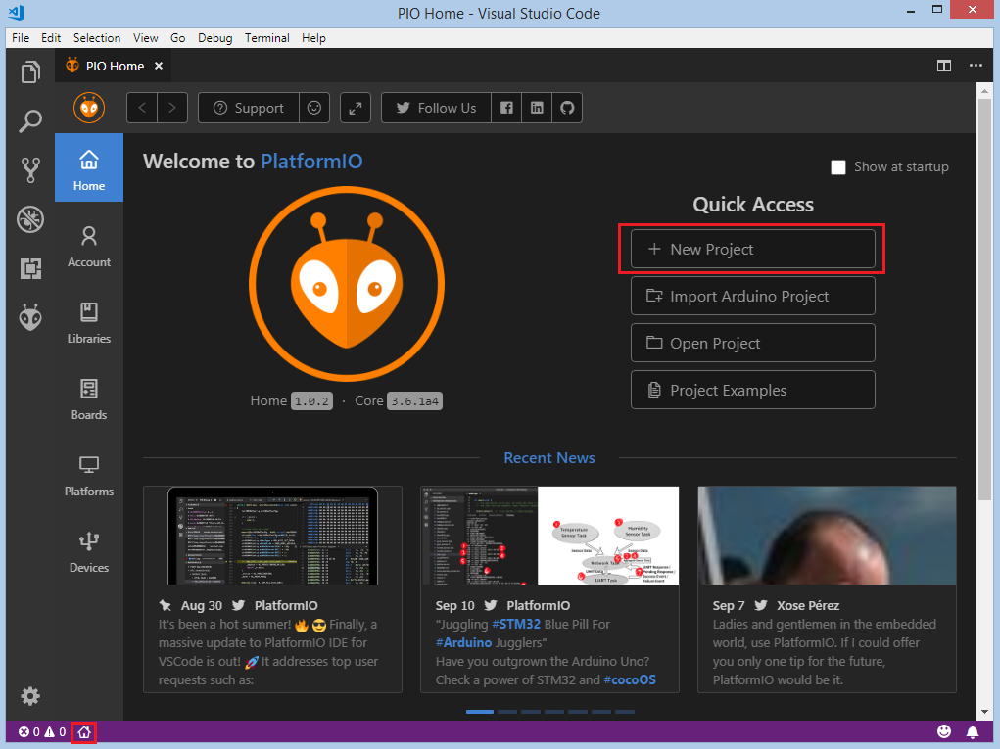

Next, we need to select ``Espressif ESP32 Dev Module`` as a development board, :ref:`framework_arduino` as a framework and a path to the project location (or use the default one):

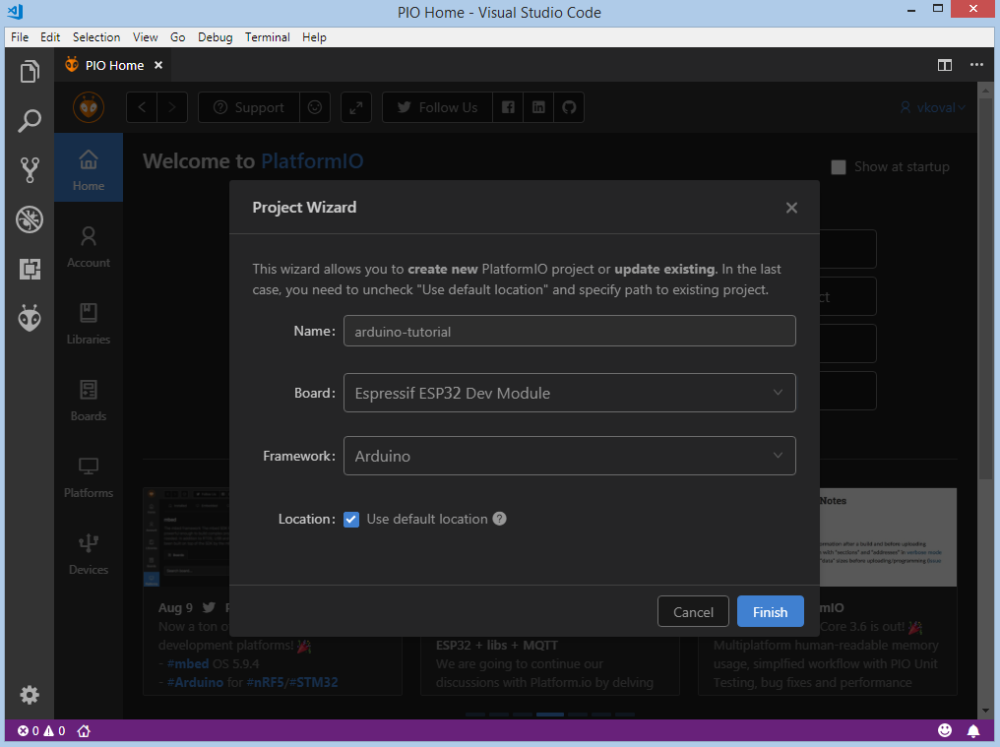

Processing the selected project may take some time (PlatformIO will download and install all required packages).
After that, we have a fully configured project that is ready for developing code with the :ref:`framework_arduino` framework.

Adding Code to the Generated Project
------------------------------------

Let's add some actual code to the project. Firstly, we open a default main file named ``main.cpp`` in the :ref:`projectconf_pio_src_dir` folder and replace its content with following:

.. code-block:: cpp

    #include <Arduino.h>

    void setup()
    {
        Serial.begin(9600);
    }

    void loop()
    {
        Serial.println("Hello world!");
        delay(1000);
    }

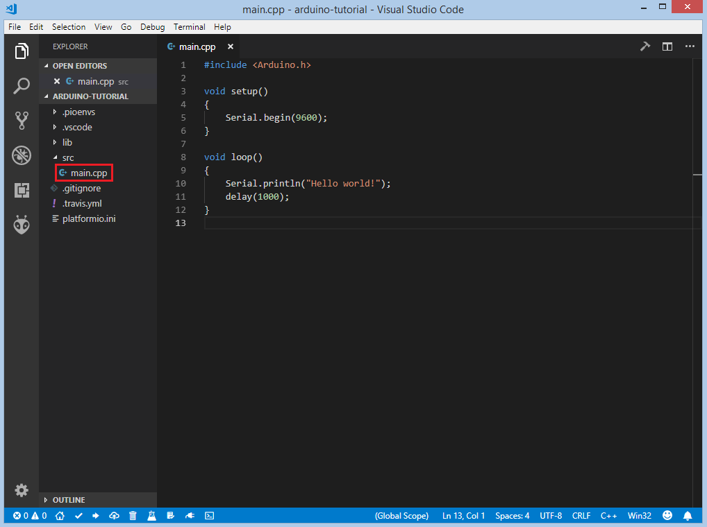

We have now created a basic project ready for compiling and uploading.

Compiling and Uploading the Firmware
------------------------------------

Now we can build the project. There are several ways to compile firmware:

* Build option in the ``Project Tasks`` menu,
* Build button in :ref:`ide_vscode_toolbar`,
* Task Menu: ``Tasks: Run Task... > PlatformIO: Build``, or in the :ref:`ide_vscode_toolbar`,
* Command Palette: ``View: Command Palette > PlatformIO: Build``, or
* via hotkeys ``cmd-alt-b / ctrl-alt-b``

Marked in red:

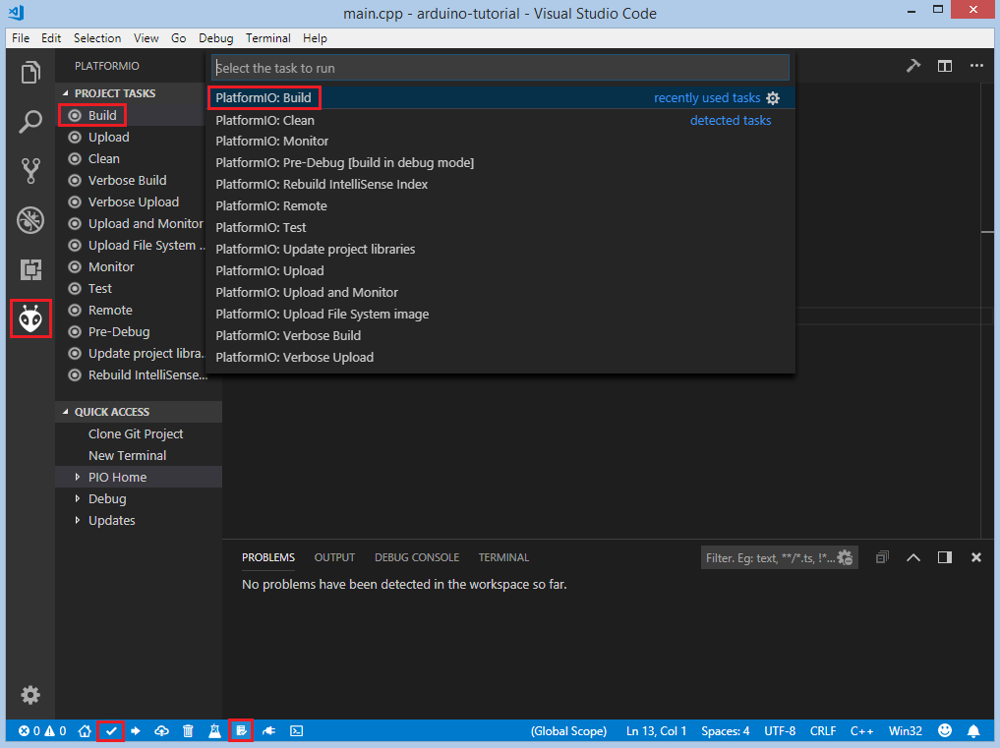

If everything went well, we should see a Success message in the terminal window:

.. image:: ../../_static/images/tutorials/espressif32/arduino-debugging-unit-testing-5.png

There are also several ways to upload the firmware to the board:

* Upload option in the ``Project Tasks`` menu,
* Upload button in :ref:`ide_vscode_toolbar`,
* Command Palette: ``View: Command Palette > PlatformIO: Upload``,
* using the Task Menu: ``Tasks: Run Task... > PlatformIO: Upload``, or
* via hotkeys: ``cmd-alt-u / ctrl-alt-u``:

.. image:: ../../_static/images/tutorials/espressif32/arduino-debugging-unit-testing-6.png

After uploading, we need to check if the firmware is uploaded correctly. To do this, open the serial monitor and check that the message from the board is received. To open the serial monitor, we can use the following options:

* Monitor option in the ``Project Tasks`` menu,
* Serial Monitor button in the :ref:`ide_vscode_toolbar`,
* Command Palette: ``View: Command Palette > PlatformIO: Monitor``, or
* Task Menu: ``Tasks: Run Task... > PlatformIO: Monitor``:

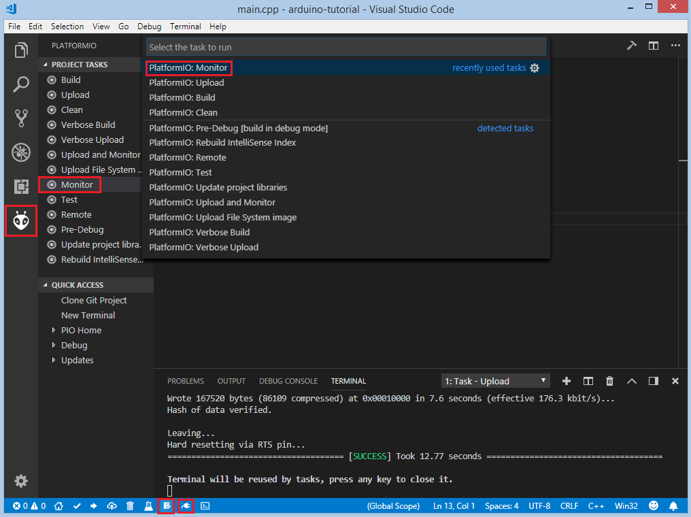

If the firmware works as expected, the message from the board can be observed in the terminal window:

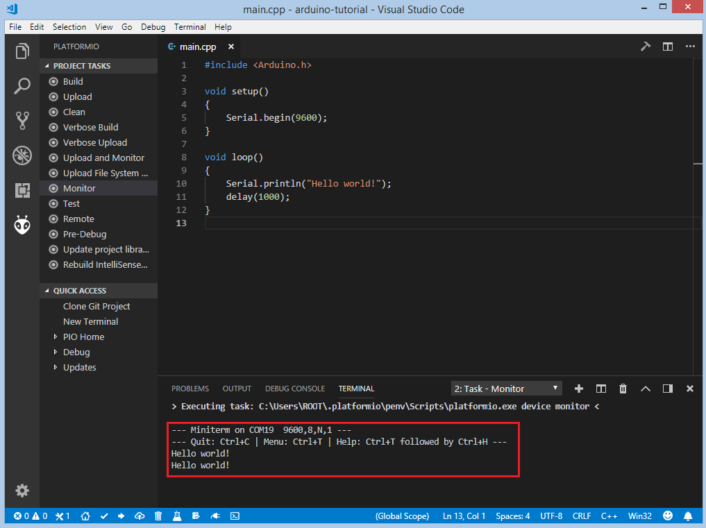

Debugging the Firmware
----------------------

Setting Up the Hardware
~~~~~~~~~~~~~~~~~~~~~~~

In order to use a JTAG probe with an ESP32, we need to connect the following pins:

.. list-table::
    :header-rows:  1

    * - ESP32 pin
      - JTAG probe pin

    * - ``3.3V``
      - ``Pin 1(VTref)``

    * - ``GPIO 9 (EN)``
      - ``Pin 3 (nTRST)``

    * - ``GND``
      - ``Pin 4 (GND)``

    * - ``GPIO 12 (TDI)``
      - ``Pin 5 (TDI)``

    * - ``GPIO 14 (TMS)``
      - ``Pin 7 (TMS)``

    * - ``GPIO 13 (TCK)``
      - ``Pin 9 (TCK)``

    * - ``GPIO 15 (TDO)``
      - ``Pin 13 (TDO)``

:ref:`piodebug` offers the easiest way to debug the board. Firstly, we need to specify :ref:`projectconf_debug_tool` in :ref:`projectconf`. In this tutorial, an :ref:`debugging_tool_olimex-arm-usb-ocd-h` debug probe is used:

.. code-block:: ini

    [env:esp32dev]
    platform = espressif32
    board = esp32dev
    framework = arduino
    debug_tool = olimex-arm-usb-ocd-h

To start the debug session we can use the following methods:

* ``Debug: Start debugging`` in the top menu,
* ``Start Debugging`` option in the Quick Access menu, or
* hotkey button ``F5``:

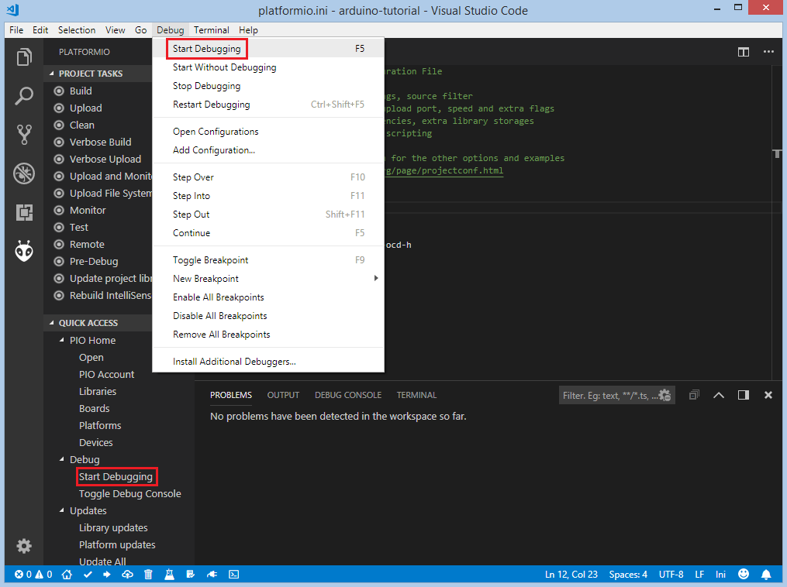

We need to wait some time while PlatformIO initializes the debug session,
and are ready to debug when the first line after the main function is highlighted.

1. Please wait when debugging session is stopped at the first line of ``app_main()`` function
2. **WARNING!** Please set a breakpoint at ``void loopTask(void *pvParameters)`` (line 13 in the screenshot below - this line can change between releases)
3. Now, please press CONTINUE/RUN button on debugging toolbar (right arrow icon)
4. The debugging session should stop at the first line of the ``void loopTask(void *pvParameters)`` function
5. Now, navigate to your Arduino setup/loop code and do classic debugging.

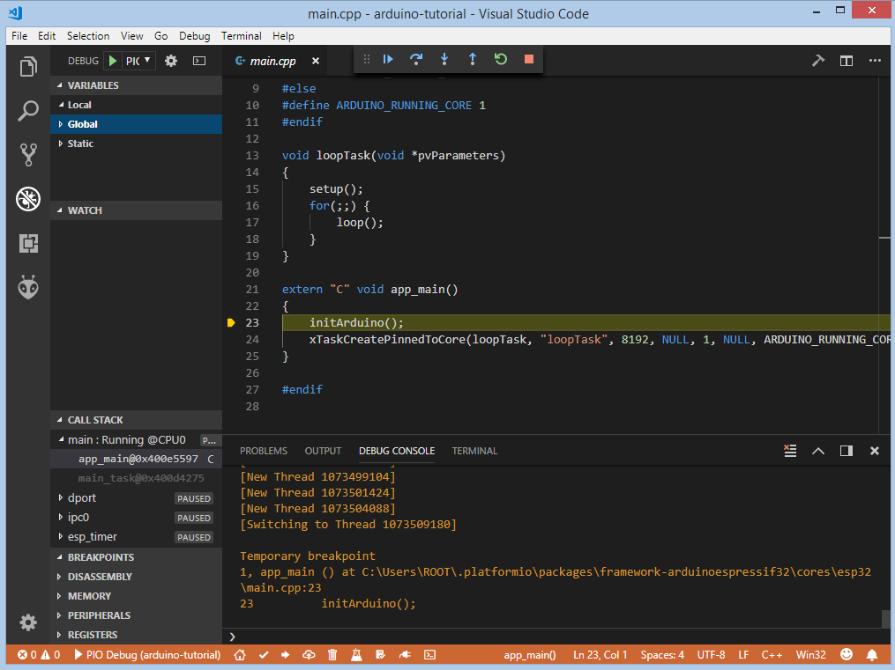

We can walk through the code using control buttons, set breakpoints, and add variables to the ``Watch window``:

.. image:: ../../_static/images/tutorials/espressif32/arduino-debugging-unit-testing-11.png

Writing Unit Tests
------------------

Test cases can be added to a single file that may include multiple tests. First of all, in this file, we need to add four default functions: ``setUp``, ``tearDown``, ``setup`` and ``loop``. Functions ``setUp`` and ``tearDown`` are used to initialize and finalize test conditions. Implementations of these functions are not required for running tests, but if you need to initialize some variables before you run a test, use the ``setUp`` function. Likewise, if you need to clean up variables, use ``tearDown`` function. In our example we will use these functions to respectively initialize and deinitialize LED states.  The ``setup`` and ``loop`` functions act as a simple Arduino program where we describe our test plan.

Let's create a ``test`` folder in the root of the project and add a new file, ``test_main.cpp``, to this folder. Next, basic tests for ``String`` class will be implemented in this file:

* ``test_string_concat`` tests the concatenation of two strings
* ``test_string_substring`` tests the correctness of the substring extraction
* ``test_string_index_of`` ensures that the string returns the correct index of the specified symbol
* ``test_string_equal_ignore_case`` tests case-insensitive comparison of two strings
* ``test_string_to_upper_case`` tests conversion of the string to upper-case
* ``test_string_replace`` tests the correctness of the replacing operation

.. code-block:: cpp

    #include <Arduino.h>
    #include <unity.h>

    String STR_TO_TEST;

    void setUp(void) {
        // set stuff up here
        STR_TO_TEST = "Hello, world!";
    }

    void tearDown(void) {
        // clean stuff up here
        STR_TO_TEST = "";
    }

    void test_string_concat(void) {
        String hello = "Hello, ";
        String world = "world!";
        TEST_ASSERT_EQUAL_STRING(STR_TO_TEST.c_str(), (hello + world).c_str());
    }

    void test_string_substring(void) {
        TEST_ASSERT_EQUAL_STRING("Hello", STR_TO_TEST.substring(0, 5).c_str());
    }

    void test_string_index_of(void) {
        TEST_ASSERT_EQUAL(7, STR_TO_TEST.indexOf('w'));
    }

    void test_string_equal_ignore_case(void) {
        TEST_ASSERT_TRUE(STR_TO_TEST.equalsIgnoreCase("HELLO, WORLD!"));
    }

    void test_string_to_upper_case(void) {
        STR_TO_TEST.toUpperCase();
        TEST_ASSERT_EQUAL_STRING("HELLO, WORLD!", STR_TO_TEST.c_str());
    }

    void test_string_replace(void) {
        STR_TO_TEST.replace('!', '?');
        TEST_ASSERT_EQUAL_STRING("Hello, world?", STR_TO_TEST.c_str());
    }

    void setup()
    {
        delay(2000); // service delay
        UNITY_BEGIN();

        RUN_TEST(test_string_concat);
        RUN_TEST(test_string_substring);
        RUN_TEST(test_string_index_of);
        RUN_TEST(test_string_equal_ignore_case);
        RUN_TEST(test_string_to_upper_case);
        RUN_TEST(test_string_replace);

        UNITY_END(); // stop unit testing
    }

    void loop()
    {
    }

Now we are ready to upload tests to the board. To do this we can use the following:

* Test button on :ref:`ide_vscode_toolbar`,
* Test option in the ``Project Tasks`` menu, or
* ``Tasks: Run Task... > PlatformIO Test`` in the top menu:

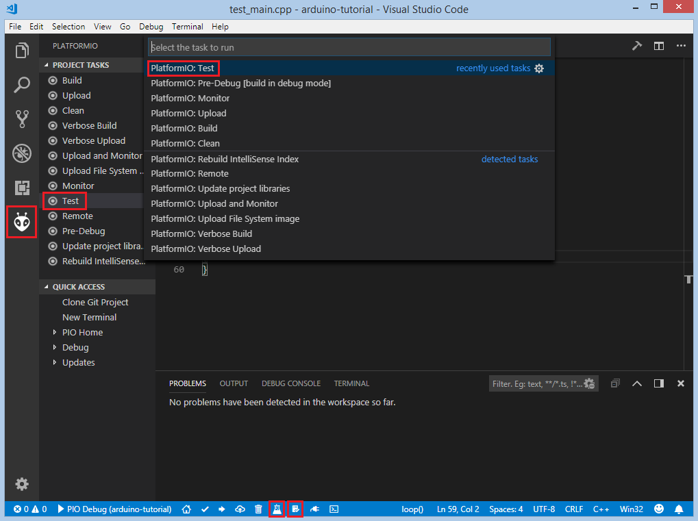

After processing, we should see a detailed report about the testing results:

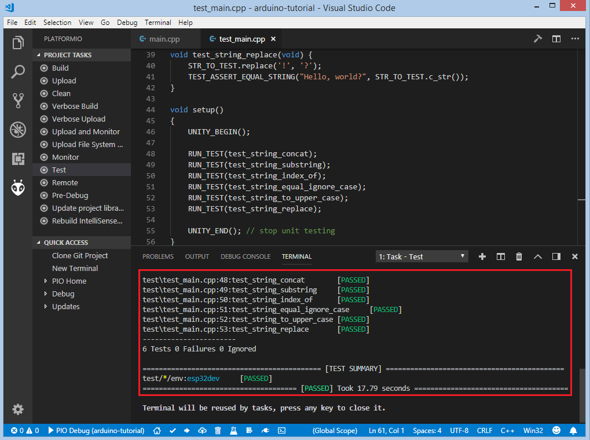

As we can see from the report, all our tests were successful!

Adding Bluetooth LE features
----------------------------

Now let's create a basic application that can interact with other BLE devices (e.g phones).
For example, the following code declares a BLE characteristic whose value can be printed to the serial port:

.. code-block:: cpp

    #include <Arduino.h>
    #include <BLEDevice.h>
    #include <BLEUtils.h>
    #include <BLEServer.h>

    #define SERVICE_UUID        "4fafc201-1fb5-459e-8fcc-c5c9c331914b"
    #define CHARACTERISTIC_UUID "beb5483e-36e1-4688-b7f5-ea07361b26a8"

    class MyCallbacks: public BLECharacteristicCallbacks {
        void onWrite(BLECharacteristic *pCharacteristic) {
          std::string value = pCharacteristic->getValue();
          if (value.length() > 0) {
            Serial.print("\r\nNew value: ");
            for (int i = 0; i < value.length(); i++)
              Serial.print(value[i]);
            Serial.println();
          }
        }
    };

    void setup() {
      Serial.begin(9600);

      BLEDevice::init("ESP32 BLE example");
      BLEServer *pServer = BLEDevice::createServer();
      BLEService *pService = pServer->createService(SERVICE_UUID);
      BLECharacteristic *pCharacteristic = pService->createCharacteristic(
                                             CHARACTERISTIC_UUID,
                                             BLECharacteristic::PROPERTY_READ |
                                             BLECharacteristic::PROPERTY_WRITE
                                           );

      pCharacteristic->setCallbacks(new MyCallbacks());

      pCharacteristic->setValue("Hello World");
      pService->start();

      BLEAdvertising *pAdvertising = pServer->getAdvertising();
      pAdvertising->start();
    }

    void loop() {
      delay(2000);
    }

Now we can compile and upload this program to the board as described in the previous sections.
To verify that our application works as expected, we can use any Android smartphone with the BLE feature and
`Nordic nRF Connect tool <https://play.google.com/store/apps/details?id=no.nordicsemi.android.mcp&hl=en>`_.

At first, we need to scan all advertising BLE devices and connect to the device called ``ESP32 BLE example``.
After successful connection to the board, we should see one "Unknown Service" with one "Unknown Characteristic" field:

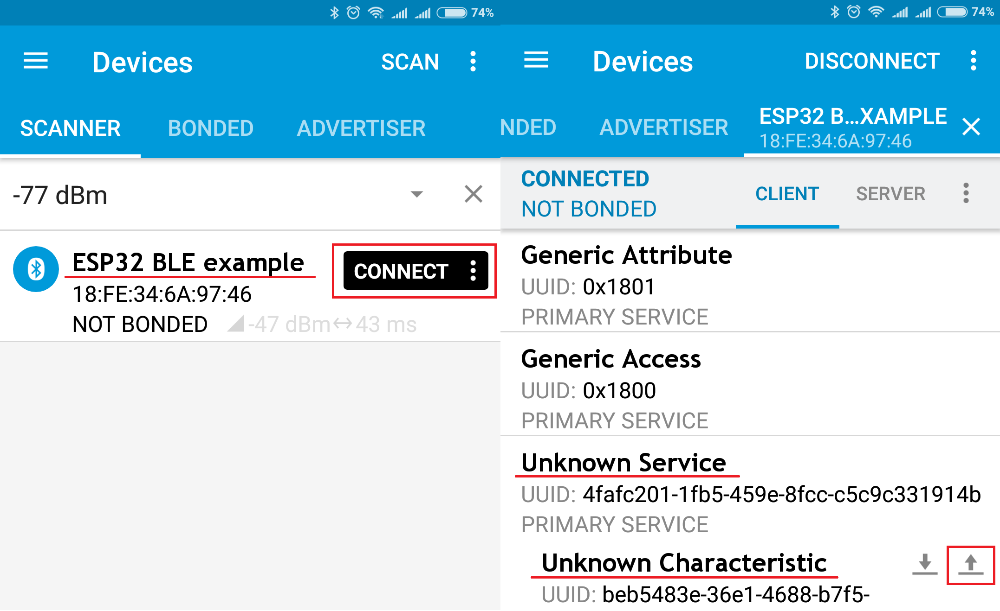

To set the value, we need to send new text to the BLE characteristic:

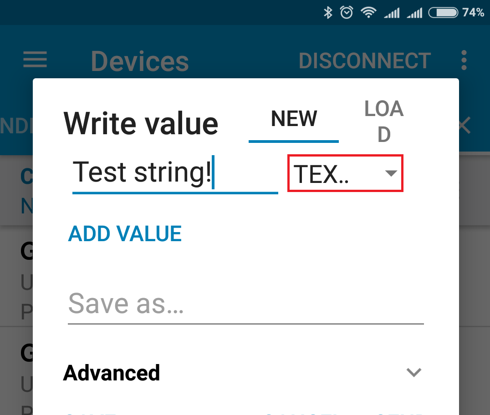

The change of the value is printed to the serial monitor:

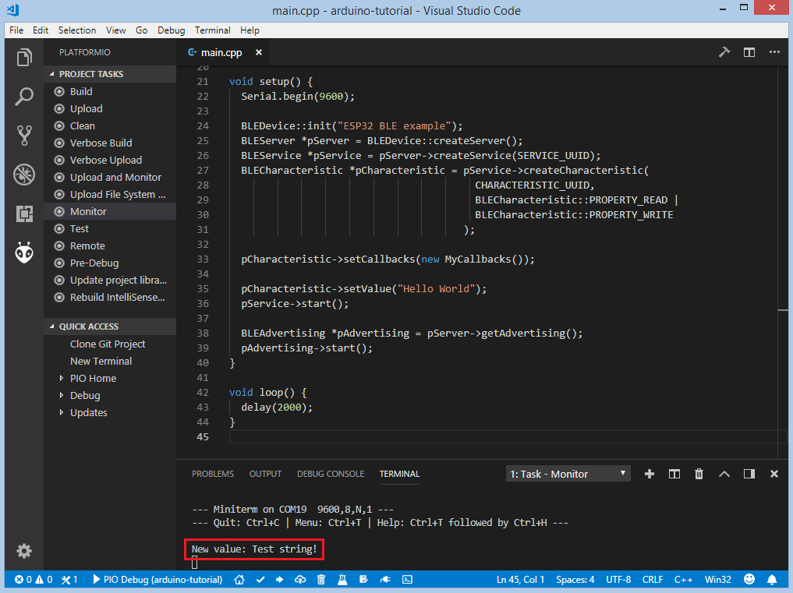

Conclusion
----------

Now we have a project template for the ``ESP32-DevKitC`` board that we can use as boilerplate for later projects.
