..  Copyright 2014-present PlatformIO <contact@platformio.org>
    Licensed under the Apache License, Version 2.0 (the "License");
    you may not use this file except in compliance with the License.
    You may obtain a copy of the License at
       http://www.apache.org/licenses/LICENSE-2.0
    Unless required by applicable law or agreed to in writing, software
    distributed under the License is distributed on an "AS IS" BASIS,
    WITHOUT WARRANTIES OR CONDITIONS OF ANY KIND, either express or implied.
    See the License for the specific language governing permissions and
    limitations under the License.

.. _tutorial_nordicnrf52_arduino_debugging_unit_testing:

Arduino and Nordic nRF52-DK: debugging and unit testing
=======================================================

The goal of this tutorial is to demonstrate how simple it is to use :ref:`ide_vscode` to develop, run and debug a simple project with :ref:`framework_arduino` framework for ``Nordic nRF52-DK`` board.

* **Level:** Beginner
* **Platforms:** Windows, Mac OS X, Linux

**Requirements:**
    - Downloaded and installed :ref:`ide_vscode`
    - Install drivers for :ref:`debugging_tool_jlink` debug tool
    - :ref:`board_nordicnrf52_nrf52_dk` development board

.. contents:: Contents
    :local:

Setting Up the Project
----------------------

At first step, we need to create a new project using PlatformIO Home Page (to open this page just press Home icon on the toolbar):

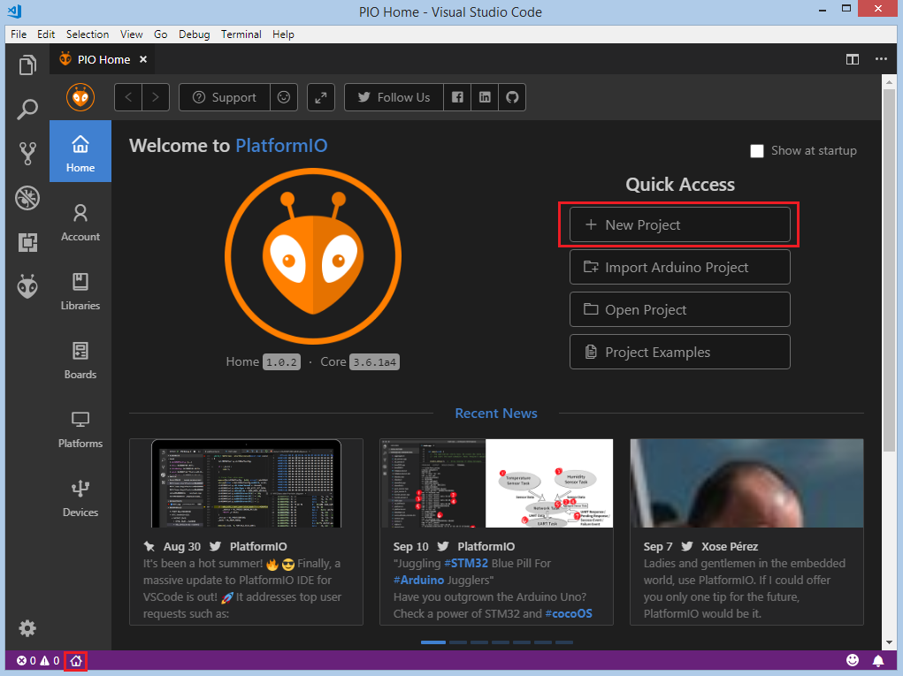

On the next step we need to select ``Nordic nRF52-DK`` as a development board, :ref:`framework_arduino` as a framework and a path to the project location (or use the default one):

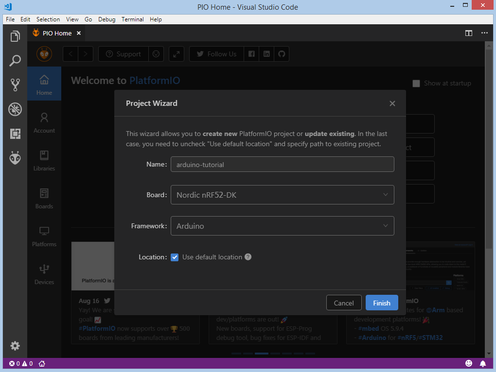

Processing the selected project may take some amount of time (PlatformIO will download and install all required packages)
and after these steps, we have a fully configured project that is ready for developing code with :ref:`framework_arduino` framework.

Adding Code to the Generated Project
------------------------------------

Let's add some actual code to the project. Firstly, we open a default main file ``main.cpp`` in the :ref:`projectconf_pio_src_dir` folder and replace its contents with the following:

.. code-block:: cpp

    #include <Arduino.h>

    void setup()
    {
        pinMode(LED_BUILTIN, OUTPUT);
    }

    void loop()
    {
        digitalWrite(LED_BUILTIN, HIGH);
        delay(100);
        digitalWrite(LED_BUILTIN, LOW);
        delay(100);
    }

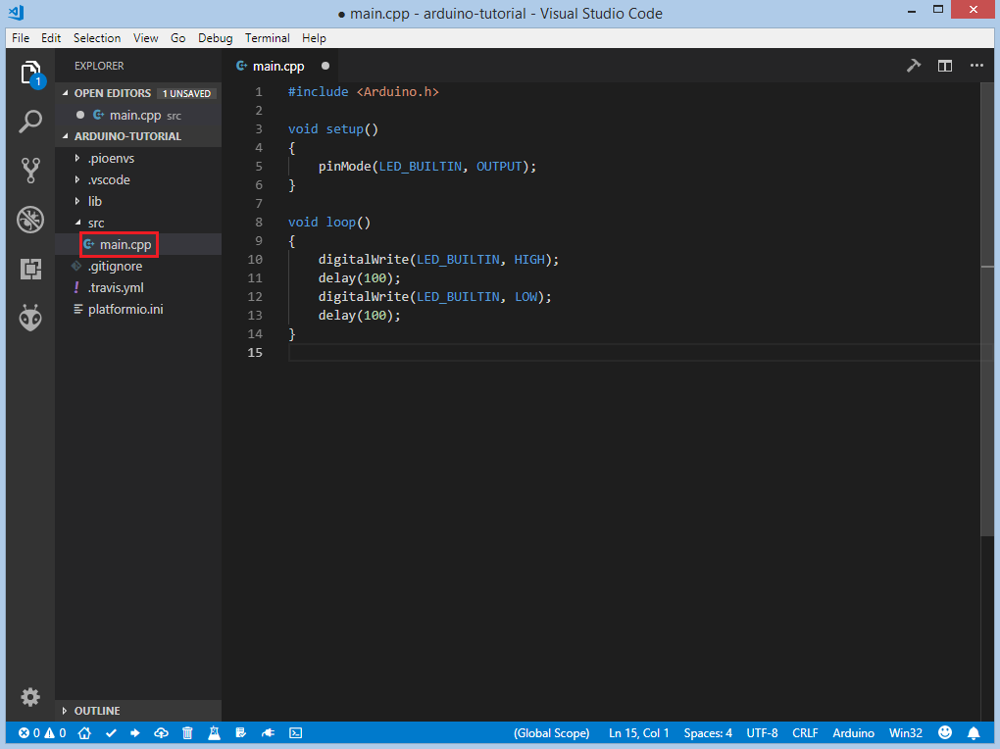

After this step, we created a basic blink project ready for compiling and uploading.

Compiling and Uploading the Firmware
------------------------------------

Now we can build the project. To compile firmware we can use next options:
Build option from the ``Project Tasks`` menu, Build button in :ref:`ide_vscode_toolbar`, Task Menu ``Tasks: Run Task... > PlatformIO: Build`` or in :ref:`ide_vscode_toolbar`, Command Palette ``View: Command Palette > PlatformIO: Build`` or via hotkeys ``cmd-alt-b / ctrl-alt-b``:

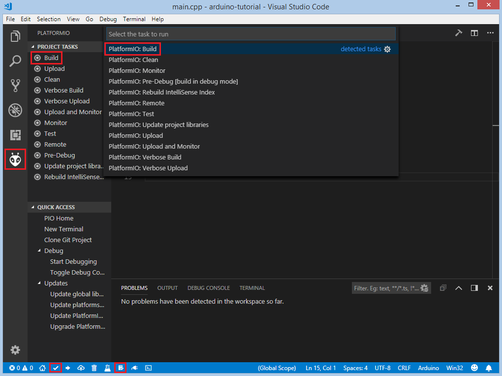

If everything went well, we should see a successful result message in the terminal window:

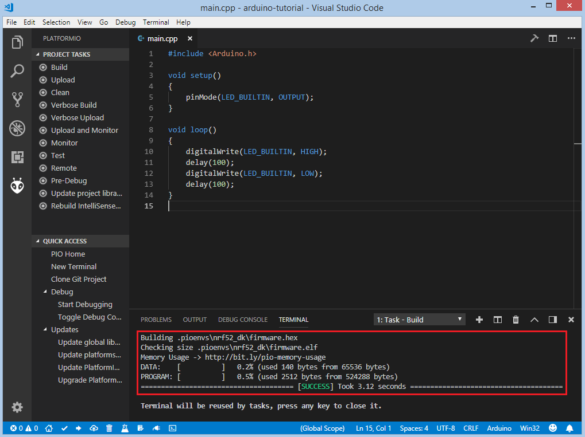

To upload the firmware to the board we can use next options:
Upload option from the ``Project Tasks`` menu, Upload button in :ref:`ide_vscode_toolbar`, Command Palette ``View: Command Palette > PlatformIO: Upload``, using Task Menu ``Tasks: Run Task... > PlatformIO: Upload`` or via hotkeys ``cmd-alt-u / ctrl-alt-u``:

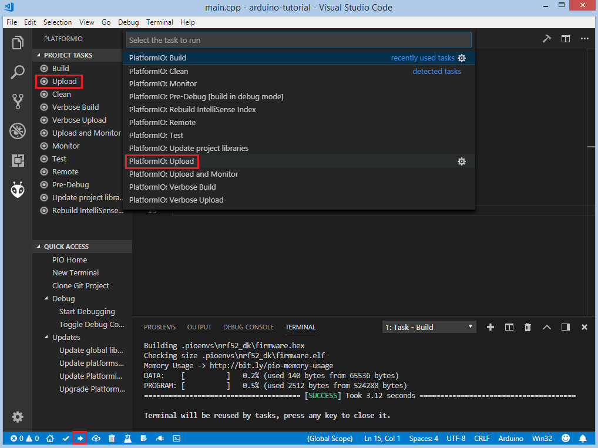

After successful uploading, the green LED1 should start blinking.

Debugging the Firmware
----------------------

:ref:`piodebug` offers the easiest way to debug the board. Firstly, we need to specify :ref:`projectconf_debug_tool` in :ref:`projectconf`. Since the board has an on-board ``JLink`` debug probe we can directly declare it in :ref:`projectconf`:

.. code-block:: ini

    [env:nrf52_dk]
    platform = nordicnrf52
    board = nrf52_dk
    framework = arduino
    debug_tool = jlink

To start the debug session we can use next options:
``Debug: Start debugging`` from the top menu, ``Start Debugging`` option from Quick Access menu or hotkey button ``F5``:

.. image:: ../../_static/images/tutorials/nordicnrf52/arduino-debugging-unit-testing-7.png

We need to wait some time while PlatformIO is initializing the debug session and when the first line after the main function is highlighted we are ready to debug:

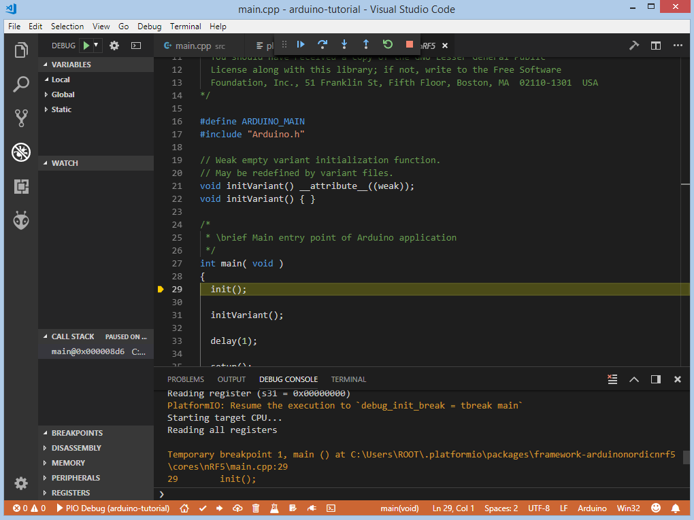

We can walk through the code using control buttons, set breakpoints, add variables to ``Watch window``:

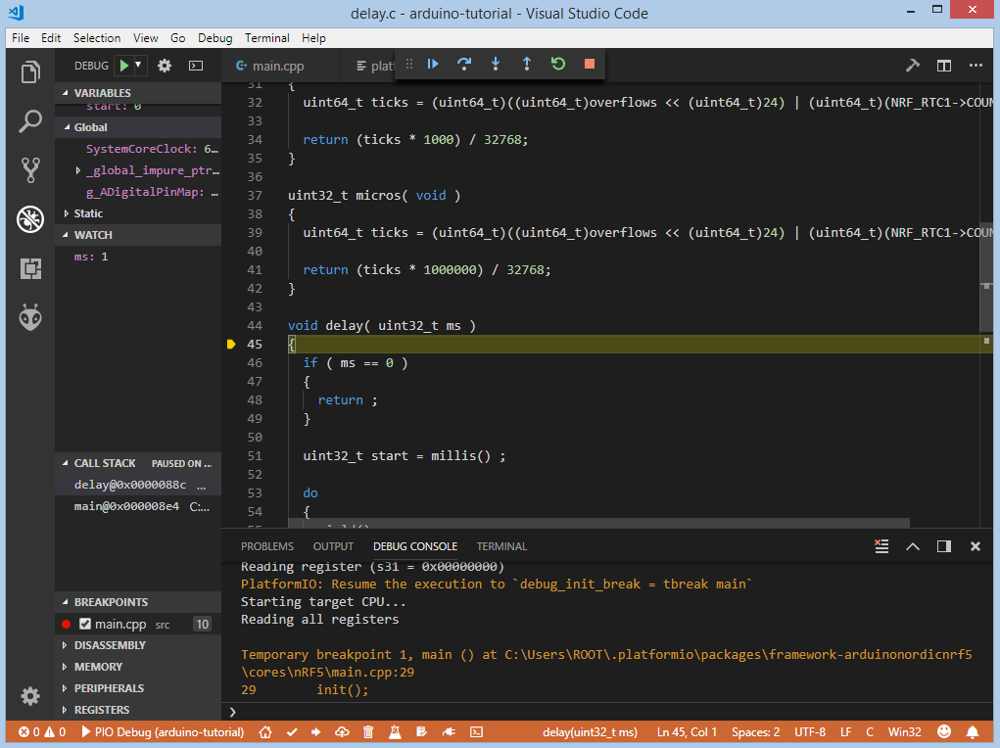

Writing Unit Tests
------------------

Test cases can be added to a single file that may include multiple tests. First of all, in this file, we need to add four default functions: ``setUp``, ``tearDown``, ``setup`` and ``loop``. Functions ``setUp`` and ``tearDown`` are used to initialize and finalize test conditions. Implementations of these functions are not required for running tests but if you need to initialize some variables before you run a test, you use the ``setUp`` function and if you need to clean up variables you use ``tearDown`` function. In our example we will use these functions to accordingly initialize and deinitialize LED.  ``setup`` and ``loop`` functions act as a simple Arduino program where we describe our test plan.

Let's create ``test`` folder in the root of the project and add a new file ``test_main.cpp`` to this folder. Next basic tests for ``String`` class will be implemented in this file:

* ``test_string_concat`` tests the concatenation of two strings
* ``test_string_substring`` tests the correctness of the substring extraction
* ``test_string_index_of`` ensures that the string returns the correct index of the specified symbol
* ``test_string_equal_ignore_case`` tests case-insensitive comparison of two strings
* ``test_string_to_upper_case`` tests upper-case conversion of the string
* ``test_string_replace`` tests the correctness of the replacing operation

.. note::
  * 2 sec delay is required since the board doesn't support software resetting via ``Serial.DTR/RTS``

.. code-block:: cpp

    #include <Arduino.h>
    #include <unity.h>

    String STR_TO_TEST;

    void setUp(void) {
        // set stuff up here
        STR_TO_TEST = "Hello, world!";
    }

    void tearDown(void) {
        // clean stuff up here
        STR_TO_TEST = "";
    }

    void test_string_concat(void) {
        String hello = "Hello, ";
        String world = "world!";
        TEST_ASSERT_EQUAL_STRING(STR_TO_TEST.c_str(), (hello + world).c_str());
    }

    void test_string_substring(void) {
        TEST_ASSERT_EQUAL_STRING("Hello", STR_TO_TEST.substring(0, 5).c_str());
    }

    void test_string_index_of(void) {
        TEST_ASSERT_EQUAL(7, STR_TO_TEST.indexOf('w'));
    }

    void test_string_equal_ignore_case(void) {
        TEST_ASSERT_TRUE(STR_TO_TEST.equalsIgnoreCase("HELLO, WORLD!"));
    }

    void test_string_to_upper_case(void) {
        STR_TO_TEST.toUpperCase();
        TEST_ASSERT_EQUAL_STRING("HELLO, WORLD!", STR_TO_TEST.c_str());
    }

    void test_string_replace(void) {
        STR_TO_TEST.replace('!', '?');
        TEST_ASSERT_EQUAL_STRING("Hello, world?", STR_TO_TEST.c_str());
    }

    void setup()
    {
        delay(2000); // service delay
        UNITY_BEGIN();

        RUN_TEST(test_string_concat);
        RUN_TEST(test_string_substring);
        RUN_TEST(test_string_index_of);
        RUN_TEST(test_string_equal_ignore_case);
        RUN_TEST(test_string_to_upper_case);
        RUN_TEST(test_string_replace);

        UNITY_END(); // stop unit testing
    }

    void loop()
    {
    }

Now we are ready to upload tests to the board. To do this we can use next options:
Test button on :ref:`ide_vscode_toolbar`, Test option from the ``Project Tasks`` menu or ``Tasks: Run Task... > PlatformIO Test`` from the top menu:

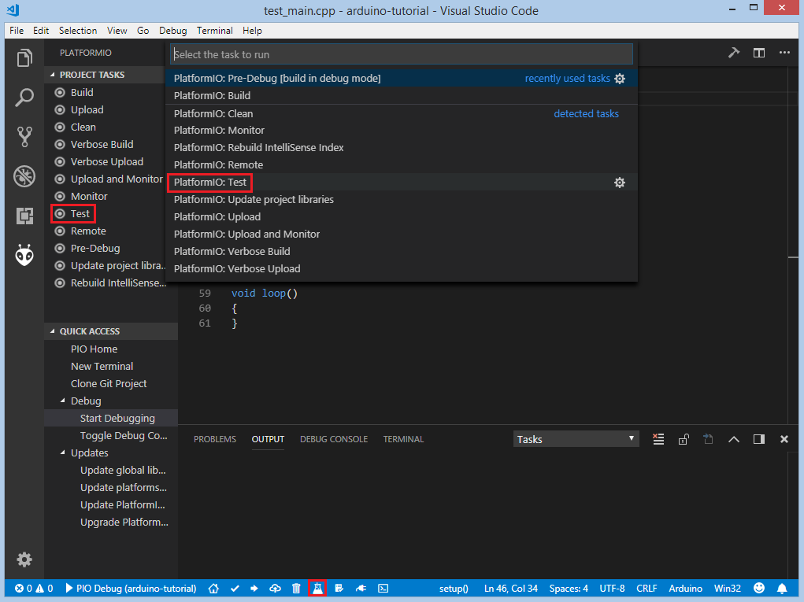

After processing we should see a detailed report about the testing results:

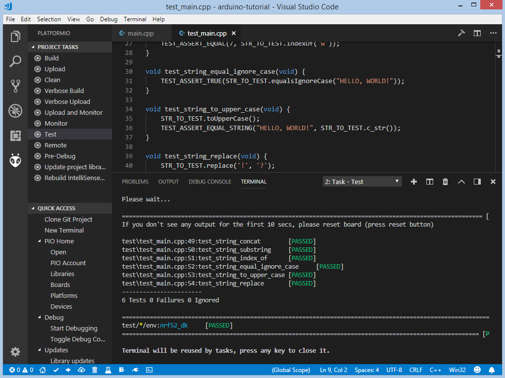

As we can see from the report, all our tests were successful!

Adding Bluetooth LE features
----------------------------

To add the basic BLE functionality to our project we need to define the SoftDevice version
and install a library called `BLEPeripheral <https://platformio.org/lib/show/259/BLEPeripheral>`_.
Both these modifications can be specified in :ref:`projectconf`:

.. code-block:: ini

    [env:nrf52_dk]
    platform = nordicnrf52
    board = nrf52_dk
    framework = arduino
    debug_tool = jlink
    ; SoftDevice version
    build_flags = -DNRF52_S132
    lib_deps =
      BLEPeripheral

Now let's create a basic application that can interact with other BLE devices (e.g phone)
For example, next code declares a BLE characteristic that controls the state of the LED1.

.. code-block:: cpp

    #include <Arduino.h>
    #include <SPI.h>
    #include <BLEPeripheral.h>

    BLEPeripheral ledPeripheral = BLEPeripheral();

    BLEService ledService = BLEService("19b10000e8f2537e4f6cd104768a1214");
    BLECharCharacteristic ledCharacteristic = BLECharCharacteristic("19b10001e8f2537e4f6cd104768a1214", BLERead | BLEWrite);

    void setup()
    {
      pinMode(LED_BUILTIN, OUTPUT);

      ledPeripheral.setAdvertisedServiceUuid(ledService.uuid());
      ledPeripheral.addAttribute(ledService);
      ledPeripheral.addAttribute(ledCharacteristic);
      ledPeripheral.setLocalName("Nordic NRF52 DK");
      ledPeripheral.begin();
    }

    void loop()
    {
      BLECentral central = ledPeripheral.central();

      if (central) {
        while (central.connected()) {
          if (ledCharacteristic.written()) {
            if (ledCharacteristic.value()) {
              digitalWrite(LED_BUILTIN, HIGH);
            }
            else{
              digitalWrite(LED_BUILTIN, LOW);
            }
          }
        }
      }
    }

Now we can compile and upload this program to the board as described in previous sections.
To verify that our application works as expected, we can use any Android smartphone with BLE feature and
`Nordic nRF Connect tool <https://play.google.com/store/apps/details?id=no.nordicsemi.android.mcp&hl=en>`_.

At first, we need to scan all advertising BLE devices and connect to the device called ``Nordic NRF52 DK``.
After a successful connection to the board, we should see one "Unknown Service" with one "Unknown Characteristic" fields:

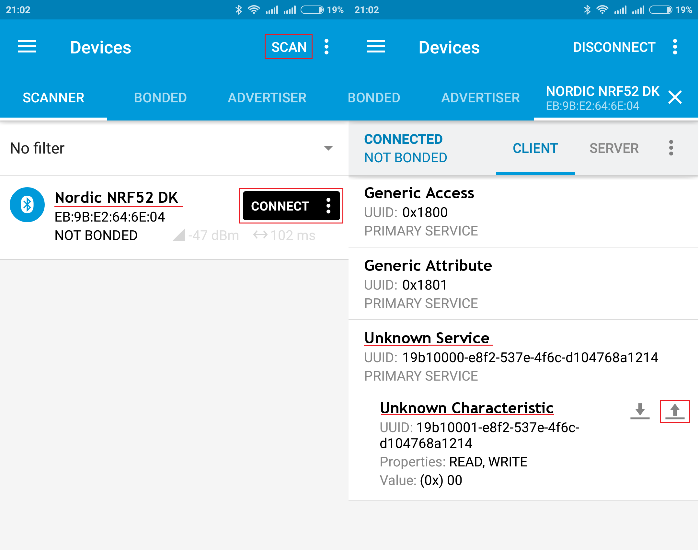

To switch the LED on or off we just need write ``0`` or ``1`` as ``UINT8`` to the BLE characteristic:

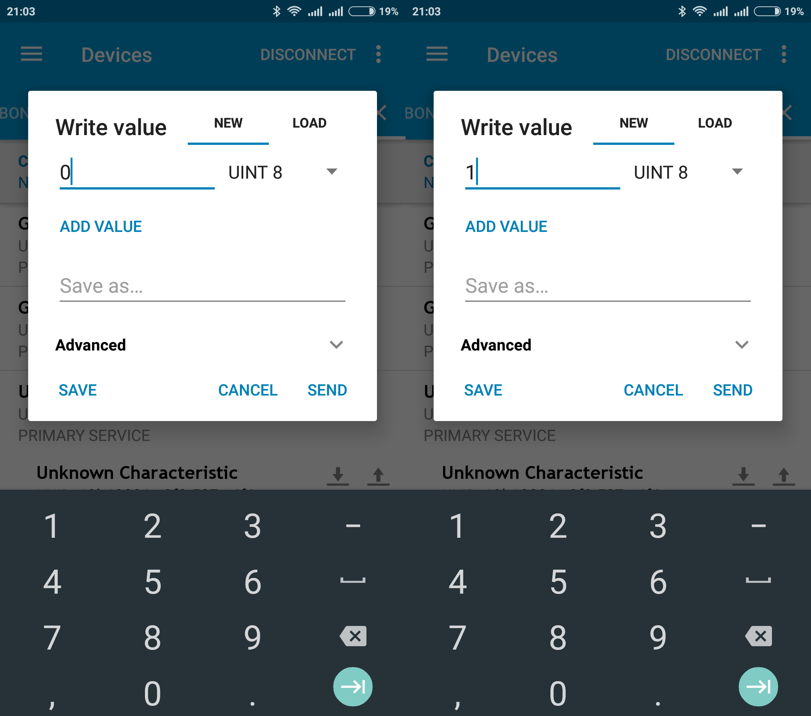

Conclusion
----------

Now we have a project template for Nordic ``nRF52-DK`` board that we can use as a boilerplate for the next projects.
