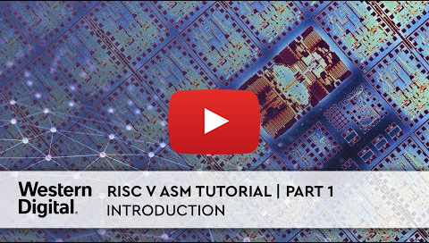

..  Copyright (c) 2014-present PlatformIO <contact@platformio.org>
    Licensed under the Apache License, Version 2.0 (the "License");
    you may not use this file except in compliance with the License.
    You may obtain a copy of the License at
       http://www.apache.org/licenses/LICENSE-2.0
    Unless required by applicable law or agreed to in writing, software
    distributed under the License is distributed on an "AS IS" BASIS,
    WITHOUT WARRANTIES OR CONDITIONS OF ANY KIND, either express or implied.
    See the License for the specific language governing permissions and
    limitations under the License.

.. _tutorial_riscv_asm_video:

RISC-V ASM Video Tutorial
=========================

An introduction to using :ref:`platform_sifive` and Assembly language on the
SiFive :ref:`board_sifive_hifive1` by Martin Fink, Chief
Technology Officer at Western Digital.

Source Files
------------

A demo source code is published on Github: https://github.com/martin-robert-fink/superBlink.git

It is already pre-configured PlatformIO project:

* Clone it or `download <https://github.com/martin-robert-fink/superBlink/archive/master.zip>`_
* Open in :ref:`ide_vscode`
* Happy coding and debugging!

Video Collection
----------------

* `Part 1 of 12 | Introduction <https://www.youtube.com/watch?v=KLybwrpfQ3I&index=1&list=PL6noQ0vZDAdh_aGvqKvxd0brXImHXMuLY>`_
* `Part 2 of 12 | Setting Up <https://www.youtube.com/watch?v=daGHhrkF41U&list=PL6noQ0vZDAdh_aGvqKvxd0brXImHXMuLY&index=2>`_
* `Part 3 of 12 | Tour PlatformIO <https://www.youtube.com/watch?v=k3tpNwXEWhU&list=PL6noQ0vZDAdh_aGvqKvxd0brXImHXMuLY&index=3>`_
* `Part 4 of 12 | C Code Wrapper <https://www.youtube.com/watch?v=MnWI9qplfvA&list=PL6noQ0vZDAdh_aGvqKvxd0brXImHXMuLY&index=4>`_
* `Part 5 of 12 | HiFive Docs <https://www.youtube.com/watch?v=nqXRzUFnM9w&list=PL6noQ0vZDAdh_aGvqKvxd0brXImHXMuLY&index=5>`_
* `Part 6 of 12 | Understanding GPIO <https://www.youtube.com/watch?v=tthKXGxAUjY&list=PL6noQ0vZDAdh_aGvqKvxd0brXImHXMuLY&index=6>`_
* `Part 7 of 12 | setupGPIO <https://www.youtube.com/watch?v=90udyEHBiwg&list=PL6noQ0vZDAdh_aGvqKvxd0brXImHXMuLY&index=7>`_
* `Part 8 of 12 | Debug setupGPIO <https://www.youtube.com/watch?v=Xmes__VpfiA&list=PL6noQ0vZDAdh_aGvqKvxd0brXImHXMuLY&index=8>`_
* `Part 9 of 12 | setLED <https://www.youtube.com/watch?v=PMLqqRHpbsQ&list=PL6noQ0vZDAdh_aGvqKvxd0brXImHXMuLY&index=9>`_
* `Part 10 of 12 | Debug setLED <https://www.youtube.com/watch?v=6K1FZK1Kc5w&list=PL6noQ0vZDAdh_aGvqKvxd0brXImHXMuLY&index=10>`_
* `Part 11 of 12 | Delay <https://www.youtube.com/watch?v=edzX3c2r0YQ&list=PL6noQ0vZDAdh_aGvqKvxd0brXImHXMuLY&index=11>`_
* `Part 12 of 12 | Final and Conclusion <https://www.youtube.com/watch?v=C16UE8oTZY0&list=PL6noQ0vZDAdh_aGvqKvxd0brXImHXMuLY&index=12>`_
