..  Copyright 2014-present PlatformIO <contact@platformio.org>
    Licensed under the Apache License, Version 2.0 (the "License");
    you may not use this file except in compliance with the License.
    You may obtain a copy of the License at
       http://www.apache.org/licenses/LICENSE-2.0
    Unless required by applicable law or agreed to in writing, software
    distributed under the License is distributed on an "AS IS" BASIS,
    WITHOUT WARRANTIES OR CONDITIONS OF ANY KIND, either express or implied.
    See the License for the specific language governing permissions and
    limitations under the License.

.. _tutorial_stm32cube_debugging_unit_testing:

STM32Cube HAL and Nucleo-F401RE: debugging and unit testing
===========================================================

The goal of this tutorial is to demonstrate how simple it is to use :ref:`ide_atom` to develop, run and debug a basic blink project with :ref:`framework_stm32cube` framework for ``STM32 Nucleo-F401RE`` board.

* **Level:** Intermediate
* **Platforms:** Windows, Mac OS X, Linux

**Requirements:**
    - Downloaded and installed :ref:`ide_atom`
    - Install drivers for :ref:`debugging_tool_stlink` debug tool
    - :ref:`board_ststm32_nucleo_f401re` development board

.. contents:: Contents
    :local:

Setting Up the Project
----------------------

At first step, we need to create a new project using PlatformIO Home Page (to open this page just press Home icon on the toolbar):

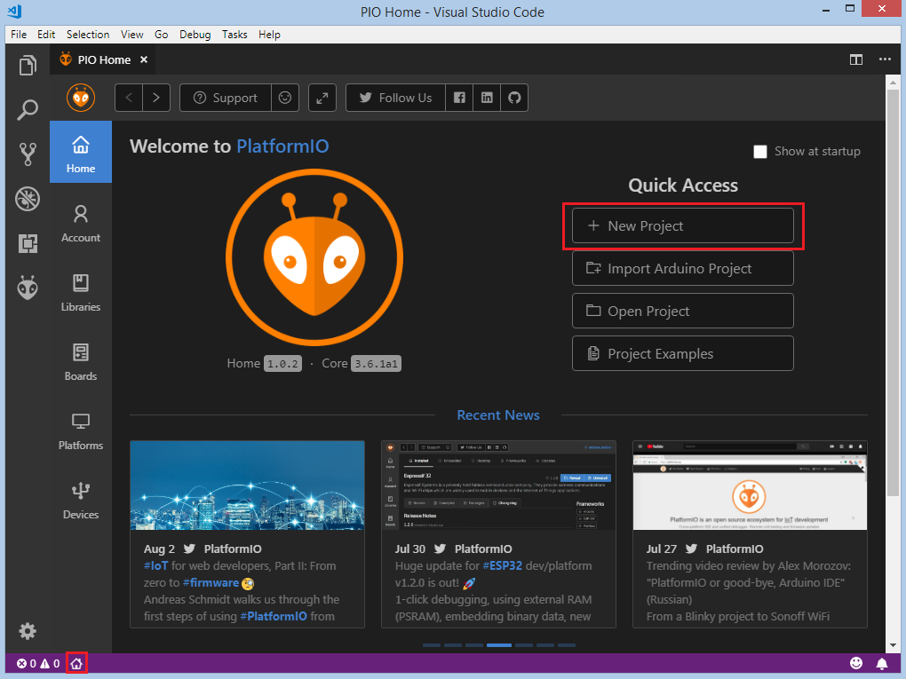

On the next step, we need to select ``ST Nucleo-F401RE`` as a development board, :ref:`framework_stm32cube` as a framework and a path to the project location (or use the default one):

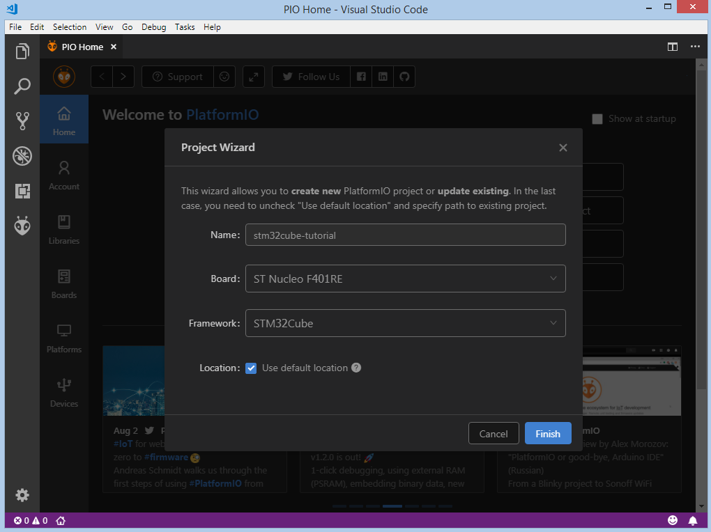

Processing the selected project may take some amount of time (PlatformIO will download and install all required packages) and after these steps, we have a fully configured project that is ready for developing code with :ref:`framework_stm32cube` framework.

Adding Code to the Generated Project
------------------------------------

Let's add some actual code to the project. Firstly, we create two main files ``main.c`` and ``main.h`` in the :ref:`projectconf_pio_src_dir` folder. Right click on the ``src`` in the project window:

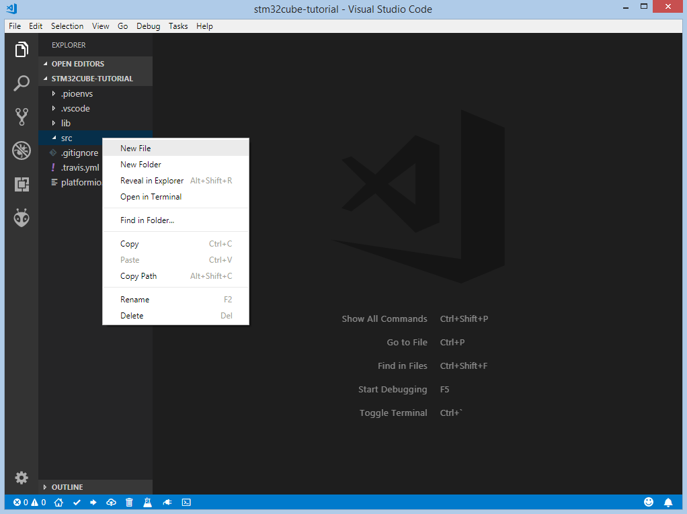

Add next content to ``main.h``:

.. code-block:: cpp

    #ifndef MAIN_H
    #define MAIN_H

    #include "stm32f4xx_hal.h"

    #define LED_PIN                                GPIO_PIN_5
    #define LED_GPIO_PORT                          GPIOA
    #define LED_GPIO_CLK_ENABLE()                  __HAL_RCC_GPIOA_CLK_ENABLE()

    #endif // MAIN_H

Add this code to ``main.c``:

.. code-block:: cpp

    #include "main.h"

    void LED_Init();

    int main(void) {
      HAL_Init();
      LED_Init();

      while (1)
      {
        HAL_GPIO_TogglePin(LED_GPIO_PORT, LED_PIN);
        HAL_Delay(1000);
      }
    }

    void LED_Init() {
      LED_GPIO_CLK_ENABLE();
      GPIO_InitTypeDef GPIO_InitStruct;
      GPIO_InitStruct.Pin = LED_PIN;
      GPIO_InitStruct.Mode = GPIO_MODE_OUTPUT_PP;
      GPIO_InitStruct.Pull = GPIO_PULLUP;
      GPIO_InitStruct.Speed = GPIO_SPEED_HIGH;
      HAL_GPIO_Init(LED_GPIO_PORT, &GPIO_InitStruct);
    }

    void SysTick_Handler(void) {
      HAL_IncTick();
    }

After this step, we created a basic blink project that is ready for compiling and uploading.

Compiling and Uploading the Firmware
------------------------------------

Now we can build the project. To compile firmware we can use next options:
Build option on the ``Project Tasks`` menu, Build button on :ref:`ide_vscode_toolbar`, using Command Palette ``View: Command Palette > PlatformIO: Build``, using Task Menu ``Tasks: Run Task... > PlatformIO: Build`` or via hotkeys ``cmd-alt-b / ctrl-alt-b``:

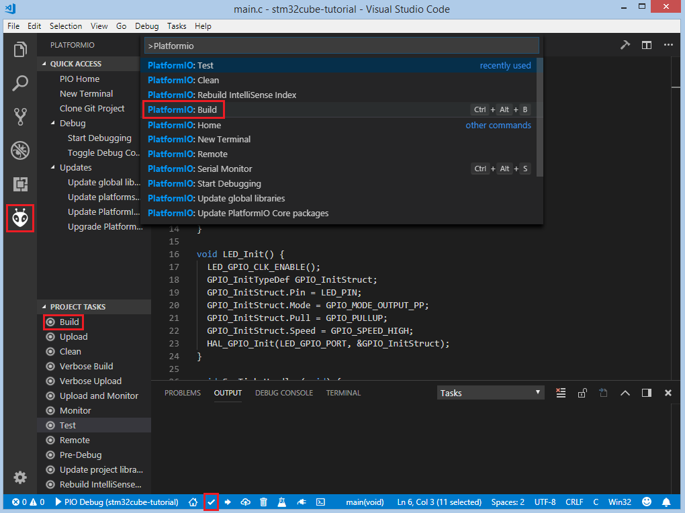

If everything went well, we should see the successful result in the terminal window:

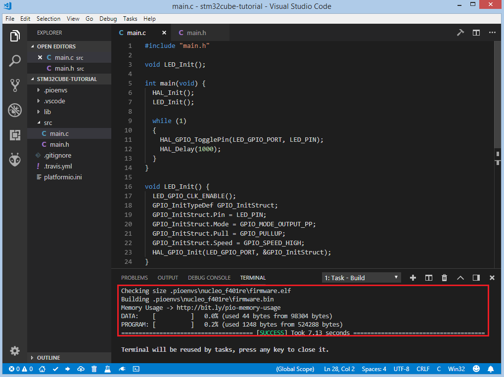

To upload the firmware to the board we can use next options:
Upload option on the ``Project Tasks`` menu, Upload button on :ref:`ide_vscode_toolbar`, using Command Palette ``View: Command Palette > PlatformIO: Upload``, using Task Menu ``Tasks: Run Task... > PlatformIO: Upload`` or via hotkeys ``cmd-alt-u / ctrl-alt-u``:

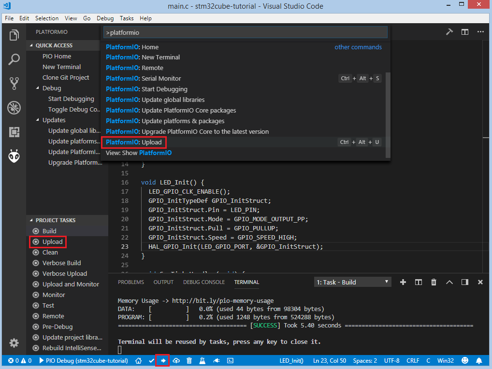

After successful uploading, the green LED2 should start blinking.

Debugging the Firmware
----------------------

:ref:`piodebug` offers the easiest way to debug your board. To start debugging session you can use ``Start debugging`` option in ``PlatformIO Quick Access`` menu, ``Debug: Start debugging`` from the top menu or hotkey button ``F5``:

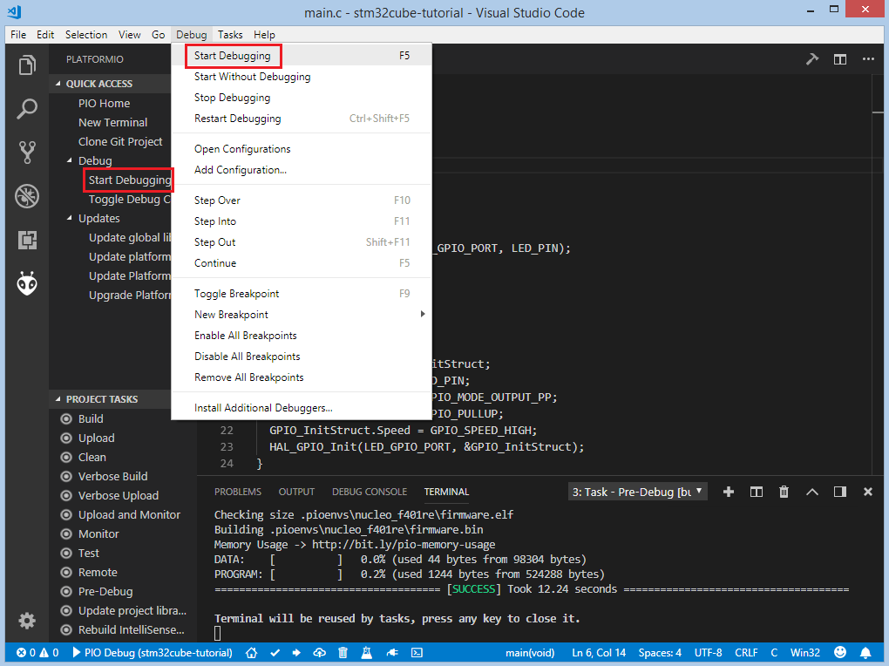

We need to wait some time while PlatformIO is initializing debug session and when the first line after the main function is highlighted we are ready to debug:

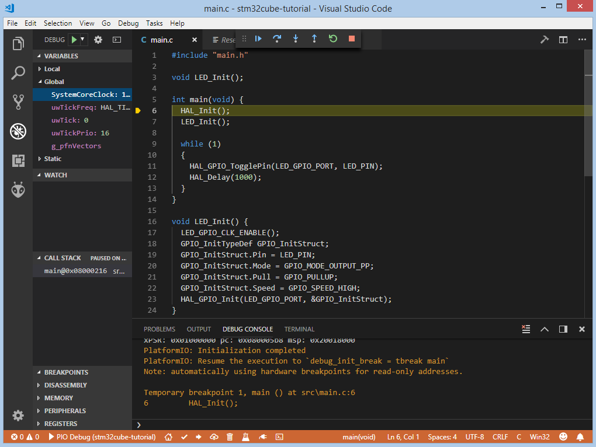

We can walk through the code using control buttons, set breakpoints, see peripheral registers, add variables to ``Watch window``:

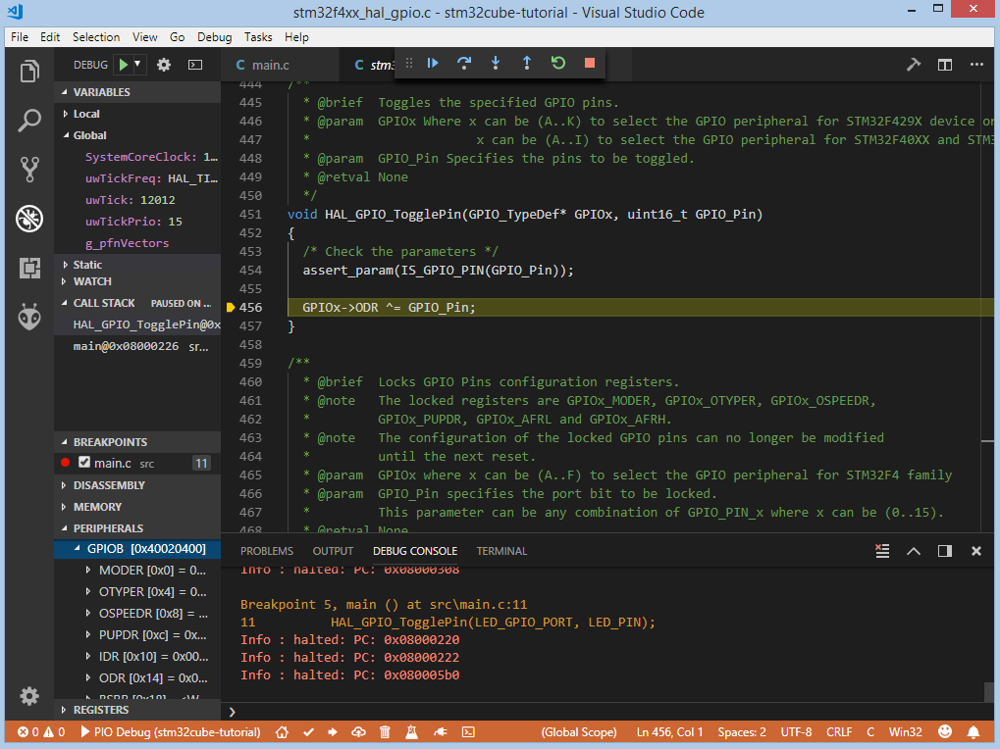

Writing Unit Tests
------------------

Now let’s write some tests using :ref:`unit_testing` feature that can help us
test code directly on the target board. :ref:`unit_testing` engine by default
supports only three frameworks: :ref:`framework_arduino`, :ref:`framework_espidf`,
:ref:`framework_mbed`. Since we decided to use
:ref:`framework_stm32cube` we need to implement a custom
:ref:`projectconf_test_transport` to print testing results and specify that
condition in :ref:`projectconf`:

.. code-block:: ini

  [env:nucleo_f401re]
  platform = ststm32
  board = nucleo_f401re
  framework = stm32cube
  test_transport = custom

Also, we need to create a new folder ``test`` where the tests and custom :ref:`projectconf_test_transport` implementation (described next) will be located:

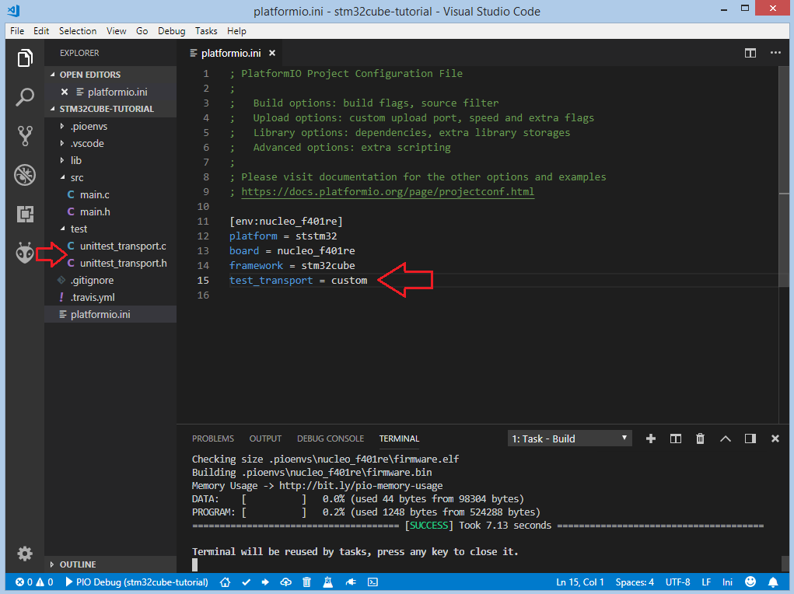

We will use ``USART2`` on ``ST Nucleo-F401RE`` board because it's directly connected to the STLink debug interface and in OS it can be visible as a Virtual Com Port, so we don't need any additional USB-UART converter. To implement the custom :ref:`projectconf_test_transport` we need to create two files ``unittest_transport.h`` and ``unittest_transport.c`` and put them in the :ref:`projectconf_pio_test_dir` in the root folder of our project. In these files we need to implement the next four functions:

.. code-block:: cpp

    void unittest_uart_begin();
    void unittest_uart_putchar(char c);
    void unittest_uart_flush();
    void unittest_uart_end();

Implementation of unittest_transport.h:

.. code-block:: cpp

    #ifndef UNITEST_TRANSPORT_H
    #define UNITEST_TRANSPORT_H

    #ifdef __cplusplus
    extern "C" {
    #endif

    void unittest_uart_begin();
    void unittest_uart_putchar(char c);
    void unittest_uart_flush();
    void unittest_uart_end();

    #ifdef __cplusplus
    }
    #endif

    #endif // UNITEST_TRANSPORT_H

Implementation of unittest_transport.c:

.. code-block:: cpp

    #include "unittest_transport.h"
    #include "stm32f4xx_hal.h"

    #define USARTx                           USART2
    #define USARTx_CLK_ENABLE()              __HAL_RCC_USART2_CLK_ENABLE()
    #define USARTx_CLK_DISABLE()             __HAL_RCC_USART2_CLK_DISABLE()
    #define USARTx_RX_GPIO_CLK_ENABLE()      __HAL_RCC_GPIOA_CLK_ENABLE()
    #define USARTx_TX_GPIO_CLK_ENABLE()      __HAL_RCC_GPIOA_CLK_ENABLE()
    #define USARTx_RX_GPIO_CLK_DISABLE()     __HAL_RCC_GPIOA_CLK_DISABLE()
    #define USARTx_TX_GPIO_CLK_DISABLE()     __HAL_RCC_GPIOA_CLK_DISABLE()

    #define USARTx_FORCE_RESET()             __HAL_RCC_USART2_FORCE_RESET()
    #define USARTx_RELEASE_RESET()           __HAL_RCC_USART2_RELEASE_RESET()

    #define USARTx_TX_PIN                    GPIO_PIN_2
    #define USARTx_TX_GPIO_PORT              GPIOA
    #define USARTx_TX_AF                     GPIO_AF7_USART2
    #define USARTx_RX_PIN                    GPIO_PIN_3
    #define USARTx_RX_GPIO_PORT              GPIOA
    #define USARTx_RX_AF                     GPIO_AF7_USART2

    static UART_HandleTypeDef UartHandle;

    void unittest_uart_begin()
    {
       GPIO_InitTypeDef  GPIO_InitStruct;

      USARTx_TX_GPIO_CLK_ENABLE();
      USARTx_RX_GPIO_CLK_ENABLE();

      USARTx_CLK_ENABLE();

      GPIO_InitStruct.Pin       = USARTx_TX_PIN;
      GPIO_InitStruct.Mode      = GPIO_MODE_AF_PP;
      GPIO_InitStruct.Pull      = GPIO_PULLUP;
      GPIO_InitStruct.Speed     = GPIO_SPEED_FAST;
      GPIO_InitStruct.Alternate = USARTx_TX_AF;

      HAL_GPIO_Init(USARTx_TX_GPIO_PORT, &GPIO_InitStruct);

      GPIO_InitStruct.Pin = USARTx_RX_PIN;
      GPIO_InitStruct.Alternate = USARTx_RX_AF;

      HAL_GPIO_Init(USARTx_RX_GPIO_PORT, &GPIO_InitStruct);
      UartHandle.Instance          = USARTx;

      UartHandle.Init.BaudRate     = 115200;
      UartHandle.Init.WordLength   = UART_WORDLENGTH_8B;
      UartHandle.Init.StopBits     = UART_STOPBITS_1;
      UartHandle.Init.Parity       = UART_PARITY_NONE;
      UartHandle.Init.HwFlowCtl    = UART_HWCONTROL_NONE;
      UartHandle.Init.Mode         = UART_MODE_TX_RX;
      UartHandle.Init.OverSampling = UART_OVERSAMPLING_16;

      if(HAL_UART_Init(&UartHandle) != HAL_OK) {
        while(1){}
      }

    }

    void unittest_uart_putchar(char c)
    {
        HAL_UART_Transmit(&UartHandle, (uint8_t*)(&c), 1, 1000);
    }

    void unittest_uart_flush(){}

    void unittest_uart_end() {
      USARTx_CLK_DISABLE();
      USARTx_RX_GPIO_CLK_DISABLE();
      USARTx_TX_GPIO_CLK_DISABLE();
    }

Now we need to add some test cases. Tests can be added to a single C file that may include multiple tests. First of all, we need to add three default functions: ``setUp``, ``tearDown`` and ``main``. ``setUp`` and ``tearDown`` are used to initialize and finalize test conditions. Implementations of these functions are not required for running tests but if you need to initialize some variables before you run a test, you use the ``setUp`` function and if you need to clean up variables you use ``tearDown`` function. In our example, we will use these functions to accordingly initialize and deinitialize LED.  ``main`` function acts as a simple program where we describe our test plan.

Let's add a new file ``test_main.c`` to the folder ``test``. Next basic tests for blinking routine will be implemented in this file:

* ``test_led_builtin_pin_number`` ensures that ``LED_PIN`` has the correct value
* ``test_led_state_high``  tests functions ``HAL_GPIO_WritePin`` and ``HAL_GPIO_ReadPin`` with ``GPIO_PIN_SET`` value
* ``test_led_state_low``  tests functions ``HAL_GPIO_WritePin`` and ``HAL_GPIO_ReadPin`` with ``GPIO_PIN_RESET`` value

.. note::
  * 2 sec delay is required  since the board doesn't support software resetting  via ``Serial.DTR/RTS``

.. code-block:: cpp

    #include "../src/main.h"
    #include <unity.h>

    void setUp(void) {
        LED_GPIO_CLK_ENABLE();
        GPIO_InitTypeDef GPIO_InitStruct;
        GPIO_InitStruct.Pin = LED_PIN;
        GPIO_InitStruct.Mode = GPIO_MODE_OUTPUT_PP;
        GPIO_InitStruct.Pull = GPIO_PULLUP;
        GPIO_InitStruct.Speed = GPIO_SPEED_HIGH;
        HAL_GPIO_Init(LED_GPIO_PORT, &GPIO_InitStruct);
    }

    void tearDown(void) {
        HAL_GPIO_DeInit(LED_GPIO_PORT, LED_PIN);
    }

    void test_led_builtin_pin_number(void) {
        TEST_ASSERT_EQUAL(GPIO_PIN_5, LED_PIN);
    }

    void test_led_state_high(void) {
        HAL_GPIO_WritePin(LED_GPIO_PORT, LED_PIN, GPIO_PIN_SET);
        TEST_ASSERT_EQUAL(GPIO_PIN_SET, HAL_GPIO_ReadPin(LED_GPIO_PORT, LED_PIN));
    }

    void test_led_state_low(void) {
        HAL_GPIO_WritePin(LED_GPIO_PORT, LED_PIN, GPIO_PIN_RESET);
        TEST_ASSERT_EQUAL(GPIO_PIN_RESET, HAL_GPIO_ReadPin(LED_GPIO_PORT, LED_PIN));
    }

    int main() {
        HAL_Init();         // initialize the HAL library
        HAL_Delay(2000);    // service delay
        UNITY_BEGIN();
        RUN_TEST(test_led_builtin_pin_number);

        for (unsigned int i = 0; i < 5; i++)
        {
            RUN_TEST(test_led_state_high);
            HAL_Delay(500);
            RUN_TEST(test_led_state_low);
            HAL_Delay(500);
        }

        UNITY_END(); // stop unit testing

        while(1){}
    }

    void SysTick_Handler(void) {
        HAL_IncTick();
    }

Now we are ready to upload tests to the board. To do this we can use ``Test`` option from the Project Tasks menu, ``Tasks: Run Task... > PlatformIO Test`` option from the top menu or Test button on :ref:`ide_vscode_toolbar`:

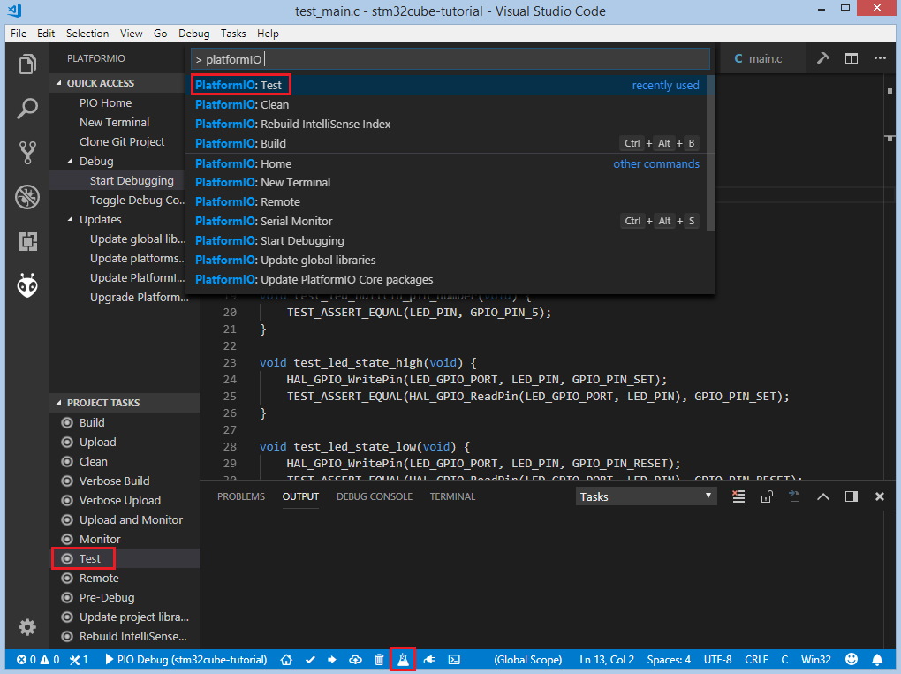

After processing we should see a detailed report about the testing results:

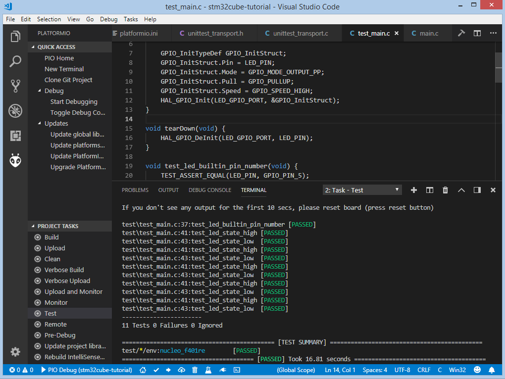

Congratulations! As we can see from the report, all our tests went successfully!

Conclusion
----------

Now we have a decent template that we can improve for our next more complex projects.

Project Source Code
-------------------

The source code of this tutorial is available at https://github.com/platformio/platformio-examples/tree/develop/unit-testing/stm32cube
